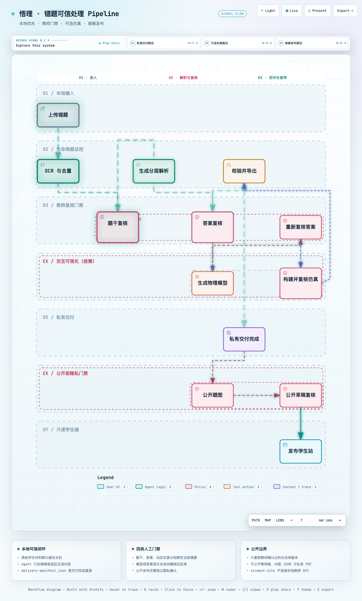
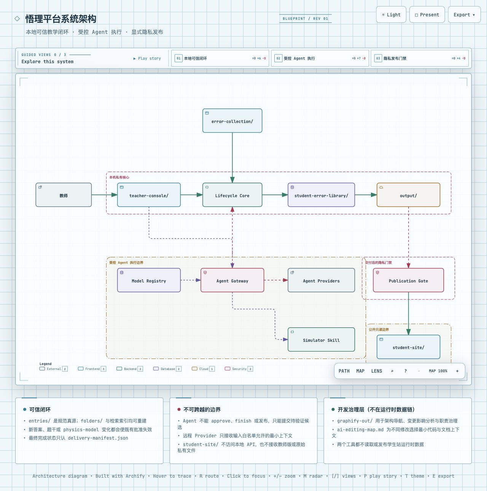

# 悟理

> 面向乡村课堂的端侧可信 AI 全流程教学助教平台

当前以高中物理为完整 MVP：本地接收图片/PDF，完成 OCR、人工核对、知识检索、分层解析、按需交互仿真、入库、PDF 与学生交付包，并把一次错题处理沉淀为可持续复用的教学资源。

<p align="center">
  <a href="https://yuanuite.github.io/wuli-personal-ai-teaching-assistant/diagrams/pipeline.workflow.html">
    
  </a>
  <br>
  <sub>🔍 点击图片打开交互版（支持搜索节点、聚焦路径、切换主题、导出 PNG/SVG）</sub>
</p>

<p align="center">
  <a href="https://yuanuite.github.io/wuli-personal-ai-teaching-assistant/diagrams/system.architecture.html">
    
  </a>
  <br>
  <sub>🔍 点击图片打开交互版 · 虚线边界为信任域</sub>
</p>

竞赛摘要见 [`docs/competition-submission.md`](docs/competition-submission.md)；完整项目说明和五分钟演示建议见 [`docs/competition-project-description.md`](docs/competition-project-description.md)。

## 最快用法

### 教师工作台（推荐）

从项目根目录启动本地页面：

```bash
python3 teacher-console/server.py
```

然后打开 <http://127.0.0.1:8787/>。工作台采用固定视口：左侧按“上传日期文件夹 → 具体题目”组织，文件夹可在网页改名并同步到 `student-error-library/folders/`；原图、编辑器和预览分别滚动。题干与学生版/教师版答案均支持 Markdown + KaTeX 边写边预览。解析意见通过本机 Agent Gateway 进入后台任务，在隔离候选区修改答案及解释 SVG/PNG，通过范围和内容校验后才提升到真源，再由教师重新批准。“可视化（可选）”页面对所有题目保留：标准解析默认不生成交互仿真；教师输入“我想为这道题生成一个可视化结果”或点击“调用 Skill 生成”后，系统才调用 `build-physics-simulator`。没有模型只表示尚未生成，不代表题目不适合。交付页只显示适合发送或继续编辑的成品，并逐一解释用途；已交付题目还可对原题图进行自动建议裁剪、手动四边调整和拖拽遮挡，教师确认后生成独立公开副本，再制作学生端预览并复制到 `student-site/`。学生端下载入口在具体题目阅读页，文件名统一为 `带答案错题.pdf`；该 PDF 由公开脱敏 Markdown 和公开题图重新生成，不直接复用私有交付目录里的原始 PDF。服务硬性只监听本机回环地址，公开站也不会连接本地 API。

Gateway 默认依次尝试结构化 adapter、经授权的 OpenAI-compatible API、兼容旧命令、Codex 和 Claude Code；显式配置的结构化 provider 优先于通用 CLI。本机 CLI 不等于本地推理，页面会显示执行与数据位置属性。顶部“模式”支持“自动 / 经济 / 深度 / 自定义”：普通模式按设置页里的默认模型策略匹配任务，自定义模式才展开真实模型下拉框并携带 `model_id` 覆盖自动 provider/model 选择。没有可用 provider 时保留本地请求，不伪造完成；Agent 也不能替教师执行批准或交付。可用无学生数据的主动探测验证真实连通性；运行失败的 provider 会短暂熔断并安全降级。内容校验失败、输出截断或未产生候选时，系统会携带脱敏失败证据在全新隔离区最多纠正一次，越权与 canonical 冲突绝不自动重试。完整协议见 [`docs/agent-gateway.md`](docs/agent-gateway.md) 和 [`docs/failure-intelligence.md`](docs/failure-intelligence.md)。


### 学生端访问

已发布的题目通过教师工作台在同一端口提供学生端阅读：

- **打开学生端**：`http://127.0.0.1:8787/api/public-site/index.html`
- **阅读已发布题目**：`http://127.0.0.1:8787/api/public-site/viewer.html?id=<public_id>`
- **浏览已发布题目列表**：`http://127.0.0.1:8787/api/public-site/catalog.json`

如需在不启动教师工作台的场景下独立部署学生站（如课堂大屏展示），可用静态文件服务器单独启动：

```bash
python3 -m http.server 8080 -d student-site
```

独立启动时只能看到已复制到 `student-site/` 的已发布内容，无法使用教师工作台的题目管理与发布功能。

**在线学生站**（GitHub Pages，自动部署 `main` 分支）：

- [悟理学习站](https://yuanuite.github.io/wuli-personal-ai-teaching-assistant/) — 只读公开题库
- [管道流程图（交互版）](https://yuanuite.github.io/wuli-personal-ai-teaching-assistant/diagrams/pipeline.workflow.html)
- [系统架构图（交互版）](https://yuanuite.github.io/wuli-personal-ai-teaching-assistant/diagrams/system.architecture.html)

内容经教师复核后发布，推送 `main` 分支后 Actions 自动更新。

### 自然语言入口

1. 把待处理的 JPG、PNG 或 PDF 放进 [`error-collection/`](error-collection/)。
2. 在本项目中打开支持 Agent Skill 的工具，例如 Claude Code、OpenAI Codex、OpenCode 或 OpenClaw。
3. 直接说：

   > 处理现在新上传的题目

系统会以 `manage-student-error-library` 为总控，连续完成：

```text
发现上传 → OCR/去重 → 原图核对 → 分析与历史检索
→ 学生版/教师版答案 → 教师答案复核 → [教师按需请求交互可视化与复核] → 校验与入库
→ Markdown/PDF → student-package.zip → delivery-manifest.json
```

标准解析不会自动判断或生成交互仿真。只有教师明确提出可视化请求时，总控才调用 `build-physics-simulator`；未请求时仍可在解析中使用精确静态示意图。

如果 Claude Code 使用不能识图的 DeepSeek，系统不会让 DeepSeek 猜图：Apple Vision 先做本地 OCR，再由可插拔视觉模型复核；未配置视觉模型时自动生成教师复核单。复核完成后，DeepSeek 继续负责解题和 PDF，并仅在教师明确请求时配合仿真 Skill。

视觉边车的完整接入协议、配置示例和错误处理见 [`docs/visual-review-integration.md`](docs/visual-review-integration.md)。

## 可选环境变量

视觉边车变量只在使用项目自带的 OpenAI-compatible 适配器时需要；仿真变量只在 Node/Playwright 不在默认搜索路径时需要：

| 变量 | 必需 | 作用 |
|---|---|---|
| `VISUAL_REVIEW_BASE_URL` | 是 | `/v1` 基地址；默认只允许本机回环地址 |
| `VISUAL_REVIEW_MODEL` | 是 | 多模态模型名称 |
| `VISUAL_REVIEW_API_KEY` | 远程通常需要 | 从安全环境读取，禁止写入项目文件 |
| `VISUAL_REVIEW_TIMEOUT_SECONDS` | 否 | 请求超时，默认 120 秒 |
| `VISUAL_REVIEW_ALLOW_REMOTE` | 远程需要 | 必须为 `true`；仍需同时打开项目隐私门禁 |
| `PHYSICS_SIMULATOR_NODE` | 否 | 指定用于浏览器检查的 Node.js 可执行文件 |
| `PHYSICS_SIMULATOR_NODE_MODULES` | 否 | 指定包含 Playwright 的 Node 模块目录 |
| `TEACHER_CONSOLE_AGENT_PROVIDER` | 否 | `auto`、`adapter`、`codex`、`claude` 或 `openai-compatible` |
| `TEACHER_CONSOLE_AGENT_ADAPTER_COMMAND` | 否 | 推荐的新 provider JSON stdin/stdout 适配器命令 |
| `TEACHER_CONSOLE_AGENT_API_BASE_URL` | API provider 需要 | OpenAI-compatible `/v1` 基地址 |
| `TEACHER_CONSOLE_AGENT_API_MODEL` | API provider 需要 | 用于解析或模型候选的模型名 |
| `TEACHER_CONSOLE_AGENT_API_ECONOMY_MODEL` | 否 | 页面“经济”档使用的低成本模型；未配置则明确降级到标准模型 |
| `TEACHER_CONSOLE_AGENT_API_EXPERT_MODEL` | 否 | 页面“深度”档使用的强模型；自动档生成可视化时优先使用 |
| `TEACHER_CONSOLE_AGENT_API_KEY` | 远程通常需要 | 只从安全环境读取，禁止写入项目 |
| `TEACHER_CONSOLE_AGENT_API_TIMEOUT_SECONDS` | 否 | OpenAI-compatible 单次请求超时，默认 300 秒 |
| `TEACHER_CONSOLE_AGENT_ATTEMPT_TIMEOUT_SECONDS` | 否 | 单个 provider 最长执行时间，默认 300 秒，范围 30–1800 秒 |
| `TEACHER_CONSOLE_AGENT_FAILURE_COOLDOWN_SECONDS` | 否 | 任务失败后同一 (题目, 操作类型) 的冷却时间，默认 300 秒，范围 30–3600 秒；冷却仅阻止同一题目的同类型任务重试，不阻止其他题目使用同一 provider |
| `TEACHER_CONSOLE_AGENT_ENV_ALLOWLIST` | 否 | 自定义 provider 额外允许继承的环境变量名，逗号分隔 |

可插拔模型注册表位于 `student-error-library/config/model-registry.json`，也可在教师端右上角“设置”界面编辑；可从 [`docs/model-registry.example.json`](docs/model-registry.example.json) 复制。“添加 Codex 可视化预设”旁的小状态框可检测 Codex CLI、选择教师确认的本机代理并执行无学生数据的真实探测；运行配置写入同样被忽略的 `student-error-library/config/agent-runtime.json`，保存后无需重启。页面可为 OpenAI-compatible API 或 Claude Code Agent 模型分别保存地址、真实模型名和 API Key；Claude Code 运行时在文件任务中可使用受限 Skill/文件工具，但完整解析 `analysis.generate` 被刻意切换为无工具结构化输出，再由程序确定性生成 Markdown 与 SVG。每次 Claude 子进程都会覆盖所选模型的 `ANTHROPIC_BASE_URL` 与认证变量，避免继承另一模型的全局令牌；这不会改写用户的 `~/.claude/settings.json`，所以在终端直接运行 `claude` 仍使用终端自己的配置。后端不会把明文 key 回显给页面，提交 GitHub 前也不应取消忽略规则。每个可选模型必须先在设置页点“测试”并通过不含学生数据的连通探测，才会被自动/默认路由调用；未测试或测试失败的模型在页面中置灰。推荐用本机 LiteLLM Proxy 统一 Qwen/GPT/DeepSeek/本地模型等上游供应商，再在悟理中注册 `wuli-economy`、`wuli-standard`、`wuli-expert` 三个稳定别名；配置见 [`docs/litellm-gateway.md`](docs/litellm-gateway.md)。远程地址仍必须满足项目隐私门禁 `privacy.allow_remote_agent=true`。

模型端点和模型名可以来自环境变量或本地模型注册表，但不写入 `student-error-library/config.json`；API Key 可继续从环境变量读取，也可由设置页保存到已忽略的本地注册表。教师可在页面选择具体模型以及“自动 / 经济 / 深度”模式，偏好只保存在当前浏览器；未选择具体模型时，自动档按本地注册表默认策略匹配任务。Gateway 不把教师服务的完整环境交给子进程，额外变量必须显式进入 allowlist。

工作台离线预览使用项目内固定版本的 Marked 17.0.5 与 KaTeX 0.16.22；授权文本位于 `teacher-console/static/vendor/`，运行时不访问 CDN。

## 结果在哪里

每道题的最终目录位于 [`output/`](output/)，完成状态只以其中的 `delivery-manifest.json` 为准。典型产物包括：

```text
output/<题目名称>/
├── 带答案错题.md
├── 带答案错题.pdf             # PDF 工具链可用时
├── simulation/               # 需要动态仿真时
│   ├── physics-simulator.html
│   ├── physics-simulator.zip
│   └── simulation-build.json
├── student-package.zip       # 可直接发给学生
└── delivery-manifest.json    # 答案、PDF、仿真及运行时检查状态
```

发送给学生时，优先发送 `student-package.zip`；学生只想阅读时可单独发送 PDF。HTML 可以直接双击离线打开，ZIP 中使用跨平台 ASCII 文件名。

## 其他常用说法

| 你说 | 系统行为 |
|---|---|
| “帮我入库这些错题” | OCR、去重、原图核对、建立知识库条目 |
| “生成这道题的解析” | 生成学生版与教师版答案、示意图和完整校验 |
| “给我出 3 道变式题” | 生成可迁移训练题，并为每题配完整答案 |
| “我想复习磁场部分” | 检索历史错题和到期复习项 |
| “分析电磁学薄弱点” | 按知识点和可观察错误类型统计 |
| “把这道题做成仿真” | 生成可播放、缩放、拖动、分层显示且适配手机紧凑布局的离线 HTML |
| “导出这道题” | 生成 Markdown、可用时生成 PDF，并打包学生文件 |

## Skill 职责

| Skill | 职责 |
|---|---|
| `manage-student-error-library` | 唯一生命周期总控：上传、OCR、分析、分层答案、知识库、PDF、学生包与交付清单 |
| `build-physics-simulator` | 可选专家：物理事件/轨迹模型、交互 HTML/ZIP 及仿真验证 |
| `grill-me` | 逐层追问学习方案或解题思路 |
| `scout` | 识别项目风险与高收益下一步 |
| `neat-freak` | 同步文档、整理知识与审计规范 |
| `darwin-skill` | 对 Skill 做质量评分和迭代建议 |

两个核心 Skill 通过同一个 `physics-model.json` 协作，但字段所有权不同，详见 [`docs/architecture.md`](docs/architecture.md)。AI 接手修改时先看 [`docs/ai-editing-map.md`](docs/ai-editing-map.md) 选择最小上下文；涉及功能归位、复杂度删减或变更影响分析时，再按 [`docs/architecture-governance.md`](docs/architecture-governance.md) 用 graphify 做结构证据检查。阶段性能力变化见 [`docs/CHANGES.md`](docs/CHANGES.md)。

高中物理通用技巧的人工速查见 [`docs/high-school-physics-techniques.md`](docs/high-school-physics-techniques.md)；Agent 自动采用二级结论时，以带适用条件和禁用条件的 JSON 结论库为准。

## 目录结构

```text
error-collection/          待处理的本地图片/PDF
student-error-library/     私有知识库、条目与检索索引
  folders/                 按上传日期建立的本地同步视图（条目真源仍在 entries/）
output/                    可交付成品
teacher-console/           本地教师工作台（日期文件夹、题干/答案复核、按需动态仿真复核、交付下载）
student-site/              只读学生端静态站（Markdown 阅读、题目页下载公开版带答案错题.pdf、已批准仿真入口）
docs/                      文档入口、架构、API、Gateway、运维、竞赛材料
.claude/skills/            Skill 唯一真源
.agents/skills/            指向 .claude 真源的兼容软链接
```

不要在 `.agents/skills/` 中维护第二份 Skill。需要修改时只改 `.claude/skills/`，再检查软链接完整性。

## 自动化测试

教师真实处理题目与 E2E 测试是两条隔离路径：教师在工作台上传、复核和交付会写入真实
`student-error-library/` 与 `output/`，但**不会触发 E2E，也不会把操作自动录制成测试**。
E2E 只在维护者手动运行 `npm run test:e2e`，或 GitHub Actions 执行 CI 时启动；它为每个场景创建临时知识库，
使用确定性假 Agent，并在结束后清理，不会形成正式错题条目。

当前 3 条可执行场景覆盖基础交付、交互可视化和公开脱敏发布。HTTP、UI、生命周期门禁、生产仿真构建、
`evaluator.py` 与 `pipeline_quality_eval.py` 都会进入断言；后二者是结果判定与质量诊断工具，不负责点击 UI
或调用 API。运行方法和场景边界见 [`teacher-console/e2e/README.md`](teacher-console/e2e/README.md)。

## 手动运行与排障

通常只需自然语言入口。需要查看中间状态、单独完成某个条目或处理依赖缺失时，参见 [`docs/operator-runbook.md`](docs/operator-runbook.md)；需要从其他本地页面或脚本调用教师工作台时，参见 [`docs/teacher-console-api.md`](docs/teacher-console-api.md)。

## 模型选择与调用

- 经济模式：使用“经济模型”配置，适合小修、小改、低成本任务；模型仍须声明支持当前任务，不能用低价模型绕过能力限制。
- 深度模式：使用“深度模型”配置，适合复杂解析、长推理、结构重写。
- 自动模式：按任务类型选择默认模型，解析、答案修改、可视化可以分别走不同模型。
- 自定义：手动指定本次任务使用的具体模型；不改变任务本身的工具、安全和审批边界。

任务决定工具形态：`analysis.generate` 对所有 provider 都是无工具结构化请求；`source.clean`、`answer.revise` 和 `visualization.model` 才允许 Claude/Codex 在隔离候选区使用相应的受限文件工具。OpenAI-compatible/LiteLLM 路线始终只有结构化请求，能返回候选内容，但不能自行读取项目、运行 Skill 脚本或执行浏览器验证。完整兼容矩阵与接入排障见 [`docs/agent-gateway.md`](docs/agent-gateway.md)。

## 许可证

本项目采用 [MIT License](LICENSE)。
