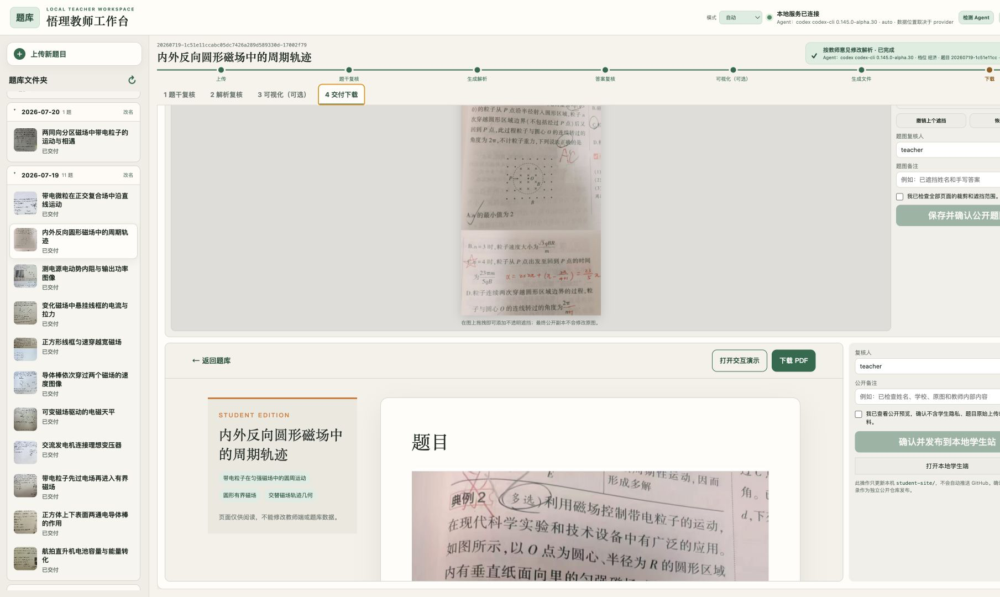
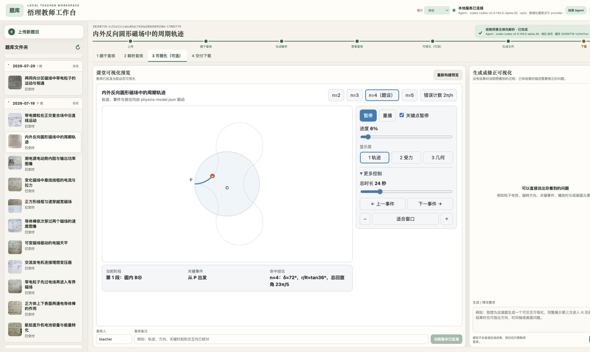
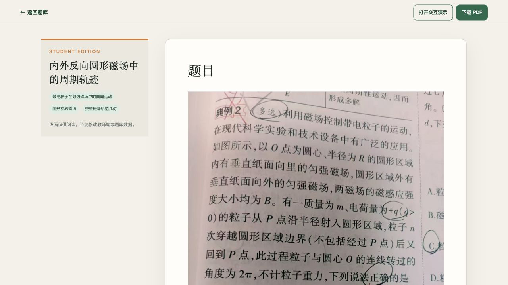

---
domain:
  - multi-modal
language: zh
tags:
  - 教育
  - 乡村教育
  - 高中物理
  - teacher-in-the-loop
  - 本地优先
  - 离线应用
deployspec:
  entry_file: index.html
license: MIT
---

# 悟理 · 乡村物理学习助理

> 大山很远，答案不该很远。

悟理是一套面向乡村课堂的端侧可信 AI 全流程教学助教平台。当前完整 MVP 聚焦高中物理，把错题录入、题干复核、分层解析、教师确认、按需交互仿真、PDF/学生包交付和知识沉淀组织为同一条可审计流程。

## 核心理念

AI 提供候选，教师确认事实；一次专业判断，持续服务课堂、复习与教研。

悟理不会把“模型生成了内容”等同于“内容已经可信”。题干、答案和动态仿真分别经过复核；关键内容发生变化后，旧批准会自动失效。教师确认后的讲法、PDF 和离线仿真可以作为校本资源持续复用。

## 工作流程

```text
错题图片或 PDF
  → 本地 OCR 与题干复核
  → 分层解析与教师确认
  → [教师按需请求交互仿真并复核]
  → Markdown / PDF / 学生包
  → 隐私处理与只读学生站
  → 检索、复习与知识沉淀
```

## 真实界面

### 教师工作台与发布门禁



题干、答案、交互仿真和公开发布分别设置确认门禁。Agent 可以生成或修订候选内容，但不能自行批准和发布。

### 已批准的离线交互仿真



交互仿真由教师按需请求。审核通过后保存为离线 HTML，课堂和学生端重复打开时不需要再次调用模型。

### 只读学生站



学生端与本地教师工作台隔离，只接收经过教师确认和隐私检查的白名单产物。

## 本创空间的范围

本创空间是悟理项目的纯静态公开展示页：

- 启动文件为 `index.html`；
- 不需要 Python、模型权重、运行时依赖或云端 API；
- 不包含学生原始题图、教师版私有解析、内部状态 JSON、访问令牌或 API Key；
- 页面中的图片均为经过筛选的项目界面截图；
- 完整项目需要在本地运行，教师工作台默认只监听 `127.0.0.1`。

## 开源与许可

- 开源代码：[Yuanuite/wuli-personal-ai-teaching-assistant](https://github.com/Yuanuite/wuli-personal-ai-teaching-assistant)
- 开源许可：MIT License

本展示页不宣称已经完成学校规模化试点，也不使用未经对照实验验证的学习成绩或 Token 节省比例。
