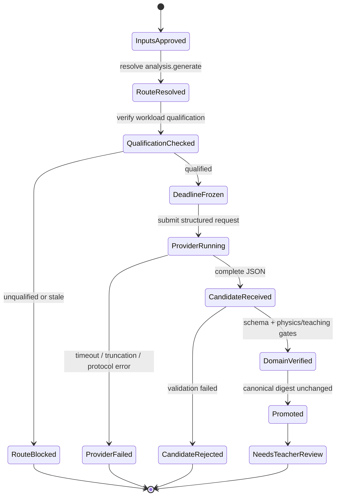

# 解析 Provider 超时与结构化输出失配修复原子 Work-Tree

> 状态：已执行（A0.1–A5.4 完成；A5.5 聚合验收中，条件 8“维护者批准默认路由”待人工确认）
> 版本：`wuli-analysis-provider-reliability-v1`
> 类型：软件调试 + Provider 资格治理 + 教师端可观测性
> 目标故障：`analysis.generate → openai-compatible / deepseek-v4-flash-api → output_truncated | provider_timeout`

## 1. 范围与真值政策

本计划只修复“题干已批准后，生成学生版与教师版解析失败”的链路：

```text
教师点击运行解析流程
→ 冻结任务路由
→ OpenAI-compatible 结构化请求
→ wuli.analysis.v2 校验
→ 确定性生成学生版/教师版
→ 等待教师答案复核
```

权威证据顺序：

1. `.cache/agent-jobs/<job-id>.json` 的实际 route、attempt、timing 和终态；
2. Gateway/adapter 的脱敏结构化失败 envelope；
3. 模型注册表、路由快照和任务契约摘要；
4. 自动化测试与经维护者批准的无隐私真实 canary；
5. 教师端文案。

不在本计划范围内：

- OCR、`source.clean`、题干人工批准；
- 物理答案内容本身的最终教师批准；
- 可视化、PDF、交付和公开发布；
- 放宽 allowed/denied paths、canonical 摘要或领域校验；
- 通过无限提高 Token、费用或自动重试次数掩盖模型不兼容；
- 把 provider 参数重新写进 `server.py`。

## 2. 已冻结事实

### 2.1 真实复现

| 事实 | 观测值 |
|---|---|
| 条目 | `20260802-screenshot-2026-08-02-at-17-55-28-830117d9` |
| 操作 | 教师端“运行解析流程” |
| 作业 | `f7afb816946a461d82b0f7313ec79cc5` |
| 任务 | `analysis.generate` |
| 路由 | `core-first → deepseek-v4-flash-api → openai-compatible` |
| 任务规模 | 6 个目标；3 条历史证据；7586 字符；evidence 已裁剪 |
| 结果 | provider 子进程在 `89.998 s` 被终止 |
| 终态 | `provider_timeout`；无候选修改；未运行 authoritative review |
| 预算行为 | 只调用 1 次；`provider-timeout-consumed-budget` 阻止付费 fallback |

### 2.2 历史同源失败

| 作业 | 直接信号 | 诊断 |
|---|---|---|
| `9cf0a400...` | `content_chars=0`、`reasoning_chars=18547`、`completion_tokens=6000` | reasoning-only，JSON 正文为空 |
| `50304a90...` | `finish_reason=length`、`content_chars=0`、`reasoning_chars=19162` | `output_truncated` |
| `f7afb816...` | thinking 关闭与复杂题宽预算已启用，仍在 90 秒前无结果 | 仅调大输出预算不足以证明兼容 |

### 2.3 已完成、不得重复实现的能力

- reasoning-only/length 已能诊断为 `output_truncated`；
- adapter 已能输出脱敏失败 envelope 和 usage；
- 复杂题已有 `request_preflight`、宽完成预算和 `thinking=disabled` 请求；
- job 已冻结 `route_snapshot` 并记录实际 provider/model；
- Gateway 已有 30 秒成本保护、一次调用边界和 canonical 安全提升；
- 分析检查点、运行报告和失败审计已经存在。

本计划的剩余缺口是：连通 probe 不能证明模型适合 `wuli.analysis.v2`；任务默认路由仍会选择未通过真实复杂负载资格验证的模型；Gateway 的 90 秒硬期限与 adapter 的 300 秒 HTTP 默认期限不形成可审计的统一契约；教师点击前看到的是通用运行时摘要，而不是本次任务的解析路由。

## 3. 稳定目标

| ID | 目标 | 可观测成功标准 | 优先级 | 批准者 |
|---|---|---|---|---|
| T1 | 建立任务级模型资格 | 只有通过固定 `wuli.analysis.v2` 样本、完整性、延迟和费用门槛的模型才能成为 `analysis.generate` 默认值 | P0 | 维护者 |
| T2 | 统一期限契约 | 每次作业明确记录 task/attempt/HTTP 三层期限且满足 `HTTP soft deadline < attempt hard deadline ≤ task deadline` | P0 | 自动测试 |
| T3 | 获得稳定结构化结果 | 复杂公开夹具得到非空 JSON，通过 schema 与既有领域 Gate；失败时保留准确终态且不污染 canonical | P0 | 自动测试 + 教师 |
| T4 | 消除界面路由误导 | 点击前、运行中、失败后均显示本任务实际 resolved model/provider；通用 Codex 状态不冒充解析模型 | P1 | UI E2E |
| T5 | 保持成本与安全边界 | 不自动提高费用、不进行第二次完整付费重试、不泄露题干/密钥/reasoning、不改变教师门禁 | P0 | 安全检查 |

## 4. 过程与状态模型



不变量：

- `RouteResolved` 后的模型身份在本作业内不可漂移；
- 未通过 `QualificationChecked` 不得调用 provider；
- provider 失败、候选拒绝或 canonical 漂移都不得提升文件；
- 自动恢复不得越过一次完整推理调用和现有费用保护；
- 只有教师可以批准答案。

## 5. 原子任务 DAG

每个任务只包含一个主要动词；默认最大尝试 1 次。需要重试时必须改变输入版本、模型策略指纹或期限策略指纹，并只重跑受影响依赖锥。

### Wave 0：冻结证据与验收口径

#### A0.1 · 提取脱敏复现夹具

- 动词：`extract`
- 输入：上述三个失败 job 的 route、timing、usage、failure envelope；不得复制题干和 reasoning 正文。
- 输出：新增或扩展 `teacher-console/tests/fixtures/analysis-run/` 下的 timeout、reasoning-only 和 valid-json 三类夹具。
- 依赖：无。
- 验证：隐私扫描确认无条目正文、绝对路径、Key、prompt 或 reasoning 正文。
- 终态：`completed | blocked-security`。

#### A0.2 · 定义资格门槛

- 动词：`model`
- 输入：`wuli.analysis.v2`、90 秒生产 SLA、现有成本保护、固定公开复杂题集合。
- 输出：`AnalysisQualification.v1`，至少包含 contract digest、模型配置 digest、样本版本、结构成功率、schema/domain Gate、p50/p95 延迟、provider usage、结论和失效条件。
- 依赖：A0.1。
- 验证：Schema 拒绝缺少样本版本、延迟、完整性结果或配置摘要的记录。
- 终态：`completed | failed-contract`。

#### A0.3 · 冻结完成定义

- 动词：`classify`
- 输入：T1–T5。
- 输出：`accepted / provisional / rejected` 判定表。
- 依赖：A0.2。
- 验证：不能用“probe 通过”“单个请求成功”或“超时调大后未报错”替代完整验收。
- 终态：`completed`。

### Wave 1：验证模型与 API 契约

#### A1.1 · 探测结构化能力

- 动词：`test`
- 输入：不含学生数据的最小 JSON 契约，分别覆盖 `response_format=json_object`、thinking 控制和普通非推理响应。
- 输出：provider 对各参数的接受、忽略或拒绝证据。
- 依赖：A0.2。
- 验证：保存状态码、finish reason、usage 和字符计数，不保存响应正文或凭据。
- 最大尝试：每个参数组合 1 次；最多 3 个组合。
- 终态：`compatible | incompatible | inconclusive`。

#### A1.2 · 比较复杂负载策略

- 动词：`compare`
- 输入：同一批 3 个公开/合成复杂题；保持模型、温度、evidence 和契约版本不变，只改变 A1.1 允许的结构化策略。
- 输出：`AnalysisQualification.v1` 对照报告。
- 依赖：A1.1。
- 验证：每个候选必须同时满足 JSON 非空、schema 通过、领域 Gate 通过、延迟与费用可接受；不得只比较“是否返回 200”。
- 最大尝试：每个策略 1 轮。
- 终态：`qualified | unqualified | provisional`。

#### A1.3 · 裁定默认资格

- 动词：`verify`
- 输入：A1.2 报告、当前默认模型和候选替代模型。
- 输出：每个模型对 `analysis.generate` 的资格结论及有效 config/contract digest。
- 依赖：A1.2。
- 验证：不合格模型不得继续依靠普通 connectivity probe 获得默认资格。
- 终态：`qualified-default | qualified-explicit-only | unqualified`。

### Wave 2：统一路由与期限

#### A2.1 · 建模期限预算

- 动词：`model`
- 输入：Core 总 SLA、模型资格延迟、Gateway 启动/清理开销、adapter HTTP 期限。
- 输出：`DeadlineBudget.v1`：`task_deadline`、`attempt_deadline`、`http_soft_deadline`、`cleanup_grace` 和来源。
- 依赖：A1.3。
- 验证：确定性检查 `http_soft_deadline + cleanup_grace ≤ attempt_deadline ≤ task_deadline`；禁止 adapter 的 300 秒默认值静默越过 90 秒作业期限。
- 终态：`completed | invalid-budget`。

#### A2.2 · 约束模型解析

- 动词：`enforce`
- 输入：`AnalysisQualification.v1`、model registry 和任务 kind。
- 输出：`resolve_model_id_for_task()` 只把当前 contract/config digest 下合格的模型解析为默认 `analysis.generate`。
- 依赖：A1.3。
- 允许修改：`model_registry.py`、注册表公开摘要及其测试；不得把判断复制到 `server.py` 或前端。
- 验证：未资格化、过期资格、能力缺失三类情况都在 provider 调用前失败关闭，并给出稳定原因。
- 终态：`completed | route-blocked`。

#### A2.3 · 选择安全默认路由

- 动词：`decide`
- 输入：所有合格模型的质量、延迟、费用和数据边界报告。
- 输出：维护者批准的 `analysis.generate` 默认模型；若没有合格模型，保持任务不可自动运行并提示选择已验证模型。
- 依赖：A2.2。
- 决策规则：质量与契约完整性为硬门；成本和速度只在硬门通过者之间比较。
- 终态：`approved | no-qualified-default`。

#### A2.4 · 传递期限预算

- 动词：`wire`
- 输入：A2.1 与 A2.3。
- 输出：Gateway 向 adapter 传递本次 soft deadline；job 记录冻结后的三层期限和策略 digest。
- 依赖：A2.1、A2.3。
- 允许修改：`agent_gateway.py`、provider adapter、route/job outcome；provider 细节仍只在 Gateway/adapter。
- 验证：慢响应先形成脱敏结构化 timeout envelope，再由 Gateway 留出清理时间完成安全终态。
- 终态：`completed | deadline-propagation-failed`。

### Wave 3：加固 OpenAI-compatible 结构化执行

#### A3.1 · 选择请求策略

- 动词：`select`
- 输入：A1.1 兼容矩阵、A1.3 资格记录和任务复杂度。
- 输出：由模型配置声明的结构化请求策略；禁止按模型名称散落条件分支。
- 依赖：A1.3。
- 验证：未知策略、未经资格验证的参数组合在 HTTP 调用前失败。
- 终态：`completed | unsupported-strategy`。

#### A3.2 · 记录阶段进度

- 动词：`record`
- 输入：compact core/interface 两阶段请求、request preflight 和期限预算。
- 输出：不含正文的阶段事件：阶段名、开始/结束、request count、finish reason、usage、字符计数和剩余期限。
- 依赖：A2.4、A3.1。
- 验证：即使第二阶段超时，也能区分“第一阶段未返回”和“第一阶段成功、第二阶段超时”；不得保存 reasoning 正文。
- 终态：`completed | telemetry-incomplete`。

#### A3.3 · 验证结构化候选

- 动词：`verify`
- 输入：provider 返回的完整 JSON。
- 输出：既有 `wuli.analysis.v2` schema、最短高中方法、目标覆盖和 canonical 摘要验证结果。
- 依赖：A3.2。
- 验证：不得为了让 DeepSeek 通过而放宽契约或物理/教学 Gate。
- 终态：`verified | rejected | unsupported`。

### Wave 4：修正教师端心智模型

#### A4.1 · 暴露路由预览

- 动词：`expose`
- 输入：服务端现有任务 resolver、当前模式、kind 和 route snapshot 摘要。
- 输出：教师端可消费的只读 `RoutePreview.v1`：任务、resolved model、provider、资格状态、期限和数据边界。
- 依赖：A2.2、A2.4。
- 验证：预览与随后入队 job 的 route snapshot 一致；配置变化时预览失效，不猜测。
- 终态：`completed | stale-preview`。

#### A4.2 · 渲染任务身份

- 动词：`render`
- 输入：A4.1 和 active job public schema。
- 输出：点击前显示“本次解析将使用 …”；运行中和失败后继续显示同一实际模型/provider。通用 Codex 可视化状态单独标注为运行时能力。
- 依赖：A4.1。
- 验证：自动模式下不得出现“顶部看似 Codex、实际解析为 DeepSeek”而无解释的状态。
- 终态：`completed | ui-contract-failed`。

#### A4.3 · 渲染可执行故障建议

- 动词：`render`
- 输入：`provider_timeout`、`output_truncated`、资格状态和预算保护原因。
- 输出：教师可执行但不越权的建议，例如“该模型未通过复杂解析资格，请选择已验证模型或等待维护者修复”；不声称系统已 fallback。
- 依赖：A4.2。
- 验证：建议来源于结构化字段；公开 API 不返回 stdout/stderr、题干、绝对路径或 Key。
- 终态：`completed | unsafe-copy`。

### Wave 5：回归、真实验证与收口

#### A5.1 · 运行单元验证

- 动词：`test`
- 输入：A0–A4 的代码和夹具。
- 输出：model registry、Gateway、adapter、route snapshot、失败分类、job outcome、前端静态契约测试报告。
- 依赖：A3.3、A4.3。
- 验证：全部通过且无真实网络调用。
- 终态：`passed | failed`。

#### A5.2 · 运行集成验证

- 动词：`test`
- 输入：本地 fake OpenAI-compatible server。
- 输出：valid JSON、reasoning-only length、HTTP soft timeout、迟到响应、两阶段第二段超时五种报告。
- 依赖：A5.1。
- 验证：每种故障的分类、期限、request count、预算保护和 canonical 零修改都正确。
- 终态：`passed | failed`。

#### A5.3 · 运行生命周期 E2E

- 动词：`test`
- 输入：独立临时知识库、临时输出目录和两个 fake adapter。
- 输出：教师端“上传/题干复核/解析生成/答案复核”链路报告。
- 依赖：A5.2。
- 验证：不得读取或写入正式 `student-error-library/`、`output/`、`student-site/`；页面预览模型与 job 实际模型一致。
- 终态：`passed | failed`。

#### A5.4 · 执行真实 canary

- 动词：`test`
- 输入：维护者明确批准的 3 道公开/合成复杂题、费用上限、远程数据许可。
- 输出：真实 provider 的 `AnalysisQualification.v1` 与脱敏运行报告。
- 依赖：A5.3。
- 验证：不得使用正式学生原图或未批准题干；不得自动扩大费用或重试。
- 最大尝试：每题每策略 1 次。
- 终态：`qualified | unqualified | blocked-approval | blocked-provider`。

#### A5.5 · 聚合验收

- 动词：`aggregate`
- 输入：A5.1–A5.4 的已验证工件。
- 输出：最终 acceptance report 和默认路由决议。
- 依赖：A5.4。
- 验证：任何 `failed/unqualified/unresolved` 必须原样保留；文档渲染不得把 provisional 改写为 passed。
- 终态：`accepted | provisional | rejected`。

## 6. 执行波次与角色

| 波次 | 可并行任务 | 角色 | 写入边界 |
|---|---|---|---|
| 0 | A0.1；随后 A0.2/A0.3 | 测试设计者 | fixtures/schema/docs |
| 1 | A1.1；随后 A1.2/A1.3 | Provider 验证者 | probe/benchmark/report；不改生产默认 |
| 2 | A2.1 与 A2.2；随后 A2.3/A2.4 | Gateway/路由维护者 | model registry、Gateway、job contract |
| 3 | A3.1/A3.2；随后 A3.3 | Adapter 维护者 | adapter 与对应测试 |
| 4 | A4.1；随后 A4.2/A4.3 | 教师端维护者 | API public schema、`app.js`、UI 测试 |
| 5 | A5.1→A5.2→A5.3→A5.4→A5.5 | 独立验证者 + 维护者 | 临时测试区、脱敏报告 |

角色是职责划分，不授权自动创建子 Agent。A2.3 与 A5.4 涉及默认路由、费用和远程数据，必须由维护者明确批准。

## 7. 状态传递契约

| ID | 工件 | 生产者 → 消费者 | 前置条件 | 指纹 | 失效规则 |
|---|---|---|---|---|---|
| I1 | `FailureFixture.v1` | A0.1 → A0.2/A5.2 | 已脱敏 | 原 job 摘要 + fixture schema | 失败字段语义变化 |
| I2 | `AnalysisQualification.v1` | A1.2/A1.3 → A2.2/A2.3/A3.1/A5.5 | 固定样本全部执行 | model config + contract + sample-set digest | 模型配置、契约、样本或策略变化 |
| I3 | `DeadlineBudget.v1` | A2.1 → A2.4/A3.2 | 模型资格结论存在 | route policy + model latency digest | SLA、模型或 Gateway 开销变化 |
| I4 | `RouteSnapshot.v1` | A2.2 → job/Gateway/A4.1 | resolver 成功 | registry + route config digest | 配置变化；旧 job 只读保留 |
| I5 | `RoutePreview.v1` | A4.1 → A4.2 | 与当前配置摘要一致 | entry + kind + tier + route digest | 任一输入或配置改变 |
| I6 | `AcceptanceReport.v1` | A5.5 → 维护者 | 只聚合验证通过或显式未决工件 | 所有输入报告摘要 | 任一输入报告重跑 |

接口兼容性必须单独验证；不得以“下一步读取上一任务结果”的自然语言代替 schema、摘要和失效条件。

## 8. 验证账本

| VO | 对应目标 | 检查 | 证据 | 判定规则 | 失败回跳 |
|---|---|---|---|---|---|
| V1 | T1 | 默认模型具备真实任务资格 | `AnalysisQualification.v1` | contract/config digest 当前，3/3 结构完整且 Gate 通过 | A1.1–A1.3 |
| V2 | T2 | 三层期限有序 | `DeadlineBudget.v1` + job | soft + grace ≤ attempt ≤ task | A2.1/A2.4 |
| V3 | T3 | 复杂解析产生可用 JSON | fake + live canary | content 非空、schema/domain Gate 通过 | A3.1–A3.3 |
| V4 | T3/T5 | 失败不污染 canonical | before/after digest | provider/validation 失败时摘要完全相等 | Gateway promotion cone |
| V5 | T4 | UI 与实际路由一致 | route preview + job snapshot + E2E | model/provider/资格状态一致 | A4.1/A4.2 |
| V6 | T5 | 无重复付费推理 | attempts/usage/budget guard | 超过阈值后 `attempts.count=1` | A2.4/Gateway |
| V7 | T5 | 无敏感信息泄露 | 仓库、job public API、report 扫描 | 无 Key、完整 prompt/reasoning、正式题干、绝对路径 | 对应生产者任务 |
| V8 | 全部 | 原生命周期无回归 | 单测 + 临时库 E2E | 全通过；正式库零写入 | 最小失败依赖锥 |

物理解答正确性仍需既有领域 Gate 与教师复核；模型资格测试不能替代教师批准。

## 9. 反馈、回跳与停止规则

| 触发 | 最小回跳点 | 最大次数 | 停止状态 |
|---|---|---:|---|
| 参数被上游忽略或拒绝 | A1.1/A3.1 | 2 个新策略版本 | `unqualified` |
| 仍出现 reasoning-only | A1.2/A3.1 | 2 轮全局策略比较 | `unqualified` |
| JSON 完整但领域 Gate 失败 | A3.3；不得放宽 Gate | 1 个新候选版本 | `rejected` |
| p95 超过 Core SLA | A2.1/A2.3 | 1 次维护者决策 | `no-qualified-default` |
| preview 与 job 路由不同 | A4.1 | 1 个新 route digest | `ui-contract-failed` |
| 相同 task/model/config/strategy 指纹再次失败 | 不重跑 | 0 | `deduplicated-failure` |
| 真实 canary 未获批准或 provider 不可用 | 不猜测结果 | 0 | `blocked-approval/provider` |

全局最多 2 轮“假设—测试—修订”。连续一轮没有新增结构成功、延迟改善或更准确失败证据时触发 no-progress fuse。任何假设只能安排测试，不能直接修改默认路由或宣布模型合格。

## 10. 文件影响边界

预计可能修改：

- `teacher-console/model_registry.py`
- `teacher-console/agent_gateway.py`
- `teacher-console/providers/openai_compatible_agent_adapter.py`
- `teacher-console/route_snapshot.py`
- `teacher-console/agent_jobs.py` / `agent_outcome.py`
- `teacher-console/server.py`：只允许生命周期提交与只读 route preview，不加入 provider 参数
- `teacher-console/static/app.js`
- `teacher-console/tests/test_model_registry.py`
- `teacher-console/tests/test_agent_gateway.py`
- `teacher-console/tests/test_analysis_run_observability.py`
- 新增的 deadline/qualification/UI 契约测试与 E2E fake adapter
- `docs/agent-gateway.md`、`docs/failure-intelligence.md`、`docs/teacher-console-api.md`、`docs/operator-runbook.md`、`docs/CHANGES.md`

禁止修改或生成：

- 正式条目的题干、答案、批准记录和 pipeline 状态；
- `student-site/` 公开产物；
- 正式 `output/` 交付物；
- 为通过测试而降低 `wuli.analysis.v2`、canonical 或教师批准门禁。

## 11. 建议验收命令

实际实现后至少运行：

```bash
/Users/qingyuan/miniconda3/bin/python3 -B teacher-console/scripts/run_tests.py \
  --python /Users/qingyuan/miniconda3/bin/python3 --strict

python3 -B -m unittest \
  teacher-console/tests/test_model_registry.py \
  teacher-console/tests/test_agent_gateway.py \
  teacher-console/tests/test_analysis_run_observability.py \
  teacher-console/tests/test_analysis_run_report.py \
  teacher-console/tests/test_failure_intelligence.py

python3 -B teacher-console/e2e/run_e2e.py \
  --scenario analysis-qualified-route \
  --scenario analysis-soft-timeout \
  --scenario analysis-route-preview

git diff --check
graphify update .
```

新增 E2E 场景名称在实现时注册；E2E 必须使用独立临时知识库和输出目录。真实 canary 是独立维护者批准项，不得混入自动测试。

## 12. 聚合与最终完成条件

只有同时满足以下条件，A5.5 才能输出 `accepted`：

1. `analysis.generate` 默认模型具有当前 `wuli.analysis.v2` 与配置摘要下的有效资格记录；
2. 复杂题至少 3 个固定样本全部返回完整 JSON，并通过既有 schema/领域 Gate；
3. 三层期限满足有序不变量，超时能在 Gateway 硬终止前形成可审计安全终态；
4. 不合格模型在调用前失败关闭，或仅作为明确的实验性自定义选择；
5. 教师点击前能看见本次解析真实模型/provider，运行与终态不发生身份漂移；
6. provider 失败与候选拒绝均不修改 canonical，也不触发第二次完整付费推理；
7. 单元、集成、临时库 E2E、隐私扫描和 `git diff --check` 全部通过；
8. 维护者批准默认路由，并查看至少一份成功报告和一份受控失败报告；
9. 相关文档与 graphify 已同步。

如果代码与 fake 测试通过，但真实 canary 未完成，状态只能是 `provisional`。如果没有任何模型同时满足质量、结构完整性和 SLA，允许以 `no-qualified-default` 安全结束；不得把连接成功伪装成生产可用。

## 13. 当前推荐的最小执行顺序

```text
A0.1 → A0.2 → A0.3
             ↓
A1.1 → A1.2 → A1.3
             ├→ A2.1 → A2.4 ─┐
             └→ A2.2 → A2.3 ─┼→ A3.1 → A3.2 → A3.3
                              └→ A4.1 → A4.2 → A4.3
                                                     ↓
                                      A5.1 → A5.2 → A5.3
                                                     ↓
                                      A5.4 → A5.5
```

首个可交付里程碑不是“把 90 秒改大”，而是完成 A0–A2：让系统只把经过任务级资格验证、期限契约一致的模型选为默认解析路由。随后再用 A3–A5 证明结构化输出、教师端显示和真实负载都闭环。
