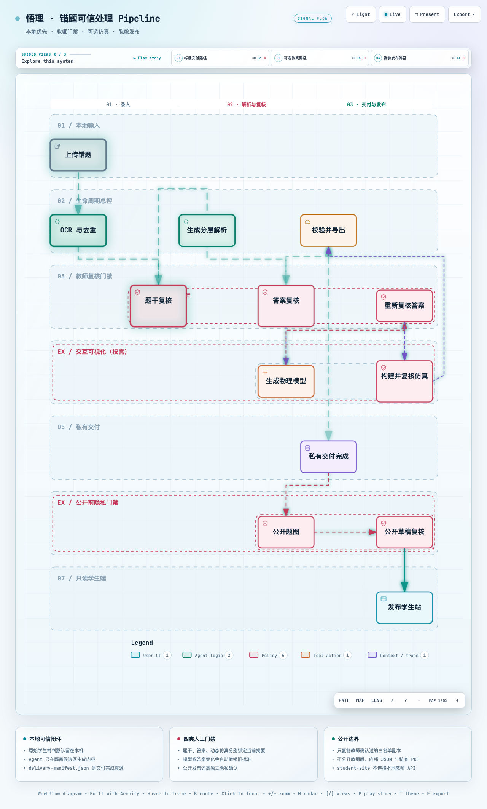
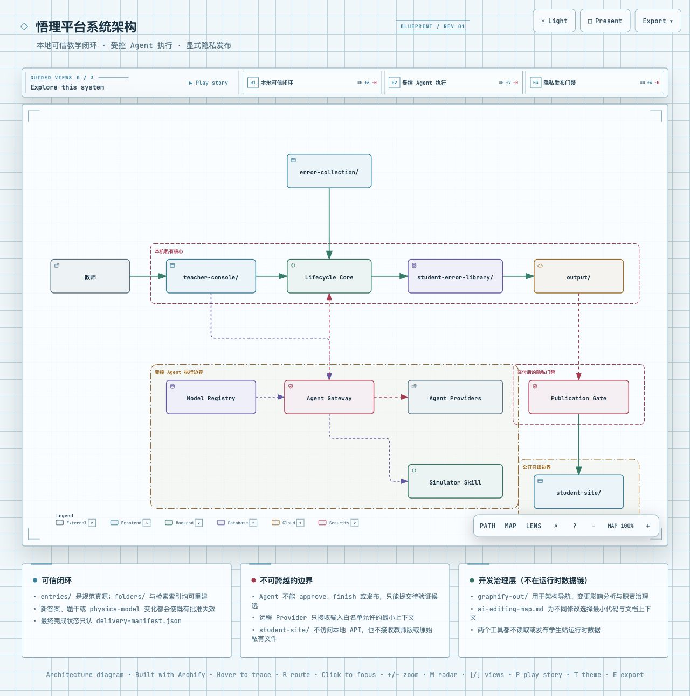

# 悟理系统架构

## 目标与边界

本项目把一道新上传的错题视为一个有状态的生命周期，而不是一组彼此独立的 OCR、解析、仿真和导出命令。学生材料默认只在本机处理；未经明确授权，不上传到远程 OCR 或其他外部服务。

## 生命周期

```text
uploaded → ingested → source-reviewed → analyzed → answered → answer-reviewed
         → [teacher requests interactive visualization
            → model-created → answer-re-reviewed → visualization-built → visualization-reviewed]
         → validated → delivered → reviewed
```

`manage-student-error-library` 是唯一生命周期总控。它发现上传、建立条目、推进状态、生成答案、维护索引并交付结果。`build-physics-simulator` 只在教师明确请求交互可视化时被调用；若确定性渲染器无法正确表达该过程，必须返回 `unsupported` 及理由。

> **交互式管道图**：[点击查看](https://yuanuite.github.io/wuli-personal-ai-teaching-assistant/diagrams/pipeline.workflow.html)（可缩放、搜索节点、切换暗色/亮色主题）
>
> 
>
> **系统架构图**：[点击查看](https://yuanuite.github.io/wuli-personal-ai-teaching-assistant/diagrams/system.architecture.html)（展示组件关系与信任边界）
>
> 

## 文本模型与视觉边车

主推理模型不必具备视觉能力。输入规范化分为三层：

```text
原图/PDF → OCR 字符草稿 → 视觉语义复核 → 已复核题干 → 推理模型
```

- OCR 负责文字候选，不判断图形语义；
- 可插拔视觉边车负责公式结构、图示、方向、电性和边界；
- 教师是任何适配器失败或存在不确定项时的最终兜底；
- DeepSeek 等纯文本模型只消费已经通过复核的题干和图形事实。

`source-review.json` 记录方法、引擎、本地/远程属性、输入摘要和复核时间。`source-review.md` 是人工路径的本地复核包。任何路径都不得仅凭 OCR 置信度解除门禁。

### 教师确认的信任边界

系统不能证明教师是否认真看过原图，只能证明某位教师或角色明确确认了某个题干版本。因此人工路径采用可审计声明，而不是模型猜测：

1. 教师对照原图修正 `problem.md`；
2. 教师明确执行或授权执行 `approve-source`；
3. 命令拒绝仍含 `[待核对]` 的题干；
4. `source-review.json` 保存 reviewer、时间、原始输入摘要和正式题干哈希；
5. `record.json` 的 `ocr.review_required=false` 与 `source_review.status=passed` 必须同时成立。

这些证据能追溯“谁确认了哪个版本”，不能替代教师本人的专业责任。视觉边车返回任何不确定项时也必须回到该人工路径。

每个条目的 `pipeline.json` 记录当前状态和下一步；脚本负责推进状态，Agent 不手工伪造完成状态。最终完成以输出目录的 `delivery-manifest.json` 为准。

### 教师工作台

`teacher-console/` 是生命周期总控的本地交互外壳，不复制 OCR、校验、导出或仿真逻辑。后端直接调用 `process_uploads.py` 与 `kb.py`，页面负责上传、展示原图、收集题干与答案确认，并对所有条目保留按需可视化入口；只有已生成物理模型的条目才进入动态产物复核。工作台还可通过本机 Agent Gateway 触发已配置的 provider、展示后台作业和提供必要成品下载。默认只绑定 `127.0.0.1`，因此不是公网发布站点。

来源批准绑定题干摘要；答案批准绑定题干、学生版、教师版、同步答案、共享物理模型和答案所引用本地图像的联合摘要。解析意见可交给 Gateway provider 在隔离候选区修改 Markdown；静态物理图由独立 `diagram.scene` 结构化任务规划并由本地渲染器生成，Agent 不直接写 SVG，也不能自行批准。任一受保护文件发生变化，旧批准失效，`finish` 必须拒绝交付。

可视化页面始终保留，但标准解析不主动创建交互模型。没有 `physics-model.json` 时显示“尚未生成”，教师明确请求后才由 Agent 调用 `build-physics-simulator` 创建模型；这不是对题目适宜性的自动判断。模型创建会使答案摘要失效，因此先回到答案复核。可视化批准只适用于已经生成的动态交互仿真，并独立绑定当前模型、预审 HTML/ZIP、运行时证据和构建报告。动态仿真先在条目 `visualization/` 中构建并由教师通过 sandbox iframe 查看；`finish` 只复制这份已批准产物，不重新渲染。静态 SVG/PNG 始终留在答案复核。

交互仿真的呈现契约同样属于待复核产物：桌面端优先采用画布与控制栏并排，手机端应在首屏同时保留画布、当前结论、播放按钮和进度，案例横向滚动，次要图层与高级控制默认折叠，避免学生为观察结果反复上下滑动。模板变更后必须重新构建并执行桌面与手机视口检查；公开发布复制通过教师批准的字节，不在学生站另做一套布局。

`entries/` 是条目唯一真源。`folders/` 是按上传日期生成、可从真源重建的教师视图，网页文件夹改名只调整该视图和分组元数据，不移动 canonical entry。

工作台的路由、写操作请求头、门禁状态码和本地集成顺序见 [`teacher-console-api.md`](teacher-console-api.md)。该接口只服务本地教师端，不构成学生端的数据通道。

### Agent Gateway 信任边界

```text
HTTP action → persistent job → Agent Gateway → temporary candidate workspace
                                             → provider adapter
                                             → path + domain validation
                                             → locked allowlist promotion + rollback
                                             → lifecycle state/review invalidation
```

- `server.py` 只提交任务类型、教师意见、读写集合和隐私策略，不保存具体 CLI/API 参数；
- provider 在系统临时目录工作，canonical entry 不作为工作目录；候选区按输入白名单构造，原始题图、批准记录和无关内部文件不被 Gateway 复制或写入 prompt；CLI 运行时的额外只读边界仍由其自身沙箱决定，严格披露边界应使用结构化 adapter；
- 标准解析默认使用 `wuli.core-solve.v1`：模型只输出 Target Brief 绑定的最终结论、决定性推导、条件、复算检查和元数据建议，不输出教学 Markdown，也不生成阶段接口、Claim DAG、第二求解器或仲裁记录。本地 Core Gate 通过后确定性生成学生版、教师版和兼容版，渲染不得改变 `final_answer`。普通课堂使用 `high_school_standard`，官方竞赛评测显式使用 `olympiad_official`；一次核心调用失败即停止，不用旧 W2/W3 提示重复求解；
- Core Gate 之后、渲染之前执行 `wuli.physics-quality-gate.v1`（`physics_quality.py`）：对每个目标的推导/结论内部一致性、符号与方向、变量定义做确定性检查，候选不通过即拒绝且不渲染；量纲与适用条件记录为 `deferred-verifier`，不作为硬门禁。复杂题（`decompose`）的 `deferred-verifier` 项由答案后自动排队的独立 claim 验证链承接（见下条）；简单题没有自动 verifier，这些项是教师 `approve-answer` 前的人工核对清单。`core-solution.json` 的 `gate` 字段写入真实报告（reason codes 与 obligations），阶段序列含 `physics-quality-gate` 与真实 `render-fidelity-gate`；
- 静态 `diagram.scene` 与交互仿真均为答案后的可选增强，不再与首次答案候选组成阻塞事务。显式请求静态图时，仍由强类型场景契约和本地确定性 SVG 渲染承担语义与安全门禁；
- 磁场运动的静态教学投影遵循“先保几何、再表达深度”：x-y 轨迹等比例缩放，解析 `arc3d` 和通过共圆检验的采样段渲染为真实圆弧；不同案例用稳定配色和方向箭头区分，模型换向事件、圆心与半径作为构造层叠加。三维 z 位移以文字/独立视图表达，不能混入 x-y 坐标而把圆周轨迹拉成伪曲线；
- 通用逻辑流程图不再是解析失败或缺图时的默认兜底。`logic-flowchart` 仅保留为必须显式指定的可选插件；未取得可信物理 scene 时任务失败关闭并回滚答案—图组合候选；
- 每次 Agent 请求归一化为 `AgentRequestOutcome`，统一记录阶段、provider、尝试次数、错误分类、回退状态、隐私安全摘要与可用的 token/时延指标，供作业结果、候选档案和离线评测复用；
- `analysis.generate`、`answer.revise` 与 `visualization.model` 可从本地 Knowledge Store 获得经过裁剪、限量且排除当前条目的历史证据；证据构造使用确定性的字符预算、逐段裁剪和内容哈希，检索失败不阻塞任务，证据不得覆盖当前教师复核内容，也不会成为新的 canonical 真源；
- `wuli-core-first-routing-v1` 是解析生成的默认路由策略，不把题目分到 W2/W3 两套求解器。`complexity_screen` 判 `decompose` 的复杂题在 Core 链内升级：使用 `wuli.core-rich.v2` 产出五段学生版，rich 答案物化成功后自动排队 `diagram.scene`，并复用 W3 claim-verifier 批次机制自动运行独立 claim 验证（verifier 与 solver 身份隔离，全部 pass 才置 `answer_status=canonical`，否则 provisional 并列教师裁决清单，产物为 `claim-verification.json`）；简单题保持单次 `wuli.core-solve.v1`，无自动独立验证，验证责任由教师复核承担。`student-error-library/config/analysis-production-routing.json` 可切为 `legacy-adaptive` 恢复旧 `wuli-analysis-adaptive-v1`；旧 W2/W3 代码与配置暂时保留但不在默认链执行，详见 [`w3-reasoning-pipeline.md`](w3-reasoning-pipeline.md)；
- 默认关闭的 Claim Evidence 影子层可把 Solver 关系投影为版本化断言 DAG，为算术、量纲、区间、事件顺序和隔离语义复算生成证书，再做跨阶段接口检查、依赖定向回跳、受控假设搜索与确定性汇总。假设始终留在探索平面，冲突或缺证只会得到 `PROVISIONAL/UNRESOLVED`；完整账本仅供教师端读取，不修改 canonical 答案、批准或学生端产物。执行真源见 [`技术执行计划书.md`](archive/2026-08-03/技术执行计划书.md)，解题 loop 的原子任务、状态传递、反馈回路和熔断边界见 [`解题loop.md`](archive/2026-08-03/解题loop.md)；
- `.agent-context/` 按任务和成本档位提供最小只读规则：答案任务以答案模板与职责边界为主，深度档才附完整知识库 Skill；可视化任务附仿真 Skill 与模型 Schema；
- 候选修改仅限任务白名单，答案候选由知识库验证器检查，可视化候选由仿真模型构建器检查；
- canonical 条目在排队期间变化、候选越权、删除文件或验证失败时均不提升；
- 内容校验失败、输出截断或未形成修改时，失败排障层可在全新隔离区携带脱敏证据纠正一次；它不放宽路径、审批或发布边界，越权与 canonical 冲突永不自动重试；
- provider 只有在尚未产生候选修改时才能安全降级；
- 教师可选择 `auto|economy|expert`；档位只路由模型并裁剪上下文，实际模型、降级说明和 provider 用量写入私有作业记录，不改变复核门禁；
- 后台 Agent 作业由 Scheduler 按优先级和任务类型领取当前可运行任务，不让等待限额的作业占住 worker；`source.clean` 默认进入 `economy` 快速档并允许跨题并发，解析生成、答案返修和可视化建模也可跨题有限并发，同题任务始终互斥；
- `source.clean` 批量完成后以防抖方式刷新知识索引，避免每题成功都立即重建全库；Evaluator 与 Candidate Archive 仍逐题记录结果；
- 版本/help 探测与无学生数据的主动连通探测分离；任务失败后同一题目的同类型任务进入短期冷却，避免重复计费，但不阻止其他题目使用同一 provider；
- OS 单实例锁阻止两个教师服务同时管理同一知识库；单题事务锁覆盖摘要复查、提升及后处理，库级锁串行化知识索引写入；
- provider 仅继承基础运行变量与自身认证变量，其他环境变量必须显式加入 adapter allowlist；
- 作业状态与 `pipeline.json` 分离，页面刷新可以恢复轮询，服务重启则把状态不明的任务标记失败。

Gateway 不拥有 OCR、答案或物理语义，也不得调用任何 `approve-*`、`finish` 或公开发布动作。详细 provider 协议和隐私门禁见 [`agent-gateway.md`](agent-gateway.md)。

#### 路由配置真源表

解析生成相关的路由配置只有三个真源，都在 `student-error-library/config/`；`route-preview` 返回的
`wuli.route-execution-plan.v1` 从这三个文件推导，教师端不从按钮文案推断路线：

| 配置文件 | 当前值 | 语义 |
|---|---|---|
| `analysis-production-routing.json` | `mode: core-first`，`max_latency_seconds: 90` | 顶层真源：Core-first 单次 `wuli.core-solve.v1`，复杂题链内升级 `wuli.core-rich.v2` + 自动 diagram + 独立 claim 验证（最多三次调用）；可切 `legacy-adaptive` 回退旧自适应链 |
| `w3-production-routing.json` | `mode: default`，`enabled_in_core_first: false` | 仅在 `legacy-adaptive` 下生效的 W2/W3 分流参数；core-first 时不进入 W3 阶段，`mode: default` 不代表“默认会跑 W3” |
| `w3r-production-routing.json` | `mode: off` | W3R 不运行；`shadow`/`gray`/`default` 需显式切换且满足证据门禁 |

### 学生端公开边界

`student-site/` 是独立、只读、纯静态的发布目标，不是教师工作台的公开模式。数据只能单向流动：原始题图先生成不覆盖原文件的 WebP 公开副本，裁剪、遮挡、源文件摘要和教师确认记录在 `publication-images.json`；源图或副本变化后确认自动失效。已交付条目再生成 `publication-draft/`，安全扫描通过且教师查看预览、勾选隐私确认后，才把白名单产物复制到公开站。公开 ID 使用不可逆摘要，不暴露内部条目 ID；原始上传、教师版解析、流程记录、复核记录、模型 JSON、交付清单、私有交付 PDF 和绝对路径一律禁止进入公开目录。公开页面只读取相对路径的 `catalog.json`、Markdown、题目阅读页中的公开版 `带答案错题.pdf`、公开题图、答案图片及已批准仿真，不调用教师端 API；目录中的 `uploaded_at` 只保留条目首次创建日期，不暴露精确时间或时区，用于学生端新旧排序，重新发布不会改变该顺序。已经通过隐私复核且仍存在于公开站的条目，可单独刷新 `catalog.json` 中裁剪后的难度摘要；该维护动作不重新复制题目、答案、PDF 或仿真，不改变原发布时间，也不得公开标准解题路径、评估证据或内部摘要。公开 PDF 从脱敏后的 `content.md` 和公开题图重新生成：优先 `pandoc+xelatex`，失败时降级为 `reportlab`，并保留 Markdown 中的 LaTeX 编码；若两条链路都不可用则标记 `skipped`，Markdown 页面仍可发布且不显示无效下载入口。GitHub 推送是明确的人工后续操作。

教师工作台允许在解析复核阶段直接编辑学生版或教师版 Markdown。保存教师版时同步 `solution.md`，保存任一答案都会撤销旧批准并重建检索。如果条目包含 `physics-model.json`，保存会把 `source.answer_render_mode` 标记为 `manual`；之后 `finish` 尊重教师手工版本，不再静默用模型重新覆盖 Markdown。需要恢复模型生成时，应显式重新运行答案渲染并把该字段改回 `model`。

## 组件职责

| 能力 | 生命周期总控 | Agent Gateway | 仿真专家 |
|---|---|---|---|
| 上传发现、哈希、去重、OCR、原图核对 | 负责 | 不参与 | 不参与 |
| 知识点、错误类型、历史检索 | 负责 | 只运输候选 | 不参与 |
| 学生版/教师版 Markdown、PDF、学生包 | 负责 | 隔离运行并返回候选 | 不参与 |
| 物理区域、事实、事件、轨迹、交互参数 | 协调并保存 | 隔离运行并返回候选 | 负责语义与验证 |
| HTML/ZIP、静态检查、浏览器运行检查 | 调用并接收结果 | 不构建 | 负责 |
| provider 探测、后台作业、失败降级 | 不参与 | 负责 | 不参与 |
| 模型注册 CRUD、probe 验证、config 解析 | 独立模块(`model_registry.py`) | 查询使用 | 不参与 |
| 教师批准、知识索引和复习计划 | 负责 | 永不执行 | 不参与 |

## 生产流程与 E2E 边界

教师真实处理一道题时，只执行生产生命周期并写入配置所指向的
`student-error-library/`、`output/` 和经批准的 `student-site/`；生产服务没有调用 E2E runner，
也不会把教师操作自动录制为测试。E2E 是维护者或 CI 显式启动的独立驱动层：

```text
Playwright UI 操作 → 真实本地 HTTP/API → 生产生命周期与构建器
                                      ↘ 临时知识库/输出/公开站
确定性假 Agent ────────────────────────↗
                          ↓
       manifest + Evaluator + pipeline quality 断言
```

`teacher-console/e2e/run_e2e.py` 为每个场景创建临时根目录、启动真实教师服务并调度 Playwright；
测试替换 OCR 和 Agent 这两个外部不确定边界，但不替换 HTTP、候选提升、审批门禁、文件导出、
仿真构建或浏览器交互。`evaluator.py` 与 `pipeline_quality_eval.py` 位于断言层：前者核对单题领域门禁，
后者汇总内容、流程、Token 和耗时诊断；二者都不是 E2E 驱动器，也不会触发真实题目入库。

当前场景及运行方式见 [`../teacher-console/e2e/README.md`](../teacher-console/e2e/README.md)。

## `physics-model.json` 集成契约

同一道题只保留一个模型文件，避免答案、事件标签、轨迹和 HTML 常量分叉。字段所有权如下：

| 字段 | 所有者 |
|---|---|
| `schema_version`、`entry_id`、`title` | 生命周期总控初始化；双方只做一致性检查 |
| `source`、`technique_ids`、`student_solution`、`teacher_audit` | 生命周期总控 |
| `model_type`、`regions`、`facts`、`event_model`、`trajectory`、`simulation` | 仿真专家 |

仿真专家可以验证教学字段与物理事件是否一致，但不得把教学答案作为自己的第二份真源。生命周期总控不得在答案或导出脚本中另写一套轨迹/事件常量。

机器结构由 `.claude/skills/build-physics-simulator/references/physics-model.schema.json` 校验；跨字段物理关系由 `validate_physics_model.py` 校验。两层都通过后才能构建仿真。

当前确定性仿真器支持六类 `model_type`：同心圆多区场、反向圆形磁场、电场入有界磁场、平面分界磁场多粒子轨迹，以及任意二维或三维分段电/磁场轨迹。三维类型只用于纸面外位移、斜置磁场、螺旋线、圆筒收集面或空间相对运动等第三坐标改变物理结论的题目；不能把二维题强行做成立体装饰。新增类型必须同时补 renderer、模型校验、Skill 文档和浏览器检查；不得只让 Agent 自创 `model_type`。

## 验证与交付

完整交付依次通过：

1. 原图与题干核对；
2. 教师批准当前答案摘要；
3. 若教师已请求交互可视化，构建预审产物并由教师批准当前产物摘要；未请求时记录 `not-generated` / `not-required`；
4. 答案结构、图片引用和知识库记录校验；
5. JSON Schema 与跨字段物理校验；
6. HTML/JavaScript/ZIP 静态校验；
7. 浏览器运行时检查，或明确记录因依赖不可用而跳过；
8. 来源、答案与可视化复核摘要、PDF 状态、学生包和交付文件清单写入 manifest。

`finish` 成功后还会生成单题 `evaluation.json`，把解析结构、来源/答案复核、可视化状态、交付完整性和本地路径安全提示整理成可审计评分。Evaluator 只记录确定性事实和启发式提示，不替代教师复核；它是后续 Candidate Archive、题库 RAG 和 AI 审计 RAG 的共同证据入口。细节见 [`evaluator.md`](evaluator.md)。

题目客观难度与解析质量分开建模，完整量表和修改地图见
[`objective-difficulty-rubric.md`](objective-difficulty-rubric.md)。`analysis.generate` 会把私有 `method_check`
规范化为 `record.json.standard_solution_path`；复杂题蓝图也可投影为同一输入契约。
难度评分只读取已复核题干和这份标准路径，使用固定锚点六维量表：
知识深度 20%、知识整合 15%、题型距离与建模转换 20%、过程与状态复杂度 20%、
运算与表达负荷 10%、条件与完备性 15%。总分为六维纯加权平均，不随题库排名变化。
教师校准优先并保留自动基线；校准不是新的生命周期门禁。答案措辞、W2/W3 路由、
调用次数、验证冲突和返工记录不得改变客观难度。
“题型距离”衡量学生在未见答案时能否自然识别最短高中母题，按教材母题、常规变式、
标准迁移、模型重构、隐蔽桥梁、非常规构造六级固定锚点评分。知识深度不按概念层级直接
映射 1–5，而是从每个目标反向裁剪标准路径，只保留绑定决定性关系的不可绕过概念节点，
按最长概念关键路径对 A–O 固定标杆校准。纯代数和无关细节不计深度；内部校准可到 6，
正式计分统一封顶 5。越过 5 的内部校准还要求第一性重建链和独立验证，否则确定性降级。
正式 W3 解题契约不承担认知层级或知识单元标注，避免评分任务改变分解和求解能力；评分器
只在解题完成后单向读取 Solver、验证器、仲裁与蓝图关系做确定性投影。显式认知枚举仅存在
于隔离的影子契约，未通过成对非退化评测前不得进入检索或求解上下文。没有可靠认知枚举的
标准路径保守回退且不能进入 5 分段。答案拆成多少教学步骤不会重复抬高客观难度。
知识整合使用最小充分
模块集：同一母模型下的公式、分量式和重复应用合并，只有不可绕过的几何、时序或独立
守恒律才拆分。过程维评价已知正确知识点后仍需完成的组合拓扑，依次区分单一状态、标准
串联、时序组合、同步耦合、分支耦合和嵌套全局组合；完全相同的周期重复会折叠，但截断段、
多方向/多对象同步和独立路径分支不会。运算维读取正确建模后最短标准路径上的必要计算链，
包括不可复用的参数函数、联立消元、分段/分支计算和范围边界求解，不按公式行数或答案篇幅
计分。条件维从决定性关系及目标关键路径上的审查节点读取真实的临界、首次、分类或全局
完备性，不按审核标签清单长度计分。

关键教师动作、Agent 任务、确定性构建和交付动作同时追加到 `candidate-archive.jsonl`，记录任务类型、执行者、结果、变更文件、失败原因和 Evaluator 摘要。Archive 不保存密钥、原图或完整候选内容，也不改变审批状态；它为后续题库 RAG、AI 审计 RAG 和慢循环复盘提供“成败历史”。细节见 [`candidate-archive.md`](candidate-archive.md)。

`student-error-library/indexes/wuli-memory.db` 是从条目 Markdown/JSON、`evaluation.json` 和 Candidate Archive 重建出的本地 SQLite Knowledge Store。它启用 WAL 与 FTS5（不可用时降级扫描），把题干、答案、标签、评价摘要和近期候选事件打包成可引用的 evidence pack，供后续题库 RAG、AI 审计和 Evolve 候选比较使用。该数据库是派生缓存，不是审批或教学内容真源；`kb.py rebuild` 会顺带刷新它，失败时不阻断原生命周期。细节见 [`knowledge-store.md`](knowledge-store.md)。

若还要发布学生端，则在以上交付完成后执行公开草稿生成、安全扫描、教师预览与隐私确认；它不改变 `delivered` 状态，也不替代本地交付 manifest。

运行时检查有三种状态：`passed`、`skipped`、`failed`。真实运行失败会阻止交付；缺少浏览器依赖时可保留静态结果，但必须在 manifest 中记录 `skipped` 和原因。

## 真源与兼容层

`.claude/skills/` 是项目 Skill 唯一真源；`.agents/skills/` 仅放指向真源的兼容软链接。`CLAUDE.md` 是根规则真源，`AGENTS.md` 必须链接到它。人类使用说明放在 README 和 `docs/`，不塞进 Skill 或根规则文件。
