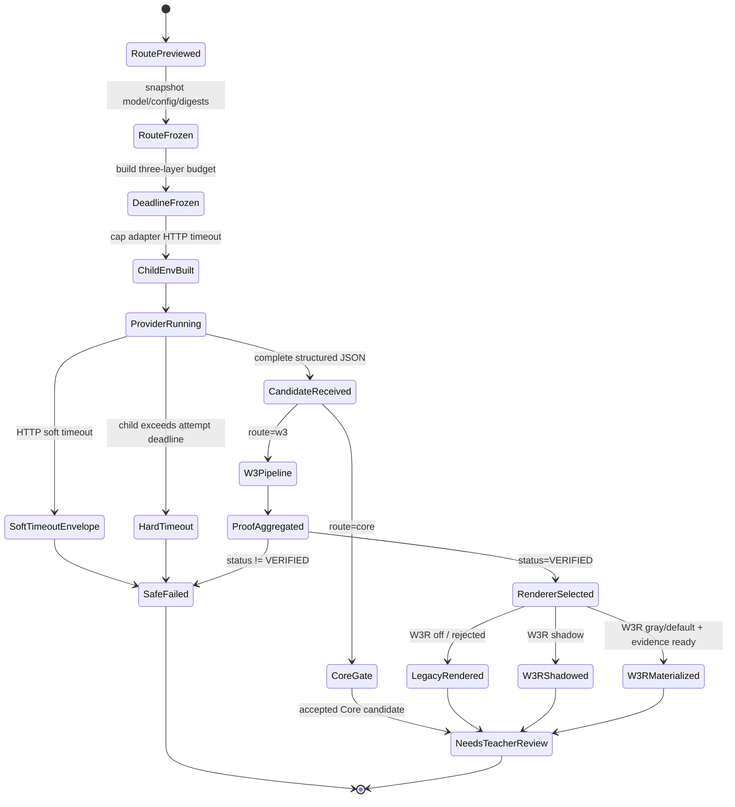

# W3/W3R 实测路由与 Deadline 传播异常修复原子 Work-Tree

> 状态：已执行（A0.1–A0.3、A1.1–A1.4、A2.1–A2.4、A3.1–A3.3、A4.1–A4.4 完成；A4.5 E2E 与 A5.5 聚合收尾；A5.2 终态 `failed-stage`、A5.3 `not-run-unverified`）
> 日期：2026-08-03
> 版本：`wuli-w3-w3r-route-deadline-repair-v1`
> 类型：软件调试 + 路由真实性验证 + Provider 期限契约收口
> 触发故障：教师端“生成学生版与教师版解析”在约 90 秒后失败，显示 `provider_timeout / openai-compatible / 修改文件前失败`

## 0. 与既有执行树的关系

本文是以下两份执行树的**增量纠偏计划**，不重新实现已经通过的能力：

- `docs/analysis-provider-timeout-repair-work-tree.md`
  - 已完成：模型资格、deadline 数据模型、失败 envelope、复杂题预算、真实 canary。
  - 被本次实测推翻的验收：A2.4“传递期限预算”只证明 job 中记录了预算，没有证明 child adapter 实际收到 soft deadline。
- `docs/core-w3-w3r-quality-recovery-work-tree.md`
  - 已完成：物理质量 Gate、W3R 配置 schema 修正等部分任务。
  - 尚未完成：legacy W3 隔离 shadow、路线对照、G1 决策、W3R 灰度证据。

本计划只关闭两个新暴露的缺口：

1. `deadline_budget` 在 provider 环境构造之后才注入，导致记录值与实际 child timeout 分叉；
2. 教师以为在实测 W3/W3R，但实际配置和 job 均显示 `core-first → core`，且 W3R 为 `off`。

## 1. 范围、权威证据与安全边界

### 1.1 范围

```text
教师点击解析
→ 冻结实际路由
→ 冻结三层 deadline
→ 构造 provider child 环境
→ 调用 OpenAI-compatible adapter
→ [Core 或 legacy W3]
→ [仅 VERIFIED Proof 可进入 W3R selector]
→ 返回教师答案复核
```

### 1.2 权威证据顺序

1. `student-error-library/.cache/agent-jobs/<job-id>.json` 中的 route、attempt、deadline、stage 与终态；
2. Gateway 实际传给 child process 的**脱敏执行摘要**；
3. adapter 的结构化 failure envelope、阶段进度和 provider usage；
4. 活动路由配置、route snapshot 与 runtime identity；
5. fake provider 集成测试、隔离 E2E 和经维护者批准的无学生数据 canary；
6. 教师端文案。

### 1.3 安全边界

- 不在测试中写正式 `student-error-library/entries/`、`output/` 或 `student-site/`。
- 不输出 API Key、完整环境变量、学生题干、prompt、reasoning 正文或绝对候选路径。
- 不因超时自动提高费用、增加完整推理重试次数或绕过预算保护。
- 不把 provider 参数移入 `server.py`；运行细节仍由 Gateway/adapter 单点负责。
- 不将 W3R 改为求解器；它只能消费整体状态为 `VERIFIED` 的 Proof Package。
- 不自动切换生产 `core-first`、W3 或 W3R 默认模式；配置放量必须经过本文的决策门。
- 不修改或覆盖工作树中既有的用户文件；新增测试前先检查同名未跟踪文件。

## 2. 本次失败事实锁

| 字段 | 已确认值 |
|---|---|
| 作业 ID | `63f9d8080ce94014873b2b44d7e932b7` |
| 条目 | `20260802-screenshot-2026-08-02-at-17-55-28-830117d9` |
| kind | `analysis.generate` |
| 实际路由 | `core-first → core` |
| 模型/provider | `deepseek-v4-flash-api / openai-compatible` |
| 任务规模 | 6 个目标；3 条知识证据；证据裁剪到约 7.6k 字符 |
| task deadline | `90.0 s` |
| attempt deadline | `90.0 s` |
| 记录的 HTTP soft deadline | `76.5 s` |
| 实际结果 | provider 子进程约 `90.008 s` 后被 Gateway 硬终止 |
| adapter 输出 | `stdout_length=0`，没有结构化 timeout envelope |
| usage | `measurement=unavailable` |
| stages | `structured-generation=failed`；`authoritative-review=not-run` |
| canonical 变化 | 无；`changed_files=[]` |
| W3 | 未运行 |
| W3R | 活动配置 `mode=off`，未运行 |

### 2.1 已复现的时序缺陷

当前执行顺序：

```text
task_environ = _task_environ(task)     # 此时 task 还没有 deadline_budget
→ build_deadline_budget(...)
→ task["deadline_budget"] = ...
→ run_process(..., env=旧 task_environ)
```

脱敏本地复现：

```text
当前顺序 child HTTP timeout：300 秒（adapter 默认）
若在 deadline_budget 后重建环境：76 秒
```

因此 job 中“正确记录 76.5 秒”不等于 adapter 实际执行了 76.5 秒 soft timeout。

### 2.2 需要保持诚实的未知项

- 无法从本次作业判断 DeepSeek 是否已进行推理、是否产生 token 或是否会在 90 秒之后返回。
- 不能把 upstream 变慢与 Gateway 时序 bug 合并为一个根因：前者是触发条件，后者造成硬杀和诊断证据丢失。
- 不能从 Core 超时推断 W3 或 W3R 超时；它们在本次作业中根本没有运行。

## 3. 稳定目标

| ID | 目标 | 可观测成功标准 | 优先级 | 验证者 |
|---|---|---|---|---|
| T1 | 修复 deadline 传播 | child 实际 HTTP timeout `≤ http_soft_deadline`，且 job/child/adapter 三处摘要一致 | P0 | 单元 + 集成测试 |
| T2 | 保留结构化超时证据 | 慢响应在 hard kill 前返回脱敏 envelope，记录 `timeout_layer=http_soft` 和阶段 | P0 | fake provider 集成测试 |
| T3 | 证明实际路由 | 每次实验都能证明走的是 Core、W3 还是 W3R；不能靠按钮文案推断 | P0 | route snapshot + E2E |
| T4 | 隔离验证 W3 | 临时配置下复杂题实际进入 W3，并记录完整阶段或准确失败点 | P0 | 隔离 E2E/Shadow |
| T5 | 隔离验证 W3R | 只有 VERIFIED Proof 能进入 W3R shadow；`off/shadow` 不改变 canonical 答案 | P0 | 合同测试 + E2E |
| T6 | 修正教师心智 | UI 显示计划路线、实际路线、W3R 模式和失败阶段 | P1 | UI E2E |
| T7 | 保持安全与成本 | 不重复付费、不泄密、不污染正式目录、不自动批准或放量 | P0 | 安全检查 + 人工复核 |

## 4. 目标过程与状态模型



不变量：

1. deadline 必须在 child 环境构造前冻结。
2. `http_soft_deadline + cleanup_grace ≤ attempt_deadline ≤ task_deadline`。
3. hard timeout 是最后一道保险，不应替代 adapter soft timeout。
4. `planned_route`、`selected_route` 与实际 `stages` 必须可交叉验证。
5. W3R 只能读取 VERIFIED Proof；`off` 和 `shadow` 不得替换 canonical 答案。
6. 任一失败都保持 canonical 零修改并返回教师复核/重新提交入口。

## 5. 原子任务 DAG

每个任务默认最大尝试 1 次。重试必须改变输入指纹、策略版本或修复版本，只重跑受影响依赖锥。

### Wave 0：冻结证据并纠正旧验收

#### A0.1 · 提取最新 timeout 回归夹具

- 动词：`extract`
- 输入：作业 `63f9d808...` 的 route、deadline、attempt、stages、usage measurement 和 changed files。
- 输出：脱敏 fixture `provider-hard-timeout-after-recorded-soft-deadline.json`。
- 依赖：无。
- 验证：fixture 不含题干、prompt、reasoning、Key 或绝对路径。
- 终态：`completed | blocked-security`。

#### A0.2 · 撤销 A2.4 的完成判定

- 动词：`classify`
- 输入：旧执行树 A2.4 验收条件、本次 child timeout 复现。
- 输出：纠偏记录：`deadline-model=passed`、`deadline-propagation=failed`。
- 依赖：A0.1。
- 验证：不得把 66 个现有测试通过解释为传播已通过。
- 终态：`completed`。

#### A0.3 · 定义 `ProviderDeadlineBinding.v1`

- 动词：`model`
- 输入：`DeadlineBudget`、model timeout、Gateway task SLA、adapter HTTP 调用。
- 输出：接口契约，至少包含：
  - `task_deadline`、`attempt_deadline`、`http_soft_deadline`；
  - 实际 child timeout；
  - `timeout_layer=http_soft|attempt_hard|task_budget`；
  - budget/config digest；
  - 不含秘密的 provider/model identity。
- 依赖：A0.2。
- 验证：schema 能表达“预算记录正确、child 绑定错误”这一状态。
- 终态：`completed | invalid-contract`。

### Wave 1：修复 Deadline 传播与失败证据

#### A1.1 · 重排 Gateway deadline 冻结

- 动词：`wire`
- 输入：A0.3、`AgentGateway.run()` 当前时序。
- 输出：在第一次 `_task_environ(task)` 前完成 budget 构造，或在写入 `task["deadline_budget"]` 后重建环境；只能保留一个权威顺序。
- 依赖：A0.3。
- 允许修改：`teacher-console/agent_gateway.py`。
- 验证：捕获传给 `run_process(..., env=...)` 的 timeout，断言等于 `floor(min(configured_http_timeout, http_soft_deadline))` 或契约规定的等价值。
- 终态：`completed | propagation-failed`。

#### A1.2 · 单点计算有效 HTTP timeout

- 动词：`consolidate`
- 输入：`effective_http_timeout()`、Gateway 环境生成和 adapter 默认值。
- 输出：唯一计算路径；禁止 Gateway、adapter 和测试分别复制 `min()` 规则。
- 依赖：A1.1。
- 验证：配置缺失、配置大于 soft、配置小于 soft、非法字符串四类情况都有确定结果。
- 终态：`completed | ambiguous-timeout`。

#### A1.3 · 加固 adapter soft-timeout envelope

- 动词：`normalize`
- 输入：urllib/Socket 可能抛出的 timeout 形态。
- 输出：统一脱敏 envelope：`failure_type=provider_timeout`、`timeout_layer=http_soft`、phase、request count、stage progress、可得 usage。
- 依赖：A1.2。
- 允许修改：`teacher-console/providers/openai_compatible_agent_adapter.py` 及其测试。
- 验证：`TimeoutError`、`socket.timeout`、包装在 `URLError.reason` 中的 timeout 均稳定分类；不包含响应正文。
- 终态：`completed | protocol-incomplete`。

#### A1.4 · 标记 hard-timeout 诊断层

- 动词：`record`
- 输入：Gateway `subprocess.TimeoutExpired`。
- 输出：保持顶层 `failure_type=provider_timeout` 兼容，同时记录 `timeout_layer=attempt_hard`、child stdout 是否为空、soft binding 摘要和 budget problems。
- 依赖：A1.1。
- 验证：不能把 hard kill 伪装成 provider 已返回的 soft timeout；不能虚构 token usage。
- 终态：`completed | telemetry-incomplete`。

### Wave 2：建立“实际执行路线”验证工具

#### A2.1 · 定义 `RouteExecutionPlan.v1`

- 动词：`model`
- 输入：Core 路由配置、W3 路由配置、W3R selector 配置、route snapshot。
- 输出：`planned_solver_route`、`planned_renderer_mode`、配置 digest、预计阶段和 canonical 写入政策。
- 依赖：A0.3。
- 验证：能够表达 `core + w3r off`、`w3 + w3r shadow`、`w3 + legacy renderer`，不得用单一“深度解析”布尔值代替。
- 终态：`completed | invalid-plan`。

#### A2.2 · 验证 Core 基线路线

- 动词：`test`
- 输入：临时题库中的 `analysis-production-routing.mode=core-first`。
- 输出：route snapshot 与 stage report。
- 依赖：A2.1、A1.4。
- 验证：必须记录 `selected_route=core`，且 W3/W3R 阶段为 `not-run`，不能显示成 W3 失败。
- 终态：`passed | failed`。

#### A2.3 · 验证 legacy W3 隔离路线

- 动词：`test`
- 输入：临时题库中的 `analysis-production-routing.mode=legacy-adaptive`、复杂题 fixture、W3 配置副本。
- 输出：W3 stage report、Proof 状态与失败焦点。
- 依赖：A2.1、A1.4。
- 验证：`selected_route=w3`，至少出现 Solver/Verifier/Proof Aggregation 的真实阶段；不能写正式条目。
- 最大真实 provider 尝试：需维护者另行批准；每题每阶段遵循现有 W3 调用上限。
- 终态：`verified-route | failed-route | blocked-provider`。

#### A2.4 · 验证 W3R shadow 路线

- 动词：`test`
- 输入：冻结的 VERIFIED Proof fixture、临时 W3R `mode=shadow` 配置。
- 输出：renderer selection、W3R render result、fidelity decision 与 canonical digest 对照。
- 依赖：A2.3。
- 验证：shadow 产物可检查但 canonical 答案字节不变；PROVISIONAL/REJECTED fixture 不运行 W3R。
- 终态：`passed | failed-contract`。

#### G1 · 路由放量决策门

- 动词：`decide`
- 输入：A2.2–A2.4、既有 Core/W3/W3R 质量执行树和 rollout evidence。
- 输出：保持 `core-first`、启用 `legacy-adaptive` 实验、或继续阻断的维护者决定。
- 决策规则：
  - 修好 deadline 不自动授权 W3；
  - W3 route 测试通过不自动授权 W3R default；
  - W3R shadow 通过不替代至少 2 份教师盲审和 fresh holdout 门槛；
  - 没有 VERIFIED Proof 时保持 W3R `off`。
- 终态：`core-kept | legacy-shadow-approved | blocked`。

### Wave 3：教师端真实性与可执行提示

#### A3.1 · 暴露 solver 与 renderer 双路线

- 动词：`expose`
- 输入：A2.1、route preview、active job public schema。
- 输出：前端可读字段：计划 solver、实际 solver、W3R mode、实际 renderer、当前阶段。
- 依赖：A2.4。
- 验证：教师能看见“Core（W3 未运行）”“W3 已验证 + W3R shadow”“W3R off”等真实状态。
- 终态：`completed | public-contract-incomplete`。

#### A3.2 · 修正 timeout 文案

- 动词：`render`
- 输入：soft/hard timeout layer、usage measurement、route/stage。
- 输出：区分：
  - provider soft timeout；
  - Gateway hard timeout；
  - W3 某阶段 timeout；
  - Core structured-generation timeout。
- 依赖：A1.4、A3.1。
- 验证：本次作业应显示“Core 结构化生成在 Gateway hard deadline 超时；W3/W3R 未运行”；不得声称已发生 fallback 或确认消耗 token。
- 终态：`completed | misleading-copy`。

#### A3.3 · 保留安全停止语义

- 动词：`verify`
- 输入：A3.2 与预算保护字段。
- 输出：失败提示仍说明 canonical 未修改、未自动重试以及教师可选择的下一步。
- 依赖：A3.2。
- 验证：提示不建议无限提高 timeout；不暴露内部路径、stderr 或学生内容。
- 终态：`passed | unsafe-copy`。

### Wave 4：测试矩阵

#### A4.1 · 增加 Gateway 环境绑定单测

- 动词：`test`
- 输入：A1.1/A1.2。
- 输出：捕获 `run_process` 实际 `env` 的单测。
- 覆盖：无模型 timeout、模型 timeout 大于/小于 soft deadline、环境默认 300、非法配置、deadline 缺失。
- 验证：任何 child timeout 大于 soft deadline 都失败。
- 终态：`passed | failed`。

#### A4.2 · 增加 fake HTTP soft-timeout 集成测试

- 动词：`test`
- 输入：本地慢响应 OpenAI-compatible server。
- 输出：soft envelope、hard deadline 与墙钟时间报告。
- 依赖：A1.3、A4.1。
- 验证：adapter 在 hard deadline 前退出；Gateway 解析 envelope；canonical 零修改；usage 不可得时保持 `unavailable`。
- 终态：`passed | failed`。

#### A4.3 · 增加 hard-kill 回归测试

- 动词：`test`
- 输入：故意忽略 SIGTERM/不返回 stdout 的 fake adapter。
- 输出：`provider_timeout + timeout_layer=attempt_hard` 作业结果。
- 依赖：A1.4。
- 验证：预算保护停止后续付费调用；作业能终态化且不残留候选提升。
- 终态：`passed | failed`。

#### A4.4 · 增加路由真实性集成测试

- 动词：`test`
- 输入：A2.2–A2.4 三种临时配置矩阵。
- 输出：route preview、job snapshot、stages、renderer selection 对照。
- 验证：四者必须一致；任一漂移 fail-closed 为 `route_snapshot_stale` 或等价稳定状态。
- 终态：`passed | failed`。

#### A4.5 · 增加隔离教师端 E2E

- 动词：`test`
- 输入：临时知识库、fake adapters、教师端页面。
- 输出：以下场景报告：
  - `analysis-core-hard-timeout-route-visible`；
  - `analysis-w3-soft-timeout-stage-visible`；
  - `analysis-w3-verified-w3r-shadow`；
  - `analysis-w3r-off-not-run`。
- 验证：页面、API 和 job JSON 一致；正式目录零新增。
- 终态：`passed | failed-isolation`。

### Wave 5：真实验证、文档同步与收口

#### A5.1 · 执行无学生数据 Core canary

- 动词：`test`
- 输入：已批准公开/合成复杂题、当前合格模型、固定费用上限。
- 依赖：A4.1–A4.5，且需维护者批准真实远程调用。
- 输出：soft deadline 绑定、stage progress、usage 与终态报告。
- 最大尝试：每题 1 次，不自动 fallback。
- 终态：`passed | provider-timeout | blocked-approval`。

#### A5.2 · 执行 legacy W3 隔离 shadow

- 动词：`test`
- 输入：G1 授权、公开/合成复杂题、临时题库和 W3 调用预算。
- 依赖：A5.1、G1=`legacy-shadow-approved`。
- 输出：完整 W3 阶段、Proof 状态、调用次数、时延和费用报告。
- 最大尝试：一次完整 W3 运行；失败不自动转为生产 Core 重跑。
- 终态：`verified | failed-stage | blocked-approval`。

#### A5.3 · 重放 W3R（零 Solver Token）

- 动词：`render`
- 输入：A5.2 的冻结 VERIFIED Proof；若未 VERIFIED 则不得执行。
- 输出：W3R shadow、fidelity report、旧 renderer 对照。
- 依赖：A5.2=`verified`。
- 验证：不重新调用 Solver；不写 canonical；不引入新 claim。
- 终态：`passed | rejected-fidelity | not-run-unverified`。

#### A5.4 · 执行回滚演练

- 动词：`test`
- 输入：临时路由配置。
- 输出：`legacy-adaptive → core-first` 与 `W3R shadow → off` 的回滚证据。
- 依赖：A5.2、A5.3。
- 验证：无需改代码即可停止新路线；已批准答案和正式条目不变。
- 终态：`passed | failed`。

#### A5.5 · 聚合验收

- 动词：`aggregate`
- 输入：A4.*、A5.* 与 G1 决策。
- 输出：修复验收报告和既有执行树状态更新。
- 验证：分别报告 deadline、Core、W3、W3R 四层；不得用一层通过替代另一层。
- 终态：`accepted | provisional | rejected`。

#### A5.6 · 同步架构与图谱

- 动词：`synchronize`
- 输入：已验收代码和行为。
- 输出：更新 `docs/agent-gateway.md`、`docs/operator-runbook.md`、`docs/w3-reasoning-pipeline.md`、`docs/CHANGES.md`，代码修改后运行 `graphify update .`。
- 依赖：A5.5。
- 验证：文档不再声称未实际验证的 A2.4 已完成；图谱包含新的 deadline/route 测试边。
- 终态：`completed | docs-drift`。

## 6. 执行波次与职责

| 波次 | 可并行任务 | 角色 | 写入边界 |
|---|---|---|---|
| 0 | A0.1 → A0.2/A0.3 | 故障证据维护者 | 脱敏 fixture、契约、执行树状态 |
| 1 | A1.1/A1.4；随后 A1.2/A1.3 | Gateway/adapter 维护者 | Gateway、adapter、deadline 测试 |
| 2 | A2.2/A2.3；随后 A2.4/G1 | 路由验证者 | 临时配置、shadow 报告；不改生产默认 |
| 3 | A3.1/A3.2；随后 A3.3 | API/UI 维护者 | public schema、前端文案、UI 测试 |
| 4 | A4.1/A4.3；随后 A4.2/A4.4/A4.5 | 测试维护者 | 单测、fake server、隔离 E2E |
| 5 | A5.1 → A5.2 → A5.3；A5.4；随后 A5.5/A5.6 | 维护者 + 教师代表 | 批准的 canary、验收报告、文档 |

## 7. 状态传递契约

| 契约 | 生产者 | 消费者 | 必需字段 | 失效条件 |
|---|---|---|---|---|
| `DeadlineBudget.v1` | Gateway | env builder / job | task、attempt、soft、cleanup、sources | task/model timeout 变化 |
| `ProviderDeadlineBinding.v1` | env builder | adapter / audit | effective timeout、layer、budget digest、identity | budget/config digest 变化 |
| `RouteExecutionPlan.v1` | route preview | scheduler/Gateway/UI | solver route、renderer mode、config digests、expected stages | 任一路由配置变化 |
| `RouteSnapshot.v1` | job submit | worker/report | resolved model/provider、tier、route digest | registry/route digest 变化 |
| `ProviderFailureEnvelope` | adapter | Gateway/outcome | failure type、timeout layer、phase、request count、usage availability | adapter contract 变化 |
| `StageReport.v1` | Core/W3 orchestration | report/UI | name、status、duration、provider seconds、failure type | task fingerprint 变化 |
| `VerifiedProofPackage` | W3 aggregator | W3R selector | VERIFIED claims、certificates、canonical digest、unresolved=[] | solver/verifier/input 变化 |
| `RendererDecision` | W3R fidelity gate | promotion/UI | mode、accepted、violations、output digest | proof/config 变化 |

## 8. 验证义务台账

| ID | 目标 | 要验证的性质 | 证据 | 通过规则 | 主要任务 |
|---|---|---|---|---|---|
| V1 | T1 | child timeout 真正受 soft deadline 约束 | captured `run_process.env` | effective timeout ≤ soft | A4.1 |
| V2 | T2 | soft timeout 先于 hard kill形成 envelope | fake slow server 墙钟与 payload | envelope 可解析且留出 cleanup | A4.2 |
| V3 | T2 | hard kill 仍可审计 | hard-kill fixture | layer=attempt_hard、usage 不虚构 | A4.3 |
| V4 | T3 | 计划与实际路由一致 | preview/snapshot/stages/renderer | 四者一致 | A4.4 |
| V5 | T4 | W3 确实执行 | W3 stage report | solver/verifier/proof 阶段存在 | A2.3/A5.2 |
| V6 | T5 | W3R 只消费 VERIFIED Proof | 正反 proof fixtures | 非 VERIFIED 必拒绝 | A2.4 |
| V7 | T5 | shadow 不改 canonical | 前后 digest | 完全相同 | A2.4/A5.3 |
| V8 | T6 | UI 不再误导 | E2E 页面/API/job 对照 | 文案与真实阶段一致 | A4.5 |
| V9 | T7 | 成本和数据边界不退化 | attempts、usage、安全扫描 | 无自动付费重试/无敏感内容 | A5.5 |

## 9. 反馈、回跳与终止规则

| 触发 | 最小回跳点 | 最大次数 | 终止状态 |
|---|---|---|---|
| child timeout 仍大于 soft deadline | A1.1 | 1 | `deadline-propagation-failed` |
| adapter 被 hard kill 且无 envelope | A1.3；若 child env 错则 A1.1 | 1 | `protocol-incomplete` |
| route preview 与 job snapshot 不同 | A2.1 | 1 | `route-snapshot-stale` |
| job 选 W3 但无 W3 stages | A2.3 | 1 | `failed-route` |
| W3 Proof 非 VERIFIED | W3 对应失败阶段 | 现有 W3 固定上限 | `not-run-unverified`，禁止 W3R |
| W3R 引入新 claim/条件漂移 | A2.4 renderer/fidelity | 1 次同 Brief 表达重试 | `rejected-fidelity` |
| 真实 canary timeout | 不自动回跳 | 0 | `provider-timeout` |
| 两轮相同指纹无新证据 | 停止整个依赖锥 | 0 | `no-progress` |

全局规则：

- 自动完整推理重试总数保持现有硬边界；本文不增加。
- W3R 表达重试不能触发 Solver 重跑。
- 配置实验只在临时副本进行；失败后删除临时运行状态，不回写正式配置。
- 任何 unresolved/provisional 结果都必须原样进入最终报告。

## 10. 预计文件影响边界

### 10.1 可能修改

- Gateway/adapter：
  - `teacher-console/agent_gateway.py`
  - `teacher-console/deadline_budget.py`（只有单点计算确需时）
  - `teacher-console/providers/openai_compatible_agent_adapter.py`
  - `teacher-console/agent_outcome.py`（只有 timeout layer 需进入统一 outcome 时）
- 路由与 API：
  - `teacher-console/server.py`
  - `teacher-console/analysis_routing.py`
  - `teacher-console/route_snapshot.py`
- 教师端：
  - `teacher-console/static/app.js`
  - 相关静态契约测试
- 测试：
  - `teacher-console/tests/test_agent_gateway.py`
  - `teacher-console/tests/test_deadline_budget.py`
  - `teacher-console/tests/test_provider_reliability.py`
  - `teacher-console/tests/test_analysis_routing.py`
  - `teacher-console/tests/test_analysis_routing_server.py`
  - `teacher-console/tests/test_agent_http.py`
  - `teacher-console/e2e/` 下的隔离场景与 fake adapter
- 文档：
  - `docs/analysis-provider-timeout-repair-work-tree.md`
  - `docs/core-w3-w3r-quality-recovery-work-tree.md`
  - `docs/agent-gateway.md`
  - `docs/operator-runbook.md`
  - `docs/w3-reasoning-pipeline.md`
  - `docs/CHANGES.md`

### 10.2 禁止修改

- 正式条目的题干、答案、批准记录、pipeline 或交付产物；
- `student-site/`；
- provider 安全 allowlist/denied paths；
- W3/W3R 证明与忠实性门禁的硬条件；
- 正式 W3/W3R 模式，除非 G1 后有独立维护者批准。

## 11. 建议验收命令

以下命令是后续执行清单，本轮未运行：

```bash
/Users/qingyuan/miniconda3/bin/python3 -B -m unittest \
  teacher-console/tests/test_deadline_budget.py \
  teacher-console/tests/test_agent_gateway.py \
  teacher-console/tests/test_provider_reliability.py \
  teacher-console/tests/test_analysis_routing.py \
  teacher-console/tests/test_analysis_routing_server.py \
  teacher-console/tests/test_agent_http.py
```

```bash
/Users/qingyuan/miniconda3/bin/python3 -B \
  teacher-console/scripts/run_tests.py \
  --python /Users/qingyuan/miniconda3/bin/python3 \
  --strict
```

```bash
npm run test:e2e
```

E2E 必须使用独立临时知识库和输出目录。真实 provider canary 需要另行批准，不能由测试命令隐式触发。

完成代码修改后执行：

```bash
git diff --check
graphify update .
```

## 12. 完成定义

只有全部满足下列条件，才能把本执行树标记为 `accepted`：

1. `DeadlineBudget` 在 child 环境构造前冻结，实际环境 timeout 不超过 soft deadline。
2. fake 慢响应在 hard deadline 前返回结构化 timeout envelope。
3. hard kill 被明确标记为 `attempt_hard`，且不伪造 token usage。
4. Core 基线测试明确记录 W3/W3R `not-run`。
5. 隔离 W3 测试真实出现 Solver、Verifier、Proof Aggregation 阶段。
6. W3R shadow 只接受 VERIFIED Proof，并保持 canonical digest 不变。
7. UI 同时显示计划 solver、实际 solver、W3R mode、实际 renderer 与失败阶段。
8. 单元、fake provider 集成、路由集成和隔离 E2E 全部通过。
9. 正式知识库、输出目录、发布目录和批准记录零污染。
10. 真实 canary 若未获批准，整体最多标记 `provisional`，不得声称生产已修复。
11. W3/W3R 默认放量仍由 G1 和既有 rollout evidence 决定，不因本次 deadline 修复自动开启。
12. 相关文档与 graphify 已同步，旧 A2.4 的状态不再误导。

## 13. 推荐最小执行顺序

```text
A0.1 → A0.2 → A0.3
→ A1.1 → A1.2
→ A1.3 + A1.4
→ A4.1 + A4.2 + A4.3
→ A2.1 → A2.2 + A2.3 → A2.4
→ A4.4 + A4.5
→ G1
→ A3.1 → A3.2 → A3.3
→ [批准后] A5.1 → A5.2 → A5.3
→ A5.4 → A5.5 → A5.6
```

第一批实现只应包含 A0.1、A0.2、A0.3、A1.1 和 A4.1。它们能在不调用真实 provider、不改变任何生产路由的情况下，先证明“记录的 deadline 与实际 child deadline 已重新一致”。在这一步通过之前，不应再次用同一道正式题目测试 W3/W3R。
