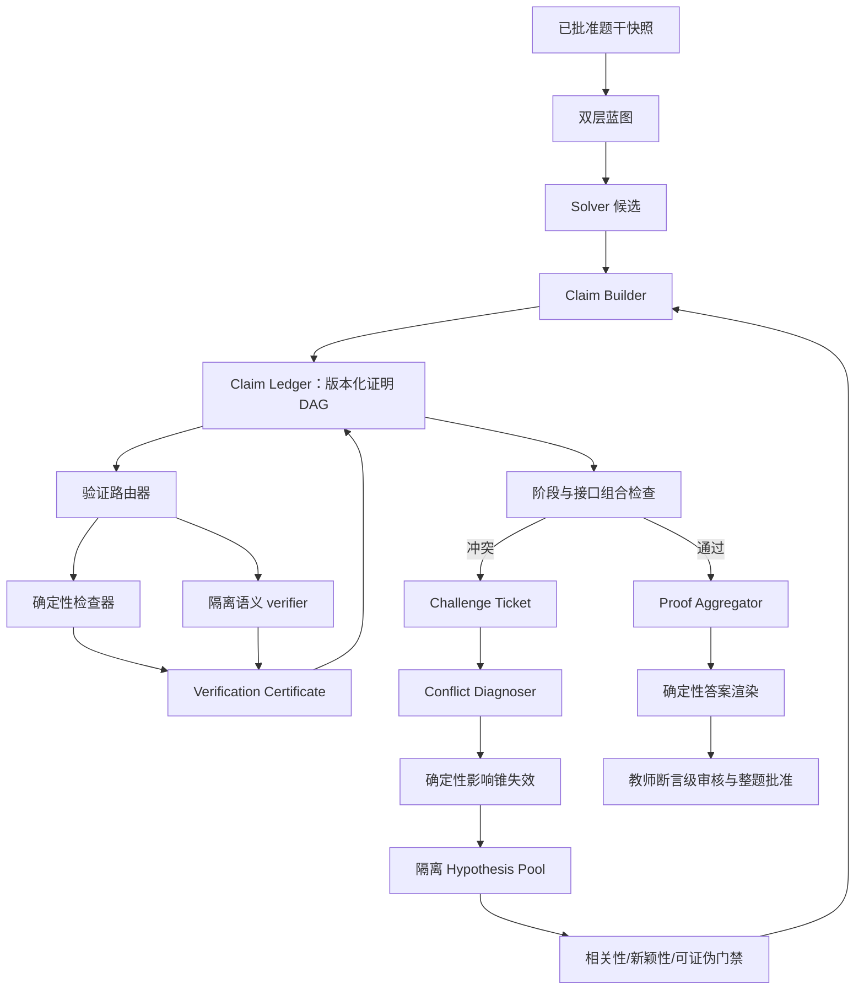

# 教学正确性证据链与受控认知环技术执行计划书

```yaml
plan_id: wuli-correctness-evidence-v1
status: completed
scope: W3 私有影子链路中的断言级正确性证据、组合验证与受控认知环
completed_through: W5-IPHO-2021-THEORY
next_task: W5-OBSERVATION
blocking_gate: none
production_default: adaptive (complex=W3, low-risk/fallback=W2)
production_gate_owner: docs/rag-completion-work-tree.md
last_updated: 2026-07-29
```

## 1. 文档权威与执行规则

本文是“教学正确性证据链与受控认知环”专项的唯一任务执行真源。它负责回答：

- 下一项原子任务是什么；
- 任务依赖哪些已完成产物；
- 哪些文件允许修改；
- 用什么证据判定完成；
- 失败时回退到哪里。

本文不替代 [`rag-completion-work-tree.md`](rag-completion-work-tree.md)。二者边界如下：

- 本文负责把 W3 从“目标级语义复算”推进到“断言级证据、组合检查和有限反馈环”；
- `rag-completion-work-tree.md` 继续独占新鲜 holdout、生产灰度、默认启用和 W2 回滚门禁；
- 本文任何任务都无权提前打开 W3 生产开关。

[`解题loop.md`](解题loop.md) 是本文的设计解释层：它整理原子任务、状态传递、Challenge 回跳、
有限联想、终止条件和结果汇总机制。执行顺序、任务状态和 Gate 仍以本文为准。

后续执行必须遵守：

1. 每次只允许一个任务处于 `DOING`；
2. 开始任务前先更新本文的 `next_task` 和任务状态；
3. 不得跳过未完成依赖；
4. 只有验收命令和产物证据齐全后才能标记 `DONE`；
5. 受外部样本或教师裁决阻塞时标记 `BLOCKED`，不得用旧题、模型共识或加大预算绕过；
6. 代码变更后运行相关测试、`git diff --check` 和 `graphify update .`；
7. 每完成一项任务，在本文末尾追加执行记录；不把开发流水账写入 `CLAUDE.md`；
8. 所有新能力先进入私有 shadow artifact，不修改正式答案、不自动批准、不发布学生端。

状态只允许：

```text
TODO → DOING → DONE
          └──→ BLOCKED
DONE → SUPERSEDED
```

## 2. 目标与完成定义

### 2.1 工程目标

把当前：

```text
题目目标
→ Solver 给出结论和 supporting_relations
→ 风险选择后的独立 verifier
→ 必要时 Solver B 与仲裁
```

扩展为：

```text
题目目标
→ 原子断言 DAG
→ 每个必要断言绑定条件、依赖和验证义务
→ 可机器检查的关系生成确定性证书
→ 其余关系接受隔离的独立语义复算
→ 组合接口检查
→ 冲突定位和依赖定向回跳
→ 受控假设生成
→ 只从已验证断言汇总答案
```

### 2.2 “完成”不等于绝对证明

本项目处理的是自然语言物理题。物理建模和题意解释不能全部降为形式证明，因此正式口径是：

> 对每个最终结论提供可追溯的证据链；对可形式化部分进行机器验证；对不可形式化部分进行隔离复算并明确不确定性；未完成关键验证时失败关闭。

专项完成必须同时满足：

- 每个题目目标都映射到至少一个最终断言；
- 每个最终断言到已批准题干前提之间存在完整依赖路径；
- 每个必要断言都有适合其类型的验证证书；
- 每个条件、首次/唯一/临界/分类问题都有显式边界义务；
- 跨物理阶段的状态传递经过接口检查；
- 任何关键 `conflict` 或 `insufficient` 都不能被汇总为 `VERIFIED`；
- 相同输入、策略版本与随机种子可以重放；
- 重复任务不会再次调用 provider；
- 影子执行不修改 canonical 答案；
- 故障注入和回放不退化后，仍须通过现有新鲜 holdout 与灰度门禁。

### 2.3 非目标

- 不构建适用于任意数学表达式的通用定理证明器；
- 不保存或传播模型的完整思维链；
- 不让多个 Agent 通过多数投票决定物理真值；
- 不让假设、质疑或 verifier 直接修改正式答案；
- 不让 Agent 获得 `approve-*`、`finish` 或发布权限；
- 不因“正确性优先”而允许无界重复同一推理；
- 不在本专项内取消 W2 回退，也不允许在未满足 WAIT-5 时绕过它。

## 3. 实施前基线（历史）

专项启动时可直接复用的能力：

| 能力 | 当前所有者 | 本计划如何使用 |
|---|---|---|
| 双层物理/推理蓝图 | `problem_decomposition.py` | 为断言绑定目标、物理阶段和校验义务 |
| 结构化目标结论 | `solution_reasoning.py` | 作为 Claim Ledger 的候选输入 |
| 风险与独立复算 | `solution_verification.py` | 下沉为断言级语义验证器 |
| Solver B 与仲裁 | `w3_pipeline.py` | 保留为高风险替代解和冲突裁决机制 |
| 候选隔离与模型路由 | `agent_gateway.py` | 所有新 Agent 阶段必须继续经 Gateway |
| 输入摘要检查点 | `server.py` 的 W3 stage runner | 扩展到原子任务指纹和版本化重放 |
| 单题追加事件 | Candidate Archive | 记录状态变化，不存完整题目或推理正文 |
| 教师答案复核 | Teacher Console | 显示完整候选、证据状态和未决义务 |
| 独立评测门禁 | W3 benchmark | 增加断言级与故障注入指标 |

专项启动时的限制（后续执行记录说明其解除情况）：

- W3 仍是一次性有限 DAG，没有冲突后的子图重建；
- `supporting_relations` 是文本数组，不是有依赖关系的原子断言；
- verifier 只覆盖风险策略选中的目标，不覆盖每个必要断言；
- `pass` 表示独立模型提交了决定性检查，不等于机器证明检查本身正确；
- 最多两张教师卡只是首屏摘要，不能表示全部未决义务已消失；
- 当时新鲜可用题为 0，生产门禁由 WAIT-5 阻塞；该门禁已在 W4 中解除。

## 4. 目标架构与职责



职责归位：

| 模块 | 职责 | 禁止承担 |
|---|---|---|
| `claim_ledger.py` | 数据契约、版本、指纹、DAG、依赖影响锥、汇总资格 | 调用模型、批准答案 |
| `claim_validation.py` | 检查类型路由、确定性证书、语义证书规范化 | 修改 Claim Ledger 状态 |
| `cognitive_loop.py` | Challenge、冲突诊断、假设池、进展函数、循环控制 | 写 canonical 文件 |
| `w3_pipeline.py` | 按策略编排上述模块 | provider 参数和密钥 |
| `server.py` | 任务提交、私有报告、教师端 API | 领域算法和 provider 细节 |
| `agent_gateway.py` | 隔离执行、provider 路由、候选提升安全 | 教学正确性裁决 |

## 5. 核心数据契约

### 5.1 Claim

```json
{
  "id": "C17",
  "version": 1,
  "kind": "premise|model|derived|numerical|boundary|final",
  "statement": "第一次进入磁场的时刻为……",
  "target_ids": ["Q1"],
  "stage_ids": ["P2"],
  "depends_on": ["C11", "C14"],
  "conditions": ["t > 0", "速度方向指向区域内部"],
  "obligation_ids": ["V3"],
  "check_spec": null,
  "status": "candidate",
  "source": {
    "task_id": "derive-C17-v1",
    "input_fingerprint": "...",
    "policy_version": "claim-ledger-v1"
  }
}
```

约束：

- Agent 只能提交 `candidate`；
- `verified`、`disputed`、`superseded` 只能由确定性编排器根据证书改变；
- `depends_on` 必须无环；
- 冲突、类比和质疑边不进入证明 DAG，留在探索平面；
- 修改断言必须创建新版本，不能覆盖旧版本。

### 5.2 Verification Certificate

```json
{
  "claim_id": "C17",
  "claim_version": 1,
  "verifier_kind": "source|deterministic|independent-agent|teacher",
  "check_type": "arithmetic|dimension|interval|event-order|semantic",
  "verdict": "pass|conflict|insufficient",
  "normalized_result": "...",
  "decisive_checks": ["..."],
  "input_fingerprint": "...",
  "verifier_identity": {
    "model_id": "...",
    "provider": "...",
    "context_isolated": true
  }
}
```

`pass` 晋升条件：

- 证书绑定当前 Claim 版本和输入摘要；
- 检查类型符合该 Claim 的必需验证策略；
- 高风险语义 Claim 不允许生成者验证自己；
- 任一关键证书为 `conflict` 或 `insufficient` 时不得汇总为 `VERIFIED`。

### 5.3 Challenge Ticket

```json
{
  "id": "CH9",
  "snapshot_version": 4,
  "trigger": "verification-conflict|interface-mismatch|missing-coverage|risk-audit",
  "claim_ids": ["C11", "C17"],
  "specific_doubt": "首次事件可能遗漏更早正根",
  "falsification_test": "枚举全部正根并按时间排序",
  "suggested_backjump": "C11",
  "status": "candidate"
}
```

Challenge 不能直接删除、修改或降级 Claim。

### 5.4 Atomic Task

```json
{
  "task_id": "verify-C17-v1",
  "action": "verify_claim",
  "target_ids": ["C17"],
  "input_snapshot": 4,
  "input_fingerprint": "...",
  "output_contract": "wuli.claim-verify.v1",
  "strategy": "event-order",
  "random_seed": null,
  "status": "pending"
}
```

一个原子任务必须满足：

- 只有一个认知动词；
- 输入版本冻结；
- 输出可独立校验；
- 失败不修改共享状态；
- 相同指纹可直接复用；
- 能在不重跑整题的情况下单独作废。

## 6. 验证策略

### 6.1 分层验证

| Claim 类型 | 首选证书 | 失败或不支持时 |
|---|---|---|
| 题干前提 | 已批准 source 摘要 | 回到题干复核，不让 Agent 猜 |
| 纯算术/代入 | 安全表达式求值 | 独立复算 |
| 量纲 | 结构化量纲向量 | 独立复算 |
| 区间与分类 | 简单区间并、交、补检查 | 独立复算并枚举分支 |
| 首次/唯一/临界 | 根集合、事件顺序、边界义务 | 独立复算；高风险再盲解 |
| 物理模型选择 | 独立语义 verifier | 冲突时诊断与教师裁决 |
| 跨阶段接口 | 输入/输出状态契约检查 | 定位接口或分解错误 |

不解析任意自由文本 LaTeX 作为可执行代码。可机器验证的 Claim 必须显式提供受限
`check_spec`；无法安全解析时返回 `unsupported`，转入语义验证。

### 6.2 正确性优先的覆盖策略

- 风险策略不再决定“是否拥有任何证书”；每个必要 Claim 都必须有证书；
- 风险只决定是否增加 Solver B、第二验证方法或随机审计；
- 所有最终 Claim、跨阶段桥接 Claim 和边界 Claim 必须达到完整证书覆盖；
- 未完成证书覆盖时输出完整 `PROVISIONAL` 候选和审核包，不得输出 `VERIFIED`。

## 7. 受控认知环

认知环只在控制平面运行：

```text
组合或验证失败
→ 创建 Challenge Ticket
→ 诊断最小冲突集合
→ 编排器计算影响锥
→ 将受影响节点标记 disputed
→ 创建替代 Claim 或 Hypothesis 任务
→ 重新验证受影响子图
```

假设生成算子：

- 极端与边界；
- 反例构造；
- 逆向推理；
- 时间顺序重排；
- 坐标系或参考系变换；
- 守恒量与不变量；
- 对称性与对称破缺；
- 相似模型迁移；
- 隐含自由度；
- 替代问题分解。

每个假设必须声明：

- 解释哪个缺口；
- 与已有候选的实质差异；
- 一次有限的证伪方法；
- 成立时影响哪些 Claim。

随机性只选择搜索算子：

- 默认按历史错误发现率、当前缺口和预期信息增益加权；
- 保留小比例固定种子的均匀探索，发现评分器未知盲区；
- 每批生成有限候选；只要风险下降或证据增强可继续下一批；
- 连续无新颖候选、无冲突缩小或无证书增强时改变策略，不机械重试；
- 硬熔断只停止执行并输出 `PROVISIONAL/UNRESOLVED`，不能把当前猜测晋升为正确。

## 8. Work-tree

```text
CE 教学正确性证据链
├─ CE-0 基线与执行真源
│  ├─ CE-000 技术执行计划书                         ✅ DONE
│  ├─ CE-001 冻结当前 W3 基线与测试证据              ✅ DONE
│  └─ CE-002 冻结 correctness-policy-v1              ✅ DONE
├─ CE-1 Claim Ledger 纵向切片
│  ├─ CE-101 Claim/Certificate 数据契约               ✅ DONE
│  ├─ CE-102 规范化、版本和任务指纹                   ✅ DONE
│  ├─ CE-103 DAG、覆盖与影响锥                        ✅ DONE
│  ├─ CE-104 现有 Solver 输出兼容投影                 ✅ DONE
│  └─ G1 Ledger 确定性门禁                           ✅ DONE
├─ CE-2 断言级验证
│  ├─ CE-201 验证路由与必需证书策略                   ✅ DONE
│  ├─ CE-202 安全算术检查器                           ✅ DONE
│  ├─ CE-203 量纲检查器                               ✅ DONE
│  ├─ CE-204 区间、边界与事件顺序检查器               ✅ DONE
│  ├─ CE-205 隔离语义 verifier                        ✅ DONE
│  ├─ CE-206 证书晋升与失败关闭                       ✅ DONE
│  └─ G2 全证书覆盖门禁                              ✅ DONE
├─ CE-3 组合、回跳与受控联想
│  ├─ CE-301 阶段接口检查                             ✅ DONE
│  ├─ CE-302 Challenge Ticket                         ✅ DONE
│  ├─ CE-303 最小冲突诊断                             ✅ DONE
│  ├─ CE-304 依赖定向失效与子图重建                   ✅ DONE
│  ├─ CE-305 重复检测、进展函数与熔断                 ✅ DONE
│  ├─ CE-306 Hypothesis Pool 与联想算子                ✅ DONE
│  ├─ CE-307 可重放的风险加权随机选择                 ✅ DONE
│  ├─ CE-308 Proof Aggregator                         ✅ DONE
│  └─ G3 有界认知环门禁                              ✅ DONE
├─ CE-4 W3 影子集成与教师审核
│  ├─ CE-401 影子 feature flag                        ✅ DONE
│  ├─ CE-402 Gateway 阶段与检查点接入                 ✅ DONE
│  ├─ CE-403 私有报告与 Candidate Archive             ✅ DONE
│  ├─ CE-404 教师审核快照/API                         ✅ DONE
│  ├─ CE-405 教师端完整证据账本 UI                    ✅ DONE
│  ├─ CE-406 Fake adapters、浏览器和隔离 E2E          ✅ DONE
│  └─ G4 影子端到端门禁                              ✅ DONE
├─ CE-5 故障注入与效果评测
│  ├─ CE-501 确定性故障注入集                         ✅ DONE
│  ├─ CE-502 断言级指标与报告                         ✅ DONE
│  ├─ CE-503 关闭/开启认知环的同条件消融              ✅ DONE
│  ├─ CE-504 旧题 replay 诊断                         ✅ DONE
│  ├─ CE-505 新鲜 holdout                             ✅ DONE
│  └─ G5 正确率与独立性门禁                          ✅ DONE
└─ CE-6 生产灰度与默认启用
   └─ 完全转交 docs/rag-completion-work-tree.md 的 W4-4/W4-5
```

## 9. 原子任务清单

### CE-0：基线与策略冻结

| ID | 依赖 | 单一目标 | 主要产物 | 完成证据 |
|---|---|---|---|---|
| CE-000 | 无 | 建立本执行真源 | 本文、文档入口链接 | `git diff --check` |
| CE-001 | CE-000 | 冻结修改前事实 | `docs/reports/correctness-evidence-baseline-v1.md` | 记录全量单测、W3 专项测试、fresh status、replay 指标和当前 git SHA |
| CE-002 | CE-001 | 冻结策略常量和状态语义 | `teacher-console/correctness_policy.py`、对应测试 | 策略版本、必需证书矩阵、状态转换、feature flag 默认关闭均可测试 |

CE-001 不调用模型、不重跑正式题目；只读取已有报告并运行确定性测试。

### CE-1：Claim Ledger

| ID | 依赖 | 单一目标 | 主要文件 | 验收 |
|---|---|---|---|---|
| CE-101 | CE-002 | 定义 Claim、Certificate、Task、GraphSnapshot 契约 | `teacher-console/claim_ledger.py`、`test_claim_ledger.py` | 非法枚举、缺字段和 Agent 自报 `verified` 被拒绝 |
| CE-102 | CE-101 | 实现规范化、版本号和输入/任务/断言指纹 | 同上 | 相同输入得到相同指纹；条件或依赖变化导致指纹变化 |
| CE-103 | CE-102 | 实现 DAG、目标/义务覆盖和影响锥 | 同上 | 环、悬空依赖、漏目标、漏义务失败；影响锥只包含真实下游 |
| CE-104 | CE-103 | 将现有 `solution-reasoning.v1` 投影为兼容 Ledger | `solution_reasoning.py`、`claim_ledger.py` | 不改现有 contract；投影结果可通过 G1，无法原子化部分标记 `semantic-required` |
| G1 | CE-104 | 冻结 Ledger 确定性门禁 | CE-1 测试 | 全部 CE-1 测试通过；不调用 provider；不写 canonical |

### CE-2：断言级验证

| ID | 依赖 | 单一目标 | 主要文件 | 验收 |
|---|---|---|---|---|
| CE-201 | G1 | 根据 Claim 类型返回必需证书集合 | `claim_validation.py`、测试 | 每类 Claim 都有明确路由；未知类型失败关闭 |
| CE-202 | CE-201 | 验证受限结构化算术表达式 | 同上 | 禁止执行代码；分数、符号代入、等式反例测试通过 |
| CE-203 | CE-202 | 验证结构化量纲向量 | 同上 | 常见力学、电磁量纲正反例通过；未知单位返回 unsupported |
| CE-204 | CE-203 | 验证简单区间覆盖、事件根排序和首次/唯一义务 | 同上 | 漏区间、重叠冲突、遗漏更早正根等故障被拒绝 |
| CE-205 | CE-204 | 新增 `wuli.claim-verify.v1` 隔离语义验证契约 | `solution_verification.py`、测试、fake adapters | verifier 只看最小快照；覆盖全部请求 Claim；支持 `pass/conflict/insufficient` |
| CE-206 | CE-205 | 根据证书确定性晋升 Claim | `claim_validation.py`、`claim_ledger.py` | 缺证、旧版本证书、生成者自验、高风险 insufficient 均不能晋升 |
| G2 | CE-206 | 冻结全证书覆盖门禁 | CE-2 测试 | 所有最终/桥接/边界 Claim 证书覆盖率 100%；其余只能 PROVISIONAL |

### CE-3：组合、回跳与受控联想

| ID | 依赖 | 单一目标 | 主要文件 | 验收 |
|---|---|---|---|---|
| CE-301 | G2 | 检查物理阶段输入/输出状态契约 | `cognitive_loop.py`、测试 | 坐标系、时间原点、方向和继承状态不匹配可定位 |
| CE-302 | CE-301 | 定义并规范化 Challenge Ticket | 同上 | 质疑必须具体、可证伪并绑定 Claim/快照 |
| CE-303 | CE-302 | 产生最小冲突集合和根因分类 | 同上、语义诊断契约 | 顺序、接口、部件、遗漏条件、分解错误可区分 |
| CE-304 | CE-303 | 确定性标记 disputed 并计算重建子图 | `claim_ledger.py`、`cognitive_loop.py` | 不删除历史；不作废无关分支；新版本可重放 |
| CE-305 | CE-304 | 实现任务去重、进展函数、策略升级和硬熔断 | `cognitive_loop.py` | 相同指纹零调用；停滞不机械重试；熔断后不得 VERIFIED |
| CE-306 | CE-305 | 实现隔离 Hypothesis Pool 和联想算子注册表 | 同上 | 假设不能进入证明图；缺相关性/新颖性/证伪方法者被拒绝 |
| CE-307 | CE-306 | 实现固定种子的风险加权算子选择 | 同上 | 相同种子可重放；统计加权与均匀探索来源 |
| CE-308 | CE-307 | 从已验证 Claim 选择无冲突证明子图 | `claim_ledger.py` 或独立 `proof_aggregation.py` | 禁止多数投票；不能补写不存在的结论；多解和未决可区分 |
| G3 | CE-308 | 冻结有界认知环 | CE-3 测试与状态机模拟 | 随机 DAG、循环冲突和重复候选测试均能终止且不误晋升 |

### CE-4：W3 影子集成

| ID | 依赖 | 单一目标 | 主要文件 | 验收 |
|---|---|---|---|---|
| CE-401 | G3 | 增加默认关闭的 `claim_evidence_shadow_v1` | `w3_pipeline.py`、配置、测试 | flag 关闭时当前 W3 输出摘要不变 |
| CE-402 | CE-401 | 通过现有 Gateway 执行新增阶段并复用检查点 | `server.py`、Gateway 测试 | provider 参数不进入 `server.py`；同输入重放零 Token |
| CE-403 | CE-402 | 将 Ledger、证书、Challenge 和循环指标写入私有报告与 Archive | `server.py`、Candidate Archive | 不保存完整思维链、密钥、绝对路径；不改 canonical |
| CE-404 | CE-403 | 提供教师审核快照和 API | `server.py`、API 测试 | 完整暂定答案、验证状态、全部未决义务可读取 |
| CE-405 | CE-404 | 增加折叠式完整证据账本 UI | `static/`、静态与浏览器测试 | 首屏突出最多两项，但其余未决义务不隐藏 |
| CE-406 | CE-405 | 同步两个 fake adapter 和隔离 E2E | 两个 fake adapter、E2E | 正常、冲突、insufficient、熔断四条路径通过 |
| G4 | CE-406 | 冻结影子端到端链路 | 全量单测与隔离 E2E | shadow 不改正式答案；失败可解释；旧 W3 仍可关闭新 flag |

### CE-5：故障注入与效果评测

| ID | 依赖 | 单一目标 | 主要产物 | 验收 |
|---|---|---|---|---|
| CE-501 | G4 | 建立确定性故障注入集 | fixtures、`test_correctness_fault_injection.py` | 符号、数值、量纲、边界、首次/唯一、阶段接口故障可复现 |
| CE-502 | CE-501 | 输出断言级效果指标 | benchmark 脚本与报告 | 证书覆盖率、故障发现率、重复率、回跳精度、未决率可追踪 |
| CE-503 | CE-502 | 固定条件比较认知环 off/on | 消融报告 | 同题、同模型、同证据、同种子；正确率优先，联想不得造成错误晋升 |
| CE-504 | CE-503 | 在旧题 replay 做诊断性回放 | replay 报告 | 只证明链路和已知故障覆盖，不宣称生产泛化 |
| CE-505 | CE-504 + 五道新题 | 执行新鲜独立 holdout | 现有 W4-3 实验目录 | 必须先冻结真值；至少 5 题、12 目标 |
| G5 | CE-505 | 裁决是否进入生产灰度 | 现有 score/paired-score | 正确率不退化、独立性完好、无错误晋升、教师负担合格 |

## 10. 测试矩阵

每个阶段只运行必要测试；Gate 运行累计测试。

```bash
# CE-1
python3 -B -m unittest teacher-console/tests/test_claim_ledger.py

# CE-2
python3 -B -m unittest \
  teacher-console/tests/test_claim_ledger.py \
  teacher-console/tests/test_claim_validation.py \
  teacher-console/tests/test_solution_verification.py

# CE-3
python3 -B -m unittest \
  teacher-console/tests/test_claim_ledger.py \
  teacher-console/tests/test_claim_validation.py \
  teacher-console/tests/test_cognitive_loop.py \
  teacher-console/tests/test_w3_pipeline.py

# CE-4 Gate
python3 -B -m unittest discover -s teacher-console/tests -p 'test_*.py' -v
python3 -B teacher-console/e2e/run_e2e.py

# 所有代码任务收尾
git diff --check
graphify update .
```

若 `analysis.generate` 契约发生变化，必须额外同步：

- `teacher-console/e2e/fake_agent_adapter.py`；
- `teacher-console/tests/fixtures/fake_agent_adapter.py`；
- 结构化契约单元测试；
- 四条隔离 E2E。

本计划默认不修改 `wuli.analysis.v2`；新契约先作为 W3 内部 shadow contract。

## 11. 故障注入清单

正确性系统不能只在正确样本上验收。CE-501 至少包含：

| 故障 | 期望发现者 |
|---|---|
| 正负号翻转 | 算术/语义 verifier |
| 系数或指数错误 | 算术检查器 |
| 单位或量纲错误 | 量纲检查器 |
| 漏掉一个合法区间 | 区间覆盖检查器 |
| 把“存在”误写成“必然” | 边界/量词义务 |
| 遗漏更早正根 | 事件顺序检查器 |
| 把返回事件当首次进入 | 事件定义与排序 |
| 跨阶段方向或坐标系不一致 | 接口检查器 |
| 模块局部正确但整体约束冲突 | 组合检查与冲突诊断 |
| 两个 Agent 给出相同错误 | 确定性证书或异构验证，而非投票 |
| Challenge 重复提出旧假设 | 指纹和新颖性门禁 |
| 回跳误伤无关分支 | 影响锥测试 |

对确定性检查器声明支持的故障，必须全部拦截；不支持的输入必须返回 `unsupported`，
不能误报 `pass`。

## 12. 指标与裁决顺序

指标按以下字典序裁决，低优先级不能抵消高优先级退化：

1. 错误晋升数；
2. 目标准确率；
3. 最终/桥接/边界 Claim 证书覆盖率；
4. 故障注入发现率；
5. 未决冲突是否完整暴露；
6. 回跳精度；
7. 重复任务与重复假设率；
8. 教师审核时间与核对卡数量；
9. 调用数、Token 和延迟。

任何确认的新增错误都停止生产推进。调用减少、回答更短或教师更快，不能抵消正确率退化。

## 13. 回退与兼容策略

- 所有新增字段带 `schema_version` 和 `policy_version`；
- feature flag 默认关闭；
- flag 关闭时继续使用当前 `wuli-w3-shadow-v1`；
- 新 stage 失败时生成私有 warning 和 PROVISIONAL 报告，不污染正式答案；
- 不覆盖已有成功检查点；
- 旧报告缺少 Claim Ledger 时按 legacy 只读展示；
- W3 灰度失败时仍按现有工作树自动回退 W2；
- 不对历史 Candidate Archive 事件做破坏性迁移。

## 14. 当前执行切片

以下是 CE-505 执行前的历史门禁；该门禁现已由教师批准的五道新鲜竞赛题满足：

```text
WAIT-5
→ 新增至少 5 道从未进入旧 W3 manifest 的教师复核题
→ 先冻结至少 12 个逐目标真值
→ 才能执行 CE-505 新鲜独立 holdout
→ G5 通过后才转交 W4-4/W4-5 生产灰度
```

门禁满足后已完成 CE-505、G5、W4-4 和 W4-5。当前不再以 WAIT-5 为阻塞项；后续进入
W5 只读持续观测，仍禁止复用旧题冒充新鲜证据或降低正确率门槛。

## 15. 执行记录

| 日期 | 任务 | 状态 | 证据 | 下一任务 |
|---|---|---|---|---|
| 2026-07-29 | CE-000 | DONE | 创建本计划；接入文档入口与 AI 修改地图；`git diff --check` | CE-001 |
| 2026-07-29 | CE-001 | DONE | 冻结代码 SHA；W3 专项 28/28；全量单测 273 通过、2 跳过；replay W2 14/15、W3 15/15；fresh 0/5 | CE-002 |
| 2026-07-29 | CE-002 | DONE | `correctness-policy-v1`；状态迁移、必需证书矩阵和默认关闭影子开关；5 项专项测试通过 | CE-101 |
| 2026-07-29 | CE-101 | DONE | Claim、Certificate、Atomic Task、GraphSnapshot 严格契约；Agent 自报 verified 与非法字段失败关闭；11 项累计测试通过 | CE-102 |
| 2026-07-29 | CE-102 | DONE | 稳定内容/版本/依赖/任务指纹；单调版本与 no-op 修订拒绝；15 项累计测试通过 | CE-103 |
| 2026-07-29 | CE-103 | DONE | 活跃版本解析、DAG、悬空/循环、目标/义务覆盖和真实下游影响锥；20 项累计测试通过 | CE-104 |
| 2026-07-29 | CE-104 | DONE | 旧 Solver 输出无破坏投影；自由文本明确标记 `semantic-required`；投影自动通过图门禁 | G1 |
| 2026-07-29 | G1 | DONE | CE-1 与 W3 相关 39 项测试通过；未调用 provider；未写 canonical | CE-201 |
| 2026-07-29 | CE-201 | DONE | 六类 Claim 显式证书路由；高风险增加独立确认；未知 Claim/check 失败关闭；26 项累计测试通过 | CE-202 |
| 2026-07-29 | CE-202 | DONE | 无 `eval` 的受限 AST 算术、精确分数/代入/关系/容差；代码执行与超限表达式转 unsupported；25 项相关测试通过 | CE-203 |
| 2026-07-29 | CE-203 | DONE | 结构化量纲向量与有限乘/除/幂；力学、电磁正反例；未知单位返回 unsupported；13 项验证测试通过 | CE-204 |
| 2026-07-29 | CE-204 | DONE | 区间无缝/重叠/端点所有权与 first/last/unique/all 事件集合核对；遗漏更早正根失败；16 项验证测试通过 | CE-205 |
| 2026-07-29 | CE-205 | DONE | `wuli.claim-verify.v1`、最小隔离视图、精确请求覆盖；运行时而非 Agent 绑定证书身份与指纹；23 项相关测试通过 | CE-206 |
| 2026-07-29 | CE-206 | DONE | 当前版本/依赖指纹/路线/隔离身份晋升；旧证、自验、缺证、冲突、高风险 insufficient 失败关闭；43 项相关测试通过 | G2 |
| 2026-07-29 | G2 | DONE | 拓扑重算整图信任；磁盘自报 verified 不被盲信；关键/全断言证书不满只能 PROVISIONAL，冲突为 UNRESOLVED；46 项相关测试通过 | CE-301 |
| 2026-07-29 | CE-301 | DONE | 参考系/时间原点/方向/入口出口状态接口；冲突定位到阶段和状态键；未验证变换只给 provisional；5 项测试通过 | CE-302 |
| 2026-07-29 | CE-302 | DONE | Challenge Ticket 绑定快照/Claim/具体怀疑/有限证伪/回跳点；Agent 只能提交 candidate；8 项累计测试通过 | CE-303 |
| 2026-07-29 | CE-303 | DONE | 冲突分为顺序/接口/部件/遗漏条件/分解错误；多处下游失败收缩到根部最小冲突前沿；11 项累计测试通过 | CE-304 |
| 2026-07-29 | CE-304 | DONE | 只失效最小根及真实下游；保留无关 Claim/证书；给出依赖序重建和单调新版本；13 项累计测试通过 | CE-305 |
| 2026-07-29 | CE-305 | DONE | 原子任务指纹零重复调用；只认真实证据/冲突收缩为进展；停滞换策略；熔断不得 VERIFIED；18 项累计测试通过 | CE-306 |
| 2026-07-29 | CE-306 | DONE | 十类受控联想算子；Hypothesis 必须相关、新颖、可证伪并隔离入池；重复/复述/自晋升拒绝；22 项累计测试通过 | CE-307 |
| 2026-07-29 | CE-307 | DONE | 风险/冲突匹配/历史发现率/证伪方式加权；固定种子均匀探索与选择指纹可重放；随机仅选搜索任务；25 项累计测试通过 | CE-308 |
| 2026-07-29 | CE-308 | DONE | 汇总重算证书、根前提路径、阶段接口和开放探索；教师始终看到完整候选，只有全门禁通过才 VERIFIED；54 项相关测试通过 | G3 |
| 2026-07-29 | G3 | DONE | 随机 DAG 影响锥、持续冲突策略耗尽、重复假设池模拟均有限终止且不误晋升；CE-1～CE-3/W3 相关 99 项测试通过 | CE-401 |
| 2026-07-29 | CE-401 | DONE | `claim_evidence_shadow_v1` 默认关闭；关闭时 W3 摘要不增加字段、不增加阶段；16 项相关测试通过 | CE-402 |
| 2026-07-29 | CE-402 | DONE | `claim-verifier` 经现有 Gateway 结构化契约执行；运行时绑定隔离身份；同输入检查点先于 provider 重放且无 usage；16 项集成测试通过 | CE-403 |
| 2026-07-29 | CE-403 | DONE | Ledger、证书和聚合状态写入私有 W3 报告；Candidate Archive 仅保留紧凑指标且明确不改 canonical；17 项集成测试通过 | CE-404 |
| 2026-07-29 | CE-404 | DONE | 私有条目 API 返回完整暂定答案、全部 Claim/证书与未决义务，同时剔除运行时身份、指纹和原始语义审计；真实 loopback HTTP 测试通过 | CE-405 |
| 2026-07-29 | CE-405 | DONE | 折叠式证据账本展示完整暂定答案、Claim DAG、证书和全部未决义务；首屏焦点仍限制为最多两项；静态契约与浏览器数量一致性测试通过 | CE-406 |
| 2026-07-29 | CE-406 | DONE | 两套 fake adapter 同步支持正常、冲突、insufficient、熔断；隔离 HTTP 与浏览器 E2E 四路径通过，均未改写 canonical | G4 |
| 2026-07-29 | G4 | DONE | 最终累计回归 373/373；lifecycle、visualization、publication、claim-evidence 四个隔离浏览器 E2E 全部通过；新 flag 仍可关闭 | CE-501 |
| 2026-07-29 | CE-501 | DONE | 冻结 14 类确定性故障（含计划要求的 12 类、生成者自证和熔断误晋升）；全部可重放并被拦截，错误晋升 0 | CE-502 |
| 2026-07-29 | CE-502 | DONE | 新增只读 benchmark 与断言级指标报告；追踪故障发现率、关键证书覆盖、重复任务率、回跳 precision/recall、未决率和 canonical 变更；6 项专项测试通过 | CE-503 |
| 2026-07-29 | CE-503 | DONE | 同题、同模型、同证据、固定种子比较认知环 off/on；候选答案一致率 100%，错误晋升均为 0；on 新增 6 个具体 Challenge、3 次有限熔断，3 次联想选择可重放且从不晋升真值 | CE-504 |
| 2026-07-29 | CE-504 | DONE | 5 道旧题、15 目标确定性投影为 113 个 Claim、37 个义务；投影 100% 可重放且无证书时 5/5 保持 PROVISIONAL；14/14 故障检出、canonical 零修改；发现 1 题当前答案摘要与旧 manifest 不一致，历史分数须刷新且不得作为生产证据 | CE-505 / WAIT-5 |
| 2026-07-29 | WAIT-5 | RESOLVING | 用户允许用已知答案竞赛题替代；已建立 AAPT 2024 F=ma Q1/Q2/Q9/Q10/Q18 的 5 道中文评测改写题、分层答案、解释图和 15 个拟冻结真值；5/5 结构与最短方法门禁通过；未生成 fresh manifest，等待教师批准当前答案摘要 | WAIT-5-APPROVE |
| 2026-07-29 | WAIT-5-PREFLIGHT | DONE | 5 份拟冻结真值引用摘要与当前学生版一致；隔离目录预演 `freeze_truth` 得 5 题/15 目标；5/5 evaluator 唯一失败项为预期的 `answer_review_current`，无其他失败或 warning | WAIT-5-APPROVE |
| 2026-07-29 | WAIT-5-APPROVE | DONE | 教师确认 5 题答案摘要与 15 个逐目标真值；5/5 `answer-review` 当前且 evaluator 通过；fresh manifest 排除历史 14 题并冻结 5 题/15 目标，真值锁 `sha256:dd089b…ab74` | CE-505-RUN |
| 2026-07-29 | CE-505-RUN | DONE | 同模型、同 expert 路由与 candidate evidence 完成 5 题真实网页 W2 和 W3；Q10 一次协议失败后安全重试；Q1 旧仲裁控制字符被新门禁拒绝并重新生成；376 项全量单测通过、4 跳过，当前报告无不支持控制字符 | CE-505-BLIND-REVIEW |
| 2026-07-29 | CE-505-BLIND-REVIEW | BLOCKED | 已生成隐藏来源的 5 题 × A/B × 15 目标盲审包；正式 labels 与评分尚未生成 | 教师逐目标确认 |
| 2026-07-29 | CE-505-BLIND-REVIEW | DONE | 教师确认 A/B 共 30 个目标均 correct；Q9-T1 单独记录长度量纲省略警告；无 supplement、incorrect 或 needs-review | G5 |
| 2026-07-29 | G5 | DONE | fresh holdout 5 题/15 目标；W2=100%、W3=100%、差值 0；平均核对卡 0；独立性完整；`production_eligible=true` | W4-4 |
| 2026-07-29 | W4-4-ROUTING | DONE | 新增 `wuli-analysis-adaptive-v1`：默认关闭、灰度白名单、确定性复杂度初筛、W3 候选三层物化、结构/调用/核对卡/延迟门禁及 W2 自动回退；相关 33 项测试通过、4 跳过 | W4-4-GRAY-APPROVE |
| 2026-07-29 | W4-4-GRAY-PREFLIGHT | BLOCKED | 新建未用于 holdout 的 Q13/Q14/Q25 三题；9 个结论与官方答案一致；方法与结构门禁仅剩预期的教师答案复核项 | 教师批准灰度题 |
| 2026-07-29 | W4-4-PRODUCTION-GRAY | BLOCKED | 真实教师端入口完成 Q13=W3、Q14=W2、Q25=W3；9/9 目标正确、0 最终回退；Q13 的微分表述触发过安全回退并改为 `s=at²/2`，Q25 的非必要显式加速度公式已经正式修订为端点与连续性方法；等待教师批准当前最终答案 | W4-4-FINAL-ANSWER-CONFIRM |
| 2026-07-29 | W4-4-FINAL-ANSWER-CONFIRM | DONE | 教师批准 Q13、Q14、Q25 当前答案摘要；三题进入 `ready-to-finish`，但尚未执行交付 | W4-4-SUPPLEMENT |
| 2026-07-29 | W4-4-SUPPLEMENT | DONE | 新增 IPhO 2021 T1-A1、APhO 2019 Q3-A3、第38届全国竞赛复赛第3题；8/8 原子目标与官方答案一致并获教师批准。另保留 APhO Q3-A8 与全国赛首版摘录的 `source-adaptation-incomplete` 证据，不计模型正确率 | W4-5 |
| 2026-07-29 | W4-5 | DONE | `wuli-analysis-adaptive-v1` 切为 `default`；同一复杂题探针完成 `W3 → W2 → W3` 实际回滚演练并恢复默认；385 项单测通过、4 跳过，4 个隔离 E2E 全通过，文档与 graphify 同步 | W5-OBSERVATION |
| 2026-07-29 | W5-IPHO-2021-THEORY | DONE | 官方英文 2021 IPhO T1–T3 解答隔离后完整作答；候选冻结再解锁；36/36 小问独立阅卷均 full-credit，30/30 分；逐题保留有效耗时、脚手架失败消耗和阅卷 token；全量 393 项单测通过、4 跳过；graphify 已同步 | W5-OBSERVATION |
| 2026-07-29 | W5-DEFAULT-OBLIGATION-SHADOW | PAUSED | 默认物理义务发现保持 shadow-only：只生成 `default_obligation_suggestions` 与只读回放报告，不进入 Solver、`verification_obligations`、`VERIFIED` 或交付。23 个 W3 报告中 7 题触发、10 条建议；已发现疑似过宽命中，后续按 Issue 15 先做人工标注再决定是否升级 | Issue 15 |
