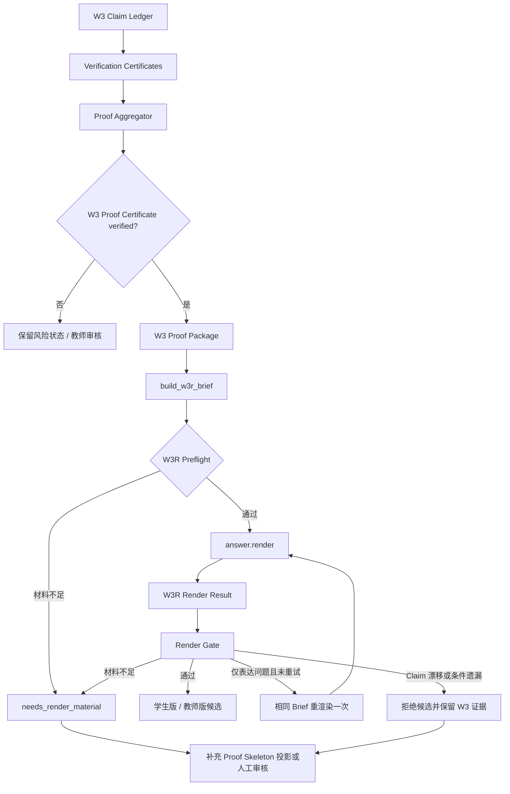
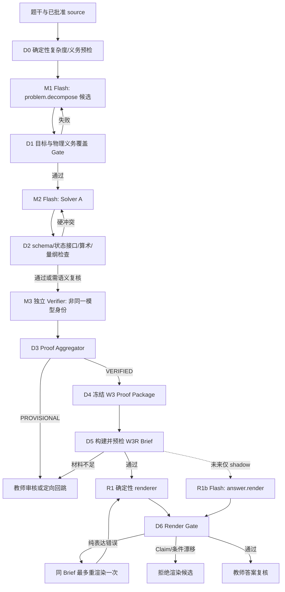

# 构建 W3R 非求解教学渲染与忠实性门禁：原子执行 Work-Tree

状态：`historical W3R design / superseded by core-first production on 2026-08-02`

## 2026-08-02 架构收敛决定

本 Work-Tree 的“渲染不能改答案”原则保留，但不再要求每题先构造完整 Proof Package、
Claim Ledger、Verification Certificates 和 Proof Skeleton。默认模式改为：

```text
已复核题干 → Target Brief → 单次 core.solve → Core Gate
→ 确定性教学渲染 → Render Fidelity Gate → 教师/标准答案审核
```

原子任务观念没有删除，而是从“每道题都执行完整 DAG”改成“只在风险触发时增加独立、
可证伪的任务”。旧 W3R 文件与评测保留作研究证据和回滚参考，不再进入生产默认链。

## 0. 2026-07-29 实施检查点

本轮已完成“复利最高的最小执行版本”，但没有申请替换生产 renderer：

| 节点 | 状态 | 实现 |
|---|---|---|
| W3R-0 | 完成 | 冻结 5 个基线来源（含 3 个官方竞赛样例），保存摘要、章节、长度、LaTeX 与教师状态报告 |
| W3R-1 | 完成 | `wuli.w3r-brief.v1`、`wuli.w3r-render-result.v1` JSON Schema 与严格 Python 校验 |
| W3R-2 | MVP 完成 | 只从 `VERIFIED` Proof Package 的最终 Claim 及其已验证祖先投影最小 Proof Skeleton；缺证、环、未闭合义务均失败关闭 |
| W3R-3 | Shadow 完成 | 独立确定性学生版/教师版 renderer；保留原 `render_recommended_student_solution()` 为生产路径 |
| W3R-4 | MVP 完成 | Final Answer、Claim span、条件、目标、LaTeX、公式来源、高中方法和相同 Brief 重试门禁 |
| W3R-5 | 未进入生产 | 不修改 `analysis_routing.candidate_files()`，不物化正式候选，不影响教师批准 |
| W3R-6 | MVP 完成 | 契约正反例、漂移/遗漏/未知公式/未知 Claim/跨度伪造/枚举全部/缺材料/重试指纹及物理条件矩阵测试 |
| W3R-7 | 薄切片完成 | 2 个固定 Brief 的同输入配对报告；硬忠实性指标均通过，生产资格仍为 false |
| W3R-8 | 未开始 | 没有灰度、默认启用或生产切换 |

主要交付：

- `teacher-console/w3r_contract.py`
- `teacher-console/w3_rendering.py`
- `teacher-console/schemas/w3r-brief.v1.schema.json`
- `teacher-console/schemas/w3r-render-result.v1.schema.json`
- `teacher-console/scripts/w3r_baseline_report.py`
- `teacher-console/scripts/w3r_shadow_benchmark.py`
- `teacher-console/tests/fixtures/w3r/`
- `docs/reports/w3r-baseline-v1.{json,md}`
- `docs/reports/w3r-shadow-benchmark-v1.{json,md}`

当前上游 `claim_evidence_teacher_snapshot()` 仍因 legacy stage-interface 缺少结构化快照而把
整体验证状态保持为 `PROVISIONAL`。因此真实 W3 shadow 报告会得到
`w3r_shadow.status=needs_render_material`，不会绕过门禁渲染，也不会重新调用 Solver。
只有未来 W3 Proof Package 真正达到 `VERIFIED` 且材料完整时，W3R shadow 才会生成候选。

## 1. 目标

把 W3 已经求解、验证和仲裁完成的结果，稳定转换成：

- 使用 LaTeX 的完整学生版解析；
- 保留条件、边界和易错点的教师版解析；
- 每个关键结论都能追溯到 W3 已验证 Claim 的可审计答案。

W3R 的定位不是“再找一个 Agent 重做一次题”，而是：

```text
W3 负责结论是否成立；
W3R 负责怎样把已成立的结论讲完整；
Render Gate 负责证明 W3R 没有偷偷改变结论。
```

W3R 可以改善语言、结构、LaTeX 和教学展开，但不能补猜 W3 没有提供的物理推导。
如果输入材料不足以写出完整过程，必须返回 `needs_render_material`，不能自行求解。

## 2. 当前实现与缺口

当前 `teacher-console/w3_pipeline.py::render_recommended_student_solution()` 是一个嵌入
W3 Pipeline 的确定性拼装函数，输入为：

```text
blueprint + solver_a + adjudication
```

它直接生成“答案速览、一眼识别、详细解答、易错点、30 秒自测”Markdown。现有实现的
优点是调用成本低、不会发起新的求解；主要缺口是：

1. 没有独立的 `W3RBrief` 输入契约；
2. 输入的是 Solver 结果，不是冻结的 W3 Proof Package；
3. `stage_results` 太短时，renderer 无法安全恢复被省略的中间过程；
4. 当前输出只有 Markdown 字符串，没有 `claim_span_map`；
5. 当前生产门禁主要检查非空、阶段警告和高中方法，尚不能检查 Claim 漂移、条件遗漏、
   目标覆盖和公式来源；
6. 已知高中等价表达依赖硬编码字符串替换，不能扩展成通用教学表达机制；
7. 渲染失败与“上游证明材料不足”尚未被区分。

因此，本任务先拆出 W3R 的输入、输出和 Gate，再考虑是否启用模型渲染。

## 3. 强制边界

### 3.1 W3R 可以做

- 调整章节顺序和讲解层次；
- 把已有关系写成规范 LaTeX；
- 展开 W3 已提供的代数代入和物理阶段说明；
- 用高中范围内的等价表达改写已验证步骤；
- 加入已由 W3 提供的条件提醒和易错点；
- 为同一份 Proof Skeleton 生成学生版与教师版；
- 在不改变数学含义时统一符号书写。

### 3.2 W3R 不可以做

- 重新求解整题或任一小问；
- 调用历史解法 RAG、搜索引擎、代码执行器或 CAS 补推导；
- 新增 W3 Proof Package 中不存在的 Claim、公式、数值或边界假设；
- 修改 `final_answer` 的数学含义；
- 把未验证 Claim 写成确定性结论；
- 省略适用条件、方向、单位、定义域或枚举要求；
- 回退到 W2 重新求解；
- 调用 `approve-*`、`finish` 或发布动作。

### 3.3 真源顺序

```text
教师复核题干
> W3 Proof Package
> W3R Brief
> W3R 输出
> 表达模板
```

表达模板没有资格覆盖任何上游事实。Evidence Agent 也不是 W3R 的答案真源；将来即使
引入 style/template RAG，也只能影响表达方式。

## 4. 架构位置



这里的“补充 Proof Skeleton 投影”只能从 W3 已有结构化状态中重新投影材料，不能重新调用
Solver。如果 W3 本身没有保存必要步骤，则本轮答案进入人工审核，而不是让 W3R 猜测。

## 5. 输入契约：`wuli.w3r-brief.v1`

建议新增独立 schema。最小字段如下：

```json
{
  "schema": "wuli.w3r-brief.v1",
  "problem_fingerprint": "sha256:...",
  "proof_package_fingerprint": "sha256:...",
  "question_targets": [
    {
      "target_id": "q1",
      "prompt": "求……",
      "response_mode": "single|enumerate_all|prove|explain"
    }
  ],
  "final_answers": [
    {
      "target_id": "q1",
      "text": "...",
      "answer_signature": "...",
      "claim_ids": ["c7"]
    }
  ],
  "proof_skeleton": [
    {
      "step_id": "s1",
      "target_ids": ["q1"],
      "claim_ids": ["c1"],
      "depends_on": [],
      "statement": "...",
      "formula_latex": "...",
      "conditions": ["..."],
      "teaching_role": "setup|derivation|substitution|conclusion|check"
    }
  ],
  "verified_claims": [
    {
      "claim_id": "c1",
      "statement": "...",
      "conditions": ["..."],
      "status": "verified",
      "certificate_ids": ["vc1"]
    }
  ],
  "verification_obligations": [
    {
      "obligation_id": "v1",
      "target_id": "q1",
      "check": "...",
      "render_as": "condition|self_check|teacher_note"
    }
  ],
  "teaching_cues": [
    {
      "cue_id": "tc1",
      "step_ids": ["s1"],
      "instruction": "解释正方向约定"
    }
  ],
  "method_scope": {
    "level": "high_school",
    "max_main_steps": 5,
    "forbidden_methods": ["calculus"]
  },
  "allowed_symbols": ["m", "v_0", "B"]
}
```

### 5.1 Brief 构建规则

- `final_answers` 只能来自 W3 最终推荐结论；
- `proof_skeleton` 只能投影 W3 已有的阶段结果、Claim 依赖和决定性关系；
- 只有 `verified` Claim 可以进入学生版确定性结论；
- `PROVISIONAL` Claim 只能进入教师审核提示；
- 每个 `final_answer` 必须关联至少一个已验证 Claim；
- 每个 Proof Step 必须声明它依赖的 Claim 和前置 Step；
- 题干默许行为应通过 `question_targets.response_mode` 显式化，例如“不限定唯一则枚举全部”；
- 原始争论日志、历史答案正文、Hypothesis Pool 和未采纳候选不得进入 Brief；
- Brief 构建后计算稳定 fingerprint，重渲染必须复用完全相同的 Brief。

### 5.2 Preflight 失败条件

满足任一条件时，禁止调用 renderer：

- 缺少目标的最终答案；
- 最终答案没有已验证 Claim；
- Proof Skeleton 无法覆盖某个目标；
- 依赖 Step 缺失或形成环；
- 条件与 Claim 不一致；
- `response_mode=enumerate_all` 但最终答案未声明完整性；
- 存在未解决的关键验证义务；
- Brief fingerprint 或 Proof Package fingerprint 不匹配。

## 6. 输出契约：`wuli.w3r-render-result.v1`

```json
{
  "schema": "wuli.w3r-render-result.v1",
  "status": "completed|needs_render_material|rejected",
  "brief_fingerprint": "sha256:...",
  "student_solution_md": "...",
  "teacher_solution_md": "...",
  "claim_span_map": [
    {
      "document": "student",
      "section_id": "detail-q1",
      "claim_ids": ["c1", "c7"],
      "step_ids": ["s1", "s2"],
      "text_fingerprint": "sha256:..."
    }
  ],
  "render_gate_report": {
    "status": "pass|retryable|reject",
    "violations": [],
    "metrics": {}
  },
  "attempt": 1
}
```

输出不得包含新的真源字段。`student_solution_md` 和 `teacher_solution_md` 是候选表达，
`claim_span_map` 与 `render_gate_report` 才是它能够进入教师审核包的依据。

## 7. 原子执行 Work-Tree

### W3R-0：冻结基线与职责

目标：不改生产答案，先保存可比较基线。

```text
W3R-0
├─ W3R-0.1 记录当前 renderer 的输入、输出和调用位置
├─ W3R-0.2 冻结 24 日前高质量答案样例
├─ W3R-0.3 冻结 29 日暴露“无 LaTeX / 过程不完整”的样例
├─ W3R-0.4 加入至少 3 道官方竞赛复杂题的 W3 固定结果
├─ W3R-0.5 保存当前答案签名、章节、长度、LaTeX 和教师评分
└─ W3R-0.6 验收：没有生产行为变化
```

交付物：

- `teacher-console/tests/fixtures/w3r/` 固定夹具；
- W3R baseline 报告；
- 样例来源和教师批准状态记录。

### W3R-1：冻结 Brief 与 Render Result schema

目标：把 W3/W3R 的共享边界变成版本化契约。

```text
W3R-1
├─ W3R-1.1 定义 wuli.w3r-brief.v1
├─ W3R-1.2 定义 wuli.w3r-render-result.v1
├─ W3R-1.3 定义字段长度、枚举和 fingerprint 规则
├─ W3R-1.4 定义 verified / provisional 的渲染权限
├─ W3R-1.5 定义 response_mode 的输出要求
└─ W3R-1.6 用固定夹具做 schema 正反例测试
```

验收标准：

- 未声明字段被拒绝；
- 缺失 Claim 映射被拒绝；
- 同一内容得到稳定 fingerprint；
- schema 变化必须升级版本，不能静默兼容。

### W3R-2：构建 Proof Skeleton 与 W3R Brief

目标：只从 W3 已有结构化结果投影可讲解材料。

```text
W3R-2
├─ W3R-2.1 从最终 targets 投影 final_answers
├─ W3R-2.2 从 stage_results / Claim DAG 投影 proof_skeleton
├─ W3R-2.3 从 certificates 投影 verified_claims
├─ W3R-2.4 从 obligations 投影条件、自测和教师提示
├─ W3R-2.5 投影高中方法和五步主线约束
├─ W3R-2.6 删除历史答案、争论日志和未采纳假设
└─ W3R-2.7 运行 Preflight
```

关键约束：

- 投影器只能复制、裁剪、排序和建立引用，不能生成新物理关系；
- Claim DAG 可以有多条证明支路，Proof Skeleton 只选已验证且教学成本最低的一条；
- 若没有足够步骤，返回 `needs_render_material`；
- 不允许把“缺步骤”自动转换成新的 Solver 调用。

### W3R-3：实现独立非求解 Renderer

目标：把 renderer 从 `w3_pipeline.py` 中解耦，并先以 shadow 运行。

```text
W3R-3
├─ W3R-3.1 新建独立 W3R 模块
├─ W3R-3.2 保留当前确定性 renderer 作为 fallback
├─ W3R-3.3 实现学生版章节模板
│  ├─ 答案速览
│  ├─ 建模与符号
│  ├─ 分阶段详细推导
│  ├─ 结果与适用条件
│  └─ 易错点 / 自测
├─ W3R-3.4 实现教师版附加内容
│  ├─ Claim 与证书摘要
│  ├─ 验证义务
│  ├─ 风险和未决状态
│  └─ 教师审核焦点
├─ W3R-3.5 输出 claim_span_map
└─ W3R-3.6 shadow 输出不得替换正式 candidate
```

若启用模型 renderer：

- 统一经过 `teacher-console/agent_gateway.py`；
- 任务名建议为 `answer.render`；
- 使用无工具结构化输出；
- 唯一内容输入是隔离的 `w3r-brief.json`；
- 不注入历史解法 RAG；
- 输出路径与禁止路径必须先做契约交集测试，避免再次出现同一路径同时被允许和禁止；
- 模型不得读取或写入正式条目目录；
- Gateway/Validator 校验通过后才能进入 shadow candidate。

### W3R-4：Render Gate

目标：确定性阻止“更好读但改错了”的答案。

```text
W3R-4
├─ W3R-4.1 结构门禁
│  ├─ 必需章节
│  ├─ 每个 target 有答案和过程
│  ├─ 无占位符 / 空步骤
│  └─ 长度与层次合理
├─ W3R-4.2 LaTeX 门禁
│  ├─ 定界符配对
│  ├─ 禁止破损 frac / tag / notag
│  ├─ 符号在 allowed_symbols 或 Brief 中有定义
│  └─ 数学块可被现有网页/PDF链渲染
├─ W3R-4.3 Claim 忠实性门禁
│  ├─ final answer signature 等价
│  ├─ 每个决定性句子绑定 claim_id
│  ├─ 不得出现未知 Claim
│  └─ provisional 不得写成确定结论
├─ W3R-4.4 条件保持门禁
│  ├─ 初态 / 末态
│  ├─ 方向 / 参考系
│  ├─ 单位 / 量纲
│  ├─ 定义域 / 参数限制
│  └─ 单解 / 枚举全部
├─ W3R-4.5 方法门禁
│  ├─ 高中范围
│  ├─ 最短主线
│  └─ 不把私有高级验证方法泄露到学生版
└─ W3R-4.6 输出 pass / retryable / reject
```

Gate 处置：

| 故障 | 处置 |
|---|---|
| 标题、LaTeX、段落等纯表达故障 | 相同 Brief 最多重渲染一次 |
| 目标遗漏但 Brief 中材料完整 | 相同 Brief 最多重渲染一次 |
| 新 Claim、答案漂移、条件变化 | 立即拒绝，不自动重试 |
| Brief 本身材料不足 | `needs_render_material` |
| W3 Proof Package 未验证 | 禁止进入 W3R |

任何故障都不能回退到 W2 重新求解。

### W3R-5：候选物化与教师审核包

目标：在不改变批准语义的情况下接入现有答案层。

```text
W3R-5
├─ W3R-5.1 通过 Gate 后生成 student_solution_md
├─ W3R-5.2 通过 Gate 后生成 teacher_solution_md
├─ W3R-5.3 教师包显示紧凑 render 摘要
├─ W3R-5.4 不向学生端公开 Claim/证书/内部 fingerprint
├─ W3R-5.5 W3R 输出变化使旧答案批准失效
└─ W3R-5.6 教师仍须人工确认当前答案摘要
```

不得让 `claim_span_map`、内部 Proof Package、绝对路径或教师审计信息进入公开学生站。

### W3R-6：测试矩阵

目标：同时验证可读性、忠实性和故障隔离。

```text
W3R-6
├─ W3R-6.1 schema 单元测试
├─ W3R-6.2 Proof Skeleton 投影测试
├─ W3R-6.3 renderer 章节与 LaTeX 测试
├─ W3R-6.4 Claim 漂移故障注入
├─ W3R-6.5 条件遗漏故障注入
├─ W3R-6.6 多目标与枚举全部测试
├─ W3R-6.7 缺步骤时拒绝脑补测试
├─ W3R-6.8 重渲染输入 fingerprint 不变测试
├─ W3R-6.9 Gateway allowed/denied 路径不相交测试
└─ W3R-6.10 candidate_files / 批准失效回归测试
```

必须覆盖的物理语义：

- 正负方向和参考系；
- 首次进入、再次返回、边界事件；
- “不限定唯一则枚举全部”；
- 瞬时关系与全过程关系；
- 单位和量纲；
- 极限情况；
- 分段运动接口；
- 等价符号与 LaTeX 写法。

### W3R-7：Shadow 配对评测

目标：证明 W3R 改善表达且不降低正确性。

```text
W3R-7
├─ W3R-7.1 同一 W3 Brief 生成 baseline / candidate
├─ W3R-7.2 隐藏版本标识做教师盲审
├─ W3R-7.3 逐 target 检查答案与条件
├─ W3R-7.4 逐 Claim 检查 span 映射
├─ W3R-7.5 记录时间、调用次数和 token
├─ W3R-7.6 报告失败类型和重渲染次数
└─ W3R-7.7 未过门禁时保持生产 renderer 不变
```

核心指标：

| 指标 | 含义 | 上线要求 |
|---|---|---|
| Final Answer Fidelity | 最终结论是否与 W3 等价 | 100% |
| Claim Support Coverage | 关键结论是否绑定已验证 Claim | 100% |
| Condition Retention | 关键条件是否完整保留 | 100% |
| Target Coverage | 是否回答所有目标 | 100% |
| LaTeX Validity | 公式是否可稳定渲染 | 100% |
| Unsupported Claim Rate | 新增无来源结论比例 | 0 |
| Teacher Readability Preference | 教师盲审更偏好哪一版 | candidate 应明确占优 |
| Teacher Edit Rate | 教师为可交付所需修改比例 | 不高于 baseline |

正确性是硬门禁；时间和 token 只记录，不以节省用量换取正确率。

### W3R-8：小范围灰度、默认启用与回滚

目标：只在证据充分时替换当前 renderer。

```text
W3R-8
├─ W3R-8.1 shadow-only
├─ W3R-8.2 仅复杂题 paired run
├─ W3R-8.3 教师逐题复核
├─ W3R-8.4 小范围灰度
├─ W3R-8.5 保留当前确定性 renderer 作为回滚路径
├─ W3R-8.6 fresh holdout
└─ W3R-8.7 满足全部硬门禁后才申请默认启用
```

回滚时只切回 renderer，不重跑 W3，不改变 W3 Proof Package，也不抹掉失败用量和 trace。

## 8. 复利最高的最小执行版本

第一轮不需要完整执行 W3R-0～W3R-8。建议交给独立 Agent 的最小版本是：

```text
MVP-0：冻结 24 日前 / 29 日后 / 官方竞赛题夹具
MVP-1：wuli.w3r-brief.v1 + Preflight
MVP-2：独立 shadow renderer
MVP-3：Final Answer / Target / Condition / LaTeX 四类 Gate
MVP-4：claim_span_map
MVP-5：同 Brief 配对评测报告
```

第一轮暂不做：

- style/template RAG；
- W3R 多 Agent 互评；
- 超过一次的重渲染；
- 自动回写 W3；
- 学生端 UI 改造；
- 替换生产 renderer；
- 为了补过程重新调用 Solver。

这一最小版本已经能验证核心假设：

```text
同一份已验证 W3 材料，能否得到更完整、更易懂、LaTeX 稳定且结论零漂移的答案？
```

## 9. 独立 Agent 的文件边界

### 9.1 建议拥有

- 可新增：`teacher-console/w3r_contract.py`
- 可新增：`teacher-console/w3_rendering.py`
- 可新增：`teacher-console/schemas/w3r-brief.v1.schema.json`
- 可新增：`teacher-console/schemas/w3r-render-result.v1.schema.json`
- 可新增：`teacher-console/tests/test_w3r_contract.py`
- 可新增：`teacher-console/tests/test_w3_rendering.py`
- 可新增：`teacher-console/tests/fixtures/w3r/`
- 可新增：`teacher-console/scripts/w3r_shadow_benchmark.py`
- 可更新：本文档和 W3R 专项报告

### 9.2 只允许最小集成修改

- `teacher-console/w3_pipeline.py`
  - 只允许加入 Brief 构建/renderer 调用钩子；
  - 原有 renderer 必须保留为 fallback；
  - 不得修改 Solver、Verifier、仲裁和风险路由。
- `teacher-console/analysis_routing.py`
  - 只允许在通过 Gate 后选择 W3R candidate；
  - 不得放宽现有 production readiness。
- `teacher-console/model_registry.py`
  - 仅在确实启用 `answer.render` 任务时增加任务映射。
- `teacher-console/agent_gateway.py`
  - 只允许接入结构化无工具渲染任务及路径契约；
  - 不得放宽其他任务权限。

### 9.3 禁止修改

- `teacher-console/problem_decomposition.py`
- `teacher-console/solution_reasoning.py`
- `teacher-console/solution_verification.py`
- `teacher-console/claim_ledger.py`
- `teacher-console/proof_aggregation.py`
- `teacher-console/cognitive_loop.py`
- Knowledge Store / Evidence Agent 召回逻辑
- 教师批准、finish 和公开发布权限边界

如果独立 Agent 发现必须修改这些文件，应停止实现并提交接口缺口，不得自行扩大范围。

## 10. 并行协作协议

W3R 可以与 Evidence Agent 并行，但双方只通过冻结契约连接：

```text
主线 / W3 Agent
拥有 W3 Proof Package 和 W3RBrief 生产端

W3R Agent
拥有 Brief 消费端、Renderer、Render Gate 和 Shadow Benchmark

Evidence Agent
拥有 Evidence Set、Evidence Usage Ledger 和 Retrieval Trace
```

三者不能同时修改同一真源：

- Evidence Agent 不能影响 W3R 的物理结论；
- W3R Agent 不能修改 W3 Claim；
- W3 主线不能绕过 Render Gate 直接采用模型渲染结果。

推荐集成顺序：

1. 主线冻结 `wuli.w3r-brief.v1`；
2. W3R Agent 使用固定夹具独立开发；
3. W3R Agent 交付 shadow benchmark；
4. 主线只接入一个 Brief producer 和一个 candidate selector；
5. fresh holdout 通过后再决定是否灰度。

## 11. 独立 Agent 任务说明模板

可将下面内容直接交给另一个 Agent：

```text
实现 docs/构建-W3R-非求解教学渲染与忠实性门禁-原子执行.md
中的“复利最高最小版本”。

目标：
把冻结的 W3RBrief 转换成完整、易懂、LaTeX 稳定的学生版和教师版，
并证明没有新增或改变任何 Claim。

允许：
新增 w3r_contract.py、w3_rendering.py、schemas、tests、fixtures 和
w3r_shadow_benchmark.py；对 w3_pipeline.py 只做最小 shadow 钩子。

禁止：
修改 W3 求解、验证、仲裁、Claim Ledger、Proof Aggregator、RAG、
教师批准、finish 和发布；禁止重新求解；禁止读取历史答案。

执行：
先完成 W3R-0～W3R-4 和 W3R-6～W3R-7，不进入生产。
任何输入材料不足返回 needs_render_material。
渲染失败最多对相同 Brief 重试一次。

验收：
Final Answer Fidelity、Claim Support Coverage、Condition Retention、
Target Coverage、LaTeX Validity 均为 100%，Unsupported Claim Rate 为 0；
输出 shadow 配对报告，不替换当前正式答案。
```

## 12. 完成定义

W3R 第一阶段完成，不是因为“答案看起来更长”，而是因为同时满足：

```text
过程比当前 renderer 完整；
教师和学生更容易阅读；
LaTeX 可稳定显示；
所有问题目标都被回答；
所有关键条件都被保留；
所有决定性结论都能回到已验证 Claim；
没有重新求解；
没有新增无来源结论；
失败时不会污染当前满分答案。
```

## 13. 2026-07-29 实施状态

代码层的 W3R-0～W3R-8 已闭环：严格 Brief/Result/路由 schema、VERIFIED-only
Preflight、五步 Proof Skeleton、确定性非求解 renderer、单次同 Brief 重渲染、六项
忠实性硬门禁、学生/教师候选物化、紧凑教师摘要、旧批准失效、盲审 A/B 包、灰度/default
证据阈值和 renderer-only 回滚均已有自动测试。

`answer.render` 没有注册到 Gateway：当前 renderer 为本地确定性纯函数，不调用模型、
不读写候选目录之外的文件，因此 W3R-6.9 的模型路径交集检查不适用，也没有为此放宽
任何 Gateway 权限。

工程完成不等于授权上线。当前状态仍是：

- 活动 W3R 配置缺省，等价于 `off`；
- 两道冻结夹具的六项硬指标通过，模型调用和 token 均为 0；
- 真实教师盲审尚未提交；
- 至少 5 道、12 个目标的新鲜 holdout 尚未完成；
- 实时 legacy Claim 聚合仍可能为 `PROVISIONAL`，逐题会失败关闭。

因此 `gray` 与 `default` 都不能据此启用。证据和待办见
`docs/reports/w3r-rollout-readiness-v1.md`。

## 14. 2026-08-01 路线图完善：Flash 执行面与 W3R 证据面分离

### 14.1 结论

`deepseek-v4-flash` 可以承担“生成候选”的原子任务和 W3 Solver，但不能因此承担最终
批准、确定性校验、Proof 晋升或自己的唯一独立复核。需要区分三个不同问题：

| 执行面 | Flash 是否可用 | 当前状态 | 决策边界 |
|---|---|---|---|
| 开发原子任务 | 可以，作为受限执行 Agent | 尚未形成统一自动调度 | 只提交 patch/报告；测试、合并和批准在外部完成 |
| W3 解题运行时 | 可以，负责分解和 Solver 候选 | `analysis.generate` 已默认指向当前可用的 `Deepseek-v4-flash` | 失败即停；不得因模型返回成功而跳过 Proof/教师门禁 |
| W3R 教学成文 | 暂不需要模型；未来可让 Flash 做 shadow renderer | 当前为本地确定性纯函数 | 只消费冻结 Brief；禁止检索、补推导和重新求解 |

这里的“原子任务调用 Flash”不等于“所有节点都交给 Flash”。原子任务分为：

- **生成型原子任务**：输出候选蓝图、候选解、候选表述，可由 Flash 执行；
- **判定型原子任务**：schema、fingerprint、覆盖、量纲、状态接口、Claim 支持等，优先由
  确定性程序执行；
- **独立复核型原子任务**：必须与 Solver 使用不同模型身份或不同证据路径，不能让
  Flash 对自己的答案进行唯一自证；
- **授权型原子任务**：教师批准、Gold/生产晋升、finish 和公开发布，只能由既有系统或
  人类执行。

### 14.2 目标状态



### 14.3 原子任务 DAG

| ID | 原子任务 | 执行者 | 输入 → 输出 | 验收/失败处置 |
|---|---|---|---|---|
| F0 | 冻结模型与评测基线 | system | registry + holdout → baseline lock | 指纹稳定；否则停止 |
| F1 | 生成双层蓝图 | Flash | approved problem → decomposition v1 | schema + target/obligation Gate；最多 1 次定向修订 |
| F2 | 补齐题干硬义务 | deterministic | blueprint + source → augmented blueprint | 首次/全部/边界/参考系等不得遗漏 |
| F3 | 生成结构化解 | Flash | blueprint + evidence set → solution v2.1 | 核心结论和阶段接口完整；失败即停 |
| F4 | 本地物理接口检查 | deterministic | solution → interface report | 硬冲突回跳 F3，最多 1 次 |
| F5 | 独立 Claim 复核 | independent verifier | 最小 Claim view → certificates | 与 F3 不同模型身份；不通过则 PROVISIONAL |
| F6 | 聚合 Proof | deterministic | claims + certificates → Proof Package | 仅全部关键义务闭合时 VERIFIED |
| R0 | 构建 W3R Brief | deterministic | VERIFIED Proof → brief v1 | fingerprint、target、condition 全覆盖 |
| R1 | 教学成文 | deterministic；未来可 Flash shadow | brief v1 → render result v1 | 不允许任何新 Claim |
| R2 | 忠实性门禁 | deterministic | brief + render → gate report | 纯表达可重试 1 次；语义漂移立即拒绝 |
| R3 | 配对/盲审/holdout | teacher + system | candidate + baseline → evidence | 硬指标全满且教师偏好占优才可灰度 |
| R4 | 灰度与回滚 | system + teacher | approved evidence → route config | renderer-only 回滚；不重跑 W3 |

依赖关系为：

```text
F0 → F1 → F2 → F3 → F4 → F5 → F6 → R0 → R1 → R2 → R3 → R4
                    ↖──────── 只回跳受影响节点，不重启整条链 ────────↙
```

### 14.4 模型路由策略

当前外部调度仍保留一个 `analysis.generate` 作业，避免把内部阶段暴露成可越权的新任务。
但运行 trace 必须记录每个内部阶段实际使用的 `provider/model/contract/fingerprint/usage`。

推荐策略：

```json
{
  "policy_version": "wuli-w3-flash-execution-v1",
  "candidate_generation": {
    "decompose": "Deepseek-v4-flash",
    "solver-a": "Deepseek-v4-flash"
  },
  "independent_verification": {
    "claim-verifier": "different-model-identity-required",
    "same_model_self_verification": "reject"
  },
  "w3r": {
    "production_renderer": "deterministic",
    "flash_renderer": "shadow-only-until-approved"
  },
  "failure_policy": "stop",
  "approval_authority": "teacher"
}
```

不应把 `economy` 或 `analysis.generate` 的全局默认值当成完整的 W3 阶段策略：它会让
分解、求解、旧 verifier 和仲裁器无差别落到同一模型。正式完善时应新增**内部阶段路由**，
但不新增外部 capability；至少把 `candidate_generation` 与
`independent_verification` 分开。

### 14.5 Flash 上线证据门禁

“调用成功”只证明接口可用，不证明答案可靠。2026-07-31 的 CPhO 2021 全年隔离盲测
虽然 8/8 都在 90 秒内得到结构化结果，但严格整题正确仅 1/8、教学批准 0/8。因此
Flash 当前可以继续作为受观测的候选生成器，不能仅凭速度直接获得 W3/W3R 效果保证。

申请生产默认前至少满足：

1. 冻结后才打开真值的 fresh holdout，不得用开发样本回填；
2. 目标级严格正确率相对当前基线不退化，关键题型不得出现系统性漏分支；
3. W3 Proof 的关键义务覆盖、最终 Claim 支持、条件保持均为 100%；
4. Solver 与独立 verifier 不得为同一模型身份，确定性故障注入错误晋升率为 0；
5. W3R 的 Final Answer、Claim Support、Condition、Target、LaTeX 五项为 100%，
   Unsupported Claim Rate 为 0；
6. 教师盲审可读性偏好高于 0.5，修改率不劣化；
7. 超时、schema 失败、Proof 未闭合或预算耗尽时都执行 `stop`，不得静默回退为另一份
   未经同等验证的答案。

### 14.6 分阶段实施

```text
P0 现在：保持 Flash 解题路由 + W3R 确定性 renderer；补齐逐阶段 trace
P1 影子：加入内部 stage route，Flash 只负责 decompose / solver-a
P2 独立验证：绑定不同模型身份，运行共同错误与漏分支故障注入
P3 W3 评测：fresh holdout + 教师真值，未达标继续 shadow/stop
P4 W3R 评测：先完成现有确定性 renderer 的盲审与 holdout
P5 可选模型渲染：注册 answer.render，只喂冻结 Brief，Flash 仅 shadow
P6 灰度：逐题教师审核；任何硬指标下降就 renderer-only 回滚
P7 默认：证据绑定到 route config，经人工授权后启用
```

当前直连 ID `deepseek-v4-flash-api` 保留为待恢复候选：它有历史成功探针，但当前没有可用
API Key，因此不作为有效默认值。当前实际默认使用可用的 Claude runtime 模型身份
`Deepseek-v4-flash`；`claim.verify` 使用 `Deepseek-v4-pro`。切回直连 API 必须重新通过
当前配置摘要绑定的探针和同一组 holdout，不能沿用旧探针结论。

因此，近期最合理的取舍不是“让 Flash 包办全部原子任务”，而是：**让 Flash 负责高吞吐
候选生成，让确定性程序和独立证据路径负责判定，让教师保留最终授权。**
