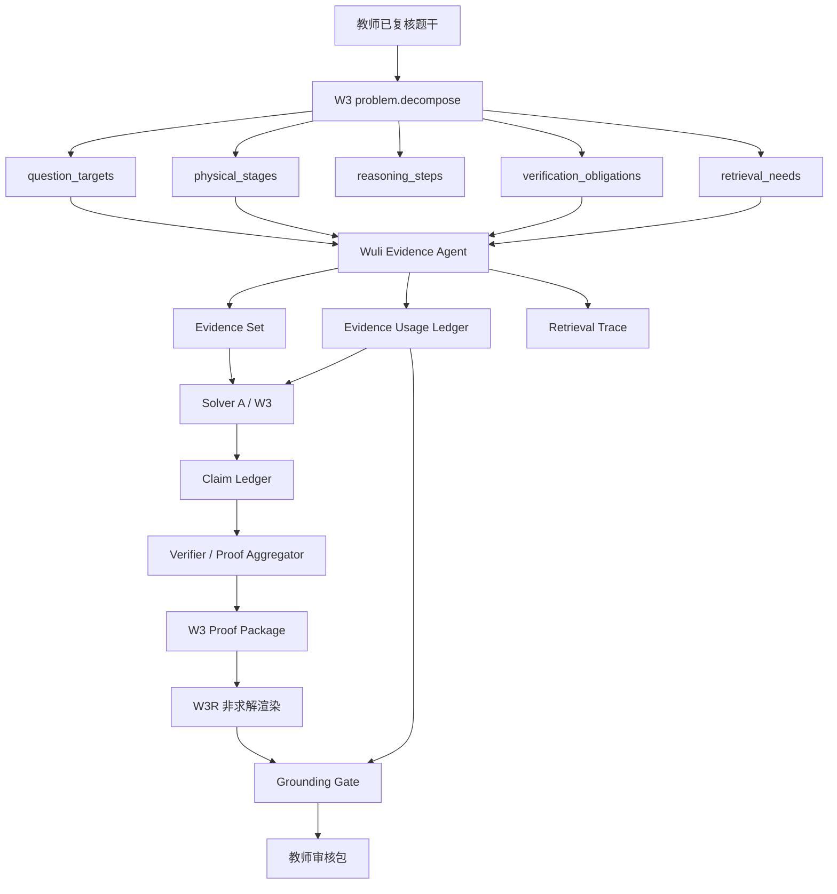
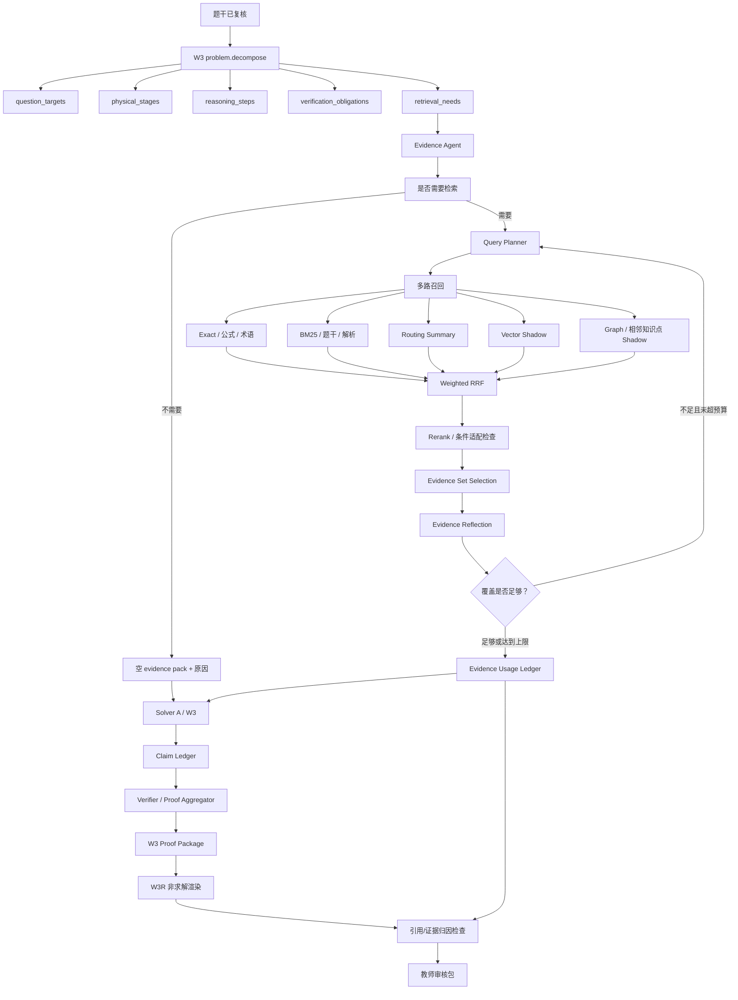

# 构建 Wuli Evidence Agent 证据层：原子任务 Work-Tree

状态：`MVP-H third fresh holdout awaiting teacher review / provider not run / production disconnected`

目标：把当前 `Controlled RAG + W3 Reasoning` 升级为 `Evidence Agent + W3 Proof Package + W3R`。这不是让 RAG 自己解题，而是让 RAG 成为一个可规划、可审计、可反思、可降级的证据系统，为 W3 提供更可靠的 Evidence Set。

参考思想：HelixRAG FS 的关键判断是“摘要用于寻路，原文用于作证；最终检索目标不是 Top-K chunk，而是能共同回答问题的 Evidence Set”。悟理只吸收适合当前物理解题闭环的轻量版本，不照搬企业级多租户、百万文档、复杂 ACL 和全量自优化。

## 执行状态

截至 2026-07-30：

- `MVP-A` 已完成：冻结四个运行契约、Gold Case schema、确定性校验与三层评分骨架；
- `MVP-B` 已完成：Knowledge Store 显式重建生成四类高价值 Evidence Unit shadow
  投影，未接入生产检索；
- `MVP-C` 已完成：新增 `single-route-bypass` 单轮 `evidence.build` 影子原子任务，
  通过 Agent Gateway 做一次无文件工具的 AI 语义验收，再由确定性 Coverage Gate
  生成可重放 `EvidenceAgentRun`；
- `MVP-D` 已完成评测骨架、教师校准与冻结契约的完整真实配对运行：8 条仅含 A 级
  curated technique 的 calibration 已由教师逐条批准，建立 baseline / Evidence Agent
  paired 报告、数据集指纹、逐证据 facet binding、逐冲突检查和 Evidence Precision
  硬门禁；
- 已保存只读 baseline：
  [`reports/evidence-agent-phase-a-baseline-v1.json`](reports/evidence-agent-phase-a-baseline-v1.json)；
- baseline 使用 30 条 calibration 与 12 条 holdout，当前生产检索策略未改变；
- 正式派生索引当前生成 258 条 Evidence Unit，投影错误为 0；
- 真实 Codex/Claude 小样本校准已经击穿并修复三类假充分：冲突证据误纳入、无关候选
  塞满 Evidence Set、未选候选的冲突连坐；
- 教师批准后的 8 条真实 Claude paired 中，Evidence Agent 的候选 Gold 召回、Gold 保留、
  Evidence Precision、状态准确率、需求覆盖和可追溯率均为 100%；false-friend admission
  为 0。相同候选池的 baseline Evidence Precision 为 15%、状态准确率为 75%，并错误
  采纳 2 条 false friend；
- 这 8 条仍是用于修订契约的 calibration，不是独立 holdout；W3 下游非退化也未测量，
  因此 `eligible_for_production=false`，生产资格保持关闭；
- 下一执行节点为 `MVP-E`：另建未参与契约修订的 fresh Evidence Unit holdout，再做
  W3 下游同条件 paired。在此之前不增加第二路召回或 RRF；
- `MVP-E` 的 20 条 fresh holdout 候选已经进入教师修订：只使用前轮 calibration
  从未触及的 6 条 A 级 curated Evidence Unit；教师首轮批准 17 条、退回 3 条。
  v2 按首轮反馈修订“纠错证据可用”语义；教师二轮再明确局部方向口诀不应替代完整
  方法。v3 因此冻结为 11 条预期 `sufficient`、9 条预期 `insufficient`，与
  calibration Evidence Unit 交集为 0；当前 Top-5 预检目标证据命中 20/20。19 条完全
  未变化的决定按逐 case 内容相等结转；
- v3 随后获得教师 20/20 批准并完成一次冻结 Claude paired；独立 holdout 门禁被真实
  触发，但未通过：候选 Gold 召回 100%，Evidence Precision 100%，false-friend
  admission 0/9，可追溯率 100%，状态准确率 85%；Gold 保留与 required need coverage
  只有 81.82%（9/11），另有 1/20 adapter protocol error。因此
  `eligible_for_production=false`；
- 失败不可用同批重跑覆盖：`holdout-angle-ledger-sign-conflict` 暴露“待纠正错误被误报
  为 hard conflict”的契约缺口；`holdout-circuit-path-valid` 暴露连接节点 facet 没有
  明文证据的语料缺口；`holdout-angle-ledger-position-conflict` 暴露 provider 未交付
  结构化结果的协议缺口。修复后本批只能转作 replay/calibration，生产资格需要新的
  fresh holdout；
- `MVP-F repair` 已完成三处有界修复：RetrievalNeed 可显式声明
  `diagnostic_targets`，确定性门禁不再把“待纠正错误”误当适用性冲突；新增 A 级
  `circuit-node-topology` Evidence Unit，直接覆盖连接节点、实际电流通路和等效电路；
  Claude evidence task 固定低 effort，并只对“唯一、无外围说明的 JSON 围栏”做严格
  协议恢复，其他异常继续 fail closed，不自动重试；
- 唯一一次 3 样本 repair replay 已通过：三个原失败的状态依次为
  `sufficient / sufficient / insufficient`，provider 完成 3/3，候选 Gold 召回、
  Gold 保留、Evidence Precision、状态准确率、required need coverage 和可追溯率
  均为 100%，false-friend admission 为 0。该数据集被结构性标记为
  `draft + calibration + post_holdout_repair_replay`，所以
  `independent_holdout_present=false`、`eligible_for_production=false`；
- 下一执行节点不是 RRF，也不是继续重跑这 20 条：必须另建一批未参与三项修复的
  fresh holdout。只有新批通过后，才讨论多路召回消融和 W3 下游 paired；
- 第二批 fresh holdout 候选已经建立并停在教师审核门禁：盘点确认现有 13 条 A 级
  curated Evidence Unit 已全部被 calibration、首批 holdout 或 repair replay 触及，
  因此没有通过“只换题面”伪造 freshness；本批另建 7 条 evaluation-only 隔离证据和
  21 条新 case，历史 Evidence ID 交集为 0，批次固定为
  `evidence-holdout-2026-07-30-b`；
- 新批次首稿包含 14 条预期 `sufficient`、7 条预期 `insufficient`，在正式 Knowledge
  Store 的既有 curated 候选与隔离 overlay 合并条件下，目标证据 Top-5 命中
  21/21；尚未调用 provider；
- overlay 不写入正式 Knowledge Store，只能通过 benchmark 的显式
  `--evidence-overlay` 参数注入。数据集同时绑定 overlay fingerprint，证据正文、
  条件或例外发生变化都会使旧教师审核失效；
- 教师首轮同意 19 条、退回 2 条；两条反馈均指出“证据已经能够回答不能，不能把待
  纠正错误当成拒绝证据的理由”。该判断已吸收：稳定干涉频率冲突与低于截止频率仍
  增强光强两条均改为 `false_friend_check + diagnostic_targets + sufficient`，新版
  因此为 16 条预期 `sufficient`、5 条预期 `insufficient`；
- `output/evidence-holdout-review-v5.html` 的最终审核已完成：21/21 标签和 7 条证据
  均获教师批准。Importer 同时冻结数据集指纹与 overlay fingerprint；只有两者精确
  匹配，live benchmark 才能加载；
- 第二批唯一一次冻结 Claude paired 已完成，21/21 provider 调用成功且无协议失败。
  Evidence Agent 相比同候选池 Top-K baseline，将 Evidence Precision 从 15.24% 提升
  到 100%，false-friend admission 从 5 降到 0，状态准确率从 76.19% 提升到
  95.24%；候选 Gold 召回和可追溯率均为 100%；
- 独立 holdout 仍未通过：`fresh2-relative-endpoint-valid` 被过度拒绝，导致 Gold
  保留与 required need coverage 均为 93.75%（15/16）。Agent 把证据中“越界却不检查
  端点”的纠错警示误当成当前题的硬冲突，而当前题恰恰是在询问如何检查端点。因此
  `gold_retention_non_regression=false`、`eligible_for_production=false`；
- 本报告不得用同批重跑覆盖。本次只证明“零误纳与精确取证显著改善”，同时暴露
  “纠错警示作用域”仍有一类过度拒绝。下一步只能做有界修复与 calibration replay，
  然后用第三批未揭盲 fresh holdout 重新提供生产资格证据；RRF、W3 下游 paired 和
  生产灰度继续后置。
- `MVP-G2 warning-scope repair` 已完成：根因不是 `uncertain` 过严，而是把证据要
  纠正的漏检行为错误放进 `forbidden_conflicts`。修复后 `diagnostic_targets` 的
  纠错语义适用于全部 RetrievalNeed purpose，不再只对 `false_friend_check` 生效；
  真正 forbidden 的 `present/uncertain` 继续 fail-closed；
- 唯一一次 1 样本 calibration replay 已通过：`fresh2-relative-endpoint-valid`
  正确选择 `EU-9bf2d5d1e1066b1b510c0a31`，三项 facet 全覆盖、hard conflict 为 0；
  provider 完成 1/1，Gold 保留、Evidence Precision、状态准确率、required need
  coverage 和可追溯率均为 100%。该 replay 固定为
  `draft + calibration + post_holdout_v2_repair_replay`，因此
  `independent_holdout_present=false`、`eligible_for_production=false`；
- 下一执行节点是第三批未揭盲 fresh holdout，不是重跑第二批，也不是先上 RRF。
  只有第三批再次证明 Gold 保留 100%、零误纳和状态非退化，才进入 W3 下游 paired。
- `MVP-H` 第三批 fresh holdout 候选已建立并停在教师审核门禁：新增 7 条
  evaluation-only A 级证据，覆盖圆周运动受力、平抛分运动、理想气体状态方程、
  动生电动势、弹簧简谐运动、全反射和放射性半衰期；Evidence ID 与 calibration、
  两批 holdout 及两次 repair replay 的揭盲集合交集为 0；
- 第三批包含 21 条新 case，固定批次为 `evidence-holdout-2026-07-31-c`：
  14 条预期 `sufficient`、7 条预期 `insufficient`。纠错型问题统一使用
  `diagnostic_targets`；不足样本只用于证据缺少所需 facet 且场景超出适用范围的情况；
- 正式 Knowledge Store 与第三批 overlay 合并的确定性 Top-5 预检为 21/21，
  `live_provider_run=false`。overlay 仍只能由显式评测参数加载，未写入正式索引；
- 当前教师审核入口为 `output/evidence-holdout-review-v6.html`。页面新增
  “纠错对象（出现不代表证据不适用）”字段，完整展示新证据正文、适用条件、例外、
  Gold 状态和理由；教师批准前不得执行 live paired。

目前只接入 Agent Gateway 的独立 shadow 执行入口，没有接入
`problem_decomposition.py` 或 W3 生产路由；`query()`、现有排序与证据注入行为保持不变。

MVP-C 实际落点：

- `teacher-console/evidence_agent.py`：单路候选召回、AI reflection 契约、Coverage Gate、
  Usage Ledger 与 `EvidenceAgentRun`；
- `teacher-console/scripts/evidence_agent_shadow.py`：显式输入冻结蓝图与 RetrievalNeed
  的只读命令行入口；
- `teacher-console/tests/test_evidence_agent.py`：覆盖候选越界、facet 缺失、权威不足、
  硬冲突、索引不可用、optional short-circuit 和 Gateway 零写入执行；
- `teacher-console/evidence_benchmark.py`：同候选池 baseline / Evidence Agent paired
  评分与不可越过的生产门禁；
- `teacher-console/tests/fixtures/evidence-agent/calibration-curated-v1.json`：
  8 条带数据集指纹的 calibration；明确标记为 `agent_proposed_calibration`，不冒充教师
  Gold 或独立 holdout；
- `docs/reports/evidence-agent-mvp-d-calibration-v1.json`：真实 provider 校准失败链、
  契约修正、教师批准与尚未满足的阻断项；
- `output/evidence-calibration-review.html`：教师可双击打开的单文件审核页；逐条同意/
  退回、保存本机进度并下载带数据集指纹的 `wuli.evidence-gold-review.v1`，无需手改
  JSON；
- `teacher-console/scripts/apply_evidence_gold_review.py`：确定性校验审核人、审核时间、
  数据集指纹和全部 case 决定后，才生成 `teacher_approved` 数据集；页面按钮本身不能
  绕过批准门禁；
- `student-error-library/evals/evidence-gold-calibration-review.json`：与冻结数据集指纹
  绑定的 8 条教师决定；
- `student-error-library/evals/evidence-gold-calibration.json`：经 importer 生成的正式
  `teacher_approved` 校准集；
- `docs/reports/evidence-agent-mvp-d-paired-v1.json`：冻结 v2 契约的 8 条真实 Claude
  paired 结果；证据层校准门禁全部通过，但独立 holdout 门禁仍关闭；
- `teacher-console/tests/fixtures/evidence-agent/holdout-curated-v1.json`：首轮教师审核的
  历史候选；`holdout-curated-v2.json`：吸收首轮 3 条退回意见；当前
  `holdout-curated-v3.json`：吸收二轮“不保留局部方向口诀”的意见；三者均使用固定
  批次 `evidence-holdout-2026-07-30-a`；
- `output/evidence-holdout-review.html`：v1 历史审核页；
  `output/evidence-holdout-review-v2.html`：二轮历史页；
  `output/evidence-holdout-review-v3.html`：只需复核 1 条变化的当前本地单文件页面；
  同样只下载指纹绑定的审核决定，不会自批或联网；
- `student-error-library/evals/evidence-gold-holdout-review.json` 与
  `evidence-gold-holdout.json`：v3 的最终教师批准记录和正式 Gold holdout；
- `docs/reports/evidence-agent-mvp-e-holdout-paired-v1.json`：20 条冻结真实 paired
  原始结果；该报告保留 2 条过度拒绝和 1 条 provider failure，不允许用选择性重跑
  覆盖；
- `docs/reports/evidence-agent-mvp-f-repair-decomposition-v1.json`：三缺口修复的
  原子任务 DAG、状态传递、验证义务和回跳边界；已通过 decomposition validator；
- `teacher-console/scripts/build_evidence_repair_replay.py` 与
  `teacher-console/tests/fixtures/evidence-agent/repair-replay-v1.json`：从已揭盲
  holdout 确定性派生的 3 条修复回放，强制降级为 draft/calibration；
- `docs/reports/evidence-agent-mvp-f-repair-replay-v1.json`：唯一一次真实 Claude
  修复回放结果；只证明三项已知缺口已闭合，不提供新的独立泛化证据；
- `docs/reports/evidence-agent-mvp-f-repair-summary-v1.json`：聚合修复结果、原始
  holdout 不可覆盖约束、157 项确定性回归、回放指标和仍关闭的生产门禁；
- `docs/reports/evidence-agent-mvp-g-fresh-holdout-decomposition-v1.json`：
  第二批 fresh holdout 的独立性、隔离 overlay、教师审核和停止规则；已通过
  decomposition validator；
- `teacher-console/tests/fixtures/evidence-agent/fresh-holdout-v2-evidence-overlay.json`：
  7 条尚未进入正式 Knowledge Store 的 A 级候选证据快照；
- `teacher-console/tests/fixtures/evidence-agent/fresh-holdout-v2.json`：首轮审核的
  历史候选；当前 `fresh-holdout-v2-v2.json` 与
  `docs/reports/evidence-agent-mvp-g-fresh-holdout-preflight-v2.json`：吸收两条
  教师反馈后的指纹绑定候选及零重叠、Top-5 预检结果；
- `output/evidence-holdout-review-v4.html`：首轮历史审核页；
  `output/evidence-holdout-review-v5.html`：只需复核 2 条变化的当前审核页；
  页面同时展示证据原文、适用条件、例外、预期状态和 Gold 理由；
- `student-error-library/evals/evidence-gold-holdout-v2-review.json`、
  `evidence-gold-holdout-v2.json` 与 `evidence-gold-holdout-v2-overlay.json`：
  21 条最终教师决定、正式 Gold 数据集和与之绑定的教师批准证据快照；
- `docs/reports/evidence-agent-mvp-g-fresh-holdout-v2-paired-v1.json`：第二批唯一一次
  冻结 Claude paired 原始报告；保留 1 条过度拒绝，不允许选择性重跑覆盖；
- `docs/reports/evidence-agent-mvp-g-fresh-holdout-v2-summary-v1.json`：批准指纹、
  baseline/Agent 指标、唯一失败归因、关闭的生产门禁和后续证据义务；
- `docs/reports/evidence-agent-mvp-g2-warning-scope-repair-decomposition-v1.json`：
  纠错警示作用域修复的原子任务 DAG、负向安全义务、一次 replay 上限和回跳边界；
- `teacher-console/scripts/build_evidence_warning_scope_replay.py` 与
  `teacher-console/tests/fixtures/evidence-agent/warning-scope-repair-replay-v1.json`：
  从已揭盲失败样本确定性派生的单案例 draft/calibration replay；
- `docs/reports/evidence-agent-mvp-g2-warning-scope-repair-replay-v1.json` 与
  `evidence-agent-mvp-g2-warning-scope-repair-summary-v1.json`：唯一一次真实 Claude
  replay 原始结果和聚合结论；只证明已知作用域缺口闭合，不提供生产资格；
- `docs/reports/evidence-agent-mvp-h-third-fresh-holdout-decomposition-v1.json`：
  第三批零重叠、隔离 overlay、Top-5 预检、教师审核和 provider 停止规则；
- `teacher-console/scripts/build_evidence_fresh_holdout_v3.py`、
  `teacher-console/tests/fixtures/evidence-agent/fresh-holdout-v3.json` 与
  `fresh-holdout-v3-evidence-overlay.json`：第三批确定性构建器、21 条候选和 7 条
  evaluation-only 证据快照；
- `docs/reports/evidence-agent-mvp-h-third-fresh-holdout-preflight-v1.json`：零重叠、
  21/21 Top-5、状态分布和 provider 未运行记录；
- `output/evidence-holdout-review-v6.html`：第三批本地单文件审核页；无需编辑 JSON，
  可逐条同意或退回并下载指纹绑定审核记录；
- `teacher-console/scripts/build_evidence_holdout.py` 与
  `render_evidence_gold_review.py`：确定性重建 holdout 候选与审核页面，避免再次手写
  JSON 或复制页面数据。

为避免在 MVP-C 扩张模型注册表，Gateway 的 provider runtime kind 暂时仍是
`analysis.generate`，任务同时显式标记 `evidence_stage=evidence.build`，当前输出契约为
`wuli.evidence-reflection.v3`。这是运行时复用，不表示 Evidence Agent 获得了解题权限。

## 一句话边界

```text
Evidence Agent 可以循环检索和评估证据；
不能循环求解；
不能覆盖 W3 结论；
不能把历史答案当作当前题证明。
```

## 架构位置

Evidence Agent 放在 W3 的 `problem.decompose` 之后、Solver 之前：



## 输入与输出契约

### 输入

- 当前题干与教师已复核的 `source.clean` / `source-review`。
- W3 蓝图：
  - `question_targets`
  - `physical_stages`
  - `reasoning_steps`
  - `stage_step_links`
  - `verification_obligations`
  - `retrieval_needs`
- 当前知识库派生索引。
- 检索预算：
  - 默认最多 3 轮检索；
  - 每轮最多执行 3 个高优先级子查询；
  - 总输出仍受 evidence 字符预算限制。

### 输出

- `evidence_set`：能共同支撑当前题方法、条件提醒、边界检查的证据集合。
- `evidence_usage_ledger`：每条证据的用途账本。
- `retrieval_trace`：每轮检索、召回路线、拒绝原因、停止原因。
- `insufficient_evidence`：证据不足时的安全退出说明。

## 强制不变量

1. 当前题干、当前答案、教师本轮指令优先于历史证据。
2. 历史证据只能提供方法启发、条件提醒、二级结论候选和既往失败教训。
3. RAG 证据不能直接晋升为当前题 Claim。
4. RAG-derived Claim 必须被当前题的 W3 推导或 verifier 重新验证。
5. W3R 可以用表达模板 RAG，但不能用历史解法 RAG 重新求解。
6. 没有 Gold Evidence Dataset 时，不允许上线自学习排序。
7. 任何检索循环必须有硬上限、无增益熔断和可审计 trace。

## 已冻结的设计决策

以下决策是进入实现前的契约，不再把概念架构中的默认画法误当作生产硬规则。

### 1. “看得更准”的定义

Evidence Agent 的一级目标是在固定预算内满足 W3 明确声明的
`retrieval_needs`，不是覆盖全部 `question_targets`，也不是直接提高最终答案分数。

优先级固定为：

```text
排除条件冲突和 false friend
→ 覆盖 required retrieval needs
→ 在安全与覆盖成立后优化召回量、延迟和成本
```

证据不足时允许返回空 Evidence Set，由 W3 独立求解；不得用低精度历史材料填满上下文。

### 2. Evidence Unit 粒度与权威

一条 Evidence Unit 是可以独立判断适用性的完整物理命题单元，必须绑定：

```text
适用条件 + 可迁移内容 + 例外/冲突条件 + 原文定位 + 内容 hash
```

首版只投影四类高价值证据：

- 带条件的二级结论；
- 方法选择及其适用条件；
- 常见误用与 false-friend 警告；
- 验证公式或边界检查。

适用性是硬门禁，权威性只是在通过门禁后的排序因素。Routing Summary 只能寻路，
不能作证；任何历史证据都不能直接晋升为当前题 Claim。

### 3. `evidence.build` 原子任务

对外表现为一次隔离、可重放、内部多阶段的原子任务：

```text
冻结蓝图与题目快照
→ 规划证据查询
→ 确定性检索
→ 条件/冲突判断
→ Evidence Set Selection
→ Coverage Gate
→ Usage Ledger + Retrieval Trace
```

它可以拆分、缩窄或扩展证据查询，也可以针对明确缺口进行一次补充检索；不能修改
蓝图、生成答案、产生当前题 Claim 或执行任何审批动作。

### 4. 充分性与停止状态

`sufficient` 只表示 W3 声明的 required `retrieval_needs` 已被合格证据覆盖，不表示
当前题已经证明。终止状态冻结为：

```text
sufficient   required needs 全部通过逐项验收
insufficient 仍有 required need 缺失、冲突或预算耗尽
not_needed   没有需要历史证据完成的检索任务
unavailable  索引、版本或基础设施不可用
```

每个 required need 必须逐项满足：

```text
来源合法
AND 原文可定位
AND purpose 匹配
AND required_facets 覆盖率 = 100%
AND 适用条件兼容
AND authority_level 达标
AND hard_conflict_count = 0
```

AI 负责语义诊断并提供原文绑定；确定性 Coverage Gate 负责最终状态，AI 无权自我批准。

这里必须区分“题面中的待纠正错误”和“证据适用性冲突”：

- 如果 Retrieval Need 就是诊断某个错误做法，而 Evidence Unit 能指出错误并给出正确
  规则，该证据可以满足 Need，但用途只能记为 `condition_warning` /
  `false_friend_warning`，不能伪装成当前题 Claim support；
- `forbidden_conflicts` 只记录会让证据无法回答本次 Need 的物理前提冲突，不得把
  “需要证据纠正的错误文本”本身填进去，否则会错误拒绝最有价值的纠错证据；
- 一般解题 Need 不得只召回一个方向口诀来替代完整方法。若完整求解需要速度分解、
  公式或几何关系，应拆成独立 required facets 或新的 Need。

### 5. 融合策略

RRF 是多路候选的可替换融合器，不是不可跳过的充分性判断器。冻结三种策略：

```text
single-route-bypass
weighted-rrf-shadow
weighted-rrf-production
```

只有多路召回在 fresh holdout 上证明相对 baseline 的独立增益，才允许把 Weighted RRF
从 shadow 提升到 production。相关度与融合分只负责排序，不能抵消条件冲突。

### 6. 三层效果门禁

评测分为三层，不能用一个总分互相抵消：

1. 候选召回：正确证据是否进入候选池、各 route 的独立贡献；
2. Evidence Set：required need coverage、Gold Evidence 保留、false-friend 纳入、
   traceability 和终止状态准确率；
3. W3 下游：同题、同模型、同 prompt 的正确率、Claim Support、教师核对负担和成本。

任何检索指标提升都不能绕过两条生产门禁：

```text
false-friend 在冻结关键集零纳入
W3 最终正确率不退化
```

## Work-Tree

### WEA-0：冻结定位与基线

目标：先把 Evidence Agent 的职责边界固定下来，避免它变成另一个 Solver。

```text
WEA-0
├─ WEA-0.1 记录当前 RAG/W3 基线
├─ WEA-0.2 明确 Evidence Agent 不求解、不改答案、不审批
├─ WEA-0.3 在 docs/README.md 增加本文档入口
├─ WEA-0.4 在 github-issues.md 登记后续优化项
└─ WEA-0.5 验收：无生产行为变化，只有文档与任务入口
```

验收标准：

- 当前 `build_agent_evidence()`、`build_blueprint_evidence()` 行为不变。
- W3 生产路由不变。
- 教师端无新增开关误导。

### WEA-1：Evidence Unit 证据单位

目标：把“历史题整块文本”拆成可引用、可过滤、可追踪的证据单位。

```text
WEA-1
├─ WEA-1.1 定义 EvidenceUnit schema
│  ├─ evidence_id
│  ├─ source_kind
│  ├─ source_locator
│  ├─ text
│  ├─ physics_facets
│  ├─ applicability
│  ├─ exceptions
│  ├─ authority_level
│  └─ content_hash
├─ WEA-1.2 在 Knowledge Store rebuild 时生成 evidence_unit 投影
├─ WEA-1.3 将题干、解析、教师反馈、二级结论、physics-model 分开入库
├─ WEA-1.4 保留当前 document/document_fts 兼容路径
├─ WEA-1.5 排除当前条目，避免旧版本污染
└─ WEA-1.6 单元测试：证据单位可重建、可追踪、可 hash、可排除
```

建议落点：

- `.claude/skills/manage-student-error-library/scripts/knowledge_store.py`
- `teacher-console/tests/test_knowledge_store.py`
- 可选新增：`teacher-console/schemas/evidence_unit.schema.json`

验收标准：

- 删除索引后可从正式题库完整重建。
- 每条 Evidence Unit 都能追踪到来源类型与内容 hash。
- 不改变现有生产检索排序。

### WEA-2：Routing Summary 寻路摘要

目标：摘要只用于把问题送到正确知识区域，不作为最终证明。

```text
WEA-2
├─ WEA-2.1 定义 RoutingSummary schema
│  ├─ title
│  ├─ path
│  ├─ model_type
│  ├─ key_entities
│  ├─ key_terms
│  ├─ applicability
│  ├─ exceptions
│  ├─ common_confusions
│  └─ source_hash
├─ WEA-2.2 为历史题生成 routing_summary
├─ WEA-2.3 增加摘要质量检查
│  ├─ 数字保留
│  ├─ 单位保留
│  ├─ 否定词保留
│  ├─ 条件保留
│  └─ 摘要不得引入新结论
├─ WEA-2.4 summary route 只做 shadow，不进生产排序
└─ WEA-2.5 报告 summary route 的独立召回增益与误召回
```

验收标准：

- 不合格摘要不进入索引。
- 摘要命中后必须回溯原始 Evidence Unit。
- summary route 未通过 holdout 前不得默认启用。

### WEA-3：Evidence Agent 有限检索循环

目标：给 RAG 加“自适应检索与自我反思”，但限制在证据层。

```text
WEA-3
├─ WEA-3.1 新增 EvidenceAgentRun schema
├─ WEA-3.2 输入 W3 retrieval_needs、targets、obligations
├─ WEA-3.3 第 1 轮执行高优先级子查询
├─ WEA-3.4 Evidence Reflection 判断证据是否足够
│  ├─ covered_targets
│  ├─ covered_obligations
│  ├─ missing_information
│  ├─ false_friend_risks
│  ├─ conflicts
│  └─ next_action
├─ WEA-3.5 不足时只允许改写查询，不允许改答案
├─ WEA-3.6 最多 3 轮，连续无增益熔断
└─ WEA-3.7 输出 retrieval_trace 和 stop_reason
```

允许的 `next_action`：

```text
stop
retry_with_narrower_query
retry_with_broader_query
degrade_empty
insufficient_evidence
```

禁止的 `next_action`：

```text
rewrite_solution
override_claim
approve_answer
finish_entry
```

验收标准：

- 同一任务指纹不重复无意义检索。
- 超预算时安全退出，不阻塞 W3 独立求解。
- 任何重检索都有“缺什么证据”的结构化理由。

### WEA-4：多路召回 shadow

目标：逐步从单一路径 BM25 升级为可消融的多路召回。

```text
WEA-4
├─ WEA-4.1 保留当前 baseline BM25 生产排序
├─ WEA-4.2 Exact route：公式、变量、术语、边界词、题型标识
├─ WEA-4.3 Evidence BM25 route：原始 Evidence Unit
├─ WEA-4.4 Routing Summary route：摘要节点寻路
├─ WEA-4.5 Vector route：只 shadow，不默认启用
├─ WEA-4.6 Graph route：知识点、方法、二级结论、相邻题型关系，只 shadow
├─ WEA-4.7 Weighted RRF 融合候选
└─ WEA-4.8 记录 Route Unique Contribution 与 Route Regret
```

验收标准：

- 每条 route 可单独关闭。
- 每条 route 有候选数、命中原因、耗时、唯一贡献。
- 没有独立增益的 route 不得长期保留为默认生产路径。

### WEA-5：Evidence Set Selection v3

目标：从“选 Top-K 相似题”变成“选能共同覆盖目标和验证义务的证据集合”。

```text
WEA-5
├─ WEA-5.1 定义 Coverage Matrix
│  ├─ question_targets
│  ├─ physical_stages
│  ├─ verification_obligations
│  ├─ method_slots
│  └─ condition_slots
├─ WEA-5.2 每条候选证据标注覆盖槽位
├─ WEA-5.3 选择器最大化
│  ├─ target coverage
│  ├─ obligation coverage
│  ├─ condition compatibility
│  ├─ evidence independence
│  └─ source authority
├─ WEA-5.4 选择器最小化
│  ├─ redundancy
│  ├─ false-friend risk
│  ├─ unexplained contradiction
│  ├─ context size
│  └─ low-quality OCR
├─ WEA-5.5 冲突证据不直接删除，先标记 conflict
└─ WEA-5.6 输出 selected/rejected/omitted 的完整 trace
```

验收标准：

- Evidence Set 明确说明覆盖了哪些目标和义务。
- 低相关证据不会为了填槽位强行进入上下文。
- 冲突证据如果有教学价值，可作为风险提示进入 ledger，但不能作为 claim support。

### WEA-6：Evidence Usage Ledger

目标：记录 RAG 到底影响了什么，防止隐性污染答案。

```text
WEA-6
├─ WEA-6.1 定义 EvidenceUsageLedger schema
├─ WEA-6.2 每条证据只能标记有限用途
│  ├─ navigation_only
│  ├─ method_hint
│  ├─ condition_warning
│  ├─ false_friend_warning
│  ├─ secondary_conclusion_candidate
│  └─ citation_support
├─ WEA-6.3 Solver 输出 claim 时声明 evidence influence
├─ WEA-6.4 RAG-derived claim 必须进入 verifier
├─ WEA-6.5 未经当前题验证的历史结论不得进入最终答案
└─ WEA-6.6 教师审核包显示紧凑证据影响摘要
```

验收标准：

- 每个最终关键 Claim 可追踪到：
  - 当前题推导；
  - W3 verification certificate；
  - 或仅作为历史证据提示而未进入结论。
- 任何 `citation_support` 都必须绑定原始 Evidence Unit。
- `method_hint` 不能被渲染成“由此可知”。

### WEA-7：W3R Grounding Gate

目标：解决“正确但不可读”与“可读但偷偷改结论”的双重风险。

本节点的独立输入输出契约、原子任务、Agent 文件边界、Shadow 配对评测和回滚机制，
以 [构建-W3R-非求解教学渲染与忠实性门禁-原子执行.md](构建-W3R-非求解教学渲染与忠实性门禁-原子执行.md)
为执行真源；本文只保留它与 Evidence Agent 的接口关系。

```text
WEA-7
├─ WEA-7.1 W3R 只读取 W3 Proof Package 和 W3R Brief
├─ WEA-7.2 可选读取 style/template evidence
├─ WEA-7.3 禁止 W3R 读取历史解法来重算答案
├─ WEA-7.4 Render Gate 检查
│  ├─ LaTeX 表达
│  ├─ 目标完整性
│  ├─ 步骤可读性
│  ├─ claim 不漂移
│  ├─ evidence usage 不越权
│  └─ 方法不过纲
└─ WEA-7.5 渲染失败只允许重渲染，不允许回退 W2 重解
```

验收标准：

- 表达失败不触发重新求解。
- W3R 输出中的每个结论都能回到 W3 Proof Package。
- 样式 RAG 只能影响表达结构、LaTeX、讲解层次，不能影响物理结论。

### WEA-8：Gold Evidence Dataset 与消融评测

目标：用 Gold Evidence 评 RAG，而不是只看答案文本。

```text
WEA-8
├─ WEA-8.1 定义 retrieval/evidence gold case
│  ├─ query
│  ├─ query_type
│  ├─ required_entries
│  ├─ required_evidence_units
│  ├─ forbidden_evidence_units
│  ├─ expected_claims
│  └─ expected_abstention
├─ WEA-8.2 至少 30 条 calibration
├─ WEA-8.3 至少 20 条 fresh holdout
├─ WEA-8.4 做 route 消融
│  ├─ BM25 only
│  ├─ Exact + BM25
│  ├─ BM25 + Summary
│  ├─ BM25 + Vector shadow
│  ├─ BM25 + Graph shadow
│  └─ Full Evidence Agent
├─ WEA-8.5 报告检索指标
│  ├─ Evidence Recall@K
│  ├─ MRR
│  ├─ nDCG
│  ├─ Evidence Coverage
│  ├─ False-Friend Rejection
│  └─ Route Unique Contribution
└─ WEA-8.6 报告答案指标
   ├─ Claim Support Rate
   ├─ Citation Precision
   ├─ Citation Completeness
   ├─ Faithfulness
   └─ Teacher Edit Rate
```

验收标准：

- 只评答案文本不算通过。
- 必须评是否召回并保留了 Gold Evidence。
- 任一路召回器必须证明独立增益，才允许进入默认路径。

### WEA-9：生产灰度与回滚

目标：安全地把 Evidence Agent 从 shadow 推到生产。

```text
WEA-9
├─ WEA-9.1 shadow-only：不影响答案
├─ WEA-9.2 paired run：同题同模型比较旧 RAG 与 Evidence Agent
├─ WEA-9.3 teacher review：看正确率、核对负担、表达质量
├─ WEA-9.4 gray route：只对复杂题启用
├─ WEA-9.5 rollback：一键回 baseline evidence
└─ WEA-9.6 生产门禁
   ├─ 正确率不退化
   ├─ Gold Evidence 保留率 100%
   ├─ false-friend 误纳入下降
   ├─ 教师核对卡不增加
   └─ 平均用量在预算内
```

验收标准：

- 生产默认切换前必须有 fresh holdout。
- 若答案正确率退化，即使用量下降也不得上线。
- 若证据层失败，W3 可以独立解题；不能被低质量历史证据拖偏。

## 最小可执行版本

采用“单路可审计闭环优先，Agentic 循环其次，多路召回最后”的纵向顺序：

```text
MVP-A：冻结 RetrievalNeed / EvidenceUnit / EvidenceAgentRun /
       EvidenceUsageLedger 契约、baseline 和 Gold 评测骨架
MVP-B：Knowledge Store 生成四类高价值 Evidence Unit shadow 投影
MVP-C：single-route-bypass 单轮 evidence.build 影子闭环
MVP-D：Evidence Usage Ledger 接入 W3 shadow 与同条件 paired run
MVP-E：教师批准的首批 fresh holdout（失败，保留原始报告）
MVP-F：只修复已暴露缺口并做一次 calibration repair replay（已通过）
MVP-G：第二批真正 fresh holdout、W3 下游 paired、复杂题灰度与一键回 baseline
MVP-H：通过 fresh holdout 后再做 Exact / Summary / Vector / Graph / Weighted RRF 消融
MVP-I：W3R Grounding Gate 独立接入冻结的 W3 Proof Package
```

依赖约束：

- Gold 评测 schema 与 baseline 记录必须先于策略行为变化；
- Evidence Unit 的稳定 `evidence_id` 必须先于 Usage Ledger 正式物化；
- 单路闭环未通过前，不增加向量、图谱或生产 RRF；
- 单轮闭环未通过前，不开放第二轮 Agentic Reflection；
- W3R 是独立非求解任务，不并入 `evidence.build`。

暂不做：

- 全量向量库生产启用；
- 自学习排序；
- 多轮 Tree Agent；
- Cross-Encoder 强制重排；
- 企业级 ACL / 多租户 / 百万文档扩展。
- Routing Summary 大规模重建；

## 成功定义

这项工作成功，不是因为“RAG 更强了”，而是因为：

```text
W3 在解题前拿到的证据更相关；
W3 在验证时知道哪些边界更危险；
W3R 在成文时不会偷改结论；
教师审核时能看到证据如何影响答案；
历史题不会再悄悄污染当前题。
```

最终交付物应当是：

```text
Evidence Set
+ Evidence Usage Ledger
+ Retrieval Trace
+ W3 Proof Package
+ Grounded Readable Answer
```

## 悟理的解题 HelixRAG-lite 架构

