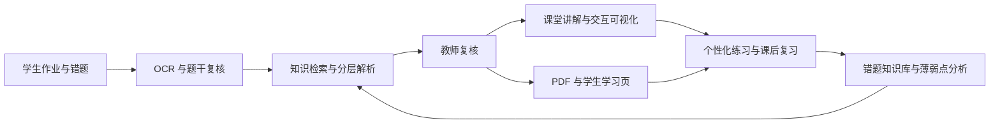
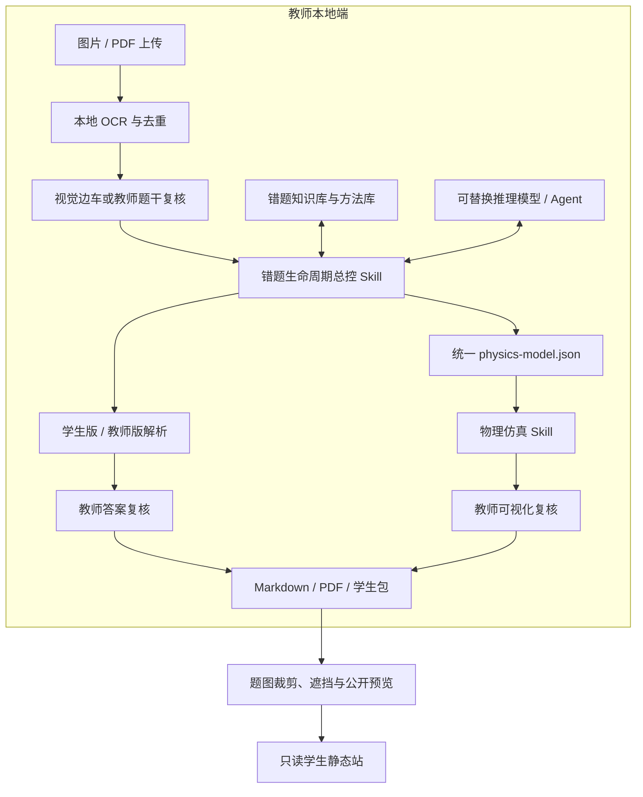

# 悟理

> 面向乡村课堂的端侧可信 AI 全流程教学助教平台

**项目口号：让 AI 成为每一位孩子持续生长的土壤。**

## 一、项目摘要

“悟理”面向乡村学校教师资源紧张、网络与设备条件不稳定、优质可视化教学资源不足、课后个性化支持难以持续等问题，构建了一套由教师掌控、可在本地部署、覆盖“备课—课堂—课后—教研沉淀”的 AI 教学闭环。

教师只需上传一道学生错题的图片或 PDF，系统即可完成本地 OCR、重复检测、题干复核、历史知识检索、学生版与教师版分层解析、按需交互仿真、Markdown/PDF 导出、学生学习页面发布、变式练习生成、薄弱点分析和复习计划维护。系统不让 AI 直接替教师作出最终判断，而是通过题干、答案、动态可视化和公开发布四类人工复核门禁，记录“谁确认了哪个版本”，使 AI 生成内容可核验、可追溯、可修订。

项目当前以高中物理为首个完整 MVP。物理学科对公式、方向、图像和动态过程的准确性要求高，能够充分检验系统在乡村课堂中的实用性与可信度。未来可通过独立学科 Skill 扩展至数学、化学和科学教育，而无需重做上传、复核、知识库、发布和学生端等公共基础设施。

## 二、项目定位

“悟理”不是一个只会回答问题的聊天机器人，也不是单一的错题本、课件生成器或在线搜题工具，而是一套以教师为教学责任主体的 AI 工作流系统。

它把原本分散的工作连接成一个持续循环：

教师不是 AI 输出的被动接收者，而是这个“教学回路”的控制者；AI 负责减少机械劳动、生成候选内容和调用工具，教师负责专业判断与最终确认。

## 三、乡村课堂的真实痛点

### 1. 教师一人承担多种角色

乡村教师往往同时承担授课、备课、批改、答疑、教研和资源整理。单道错题的价值很高，但将它整理成规范解析、课堂材料和后续练习需要大量重复劳动。

### 2. 优质动态教学资源制作门槛高

带电粒子运动、力学过程、电路变化等内容仅靠静态板书不易讲清。通用网络动画又常常与具体题目条件不一致，教师自行制作交互仿真成本较高。

### 3. 课后支持难以真正个性化

学生收到标准答案，并不等于理解了错误原因。教师难以持续为每名学生生成低认知负担解析、针对性变式题和复习计划。

### 4. 网络依赖和隐私顾虑

学生作业可能含姓名、班级等隐私信息，不适合无提示地上传云端平台。本项目默认先在本机完成 OCR；结构化推理 provider 只接收已复核文本和必要规则上下文，不接收原始题图。若教师明确授权远程视觉复核，视觉边车才可在项目配置与环境变量双门禁下发送原图。最终产物（PDF、仿真、学生页）均可保存为本地文件，课堂使用时不受网络波动影响。

### 5. 教学资源用完即散失

教师处理过的错题、讲法、图像和仿真经常散落在聊天记录和文件夹中，下一届学生遇到相似问题时仍要从头制作。

## 四、解决方案

### 4.1 教师端：一站式本地工作台

教师可以在同一页面完成：

- 上传图片或 PDF；
- 对照原图修正 OCR 题干；
- 边编辑 Markdown，边查看公式编译效果；
- 查看学生版和教师版两层解析；
- 向 AI Agent 提出明确修改意见；
- 按需生成并复核交互式物理仿真；
- 导出 Markdown、PDF 和学生文件包；
- 裁剪、遮挡并确认可公开题图；
- 预览只读学生页面后再决定是否发布。

### 4.2 课堂端：针对具体题目的动态可视化

当教师认为一道题适合动态展示时，可以明确提出可视化要求。系统基于统一的 `physics-model.json` 生成离线 HTML 仿真，支持：

- 播放、暂停和模拟时长调节；
- 时间轴与关键事件暂停；
- 轨迹、受力、几何关系逐层显示；
- 多种答案情形或参数切换；
- 画面缩放和课堂投屏；
- 桌面端画布与控制栏并排，手机端首屏保留画布、当前结论、播放和进度，次要控制折叠；
- 离线打开及跨平台打包。

标准解析默认不强制生成仿真，避免为了“炫技”增加教师负担。只有教师明确请求时才进入可视化流程。

### 4.3 学生端：只读、易检索的课后学习站

学生端可部署为 GitHub Pages 等纯静态站点，学生可以：

- 按题目或知识点检索；
- 查看经过教师确认的公开题图；
- 阅读低认知负担的学生版解析；
- 在公开 PDF 成功生成时下载排版固定版本；
- 打开已批准的交互演示。

学生端不连接教师本地 API，也不能修改教师知识库。原始上传、学生个人信息、教师版解析和内部流程记录不会直接进入公开站。

### 4.4 教研端：让一次备课转化为长期资产

每道题会形成结构化条目，记录知识点、可观察错误类型、难度、复习历史和相关教学方法。系统可以检索相似错题、统计薄弱点、安排间隔复习，并基于原题生成带完整答案的变式练习。

## 五、与竞赛赛道的对应关系

项目覆盖的不只是两个孤立方向，而是把多个赛道能力组织成一个闭环。

| 赛道能力 | “悟理”的对应功能 |
|---|---|
| 端侧备课助手 | OCR、题干整理、历史检索、分层解析、PDF/Markdown 课件生成 |
| 课堂复盘工具 | 错题入库、错误类型记录、复习历史、薄弱点分析 |
| 跨学科课件生成 | 公共工作流可复用；当前以高中物理 Skill 为首个学科实现 |
| 可视化科普 | 针对具体题目的可交互仿真、关键事件、分层显示和离线投屏 |
| 课后答疑伙伴 | 学生版解析、30 秒自测、易错点提示和只读学习页 |
| 个性化练习题生成 | 基于历史错题和可迁移错误类型生成变式题及完整答案 |
| 作业辅导助手 | 图片/PDF 输入、题干复核、详细步骤、解释图和 PDF 交付 |
| 教研知识沉淀 | 条目化知识库、条件化二级结论库、检索与复习调度 |
| 可信 AI 治理 | 教师复核门禁、版本摘要、失效机制、隐私脱敏和公开白名单 |

因此，项目更准确的赛道定位是：

> **以端侧教研搭子为入口，以课堂可视化为连接，以课后个性化支持为出口，以知识库沉淀形成持续迭代的乡村课堂 AI 教学闭环。**

## 六、核心创新

### 6.1 从“一次回答”升级为“有状态的教学生命周期”

系统不是生成答案后立即结束，而是明确区分上传、来源复核、解析、答案复核、可视化复核、交付和公开发布等状态。上一步未通过，下一步不能伪装完成。

### 6.2 让纯文本模型也能安全参与图像题处理

OCR、视觉语义复核和推理解题彼此解耦。DeepSeek 等不具备识图能力的模型只接收已经复核的题干和图形事实；当视觉能力不可用时，系统自动回到教师人工复核，而不是让模型猜图。

### 6.3 用统一物理模型消除答案与动画分叉

答案、事件、轨迹和仿真共享同一个结构化物理模型。修改模型后，旧答案和旧可视化批准自动失效，必须重新检查，避免“解析说向左、动画却向右”一类常见错误。

### 6.4 高中方法优先，降低学生认知负担

系统优先使用高中生已知或应该掌握的几何关系、守恒律、图像方法和带适用条件的二级结论，尽量把学生主线控制在少量关键步骤内；替代推导、边界讨论和完整验算放入教师版。

### 6.5 教师在环，而不是 AI 自我审批

系统分别记录题干、答案、可视化和公开内容的教师确认。受保护文件一旦变化，原批准自动失效。AI 可以修改候选内容，但不能替教师点击批准。

### 6.6 兼顾本地隐私与资源共享

教师端和知识库默认留在本机。学生公开站只接收白名单产物；原题图需要经过自动建议裁剪、教师手动遮挡和摘要确认，生成独立 WebP 副本。这样既能保护学生隐私，也能让优质教学资源安全复用。

### 6.7 Skill 化能力便于复制到不同模型平台

完整工作流被封装为可迁移的 Agent Skill，可供 Claude Code、OpenAI Codex、OpenCode、OpenClaw 等支持 Skill 的工具调用。底层模型或外部接口可以替换，教学流程和审核边界保持稳定。

## 七、技术架构

### 关键技术组成

- Python 本地生命周期与知识库脚本；
- Apple Vision 本地 OCR（macOS），Windows/Linux 可通过命令行适配器接入 Tesseract、PaddleOCR 等本地引擎；可插拔视觉复核适配器；
- Markdown、KaTeX 和 XeLaTeX/Pandoc 文档输出；
- Canvas/SVG 离线交互仿真；
- JSON Schema、跨字段物理校验、静态检查和浏览器运行检查；
- 本地教师端 Web 工作台；
- 可部署到 GitHub Pages 的纯静态学生端；
- 基于内容摘要的复核、失效和隐私发布门禁。

## 八、典型使用场景

某乡村高中物理教师发现学生在“带电粒子在复合场中的运动”中频繁出错：

1. 教师用手机拍下错题并上传；
2. 系统完成 OCR，教师对照原图确认公式、方向和全部小问；
3. 系统检索磁场圆周运动相关历史题与条件化二级结论；
4. 生成学生版五步内主线解析和教师版完整验算；
5. 教师发现运动过程难以靠静态图讲清，要求生成交互仿真；
6. 系统呈现粒子跨区域运动、时间轴、第三次进入前的关键事件和不同磁场参数；
7. 教师复核后，课堂上离线投屏讲解；
8. 课后学生在只读页面重新查看题图、解析和仿真，并在公开 PDF 可用时下载；
9. 系统后续生成变式题并记录复习结果；
10. 这道题及其讲法进入学校可持续复用的教研知识库。

## 九、当前完成度与验证情况

截至 2026 年 7 月 22 日，项目已完成可运行的高中物理 MVP：

- 已建立教师本地工作台和只读学生静态站；
- 已跑通“上传—OCR—题干复核—分层解析—答案复核—按需仿真—交付—公开预览”的完整流程；
- 本地样例知识库现有 13 个条目，当前均处于 `delivered`；
- 4 个条目包含结构化物理模型，可用于验证动态可视化流程；
- 已具备 Markdown、PDF、离线 HTML 和学生包输出；
- 已实现公开题图裁剪、遮挡、教师确认和隐私白名单；
- 当前 62 项自动化测试覆盖答案复核失效、Agent Gateway 隔离与降级、模型注册表/逐模型测试、后台作业、文件夹同步、可视化门禁、公开发布与隐私边界。

上述数据仅代表本地功能验证，不等同于真实学校规模化教学效果。学生学习增益、教师节省时间和不同设备适配情况仍需通过实地试点获得。

## 十、项目价值

### 对教师

- 减少 OCR 整理、重复排版和资料打包工作；
- 将一次讲题同时转化为解析、课件、仿真和课后材料；
- 保留最终专业判断权；
- 逐步形成学校自己的本地教研资产。

### 对学生

- 获得符合高中认知水平的分层解析；
- 通过动态过程理解抽象物理规律；
- 从“看答案”转向“针对错误进行复习和迁移训练”；
- 在网络条件有限时仍可使用 PDF 和离线 HTML。

### 对乡村学校

- 降低优质数字教学资源的制作门槛；
- 减少对单一云平台和持续网络连接的依赖；
- 支持校本资源长期沉淀和教师之间复用；
- 用明确审核与隐私边界降低 AI 进入课堂的风险。

## 十一、与常见方案的区别

| 对比维度 | 通用 AI 聊天 | 在线搜题/错题本 | 通用课件生成 | 悟理 |
|---|---|---|---|---|
| 工作方式 | 单轮问答 | 查答案、存题 | 一次性生成课件 | 持续教学生命周期 |
| 教师审核 | 通常无硬门禁 | 较弱 | 通常为人工浏览 | 多阶段摘要绑定复核 |
| 图像模型不足时 | 容易猜测 | 依赖平台能力 | 依赖云端 | OCR、视觉边车、人工复核分离 |
| 课堂可视化 | 通用描述 | 少量静态图 | 通用动画 | 与具体题目统一模型的交互仿真 |
| 课后支持 | 临时回答 | 标准解析 | 不覆盖 | 分层解析、变式题、复习计划 |
| 教研沉淀 | 聊天记录分散 | 题目收藏 | 文件分散 | 可检索结构化知识库 |
| 弱网与隐私 | 多依赖云端 | 多依赖平台 | 多依赖云端 | 本地优先、离线产物、公开白名单 |

## 十二、落地方式

### 最小部署

一台普通教师电脑即可运行本地工作台。学生材料、知识库和教师复核记录保存在本机；核心页面依赖随项目打包，不需要运行时访问 CDN。

### 模型适配

学校可以根据设备和预算选择本地或远程模型。OCR、视觉复核、推理解题和仿真构建彼此解耦，可以分别替换。任何远程学生材料上传都需要单独开启隐私授权。

### 学生访问

教师可直接发送 PDF 或离线学生包；具备网络条件时，可把经过隐私确认的只读站点部署到 GitHub Pages 或校内静态服务器。

## 十三、后续计划

### 第一阶段：真实课堂试点

- 与 1—2 所乡村学校、2—5 名教师共同试用；
- 记录单题处理时间、教师修改次数、学生使用完成率；
- 访谈教师对解析层次、仿真价值和审核负担的评价。

### 第二阶段：学科扩展

- 数学：几何构图、函数图像和步骤诊断；
- 化学：实验装置、反应流程和微观过程；
- 科学教育：跨学科实验与可视化科普。

### 第三阶段：校本协作

- 增加教师之间的精选资源导入导出；
- 建立不含学生隐私的校本题库发布流程；
- 支持班级级别的匿名学习统计和复习任务。

### 第四阶段：效果评估

- 对比使用前后的备课耗时；
- 评估学生在同类变式题上的迁移正确率；
- 评估弱网环境下的可用性和教师持续使用意愿。

## 十四、风险与应对

| 风险 | 应对机制 |
|---|---|
| OCR 或模型识别错误 | 原图对照、视觉边车、教师题干复核 |
| AI 解题或方向判断错误 | 学生版/教师版双层答案、双重验证、教师摘要审批 |
| 动画与答案不一致 | 统一物理模型、模型校验、可视化独立复核 |
| 学生隐私泄露 | 本地优先、公开题图独立副本、裁剪遮挡、发布白名单 |
| 弱网影响使用 | 本地工作台、离线 PDF、离线 HTML 和学生包 |
| 教师审核负担过重 | 仅关键阶段设置门禁，标准解析不强制生成仿真 |
| 学科扩展导致质量下降 | 每个学科独立 Skill、条件库、验证器和测试集 |

## 十五、五分钟演示建议

1. **30 秒：问题引入**——展示一张真实错题，说明乡村教师从批改到备课、讲解和课后支持的重复劳动。
2. **60 秒：上传与复核**——上传题图，展示 OCR、题干编辑和教师确认。
3. **60 秒：分层解析**——切换学生版与教师版，展示公式实时预览、易错点和高中二级结论。
4. **90 秒：交互仿真**——播放带电粒子运动，切换参数，停在关键事件，说明答案与动画来自同一模型。
5. **40 秒：交付与学生端**——展示 PDF、公开题图脱敏、只读学生页和交互入口。
6. **20 秒：闭环总结**——展示知识库、变式题和复习计划，回到“让每一道错题成为可持续教学资源”。

## 十六、可直接用于报名表的精简介绍

“悟理”是一套面向乡村课堂的端侧可信 AI 全流程教学助教平台。教师上传学生错题图片或 PDF 后，系统可完成本地 OCR、题干复核、历史知识检索、学生版与教师版分层解析、按需交互仿真、Markdown/PDF 导出、学生学习页面发布、个性化变式练习和复习计划维护。项目通过题干、答案、可视化和公开发布四类教师复核门禁，确保 AI 不能自行批准教学内容；通过统一物理模型保证解析、事件和动画一致；通过本地优先、离线产物、公开题图裁剪遮挡和白名单发布保护学生隐私。当前项目已完成高中物理 MVP，可进一步通过学科 Skill 扩展至数学、化学和科学教育。它把端侧备课、课堂可视化、课后答疑、个性化练习和校本教研沉淀连接为一个持续生长的乡村课堂 AI 教学回路。

## 附录：品牌使用规范

| 场景 | 统一写法 |
|---|---|
| 品牌名 | **悟理** |
| 申报全称 | **悟理——面向乡村课堂的端侧可信 AI 全流程教学助教平台** |
| 页面短标题 | **悟理·AI 全流程教学助教** |
| 教师产品 | **悟理教师工作台** |
| 学生产品 | **悟理学习站** |
| 项目口号 | **让 AI 成为每一位孩子持续生长的土壤。** |
