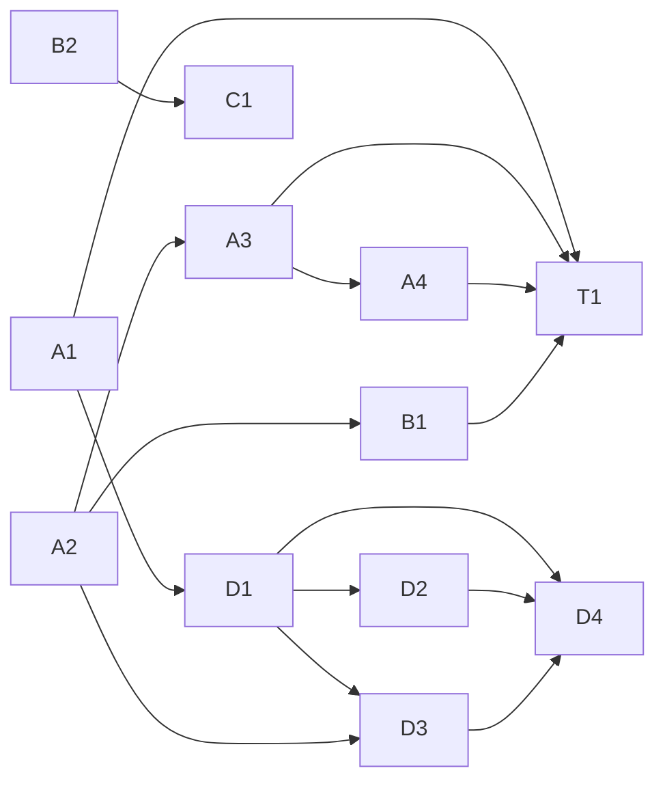

# Core 失败归因链修复与复杂题质量对齐执行树

> 状态：待执行（只读审计完成，未改动文件）
> 起因：2026-08-03 18:22 一道 6 小题物理题的 Core 重生成被误报为 `output_truncated`，真实阻断点是本地物理质量门把跨小问引用 `Q4i` 误识别成未定义物理量 `Q4`，随后 Gateway/分类器/阶段遥测/UI 连环归因错误。
> 范围：教师控制台 Core-first 解析链的失败归因、物理门符号扫描、阶段遥测、答案版本展示与检查点重放（A/B/C/T 系列）；复杂题生成质量对齐 7 月教师审核样本（D 系列）。
> 契约基线：`wuli.core-solve.v1`、`wuli.physics-quality-gate.v1`、`wuli.analysis.v2`（旧路径）、`wuli.core-rich.v2`（D1 新增 rich 五段契约）、`wuli.claim-verify.v1`（D3 复用）。

## 1. 背景与根因摘要

provider（openai-compatible / DeepSeek Flash）已完整返回 6 小题 JSON：`finish_reason=stop`、completion tokens 1256、用时 12.276 秒、returncode=0、未超 90 秒期限。失败发生在本地确定性链路：

1. 物理质量门 `_SYMBOL_TOKEN` 把答案中合法的跨小问引用 `Q4i` 截成 `Q4`，判定 "symbol Q4 is used but never defined"，拒绝候选。
2. Gateway 把物理门抛出的 `ValueError` 与 JSON 解码错误放在同一个异常处理块，统一写成 `parse_error`。
3. 失败分类器 `classify_agent_failure` 的文本截断标记包含 `finish_reason`、`content_chars`、`reasoning_chars`、`max_tokens` 等正常遥测字段名，连 `"finish_reason":"stop"` 也被误判为 `output_truncated`。
4. 阶段遥测 `stage_records` 只看 Gateway 整体状态，把实际成功的 `structured-generation` 写成失败，真正的 `physics-quality-gate` 失败没有记录。
5. UI 同时显示"失败"（最新作业）与"待复核答案"（上一成功版本 00:23），但无版本来源，教师无法分辨正在批准的是哪一版。
6. Core 路径未在 materializer 前保存输入指纹绑定的 checkpoint，修复门禁后重试会再次消耗模型预算。

本次没有运行 W3，也没有运行 W3R。旧作业 `50304a…` 才是真截断（`finish_reason=length`），前一轮增加输出预算、关闭 thinking 的修复已生效——**现在暴露的是下一层本地门禁问题，不应继续调高 timeout 或 `max_tokens`**。

## 2. 当前代码现状（只读确认）

| 模块 | 文件:行 | 现状要点 |
|------|---------|----------|
| 符号正则 | `teacher-console/physics_quality.py:43` | `_SYMBOL_TOKEN = re.compile(r"([A-Za-zα-ωΑ-Ωε][0-9]\|[α-ωΑ-Ωε][A-Za-z]?[0-9])")`；匹配字母/希腊字母+数字，`Q4i` 被截成 `Q4`，`i` 丢失 |
| 未定义检查 | `physics_quality.py:122-144` | `_undefined_symbols` 用 `_SYMBOL_TOKEN.findall` 抽取 token，再在 definitions 里查；`_check_symbol_defined` 返回 `symbol-undefined` |
| 物理门报告 | `physics_quality.py:229-268` | `physics_quality_report` 调用上述检查；dimension/applicability 标记为 `deferred-verifier` 不阻断 |
| target ID 生成 | `core_analysis.py:109-151` | `_target_items` 会生成 `Q4i`（罗马数字小问）这类 target ID，但物理门不感知 |
| 门禁抛错 | `core_analysis.py:283-293` | `normalize_payload(problem=...)` 调 `physics_quality_report`，fail 则抛 `ValueError("physics quality gate rejected: {code}@{target_id}; ...")` |
| materializer | `core_analysis.py` `materialize` | 先 `normalize_payload` 过门禁，再 render fidelity + 写文件 |
| 失败分类器 | `agent_gateway.py:54-161` | 结构化信号优先（adapter_failure_type / finish_reason=length / content_chars==0&reasoning>0）；之后文本标记含 `finish_reason`/`content_chars`/`reasoning_chars`/`max_tokens` 等正常字段 |
| 异常处理块 | `agent_gateway.py:1486-1502` | JSON 解码与 materializer 在同一 try/except，捕获 `OSError,TypeError,ValueError,PermissionError,json.JSONDecodeError`，统一写 `parse_error` |
| replay 异常块 | `agent_gateway.py:1176-1179` | checkpoint 重放路径同样把 materializer 失败写成 `parse_error` |
| 阶段记录 | `analysis_artifacts.py:552-578` | `stage_records` 仅据 `gateway.status=="completed"` 或 `materialization` 是否为 dict 判断 `structured-generation`；无法区分 provider 成功/materializer 失败 |
| checkpoint 工具 | `analysis_artifacts.py:581-660` | `input_fingerprint`/`save_generation_checkpoint`/`load_generation_checkpoint` 已存在，旧 analysis 路径使用，Core 路径未用 |
| Core 调用 | `server.py:3216-3225` | `run_agent_gateway(materializer=lambda: core_analysis.materialize, bounded_failure_repair=False)`，无 checkpoint |
| 旧 checkpoint 路径 | `server.py:3380-3401` | `materialize_with_checkpoint` 先存 checkpoint 再 materialize，可作范本 |
| 失败状态保留 | `server.py:3239-3268` | 未完成时 `resulting_state = process_uploads.pipeline_state(entry)`，保留旧 canonical 答案（正确的安全策略） |
| 路由入口 | `server.py:3016-3049` | `run_adaptive_analysis` 在 `core-first` 模式直接调 `run_core_analysis` 并返回，不跑 W3 |
| 日志脱敏 | `server.py:190-195` | `_sanitize_output` 截断 stdout/stderr 到 2000 字符，尾部加 `… (truncated)`（非模型输出截断） |
| 前端失败面板 | `teacher-console/static/app.js:2108-2143` | `jobFailureReason` 从 job/error/result 提取错误，不显示版本来源/生成时间/Job id |
| 单元测试 | `teacher-console/tests/test_physics_quality.py` | 覆盖 4 个 obligation；`FIXTURE_D` 测 `v2` 未定义，但无 `Q4i` 跨小问引用用例 |
| 分类测试 | `teacher-console/tests/test_agent_gateway.py:183-298` | `test_failure_classifier_prefers_actionable_root_causes` 用 "response was truncated" 文本判定；无"正常遥测+门禁失败"组合 |
| fake adapter | `tests/fixtures/fake_agent_adapter.py:193-225` | `core_solve_payload` 返回 `final_answer="a=F/m"`，不含跨小问引用；e2e 版同构 |
| 复杂度信号 | `problem_decomposition.py:53-81` | `complexity_screen` 纯确定性文本模式匹配，输出 `decision="decompose"\|"w2"` 与 `score`；当前仅 legacy-adaptive 的 W2/W3 分流调用，core-first 未用 |
| 图示任务构建 | `server.py:867-930` | `physics_diagram_task` 构建 `diagram.scene`，前置条件 `visual-facts.json` 存在；`run_core_analysis` 的 `diagram_task` 当前固定 `not-run`（server.py:3169-3172） |
| claim-verifier | `w3_pipeline.py:380-460` | `stage_runner("claim-verifier", ...)` 产出 `semantic_certificates`，用独立模型身份（server.py:3448-3452 `resolve_model_id_for_task("claim.verify")`）；当前仅 W3 链调用 |
| v2 五段校验 | `analysis_artifacts.py:321-339`、`w3_rendering.py:12-20` | `REQUIRED_STUDENT_HEADINGS`/`REQUIRED_STUDENT_SECTIONS` 校验五段标题齐全；`core_analysis._student_markdown` 为硬编码模板，未复用该校验 |

## 3. 修复目标与约束

**目标**：
1. （A/B/C/T 系列）让 Core-first 链的失败归因与教师 UI 一致地反映真实阻断点，修复后同一题可零 Token 重放，并把组合场景纳入测试盲区。
2. （D 系列）让复杂题的生成答案达到 7 月教师审核样本的质量：rich 五段内容、静态图示、独立验证，按复杂度信号分支调用数。

**硬约束**：
- A/B/C/T 系列不改 `wuli.core-solve.v1` 与 `wuli.physics-quality-gate.v1` 契约的外部形状；obligation 集合不变。
- D1 新增 `wuli.core-rich.v2` 契约供复杂题使用，不修改 `wuli.core-solve.v1`；简单题仍走紧凑契约。
- `analysis.generate` 必须保持无工具结构化输出；不在 prompt 中重复 `allowed_paths`/`denied_paths`/领域 validator 已兜底的约束。
- 契约变化必须同步单元测试与 E2E 的两个 fake adapter（`tests/fixtures/fake_agent_adapter.py` 与 `e2e/fake_agent_adapter.py`）。
- 不自动调高 `max_tokens`/timeout；保留"未完成不删旧 canonical 答案"的安全策略。
- Agent 永远不能调用 `approve-*`/`finish`/发布；本次只修确定性链路与 UI。
- D 系列不恢复 legacy-adaptive 的 W3 双求解器与仲裁；复杂题仍单次求解，只在 core-first 内叠加图示与验证。

## 4. 原子任务总览（DAG）

| ID | 任务 | 优先级 | 涉及主文件 | 依赖 |
|----|------|--------|------------|------|
| A1 | 物理门符号扫描排除 target ID | P0 | physics_quality.py | — |
| A2 | 分离三类失败 + 收紧截断分类 | P0 | agent_gateway.py | — |
| A3 | 写入真实阶段遥测 | P0 | analysis_artifacts.py, core_analysis.py, server.py | A2 |
| A4 | UI 分开"最新尝试/当前答案版本" | P0 | static/app.js, server.py | A3 |
| B1 | Core materializer 前 checkpoint | P1 | server.py, analysis_artifacts.py | A2 |
| B2 | 复杂题质量策略明确 | P1 | docs/, config | — |
| C1 | 配置与文档多真源统一 | P2 | docs/, config | B2 |
| T1 | 组合场景测试套件 + 双 fake adapter | P0 | tests/, e2e/ | A1-A3 |
| D1 | 升级 core 契约产 rich 五段 | P0 | core_analysis.py, analysis_artifacts.py | A1 |
| D2 | 复杂题自动排队 diagram | P1 | server.py | D1 |
| D3 | 复杂题自动验证复用 claim-verifier | P1 | server.py, w3_pipeline.py, claim_ledger.py | D1, A2 |
| D4 | 7 月样本对照集验收 | P1 | e2e/, tests/, docs/ | D1-D3 |

依赖图：

A1、A2 可并行启动（不同文件、无冲突）；A3 需 A2 先把 materializer 失败从 `parse_error` 中分离出来，才能正确标记阶段；A4 需 A3 提供真实阶段与版本来源字段；T1 在各任务落定后补齐组合场景。D1 依赖 A1（物理门修复后 claims 的跨小问引用才能通过）；D2/D3 依赖 D1（需 rich 契约的 claims 与求解成功后排队），D3 另依赖 A2；D4 在 D1-D3 落定后建对照集。

## 5. 原子任务详情

每个任务给出：目标、涉及文件与函数、具体改动、验收标准、测试要求。改动应遵循周围代码风格（ruff E/F/W/I/UP），mypy 严格模式。

---

### A1 物理门符号扫描排除 target ID

**优先级**：P0（本次真实阻断点）
**依赖**：无
**涉及文件**：`teacher-console/physics_quality.py`、`teacher-console/core_analysis.py`（只读参考）

**问题**：`_SYMBOL_TOKEN`（physics_quality.py:43）匹配 `字母+数字`，把 `Q4i` 截成 `Q4`。而 `_target_items`（core_analysis.py:109-151）会把罗马数字小问编码为 `Q4i`/`Q4ii` 作为 target id，答案中"其中 ω 为 Q4i 的结果"是合法跨小问引用，却被判未定义物理量。

**具体改动**：
1. 在 `physics_quality.py` 新增辅助函数 `_extract_target_ids(payload)`：从 `payload["targets"]` 收集所有 `target["id"]`（形如 `Q1`/`Q4i`/`Q4ii`），以及题干里 `_target_items` 能识别的编号模式，生成一个"已知 target ID 集合"。注意：physics_quality 不应反向依赖 core_analysis，可在 `physics_quality_report(payload, brief, problem_text)` 内部就地解析 brief/payload 中已有的 targets id，或让调用方 `normalize_payload` 把已知 target id 列表传入。**推荐**：在 `_check_symbol_defined` 增加可选参数 `known_target_ids: set[str]`，由 `physics_quality_report` 从 `payload["targets"]` 的 `id` 字段统一收集后传入；这样物理门不依赖 core_analysis 的解析逻辑，只消费已规范化 target。
2. 在 `_undefined_symbols(final_answer, definitions, known_target_ids)` 中，对每个 `_SYMBOL_TOKEN` 抽出的 token，先判断它是否是某已知 target id 的前缀或等价引用（如 `Q4`、`Q4i`、`Q4ii`），若是则跳过；同时改进 token 提取，使其在 `Q4i`/`Q4ii` 这类"字母+数字+罗马后缀"上整体不被截断——可考虑把正则扩展为允许尾部 `i|v|x` 罗马序列，或在抽取后回看原串，若 token 后紧跟 `i*`/`v*`/`x*` 小写罗马字母且整体能匹配某 target id，则归并跳过。
3. 保守起见，同时把"题目编号语境词"（`第`、`问`、`问的结果`、`上问`、`上一问`、`(i)/(ii)/(1)`）邻近的 `Q\d` 引用识别为非物理量；但这属于启发式兜底，主要依赖 target id 集合。

**验收标准**：
- 答案含"其中 ω 为 Q4i 的结果"且 payload targets 含 `id="Q4i"` 时，`physics_quality_report` 返回 `status=pass`，`reason_codes` 不含 `symbol-undefined@Q4iii`。
- `r1`/`r2`/`v2`/`ε0` 这类真正未定义的物理量仍被正确拒绝（回归保护，不放宽门禁）。
- 不引入对 `core_analysis` 的新 import 依赖（physics_quality 保持可独立测试）。

**测试要求**（见 T1）：
- 新增 `test_physics_quality.py` 用例：`Q4i`/`Q4ii`/`上一问` 引用不得触发 `symbol-undefined`。
- 保留 `FIXTURE_D`（`v2` 未定义）继续失败，证明门禁未放宽。

---

### A2 分离三类失败 + 收紧截断分类

**优先级**：P0（误报根源）
**依赖**：无
**涉及文件**：`teacher-console/agent_gateway.py`

**问题**：
- 异常块 1486-1502 把 JSON 解码失败、materializer/领域门禁失败混在一起，统一写 `parse_error`。
- 分类器 138-149 的 `truncation_markers` 含 `finish_reason`/`content_chars`/`reasoning_chars`/`max_tokens` 裸字段名，正常遥测也命中。
- replay 异常块 1176-1179 有同样问题。

**具体改动**：
1. **分离异常**（agent_gateway.py:1486-1502 与 replay 1176-1179）：把 try 块拆成两段——
   - 第一段只 `json.loads`/`_decode_structured_payload`，捕获 `json.JSONDecodeError`/`TypeError`/`ValueError("provider output is not an object")` → 标记 `decode_error`（新字段，语义=adapter 输出不是合法 JSON）。
   - 第二段调 `materializer(staging, payload)`，捕获 `ValueError`/`OSError`/`PermissionError` → 标记 `materializer_error`（新字段，语义=provider 输出合法但领域门禁/落盘失败），并把异常消息保留供分类。
   - 两段都不再写 `parse_error` 这个易混淆字段；为向后兼容，`parse_error` 仅在 `decode_error` 时保留为 True，`materializer_error` 单独为 True。
2. **分类器区分**：新增失败码 `materializer_rejected`（领域门禁/落盘失败）与 `adapter_decode_error`（JSON 不可解析）。
   - 当 `materializer_error` 为真 → 返回 `materializer_rejected`（优先于文本启发式）。
   - 当 `decode_error` 为真 → 返回 `adapter_decode_error`。
   - 这两个新码在 `stage_records`/UI/失败面板中可直接映射到"本地门禁失败"而非"provider 截断"。
3. **收紧截断分类**（agent_gateway.py:138-149）：从 `truncation_markers` 集合中移除 `finish_reason`、`content_chars`、`reasoning_chars`、`max_tokens` 这些正常遥测字段名。只保留真实截断短语：`truncated`、`截断`、`reached max_tokens`（带 `reached` 上下文）、`output token limit`。
   - 截断判定**只**接受结构化证据：`adapter_failure_type=="output_truncated"`、`finish_reason=="length"`、`content_chars==0 且 reasoning_chars>0`、或明确的 adapter envelope 短语。
   - 字段名本身（`"finish_reason":"stop"`）不再算证据。
4. 更新 `attempt` 字典写入：在 replay 与正常路径都写入 `decode_error`/`materializer_error` 布尔与 `error` 文本，供 `classify_agent_failure` 与 `stage_records` 使用。

**验收标准**：
- 最小复现：`finish_reason=stop` + 物理门 ValueError → `failure_type=materializer_rejected`，而非 `output_truncated`。
- 移除正常遥测字段后：同一物理门错误 → `materializer_rejected`（而非 `adapter_protocol_error`）。
- 真截断（`finish_reason=length`/`content_chars=0`/`reasoning_chars=19162`）仍判 `output_truncated`。
- JSON 损坏 → `adapter_decode_error`。

**测试要求**（见 T1）：
- 新增 `test_agent_gateway.py` 用例：`finish_reason=stop` + materializer 抛 `ValueError("physics quality gate rejected")` → 不得归类 `output_truncated`。
- 现有 `test_failure_classifier_prefers_actionable_root_causes` 中"response was truncated before closing JSON"文本用例需复核：该文本应仍判 `output_truncated`（含 `truncated` 短语），不破坏。

---

### A3 写入真实阶段遥测

**优先级**：P0（阶段归因错误）
**依赖**：A2（需 `materializer_error` 字段区分 provider 成功/materializer 失败）
**涉及文件**：`teacher-console/analysis_artifacts.py`、`teacher-console/core_analysis.py`、`teacher-console/server.py`

**问题**：`stage_records`（analysis_artifacts.py:552-578）只据 `gateway.status=="completed"` 判断 `structured-generation`，provider 成功但 materializer 失败时仍写 `structured-generation=failed`，且 `physics-quality-gate` 失败阶段完全缺失。

**具体改动**：
1. **`stage_records` 读取 attempt 级信号**：当 `gateway.status != "completed"` 时，检查最后一个 attempt 的 `decode_error`/`materializer_error`/`failure_type`：
   - 若 `decode_error` 为真或 `payload` 未取到 → `structured-generation=failed`（provider 输出本身不可用）。
   - 若 `materializer_error` 为真（payload 取到了，但 materializer/门禁失败）→ `structured-generation=completed`，并追加一条 `core-materialization` 阶段 `status=rejected`，再追加 `physics-quality-gate` 阶段（当 error 文本含 "physics quality gate rejected" 时 `status=failed`，否则 `status=not-run`）。
   - 若都为假且整体 failed → 维持 `structured-generation=failed`。
2. **promotion 阶段**：当 materializer 失败时追加 `canonical-promotion` 阶段 `status=not-run`，明确"未提升候选、旧 canonical 不变"。
3. **server.py `run_core_analysis`（3253-3260）**：当前在 `stages` 列表里手动追加 `authoritative-review`。改为先 `*analysis_artifacts.stage_records(gateway)`，再追加 `authoritative-review`（completed→pending，failed→not-run），让 stage_records 产出 provider/materializer/gate 三段，再拼 review。确保失败时也能看到"provider completed → core-materialization rejected → physics-quality-gate failed → promotion not-run"的链。
4. **core_analysis.materialize 的 stages 返回**：成功路径已返回 `physics-quality-gate`/`render-fidelity-gate`（见 test_physics_quality `test_materialize_embeds_physics_gate_report`）。失败路径抛异常无法返回——这正是 A3 在 `stage_records` 侧重建失败阶段的原因，无需改 materialize 的异常契约。

**验收标准**：
- 本次复现场景（provider 成功 + 门禁失败）的 `analysis-request.json.stages` 应为：
  `structured-generation=completed`、`core-materialization=rejected`、`physics-quality-gate=failed`、`canonical-promotion=not-run`、`authoritative-review=not-run`。
- 不再出现"structured-generation=failed"的误写。
- provider 真失败（timeout/decode error）时仍正确写 `structured-generation=failed`。

**测试要求**（见 T1）：单元测试覆盖 `stage_records` 在四种 attempt 组合下的输出。

---

### A4 UI 分开"最新尝试/当前答案版本"

**优先级**：P0（教师可能误批旧版本）
**依赖**：A3（需真实阶段与可读 failure_type）
**涉及文件**：`teacher-console/static/app.js`、`teacher-console/server.py`（API 响应字段）

**问题**：失败面板（app.js:2108-2143）与生命周期标签（app.js:2172 等）独立渲染。最新作业 failed、旧 canonical 仍 `needs-answer-review`，但页面不显示"当前展示的是上一成功版本"、来源 Job、生成时间、摘要。

**具体改动**：
1. **server.py 在 `analysis-request.json`/pipeline.json 暴露版本来源**：当 `run_core_analysis` 未完成时，在 `request` 中补充 `current_answer_version` 块，包含：
   - `source_job_id`：产生当前 canonical 答案的上一成功 job id（从 pipeline.json 的 `answer_review` 或 archive 里取）。
   - `generated_at`：上一成功答案的 `completed_at`。
   - `summary`：上一成功 job 的 summary。
   - `is_latest_attempt`：布尔，标记当前展示答案是否就是本次最新尝试的产物（失败时为 false）。
   - `latest_attempt`：本次最新尝试的 `{job_id, status, failure_type, failure_summary, attempted_at}`。
2. **app.js 失败面板**：当 `latest_attempt.status==failed` 且 `current_answer_version.is_latest_attempt==false` 时，在失败面板上方插入一条醒目提示："当前展示的是上一成功版本（{generated_at}，Job {source_job_id}），本次重生成（{latest_attempt.failure_type}）未替换答案。请勿据此批准本次结果。"。
3. **生命周期标签**：在 `needs-answer-review` 标签旁显示"来自 {generated_at}"，批准按钮 tooltip 提示来源 Job。
4. 不删除旧答案、不改 `approve-answer` 行为；只让教师在批准前看到版本来源。

**验收标准**：
- 复现场景下 UI 同时显示"本次失败（materializer_rejected）"与"当前答案来自 00:23 旧 Job"。
- 成功重生成后 `is_latest_attempt=true`，不再显示旧版本提示。
- 失败面板的 `failure_type` 展示 `materializer_rejected`（而非 `output_truncated`）。

**测试要求**（见 T1）：E2E 覆盖"旧答案待复核 + 新任务失败"的 UI 版本提示。

---

### B1 Core materializer 前 checkpoint

**优先级**：P1（修复门禁后零 Token 重放）
**依赖**：A2（materializer 失败需正确归类后才好决定是否重放）
**涉及文件**：`teacher-console/server.py`、`teacher-console/analysis_artifacts.py`

**问题**：`run_core_analysis`（server.py:3216-3225）直接 `run_agent_gateway(materializer=lambda: core_analysis.materialize, bounded_failure_repair=False)`，未在 materializer 前保存 checkpoint。文档承诺"有效结构化响应在 materializer 前保存检查点以便零 Token 重放"，旧 analysis 路径（server.py:3388-3394 `materialize_with_checkpoint`）已实现，Core 路径未对齐。

**具体改动**：
1. **server.py `run_core_analysis`**：在调用 `run_agent_gateway` 前，用 `analysis_artifacts.input_fingerprint(entry, instruction=..., model_id=..., routing_tier=..., evidence_digest=...)` 计算指纹；先尝试 `load_generation_checkpoint(entry, fingerprint=...)`，若命中则走 `replay_structured` 路径（零 Token），否则用 `materialize_with_checkpoint` 模式：先 `save_generation_checkpoint` 再 `core_analysis.materialize`。
2. **复用现有工具**：`analysis_artifacts.save_generation_checkpoint`/`load_generation_checkpoint`/`checkpoint_path` 已存在（581-660），且 `save_generation_checkpoint` 内部会 `normalize_payload` 校验 payload 有效性——注意它会先过 `normalize_payload`，而物理门在 `normalize_payload(problem=...)` 里。需确认 checkpoint 保存时是否传入 `problem`：若传入则门禁失败会让 checkpoint 也保存不了（抛 ValueError），这与"先存 payload 再过门禁"的意图冲突。**推荐**：checkpoint 保存使用 `normalize_payload(payload, brief)`（不传 problem），只校验结构与契约，不过物理门；materialize 时再传 problem 过门禁。需核对 `save_generation_checkpoint` 当前是否传 problem，必要时调整为"结构校验存盘、门禁在 materialize 阶段独立判定"。
3. **run_agent_gateway 的 materializer 包装**：Core 路径把 `materializer` 改为 `lambda staging, payload: materialize_with_checkpoint(staging, payload, entry=entry, fingerprint=fingerprint, brief=brief)`，与旧路径对齐。
4. **重放决策**：A2 完成后，当 `failure_type==materializer_rejected` 时，下一次人工点击应优先命中 checkpoint 走 `replay_structured`，避免再次消耗模型预算；当 `failure_type==adapter_decode_error` 或真截断时不重放（payload 本身不可用）。

**验收标准**：
- 首次 Core 成功 → `.cache/analysis-checkpoints/{entry}.json` 存在，含 `input_fingerprint` 与 payload。
- 门禁失败（A1 修复前）后，修复 A1 再点"运行解析流程" → 命中 checkpoint，`replay_structured` 执行，`resumed_from_checkpoint=true`，不再调用 provider。
- 改动题干/答案/physics-model.json 后指纹变化 → checkpoint 不命中，重新调用 provider（指纹绑定正确）。

**测试要求**（见 T1）：单元测试覆盖 Core 路径"provider 成功 + 门禁失败 → checkpoint 存在 → 修复后重放成功"。

---

### B2 复杂题质量策略明确

**优先级**：P1（证据缺口）
**依赖**：无
**涉及文件**：`docs/w3-reasoning-pipeline.md`、`docs/architecture.md`、`student-error-library/config/`、`.claude/skills/manage-student-error-library/SKILL.md`

**问题**：旧复杂度路由认为本题应进 W3（score=9, decompose），当前生产无条件走单次 Core，且 Target Brief 写 `independent_verification=false`；物理门把量纲/适用条件标 `deferred-verifier`，但 Core 链没有独立 verifier。这与错题管理 Skill"至少两重验证后再批准"的教师检查点存在证据缺口。

**具体改动**：
1. **明确二选一策略**（文档为主，不改 Core 契约）：
   - 方案甲（保持单次 Core）：在 `docs/architecture.md`/`docs/w3-reasoning-pipeline.md` 明确"Core-first 默认不跑 W3/W3R，独立验证由教师承担；`deferred-verifier` 的量纲/适用条件是教师复核清单项，不是自动门"。在 `SKILL.md` 教师检查点标注"Core 路径下，approve-answer 前需人工核对量纲与适用条件"。
   - 方案乙（要求自动两重验证）：把复杂度信号真正接入 verifier——当 `analysis_routing.decide` 给出 `decompose` 且 Core 成功后，自动触发一次 `claim-verifier`/独立校验 Agent，而非只在 Target Brief 写 `independent_verification=false`。此方案改动较大，建议作为后续 Evolve 项，不在本次修复落地。
2. **本次落地方案甲**：更新文档与 SKILL，消除"按钮是否运行 W3/W3R"的误解；在 Target Brief 生成处（`core_analysis.build_target_brief`）把 `independent_verification` 字段语义在文档中注明=false 表示"无自动独立验证，由教师承担"，而非"已验证"。
3. 不改 `w3-production-routing.json`/`w3r-production-routing.json` 的运行值（C1 统一处理多真源）。

**验收标准**：
- 文档明确 Core-first 下验证责任归属，消除 Skill 与代码的"两重验证"措辞冲突。
- Target Brief `independent_verification` 语义有文档说明。

**测试要求**：文档一致性检查（`neat-freak` skill 可审计）。

---

### C1 配置与文档多真源统一

**优先级**：P2
**依赖**：B2
**涉及文件**：`student-error-library/config/analysis-production-routing.json`、`w3-production-routing.json`、`w3r-production-routing.json`、`docs/agent-gateway.md`、`docs/teacher-console-api.md`

**问题**：顶层路由是 Core，W3 配置却显示 `default`，W3R 又是 `off`；部分 Gateway 文档仍描述旧 `wuli.analysis.v2`，实际默认已是 `wuli.core-solve.v1`。

**具体改动**：
1. 把 `w3-production-routing.json` 的 `default` 改为与 Core-first 一致的语义（如显式标注 `enabled_in_core_first: false` 或 `mode: shadow-only`），避免"默认会跑 W3"的误解。
2. `docs/agent-gateway.md`/`docs/teacher-console-api.md` 把"默认契约 wuli.analysis.v2"更新为"Core-first 默认 wuli.core-solve.v1，旧路径 wuli.analysis.v2"。
3. 在 `docs/architecture.md` 增加"路由配置真源表"，列出三个 config 的当前值与语义。

**验收标准**：三个 config 与文档表述一致；`graphify query "Core 路由是否运行 W3"` 返回一致结论。

**测试要求**：`neat-freak` 会话收尾审计文档与规范一致性。

---

### T1 组合场景测试套件 + 双 fake adapter 同步

**优先级**：P0（测试盲区是本次误报未被既有测试捕获的根因）
**依赖**：A1、A2、A3（A4/B1 的测试可后续补）
**涉及文件**：`teacher-console/tests/test_physics_quality.py`、`tests/test_agent_gateway.py`、`tests/test_analysis_artifacts.py`、`tests/test_core_analysis.py`、`tests/fixtures/fake_agent_adapter.py`、`teacher-console/e2e/fake_agent_adapter.py`、`teacher-console/e2e/*.e2e.mjs`

**问题**：现有 64 个单元测试通过，但缺少"provider 成功 + 本地门禁失败 + 正常遥测"的组合场景，且两个 fake adapter 的 `core_solve_payload` 不产出跨小问引用，无法触发 A1 场景。

**具体改动**：

1. **test_physics_quality.py 新增**（A1）：
   - `test_accepts_cross_target_reference`：targets 含 `id="Q4i"`/`"Q4ii"`，某 target 的 `final_answer` 引用 `Q4i 的结果` → `status=pass`。
   - `test_rejects_genuinely_undefined_symbol_still`：`v2`/`ε0` 未定义仍 `symbol-undefined`（回归保护）。

2. **test_agent_gateway.py 新增**（A2）：
   - `test_materializer_rejection_not_truncated`：attempt 含 `finish_reason=stop`/`content_chars=1256` + `materializer_error=True` → `classify_agent_failure == "materializer_rejected"`，断言不等于 `output_truncated`。
   - `test_normal_telemetry_field_names_not_truncated`：attempt stdout 含 `"finish_reason":"stop"` 且无 materializer_error → 不归类 `output_truncated`（落到 `provider_failed` 或更合适码）。
   - `test_real_truncation_still_classified`：`finish_reason=length`/`content_chars=0`/`reasoning_chars=19162` → `output_truncated`。
   - `test_decode_error_classified`：stdout 非合法 JSON → `adapter_decode_error`。
   - 复核现有 `test_failure_classifier_prefers_actionable_root_causes` 中 "response was truncated before closing JSON" 用例仍通过（含 `truncated` 短语）。

3. **test_analysis_artifacts.py 新增**（A3）：
   - `test_stage_records_provider_ok_materializer_failed`：构造 `gateway.status=failed` + last attempt `materializer_error=True` + error 含 "physics quality gate rejected" → 断言 stages 含 `structured-generation=completed`、`core-materialization=rejected`、`physics-quality-gate=failed`、`canonical-promotion=not-run`。
   - `test_stage_records_provider_decode_failed`：`decode_error=True` → `structured-generation=failed`。

4. **双 fake adapter 同步**（A1 场景触发）：
   - `tests/fixtures/fake_agent_adapter.py` 的 `core_solve_payload`：当 brief targets 含多个 id（如 `Q4`/`Q4i`/`Q4ii`）时，让某 target 的 `final_answer` 引用"上一问 Q4i 的结果"，模拟本次复现；用 problem 文本中的标记（如 `[cross-target-ref]`）切换。
   - `e2e/fake_agent_adapter.py` 同步相同切换。
   - 契约不变，只是 fake 产出更贴近真实失败样本。

5. **E2E 新增**（A4 + B1）：
   - `e2e/analysis-core-materializer-rejection.e2e.mjs`：fake adapter 返回成功 payload + final_answer 引用 `Q4i`；断言 job `failure_type=materializer_rejected`（非 `output_truncated`）、stages 链含 `physics-quality-gate=failed`、UI 版本提示出现"上一成功版本"、旧 canonical 答案未变。
   - `e2e/analysis-core-checkpoint-replay.e2e.mjs`：首次门禁失败后，修复 fake adapter 让其通过，再次运行 → 断言 `resumed_from_checkpoint=true`、provider 未被再次调用。

**验收标准**：
- `python3 -m pytest teacher-console/tests/ -v --tb=short` 全绿。
- `npm run test:e2e`（`python3 teacher-console/e2e/run_e2e.py`）全绿。
- 两个 fake adapter 行为一致。

---

## 5.5 复杂题质量对齐（D 系列）架构定位

**契约**（面向执行 Agent）：
- core-first 内部按复杂度信号分支调用数，复杂度信号复用 `problem_decomposition.complexity_screen`（纯确定性文本模式匹配，`decision="decompose"` 为复杂题）：
  - 简单题（`decision="w2"`）：1 调用（求解 + 确定性渲染），走 `wuli.core-solve.v1`。
  - 复杂题（`decision="decompose"`）：3 调用（求解 + 图示 + 验证），求解走 `wuli.core-rich.v2`。
- 复杂题仍单次求解，不引入 W3 的双求解器（Solver B）与仲裁记录；图示与验证是求解成功后的叠加阶段。
- 图示在复杂题中从"可选后置增强"（当前 `diagram_task.status="not-run"`）升为"自动排队 `diagram.scene`"；交互仿真仍手动。
- 验证在复杂题中从"不跑"升为"canonical 提升前置"：`claim.verify` 产出 `VERIFIED` 证书后才提升 canonical。
- `max_agent_calls` 上限：简单题 1，复杂题 3。需同步把 `docs/architecture.md` 第 88 行"复杂度只产生可选增强信号"修订为"复杂度分支 core-first 内部调用数（简单题 1 / 复杂题 3）"。

---

### D1 升级 core 契约产 rich 五段

**优先级**：P0（复杂题质量对齐核心）
**依赖**：A1（物理门修复 target id 后，claims 的跨小问引用才能通过）
**涉及文件**：`teacher-console/core_analysis.py`、`teacher-console/analysis_artifacts.py`（复用五段校验）、`teacher-console/w3_rendering.py`（`REQUIRED_STUDENT_SECTIONS`）

**问题**：`_student_markdown`（core_analysis.py:297-326）是硬编码模板，"一眼识别/易错点/30秒自测"为写死占位文案，复杂题无法达到 7 月样本（v2 rich 五段）质量。

**具体改动**：
1. 新增 `wuli.core-rich.v2` 契约与 `CORE_RICH_OUTPUT_SCHEMA`：provider 产出扩为：
   - `student_solution`：rich 五段 Markdown，复用 `w3_rendering.REQUIRED_STUDENT_SECTIONS`（答案速览/一眼识别/详细解答/易错点/30秒自测）校验标题齐全；
   - `teacher_audit`：教师审计文本；
   - `method_check`：方法检查结构，复用 `analysis_artifacts.normalize_payload`（321-400）的 method_check 校验逻辑；
   - `claims`：`[{id, final_answer, key_relations}]`，作为物理门与 render fidelity 的校验锚点（等价于现 `targets`）。
2. `normalize_payload` 增加 rich 分支：当契约版本为 v2 时，校验 student_solution 五段 + teacher_audit + method_check + claims；claims 仍走现有 target 校验与物理门（problem 非 None 时）。
3. `_student_markdown` 拆为两路：紧凑契约（v1）保留现有模板；rich 契约（v2）改为组装 provider 产出的 student_solution（参考 `analysis_artifacts.materialize` 的组装模式），不再套模板。
4. render fidelity gate 校验 claims 的 `final_answer`/`key_relations` 逐字出现在组装后的 student-solution.md 中。
5. `build_target_brief` 的 `enhancements.independent_verification` 语义对齐 D3（复杂题为 true）。

**验收标准**：
- 复杂题 provider 产出 rich 五段，materialize 组装后 student-solution.md 五段标题齐全、内容针对本题（非占位文案）。
- claims 的 final_answer/key_relations 全部逐字出现在 student-solution.md。
- 简单题仍走 `wuli.core-solve.v1` 紧凑契约，行为不变（回归保护）。
- 跨小问引用（`Q4i`）在 claims 中不触发 `symbol-undefined`（依赖 A1）。

**测试要求**（见 T1/D4）：
- 新增 `test_core_analysis.py` 用例：rich 契约五段校验、claims fidelity、简单题回归。
- 双 fake adapter 增加 rich payload 产出。

---

### D2 复杂题自动排队 diagram

**优先级**：P1
**依赖**：D1（core 成功后才有答案供 diagram 引用）
**涉及文件**：`teacher-console/server.py`（`run_core_analysis`、`physics_diagram_task`）

**问题**：`run_core_analysis` 的 `diagram_task` 固定 `not-run`（server.py:3169-3172），复杂题图示需教师手动触发。

**具体改动**：
1. `run_core_analysis` 成功后，计算 `complexity_screen(problem, has_physics_model=...)`；若 `decision="decompose"` 且 `(entry/"visual-facts.json").is_file()`，自动排队 `diagram.scene`（复用 `physics_diagram_task`，server.py:867）。
2. `max_agent_calls` 复杂题 1→2（求解 + 图示）；`run_adaptive_analysis` 的 `limits.max_agent_calls` 与 `observed_metrics.agent_call_count` 按实际调用数写入，不再硬编码 1（server.py:2982/2987）。
3. 静态 SVG 默认；交互仿真（`build-physics-simulator`）仍手动触发，不改。
4. `visual-facts.json` 缺失时不排队 diagram（保持 `physics_diagram_task` 现有门禁），`diagram_task.status="not-run"` 理由更新为 `missing-visual-facts`。

**验收标准**：
- 复杂题（decompose）core 成功且 visual-facts.json 存在 → diagram.scene 自动排队。
- 简单题（w2）不排队 diagram。
- visual-facts.json 缺失 → 不排队，`diagram_task` 标记 `missing-visual-facts`。

**测试要求**：E2E 覆盖"复杂题 core 成功 → diagram 自动排队"与"简单题不排队"。

---

### D3 复杂题自动验证复用 claim-verifier

**优先级**：P1
**依赖**：D1（需要 claims）、A2（需要 `materializer_error` 分类区分求解失败与验证失败）
**涉及文件**：`teacher-console/server.py`、`teacher-console/w3_pipeline.py`（claim-verifier stage）、`teacher-console/claim_ledger.py`、`teacher-console/claim_validation.py`

**问题**：core-first 不跑 claim-verifier，教师复核是唯一可信层；复杂题需独立验证防同模型自证。

**具体改动**：
1. Core 成功且 `decision="decompose"` 后，排队 `claim.verify` 任务；用独立模型身份（复用 server.py:3448-3452 `resolve_model_id_for_task("claim.verify", ...)`，与求解模型不同 provider/模型）。
2. claims → Claim DAG 适配：把 D1 的 `claims[{id, final_answer, key_relations}]` 投影为 `claim_ledger` 的 Claim 结构，供 claim-verifier 消费。
3. 复用 `w3_pipeline` 的 claim-verifier 批次逻辑（380-460）产出 `semantic_certificates`；不引入 Solver B 与仲裁。
4. canonical 提升前置：仅当全部 final claims 的证书为 `VERIFIED` 才提升；否则标记 `PROVISIONAL` 并保留教师裁决项，不自动晋升。
5. `max_agent_calls` 复杂题 2→3（求解 + 图示 + 验证）。

**验收标准**：
- 复杂题 core 成功后 claim.verify 自动排队，且 verifier 模型身份与求解模型不同。
- VERIFIED 证书产出后才 canonical 提升；非 VERIFIED 时答案标记 `PROVISIONAL`，不晋升。
- 简单题不跑 claim.verify。

**测试要求**：单元测试覆盖 claims→ledger 适配与 VERIFIED/PROVISIONAL 分支；E2E 覆盖复杂题验证链。

---

### D4 7 月样本对照集验收

**优先级**：P1
**依赖**：D1、D2、D3
**涉及文件**：`teacher-console/e2e/`、`teacher-console/tests/`、`student-site/catalog.json`（只读参照）、`docs/answer-quality-benchmark.md`

**问题**：无黄金样本对照集，无法验证复杂题生成质量是否达到 7 月教师审核样本效果。

**具体改动**：
1. 从 `catalog.json` 选 `difficulty.score>=60` 的题（如 question-1edcc8241bf2(66)、ccdf4cfc702c(80)、4a1ddcd4877a(82)、83c1f4acef52(67)、212ecbad04d3(67)）作为黄金对照集，记录其 7 月 `content.md` 的质量特征。
2. 定义六维对照清单：①五段齐全且内容针对本题；②跨小问引用正确；③易错点"错误表现+纠正策略"成对；④二级结论带适用条件；⑤静态 SVG 图示存在；⑥量纲/适用条件核对项列出。
3. 新增 E2E：对对照集题目跑 D1-D3 链，断言六维通过；结果写入 `docs/reports/complex-quality-alignment-report.md`。
4. 对照集只读参照 7 月样本，不修改 `student-site/`。

**验收标准**：
- 黄金对照集与六维清单落档。
- 对照集题目经 D1-D3 链生成后六维断言全通过。

**测试要求**：纳入 `npm run test:e2e`；报告可由 `neat-freak` 收尾审计。

## 6. 测试矩阵

| 场景 | 触发 | 期望 failure_type | 期望 stages 关键项 | 覆盖任务 |
|------|------|-------------------|---------------------|----------|
| 正常遥测 + 物理门假阳性 | `Q4i` 引用 | `materializer_rejected` | structured-gen=completed, physics-gate=failed | A1/A2/A3 |
| 正常遥测 + JSON 损坏 | stdout 非法 JSON | `adapter_decode_error` | structured-gen=failed | A2/A3 |
| 真截断 | `finish_reason=length` | `output_truncated` | structured-gen=failed | A2 回归 |
| provider 超时 | soft timeout | `provider_timeout` | structured-gen=failed | 回归 |
| provider 成功 + 全通过 | 正常 | （无 failure） | structured-gen=completed, physics-gate=passed, promotion=completed | 回归 |
| 门禁失败后重放 | checkpoint 命中 | （无 failure） | resumed_from_checkpoint=true | B1 |
| 旧答案待复核 + 新任务失败 | UI 组合 | `materializer_rejected` | 版本提示出现 | A4 |

## 7. 执行顺序建议

1. **第 1 波（并行，P0 阻断点）**：A1（physics_quality.py）、A2（agent_gateway.py）同时开工，文件互不冲突。
2. **第 2 波**：A3（依赖 A2 的 `materializer_error` 字段）、B1（依赖 A2 的归类）。
3. **第 3 波**：A4（依赖 A3 的真实阶段与 failure_type）。
4. **第 4 波**：T1 组合测试（依赖 A1-A3 落地），含双 fake adapter 同步。
5. **第 5 波（D 系列，复杂题质量对齐）**：D1（依赖 A1）落定后，D2、D3（依赖 D1，D3 另依赖 A2）可并行，最后 D4（依赖 D1-D3）。D1 未完成前不动 D2/D3。
6. **并行/后续**：B2（文档与策略明确）、C1（配置多真源统一），可由 `neat-freak` 收尾审计；D 系列的 `docs/architecture.md` 第 88 行修订随 D1 落地。
7. 全部完成后 `graphify update .` 更新知识图谱。

每波结束运行：`python3 -m pytest teacher-console/tests/ -v --tb=short` + `npm run test:e2e`。

## 8. 回滚与门禁

- **不盲目重试**：预算保护已停止第二次 provider 调用（`bounded_failure_repair=False`），本次不重试、不调高 `max_tokens`/timeout。
- **不删旧答案**：失败路径保留旧 canonical 与 `needs-answer-review` 状态（安全策略），A4 只增加版本提示，不改 `approve-answer`。
- **契约不变**：A1 不改 obligation 集合；A2 新增失败码但不删除既有码语义；A3 只丰富 stages，不改 `wuli.core-solve.v1` 形状。
- **门禁顺序**：A1 先于真实重放，否则重放仍会被同一假阳性拒绝。
- **E2E 隔离**：新 E2E 只在临时知识库与输出目录运行，不得污染正式 `student-error-library/`/`output/`/`student-site/`。

## 9. Skill / Subagent 使用建议

- **complex-process-decomposer**：本文件即为其方法论产出的原子 Work-Tree；若执行中发现新反馈环（如 materializer 失败 → 重放 → 仍失败），可用它补一个回跳状态。
- **Search subagent**：开工前用它确认 A1/A2/A3 涉及函数的当前实现与调用方（本次审计已用其完成现状确认）。
- **code-reviewer / silent-failure-hunter**：A2（异常分离）落地后用 silent-failure-hunter 审查是否有静默吞错；A3 落地后用 code-reviewer 审查 stages 一致性。
- **type-design-analyzer**：A2 新增 `materializer_error`/`decode_error` 字段与失败码后，审查 attempt dict 的不变量与封装。
- **neat-freak**：B2/C1 与最终收尾用它同步 `docs/`、`CLAUDE.md`、记忆与规范一致性。
- **graphify**：改动完成后 `graphify update .`；排障时 `graphify path "physics_quality" "agent_gateway"` 看跨模块影响。
- **Debug subagent**：若 A1 正则修复后有新误报/漏报，用它复现并定位。

## 10. 不做的事

- 不切回 `legacy-adaptive` 路由以"绕过"物理门（W3R 不能纠正求解结论，没有 VERIFIED Proof 时即使打开 W3R 也不应生成生产答案）。
- 不在 `analysis.generate` prompt 中重复 `allowed_paths`/`denied_paths`/领域 validator 已兜底的约束。
- 不让 Agent 调用 `approve-*`/`finish`/发布。
- 不自动推送 GitHub；公开发布是交付后的独立门禁。
- D 系列不恢复 W3 双求解器（Solver B）与仲裁记录；复杂题仍单次求解，只叠加图示与验证。
- D 系列不对简单题强制 rich 契约、diagram 或 claim.verify；复杂度信号为 `w2` 时保持单调用紧凑路径。
- D4 对照集只读参照 7 月样本，不修改 `student-site/` 已发布产物。
