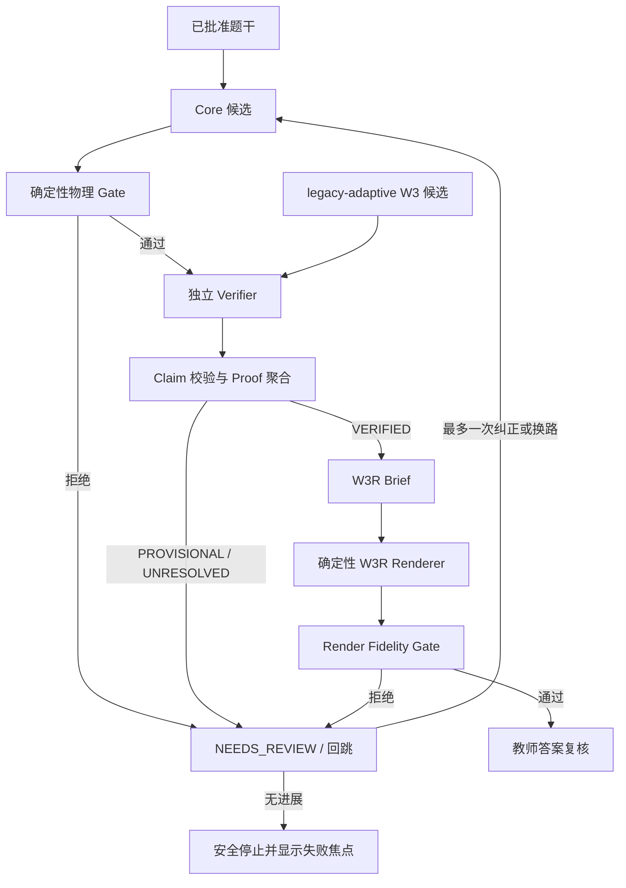

# Core–W3/W3R 复杂题质量恢复原子 Work-Tree

> **状态：部分完成（G1 灰度仍为后续批准项）**
> 核心代码已实现：`teacher-console/w3r_contract.py`、`teacher-console/w3_rendering.py`。G1 灰度部署待批准。

> 状态：已执行（A0.1/A0.2/A1.2/A2.1/A3.1 完成；A1.1/A1.3/A1.4/G1 与 A5.x 灰度仍为后续批准项）
> 日期：2026-08-03
> 版本：v1
> 目标：修复复杂题在 `core-first` 路由下答案过简、物理一致性未独立验证、W3R 未参与最终教学表达的问题，并建立可测试、可灰度、可回滚的生产路径。

## 0. 执行边界

本文档只定义后续修复、测试和完善任务，不在本轮修改生产代码、正式题库、答案批准状态或发布产物。

执行时必须遵守以下边界：

- 正式学生题库、`output/` 与 `student-site/` 不得承载测试产物。
- 对真实问题的重跑只能使用只读输入和隔离临时题库；未经教师确认不得提升候选。
- W3R 是非求解渲染器，只能消费 `VERIFIED` Proof Package，不能补造物理结论。
- Agent 不得调用 `approve-*`、`finish` 或发布动作。
- provider 参数与文件隔离继续由 `agent_gateway.py` 管理，不把运行时参数重新散落到 `server.py`。
- 本执行树不重复已经完成的 provider 超时、资格、期限、进度与 canary 修复。

## 1. Scout 侦查结论

### 1.1 已确认事实

| 编号 | 事实 | 证据/含义 |
|---|---|---|
| F1 | 最近一次成功任务走 `core-first → core` | 阶段只有结构化生成、Core gate、确定性教学渲染、忠实性 gate、教师复核待办 |
| F2 | 该任务 `independent_verification=false` | 未进入独立物理验证、证明聚合或 W3/W3R |
| F3 | 6 个目标合计 completion tokens 约 1360 | 答案简短不是前端丢失，而是候选与确定性模板本身较短 |
| F4 | `server.py` 的 `core-first` 分支提前返回 | 旧 W3 分支不会被自动执行 |
| F5 | Core 渲染器主要拼接 `final_answer`、`key_relations` 与通用教学提示 | 它能保证结构，但不会自动补出经过证明的丰富讲解 |
| F6 | 当前样例暴露两类物理一致性风险 | 包括推导形式与最终公式不一致、符号/方向条件被无依据改写 |
| F7 | 活动 W3R 配置与代码契约不一致 | policy version 和 evidence fields 不匹配，规范化后应 fail-closed 到 `off` |
| F8 | W3R 工程能力已有单测，但生产默认证据未满足 | 教师盲审与 fresh holdout 仍不足，不能直接切为默认 |
| F9 | Scout 扫描到 300 个源码文件、135 个测试文件、17 个 E2E 文件 | 本轮未运行项目测试；测试数量不等于当前链路已有覆盖 |
| F10 | 工作树已有用户修改与未跟踪文件 | 后续实现必须限定文件范围，不覆盖无关改动 |

### 1.2 推断

- I1：答案“过于简单”是当前 `core-first` 设计的可预期结果，不是 W3R 渲染失败后的偶发现象。
- I2：直接把 Core 文本接入 W3R 很可能违反 W3R 的 `VERIFIED` 输入契约；先做契约上限测试比直接编码更划算。
- I3：确定性 gate 能抓维度、符号、条件和内部一致性的一部分问题，但不能替代独立求解/验证者。
- I4：真正的修复目标不是“出现 W3R 标记”，而是“先得到可审计的验证证明，再忠实渲染”。

### 1.3 尚未知

- U1：旧 `legacy-adaptive` W3 路径在当前代码与同一复杂题上是否仍能稳定生成 `VERIFIED` Proof Package。
- U2：Core 候选能否在不重新求解、不发明 claim 的前提下投影为合法证明包。
- U3：`Core + 独立 verifier + proof bridge` 与 `W3 + W3R` 哪条路线在质量、时延、成本上更优。
- U4：新增物理 gate 对普通题的误拒绝率是否可接受。

## 2. Scout 决策卡

### DC-1：验证 Core → W3R 的契约上限

- 类型：质量去风险
- 预计耗时：20 分钟
- 影响：5/5；置信度：0.90
- 失败概率：20%；学习价值：4.83/小时
- 决策：首先执行；只允许一次最小 preflight，不进入生产实现。
- 成功条件：Core 现有产物可无损映射全部必需 claim、证书和证据字段，且无新增语义。
- 失败动作：禁止直接 Core → W3R，转入独立 verifier/proof bridge 或 W3 路线。

### DC-2：把当前物理矛盾固化为回归夹具

- 类型：质量去风险
- 预计耗时：25 分钟
- 影响：5/5；置信度：0.90
- 失败概率：40%；学习价值：2.20/小时
- 决策：与 DC-1 同一波执行。
- 成功条件：至少覆盖“推导形态与答案公式不一致”和“方向条件无依据改写”两类错误，并在提升前 fail-closed。

### DC-3：隔离运行 legacy W3 shadow

- 类型：质量去风险
- 预计耗时：45 分钟
- 影响：5/5；置信度：0.85
- 失败概率：40%；学习价值：1.22/小时
- 决策：在临时题库和候选区运行，不改 canonical 产物。
- 成功条件：得到完整路由、验证、证明聚合和 W3R readiness 报告，可与 Core 路线同题对照。

### DC-4：修正 W3R 配置真源但保持 `off`/`shadow`

- 类型：流程修复
- 预计耗时：35 分钟
- 影响：4/5；置信度：0.95
- 决策：完成配置迁移与校验，但不得绕过 rollout 证据直接设为默认。

### DC-5：实现胜出路线并补齐教师端与 E2E

- 类型：功能实现
- 预计耗时：240 分钟
- 影响：5/5；置信度：0.75
- 决策：仅在架构决策门 G1 之后开始，避免同时维护两条未验证的新路径。

## 3. 稳定目标与非目标

### 3.1 稳定目标

- T1：让已知物理矛盾在答案提升前被可靠拦截。
- T2：用同题、同模型、同评价口径确定复杂题的生产路线。
- T3：确保 W3R 前存在独立验证、claim 账本和证明聚合。
- T4：使 W3R 配置与代码契约一致，并按证据从 `off → shadow → gray → default` 推进。
- T5：教师端能看到实际路由、验证状态、失败焦点和 W3R 状态。
- T6：新增路径具备单测、集成测试、隔离 E2E、盲审与回滚演练。

### 3.2 非目标

- 不让 W3R 承担求解或纠错职责。
- 不以增加篇幅作为质量验收标准。
- 不在本执行树重构全部 W3 代码或统一所有历史报告格式。
- 不因某个 provider 名称而放宽 `analysis.generate` 无工具结构化输出契约。
- 不自动批准答案、仿真或公开发布。

## 4. 目标过程与状态模型



关键不变量：

1. `VERIFIED` 之前不得进入 W3R 正式渲染。
2. W3R 输出不得包含证明包之外的新物理 claim。
3. 路由切换不会继承旧路线的“通过”状态。
4. 教师审批只针对当前 canonical 摘要，题干、答案或证明包变化即失效。
5. `PROVISIONAL` 和 `UNRESOLVED` 不能伪装成“已生成完整解析”。

## 5. 原子任务 DAG

依赖记法：`A → B` 表示 B 只能在 A 完成后开始；`[G1: 条件]` 表示决策分支。

### Wave 0：证据与契约冻结

#### A0.1 建立匿名化物理失败回归夹具

- 输入：当前失败样例的结构性错误、现有 Core contract。
- 操作：构造不含真实学生私有信息的最小合成夹具，分别表达：
  - 中间推导为对数型，最终答案却变成倒数差；
  - 计算结果为负，却在无题设条件时改取绝对值。
- 输出：`CorePhysicsFailureFixture.v1`。
- 验证：夹具能被现有路径接受但被预期的新 gate 拒绝。
- 失败回跳：若不能最小复现，回到原任务审计记录提取 claim 级差异，不复制完整真实题目。
- 修改范围：仅测试夹具目录。

#### A0.2 定义 `PhysicsQualityGate.v1`

- 输入：A0.1、现有 `claim_validation` 与 proof contract。
- 操作：定义最低限度验证义务：量纲、符号、适用条件、推导/结论内部一致性、变量定义完整性。
- 输出：schema、状态枚举、reason codes、示例。
- 验证：每个 reason code 都有正反例；明确“确定性检查不等于完整物理正确性”。
- 失败回跳：无法确定性判断的规则降级为 verifier obligation，不写成硬 gate。

#### A0.3 冻结路线对照协议

- 输入：Core、legacy W3、W3R 现有入口。
- 操作：统一问题输入、模型档位、超时、知识证据、评分口径和数据保存位置。
- 输出：`RouteComparisonProtocol.v1`。
- 验证：三条候选路线的差异只来自路线本身；输出均落入临时目录。
- 外部依赖：如需付费/远程 provider，先取得维护者批准。

### Wave 1：最高学习价值去风险

#### A1.1 Core → W3R 契约上限测试

- 依赖：A0.2。
- 操作：尝试仅从当前 Core 结构化产物构造 W3R Brief 所需的 proof/claim 引用。
- 预算：一次、20 分钟；不得修改生产路由。
- 输出：`CoreToW3RPreflightReport.v1`，逐字段标记 `present / derivable / missing / would-invent`。
- 通过：所有必需字段均为 `present` 或无语义新增的 `derivable`。
- 拒绝：任一必需字段为 `missing` 或 `would-invent`。
- 终止规则：拒绝即关闭“直接 Core → W3R”分支，不继续美化适配器。

#### A1.2 物理盲区回归测试

- 依赖：A0.1、A0.2。
- 操作：先写失败测试，再实现最小 deterministic checks。
- 输出：两类缺陷的单元测试与结构化 reason codes。
- 验证：错误样例 fail-closed；相邻正确样例不被拒绝。
- 回跳：误拒绝则收窄规则，将语义判断移交独立 verifier。

#### A1.3 legacy W3 隔离 shadow

- 依赖：A0.3。
- 操作：在临时题库对同题运行 `legacy-adaptive`，保留阶段事件、claim ledger、验证与 proof 聚合报告。
- 输出：`LegacyW3ShadowReport.v1`。
- 验证：不写正式条目；报告能说明是否到达 `VERIFIED`、失败阶段和耗时/用量。
- 终止规则：同一失败最多一次受控纠正；无新证据即停止。

#### A1.4 三路线质量/成本对照

- 依赖：A1.1、A1.2、A1.3。
- 路线：
  1. Core-only 基线；
  2. Core + verifier/proof bridge 原型；
  3. legacy W3 + W3R shadow。
- 输出：`RouteComparisonReport.v1`。
- 指标：物理正确性、claim 可追溯性、教学完整性、渲染忠实性、时延、token/成本、失败可诊断性。
- 验证：评价者看不到路线名称；结论包含原始证据而非只给总分。

#### G1 架构决策门

- 依赖：A1.4。
- 责任人：维护者 + 教师代表。
- 决策规则：
  - 只有 A1.1 全部通过，才允许考虑直接 Core → W3R；否则永久关闭该方案。
  - 若 `Core + verifier/proof bridge` 达到质量阈值且时延/成本优于 W3，选择分支 B。
  - 否则若 legacy W3 达到质量阈值，选择分支 C，将其用于复杂题。
  - 两者均未达标时，不自动深度生成；保留 Core 草稿并提供显式“深度解析”入口，状态为 `NEEDS_REVIEW`。
- 输出：一页架构决策记录，包含选择、反证、回滚目标和重新评估条件。

### Wave 2：实现唯一胜出路线

#### A2.B1 Core proof projection（条件分支 B）

- 条件：G1 选择 Core + verifier/proof bridge。
- 操作：复用 `claim_ledger.py`、`claim_validation.py`、`proof_aggregation.py`，把 Core 候选投影为待验证 claims。
- 禁止：复制一套平行 claim schema；把 Core 自述当作独立证据。
- 输出：`CoreCandidate → ClaimLedger` 适配层。
- 验证：缺失证据时只能得到 `PROVISIONAL/UNRESOLVED`。

#### A2.B2 Core 独立 verifier（条件分支 B）

- 依赖：A2.B1。
- 操作：使用与主解身份隔离的验证调用，输出证书、反例或 unresolved obligations。
- 验证：运行记录能证明 solver/verifier 身份分离；验证失败不会进入 W3R。

#### A2.C1 恢复复杂题 W3 路由（条件分支 C）

- 条件：G1 选择 legacy W3。
- 操作：只对满足复杂度/风险条件的任务进入 W3，简单题保留 Core。
- 输出：版本化路由规则和结构化 route reason。
- 验证：同一任务可重放出相同路由决定；不得由前端文本猜测路线。

#### A2.C2 收口 W3 失败与回跳（条件分支 C）

- 依赖：A2.C1。
- 操作：对 verifier 拒绝、proof unresolved 和超时分别定义一次纠正、换路或停止。
- 验证：无无限重试；每次回跳携带新的失败焦点。

#### A2.1 修正 W3R 配置真源

- 可与选中分支并行。
- 操作：迁移到代码要求的 policy version 与完整 evidence fields；增加 schema 校验。
- 初始模式：`off` 或 `shadow`，不得直接 `default`。
- 输出：有效配置、迁移测试、无效配置 fail-closed 测试。

#### A2.2 VERIFIED Proof → W3R 接线

- 依赖：A2.B2 或 A2.C2，以及 A2.1。
- 操作：只从聚合器的 `VERIFIED` Proof Package 生成 W3R Brief，再由确定性 renderer 渲染。
- 验证：删除/篡改任一 claim 引用，render fidelity gate 必须拒绝。

### Wave 3：正确性门禁与可观测性

#### A3.1 统一物理 gate 执行顺序

- 顺序：结构校验 → deterministic physics checks → independent verifier → proof aggregation → W3R fidelity。
- 验证：阶段事件与最终状态一一对应，不出现“某阶段未运行但总体成功”。

#### A3.2 证明状态闭包

- 状态：`VERIFIED / PROVISIONAL / UNRESOLVED / REJECTED`。
- 验证：每个非 VERIFIED 状态都有 reason、owner、next action；只有 VERIFIED 能进入 W3R。

#### A3.3 教师复核焦点

- 输出：`TeacherReviewFocus.v1`，优先显示符号、适用条件、关键等式、未决 claim 和路线信息。
- 验证：教师能从 UI 判断“未运行”“运行失败”“验证通过”“仅完成渲染”的差别。

#### A3.4 任务详情阶段可视化

- 显示：`Core-only`、`Core + Verifier` 或 `W3 + W3R`；每阶段时间、状态与失败原因。
- 禁止：把“W3R rendered”呈现为“物理正确”。

### Wave 4：测试矩阵

#### A4.1 单元测试

- Core 候选到 claim ledger 的映射。
- 量纲、符号、条件、推导/结论一致性。
- verifier 身份分离与输出 schema。
- proof 聚合四状态。
- W3R policy 配置正常/异常规范化。
- W3R claim 引用与 fidelity 拒绝。

#### A4.2 路由集成测试

- 简单题仍走 Core。
- 复杂题走 G1 选中的深度路线。
- verifier 拒绝时不生成 W3R canonical 答案。
- W3R `off/shadow` 不改变正式答案字节。
- 超时、provider 不可用与 schema 错误均显示真实失败阶段。

#### A4.3 隔离 E2E

新增建议场景：

- `analysis-core-proof-w3r`
- `analysis-core-proof-rejected`
- `analysis-legacy-w3-w3r`（若选择分支 C）
- `analysis-render-route-visible`
- `analysis-w3r-shadow-no-promotion`

所有场景必须使用临时知识库、临时输出目录和 fake adapter；真实 provider shadow 单独执行，不录入正式 E2E 产物。

#### A4.4 同题盲评

- 维度：物理正确、主线最短、条件完整、教学可读、无新 claim、教师修改量。
- 评价：隐藏路线名称与模型名称。
- 通过：胜出路线不低于已批准基线，且当前两类物理矛盾均为零容忍。

### Wave 5：灰度与回滚

#### A5.1 Shadow 观测

- 正式答案仍来自当前批准路径；新路径只产候选和评价报告。
- 记录：路由分布、VERIFIED 比例、拒绝原因、时延、用量、教师修改量。

#### A5.2 Gray 门禁

- 前置：至少 2 份教师盲审通过；配置证据字段完整；回滚演练成功。
- 范围：版本化小流量或维护者显式选择，不按模糊时间窗口放量。

#### A5.3 Default 门禁

- 前置：满足现有 W3R rollout policy 的 fresh holdout 要求（至少 5/12）及全部 schema/质量阈值。
- 责任人：维护者明确批准。
- 禁止：仅因工程测试全绿自动切默认。

#### A5.4 回滚演练

- 触发：质量回归、VERIFIED 比例异常、教师修改量上升、时延/成本超限或错误提升。
- 动作：配置切回上一版本；保留审计记录；不得覆盖已批准答案。
- 验证：无需改代码即可停止新路线，且在途任务安全结束。

## 6. 状态传递契约

| 契约 | 生产者 | 消费者 | 必需字段 |
|---|---|---|---|
| `CoreCandidate.v1` | Core generator | physics gate / claim projector | problem digest、relations、steps、final answer、assumptions |
| `PhysicsGateReport.v1` | deterministic gate | verifier / UI | status、reason codes、checked obligations、candidate digest |
| `ClaimLedger.v1` | projector/W3 | verifier/aggregator | claim id、text、dependencies、evidence refs、status |
| `VerifiedProofPackage` | proof aggregator | W3R contract | canonical digest、VERIFIED claims、certificates、unresolved=[] |
| `W3RBrief` | W3R contract | renderer | proof refs、section plan、teaching emphasis、no-new-claim guard |
| `RendererDecision` | fidelity gate | promotion/UI | accepted、claim coverage、violations、output digest |
| `TeacherReviewFocus.v1` | orchestration | teacher UI | route、stage states、risk focus、unresolved items |
| `RouteComparisonReport.v1` | shadow evaluator | G1 | blinded scores、latency、usage、failures、artifacts |

所有跨阶段对象必须带 schema version、entry/job id、input digest、producer identity 与时间戳；摘要不一致时 fail-closed。

## 7. 验证义务台账

| 目标 | 验证义务 | 自动证据 | 人工证据 |
|---|---|---|---|
| T1 | 已知矛盾不可提升 | A1.2、A4.1、A4.2 | 夹具审阅 |
| T2 | 路线选择有可比证据 | A1.4 报告 | G1 决策记录 |
| T3 | W3R 前确有独立验证 | verifier identity、proof state、阶段事件 | 抽查 claim/certificate |
| T4 | 配置有效且不越权放量 | schema/normalization tests | rollout 批准 |
| T5 | 教师能辨别阶段与风险 | UI/E2E 截图、API payload | 教师可用性检查 |
| T6 | 可停止、可回滚 | rollback test、无 canonical overwrite | 维护者演练签字 |

## 8. 反馈回路与终止规则

- 同一候选的 verifier 纠正最多 1 轮。
- 同一路线连续两次失败且没有新增 reason/evidence，触发 no-progress fuse。
- 发生 schema、摘要或身份分离失败时不得自动重试提升；直接进入 `NEEDS_REVIEW`。
- 发生 provider timeout 时沿用既有 provider reliability 策略，不在本执行树增加新的无限重试。
- W3R fidelity 失败只允许重新渲染，不得反向修改 proof claim。
- 若两条深度路线均未通过盲评，终止自动默认化，保留显式人工触发入口。

## 9. 预计影响文件

最终范围由 G1 决定；不得在决策前同时改造全部文件。

- 编排与路由：
  - `teacher-console/server.py`
  - `teacher-console/analysis_routing.py`
  - `teacher-console/core_analysis.py`
  - `teacher-console/w3_pipeline.py`
- 证明与渲染：
  - `teacher-console/claim_ledger.py`
  - `teacher-console/claim_validation.py`
  - `teacher-console/proof_aggregation.py`
  - `teacher-console/w3r_contract.py`
  - `teacher-console/w3_rendering.py`
- 教师端：
  - `teacher-console/static/app.js`
  - 相关 HTML/CSS（仅在阶段展示确需时修改）
- 配置：
  - `student-error-library/config/w3r-production-routing.json`
  - 复杂度/分析路由配置真源
- 测试：
  - `teacher-console/tests/test_core_analysis.py`
  - `teacher-console/tests/test_claim_validation.py`
  - `teacher-console/tests/test_proof_aggregation.py`
  - `teacher-console/tests/test_w3r_contract.py`
  - `teacher-console/tests/test_w3_rendering.py`
  - `teacher-console/tests/test_analysis_routing.py`
  - `teacher-console/tests/test_analysis_routing_server.py`
  - `teacher-console/e2e/` 下新增隔离场景
- 文档：
  - `docs/architecture.md`
  - `docs/w3-reasoning-pipeline.md`
  - `docs/agent-gateway.md`
  - `docs/CHANGES.md`

## 10. 建议验证命令

按所选分支裁剪测试集合；以下为候选，不表示本轮已执行：

```bash
python3 -B -m unittest \
  teacher-console/tests/test_core_analysis.py \
  teacher-console/tests/test_claim_validation.py \
  teacher-console/tests/test_proof_aggregation.py \
  teacher-console/tests/test_w3r_contract.py \
  teacher-console/tests/test_w3_rendering.py \
  teacher-console/tests/test_analysis_routing.py \
  teacher-console/tests/test_analysis_routing_server.py
```

```bash
/Users/qingyuan/miniconda3/bin/python3 -B \
  teacher-console/scripts/run_tests.py \
  --python /Users/qingyuan/miniconda3/bin/python3 \
  --strict
```

```bash
git diff --check
graphify update .
```

`graphify update .` 只在代码/架构内容实际修改后运行。

## 11. 完成定义

只有同时满足以下条件，才能将本执行树标记完成：

- 当前两类物理矛盾已形成稳定回归测试，并在 canonical 提升前被拒绝。
- 复杂题生产路线由 G1 的对照证据确定，不存在未使用却并行维护的新架构。
- 生产记录明确包含 deterministic gate、独立 verifier、proof aggregation 和最终 proof 状态。
- W3R 只消费 `VERIFIED` Proof Package，且 fidelity gate 能拒绝新增/篡改 claim。
- 学生版具备 W3R 契约要求的教学结构，但没有因“丰富表达”引入新结论。
- 教师端能看到真实路线、未运行阶段、失败阶段和复核焦点。
- 单元、集成、隔离 E2E 与同题盲评通过；测试产物未进入正式目录。
- W3R 配置与 schema 一致；未满足 rollout 证据前保持 `off/shadow`。
- gray/default 都有维护者批准、版本化范围与已演练回滚路径。
- 相关架构、运行手册与变更记录同步，graphify 在代码修改后已更新。

## 12. 推荐最小执行顺序

```text
A0.1 + A0.2 + A0.3
  → A1.1 + A1.2 + A1.3
  → A1.4
  → G1
  → 仅执行 A2.B* 或 A2.C*
  → A2.1 + A2.2
  → A3.*
  → A4.*
  → A5.1 shadow
  → A5.2 gray
  → A5.3 default（证据满足后）
```

最先开始的三个任务是 A0.1、A1.1、A1.2：它们能以最小成本回答“当前问题是渲染不够，还是上游证明根本不存在”，并防止团队先花数小时接线，最后才发现 W3R 没有合法输入。
