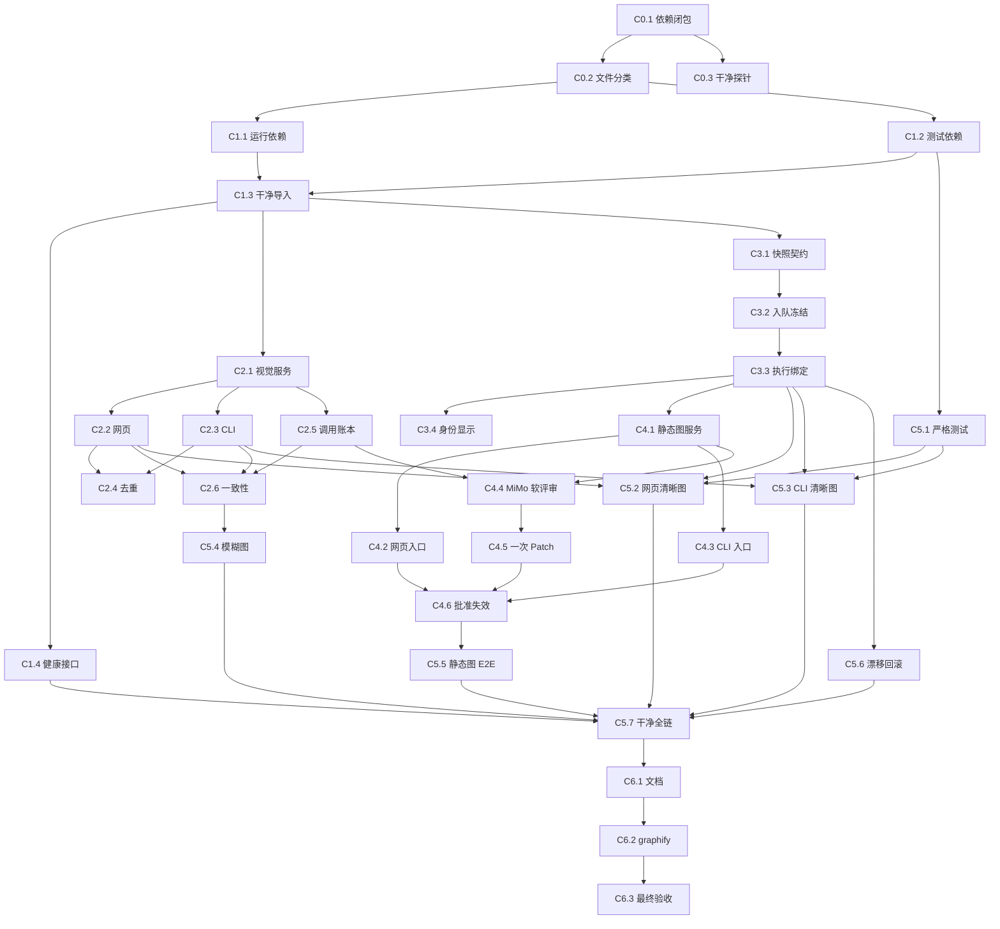

# MiMo–DeepSeek 一致性修复收口版原子 Work-Tree

> 状态：已验收（C0-C5.7 与 C6.1-C6.3 完成：干净克隆全链 18/18、70/70 单测、5 条收口 E2E 全通过；visualization E2E 为预存 W3 流 token 计数漂移，作为已知排除项单独报告；最终验收见 docs/reports/mimo-deepseek-consistency-closure-acceptance-v1.md，待维护者签署）
> 类型：工程 + 流程治理 + 可复现验收
> 基线提交：`026b104`
> 计划版本：`wuli-mimo-deepseek-consistency-closure-v1`
> 上游计划：`docs/mimo-deepseek-web-cli-consistency-repair-work-tree.md`

## 1. 目的与适用范围

本计划只处理上一版 Work-Tree 自检后仍未关闭的依赖锥，不重做已经通过的运行身份、
trait 路由和生产同形视觉探针。最终目标是让 MiMo–DeepSeek 协作在干净克隆、网页、
CLI 和隔离 E2E 中表现一致，并让静态图协作成为真正可达、可观测、可失败关闭的可选流程。

当前已验证事实：

- `mimo-v2.5-flash` 使用无隐私合成图片的真实视觉请求已经通过；
- `core-first` 默认解析路径保持一次核心求解；
- 运行身份、trait fail-closed 和视觉请求契约已有单元测试；
- 隔离 lifecycle E2E 可以到达 `delivered`；
- 当前提交不是自包含提交，教师端依赖若干未跟踪模块；
- `source.clean` 仍可能重复上传原图；
- `route_snapshot`、静态图网页/CLI 动作、MiMo 图后软评审和五条收口 E2E 尚未形成完整证据。

排除范围：

- 不改变 W3/Claim Evidence 的求解策略；
- 不修改交互仿真 Skill 的职责；
- 不让 MiMo 修改物理真源、SVG 或批准状态；
- 不把 provider 参数、API Key 或 endpoint 放回 `server.py`、UI 或生命周期 Skill；
- 不整理与本收口依赖锥无关的研究报告和实验产物；
- 不使用正式学生题图、正式知识库或公开站运行 E2E。

## 2. 真值、冻结决策与最终批准

权威顺序：

1. 干净克隆中的已跟踪文件与可执行测试；
2. `record.json`、`pipeline.json` 和条目 canonical 工件；
3. `student-error-library/config/model-registry.json` 与生产路由配置；
4. Agent Gateway 的候选、运行身份与安全提升结果；
5. 网页/CLI 对称 E2E 报告；
6. 文档和 UI 文案。

冻结决策：

- 干净克隆可启动是所有功能验收的前置门，不允许用工作区未跟踪文件补齐运行依赖；
- 原图默认只进入一次 `visual.extract`，生成指纹绑定的 `visual-facts.json`；
- `source.clean` 和 `analysis.generate` 只消费当前视觉事实，不再次上传原图；
- 缺失或过期视觉事实时回到显式视觉提取/人工题干复核，不在 Gateway 内隐式补调用；
- `core-first` 继续保持一次求解调用；作业执行必须绑定入队时的路由快照；
- 静态图与交互仿真均为答案后的独立可选流程；
- 静态图先由 DeepSeek 生成强类型 scene、本地渲染，再由 MiMo 做一次非阻断软评审；
- 只有存在可操作建议时，DeepSeek 才能提交最多一次受限 Patch；
- 任何模型都不能批准题干、答案、静态图、仿真、交付或公开发布；
- 最终完成由维护者结合自动证据和实际网页复核批准。

## 3. 收口目标

| ID | 目标 | 成功标准 | 优先级 | 批准者 |
|---|---|---|---|---|
| C-T1 | 提交自包含 | `git archive HEAD` 解包后可导入教师端、运行固定测试和启动健康接口 | P0 | 维护者 |
| C-T2 | 视觉入口同源 | 网页与 CLI 调用同一个应用编排服务并产出同形状态、工件和错误分类 | P0 | 集成测试 |
| C-T3 | 原图调用唯一 | 同一 source fingerprint 默认只有一次 MiMo `visual.extract` 请求 | P0 | 调用账本测试 |
| C-T4 | 调用可审计 | MiMo/DeepSeek 记录实际身份、契约、耗时、usage、输入/输出指纹和失败分类 | P1 | 系统测试 |
| C-T5 | 路由不可漂移 | 作业入队与执行使用同一 `RouteSnapshot.v1`，漂移时失败关闭 | P0 | 集成测试 |
| C-T6 | 静态图入口可达 | 网页和 CLI 显式动作调用同一静态图应用服务 | P0 | 教师验收 |
| C-T7 | MiMo 图后复核真实 | 安全截图触发一次 MiMo 软评审，结果不能修改物理真源或批准状态 | P1 | 契约测试 |
| C-T8 | Patch 严格有界 | DeepSeek 最多 Patch 一次，immutable 不变，Patch 后重跑全部硬门 | P1 | 集成测试 |
| C-T9 | E2E 对称且失败关闭 | 清晰图、模糊图、静态图、漂移和回滚场景均有隔离报告 | P0 | E2E |
| C-T10 | 测试不假绿 | 必需测试缺失或跳过时验收入口失败，已知排除项单独报告 | P0 | CI/维护者 |
| C-T11 | 文档行为一致 | Work-Tree、架构、API、runbook、Skill 和 UI 只描述实际可达行为 | P1 | 文档审计 |

## 4. 目标状态模型

```text
clean-checkout-ready
→ uploaded
→ deterministic-ingest-and-ocr
→ visual-extract-requested
  ├─ MiMo passed → current-visual-facts → needs-source-review
  ├─ uncertainty → needs-source-review
  └─ provider/privacy/protocol failure → needs-source-review + durable-failure
→ teacher-source-approved
→ source-clean-from-text-and-current-facts
→ route-snapshot-frozen
→ DeepSeek-core-once
→ core-gate-passed
→ answer-rendered
→ teacher-answer-approved
→ [teacher explicitly requests static diagram]
  → DeepSeek-scene
  → deterministic-SVG-and-hard-gates
  → MiMo-soft-review-on-safe-raster
  → [at most one DeepSeek bounded patch]
  → hard-gates-rerun
  → needs-answer-review
→ [optional interactive visualization]
→ finish
```

不可破坏的不变量：

- 未跟踪文件不能成为运行或测试依赖；
- 原图不得进入答案、静态图 scene 或仿真 provider；
- `visual-facts.json` 必须绑定原图摘要和实际 MiMo 身份；
- `source.clean` 不拥有视觉网络调用；
- `RouteSnapshot.v1` 创建后不可被回调内重新解析覆盖；
- MiMo 软评审只有建议权；
- 静态图失败不回滚已经通过硬门的答案；
- 静态图或答案修改后旧答案批准失效；
- 测试产物只能进入临时目录。

## 5. 原子任务 DAG

每个任务只有一个主动作、一个主要输出和一个验证入口。默认最大尝试 2 次；第二次必须
改变代码版本、夹具、诊断或配置指纹。相同错误指纹重复出现时触发 no-progress fuse。

### Wave 0：冻结可执行基线

#### C0.1 提取运行依赖闭包

- 动词：提取
- 输入：`server.py`、薄 CLI、固定测试入口及其 import 图
- 输出：`docs/reports/mimo-deepseek-closure-dependency-baseline-v1.json`
- 依赖：无
- 验证：列出每个运行依赖的 Git 状态、引用方、是否属于本收口依赖锥；不读取密钥
- 尝试/终态：1；`completed | incomplete-import-graph`
- 影响目标：C-T1、C-T10

#### C0.2 分类未跟踪文件

- 动词：分类
- 输入：C0.1 与 `git status --short`
- 输出：基线报告中的 `required_runtime`、`required_tests`、`unrelated_work`
- 依赖：C0.1
- 验证：每个被纳入文件必须至少有一个已跟踪引用或收口任务；无依据文件不得顺带提交
- 尝试/终态：1；`completed | ownership-unclear`
- 影响目标：C-T1

#### C0.3 构造干净克隆探针

- 动词：构造
- 输入：当前 HEAD
- 输出：可重复的 archive/临时克隆 smoke 脚本与基线报告
- 依赖：C0.1
- 验证：只写临时目录；报告必须如实记录 import、health、固定测试缺失项
- 尝试/终态：2；`completed | probe-failed`
- 影响目标：C-T1、C-T10

### Wave 1：关闭提交与测试依赖

#### C1.1 归位运行依赖

- 动词：归位
- 输入：C0.2 `required_runtime`
- 输出：自包含的已跟踪运行模块集合
- 依赖：C0.2
- 允许修改：已确认的运行模块、必要 schema；不得加入无关报告
- 验证：`git cat-file -e HEAD:<path>` 或候选提交树中每个依赖均存在
- 尝试/终态：2；`completed | dependency-scope-rejected`
- 影响目标：C-T1

#### C1.2 归位测试依赖

- 动词：归位
- 输入：C0.2 `required_tests`
- 输出：固定测试清单引用的全部测试和夹具
- 依赖：C0.2
- 允许修改：测试、无隐私夹具、测试运行脚本
- 验证：固定测试清单不存在 missing target，测试依赖不引用工作区外文件
- 尝试/终态：2；`completed | test-scope-rejected`
- 影响目标：C-T1、C-T10

#### C1.3 验证干净导入

- 动词：验证
- 输入：C1.1、C1.2 的候选树
- 输出：clean-checkout import 报告
- 依赖：C1.1、C1.2
- 验证：导入 `server`、`agent_gateway`、`entry_visual_extract` 成功；无正式数据写入
- 尝试/终态：2；`passed | clean-import-failed`
- 影响目标：C-T1

#### C1.4 验证干净健康接口

- 动词：验证
- 输入：C1.3 的临时树
- 输出：clean-checkout health smoke 报告
- 依赖：C1.3
- 验证：临时库启动、`GET /api/health` 返回 200、运行身份字段完整、服务可正常关闭
- 尝试/终态：2；`passed | clean-health-failed`
- 影响目标：C-T1

### Wave 2：统一 visual.extract 并去重原图调用

#### C2.1 提取视觉应用服务

- 动词：提取
- 输入：网页上传和 `entry_visual_extract.py` 的现有编排
- 输出：单一 `run_visual_extract()` 与 `VisualExtractOutcome.v1`
- 依赖：C1.3
- 允许修改：`teacher-console` 应用服务模块、契约测试
- 验证：服务统一完成 route、privacy、extract、stage、trace；Gateway 仍拥有 provider 执行
- 尝试/终态：2；`completed | interface-test-failed`
- 影响目标：C-T2、C-T4

#### C2.2 接入网页视觉入口

- 动词：接入
- 输入：C2.1
- 输出：网页上传后的统一视觉结果
- 依赖：C2.1
- 允许修改：`server.py`、HTTP 测试
- 验证：删除 `human/unavailable` 后再单独补视觉的双重编排语义；失败仍保留可人工复核条目
- 尝试/终态：2；`completed | web-contract-failed`
- 影响目标：C-T2、C-T4

#### C2.3 接入 CLI 视觉入口

- 动词：接入
- 输入：C2.1
- 输出：CLI 与网页同形的 `VisualExtractOutcome.v1`
- 依赖：C2.1
- 允许修改：薄 CLI、确定性生命周期回调、CLI 测试
- 验证：CLI 不重写 route、provider 请求或 staging schema；旧 adapter 仅作显式 override
- 尝试/终态：2；`completed | cli-contract-failed`
- 影响目标：C-T2、C-T4

#### C2.4 移除 source.clean 原图预处理

- 动词：移除
- 输入：当前 `source_clean_task()` 与 `_maybe_vision_preprocess()`
- 输出：仅消费题干文本和当前 `visual-facts.json` 的 source.clean 契约
- 依赖：C2.2、C2.3
- 允许修改：source.clean task、Gateway 兼容分支、对应测试
- 验证：source.clean task 不含 `vision_images`/`requires_vision`；同 fingerprint 调用账本只有一次 MiMo
- 尝试/终态：2；`completed | duplicate-call-detected`
- 影响目标：C-T3

#### C2.5 持久化视觉调用账本

- 动词：持久化
- 输入：C2.1 outcome
- 输出：私有 `visual-extract-request.json` 与紧凑 Candidate Archive 事件
- 依赖：C2.1
- 允许修改：调用账本、档案接口、脱敏测试
- 验证：包含 schema、模型/provider、契约、耗时、usage、输入/输出指纹和失败分类；不含 data URL、密钥和绝对临时路径
- 尝试/终态：2；`completed | redaction-failed`
- 影响目标：C-T4

#### C2.6 比较网页与 CLI 视觉工件

- 动词：比较
- 输入：C2.2、C2.3 的同一合成夹具结果
- 输出：`web_cli_visual_parity.v1`
- 依赖：C2.2、C2.3、C2.5
- 验证：只允许 ID、时间和临时路径不同；route、状态、schema、privacy 与教师门禁必须一致
- 尝试/终态：2；`passed | parity-failed`
- 影响目标：C-T2、C-T3、C-T4

### Wave 3：冻结作业路由

#### C3.1 定义路由快照契约

- 动词：定义
- 输入：模型注册表、生产路由和 job public schema
- 输出：`RouteSnapshot.v1` schema
- 依赖：C1.3
- 验证：包含 requested/resolved model、provider、task kind、tier、配置摘要和创建时间；不含密钥
- 尝试/终态：1；`completed | contract-rejected`
- 影响目标：C-T5

#### C3.2 冻结入队路由

- 动词：冻结
- 输入：C3.1 与提交时模型配置
- 输出：job 内不可变 route snapshot
- 依赖：C3.1
- 允许修改：`agent_jobs.py`、统一 queue helper、测试
- 验证：所有 Agent job 入队时都携带快照；显式模型错误在入队前失败
- 尝试/终态：2；`completed | queue-contract-failed`
- 影响目标：C-T5

#### C3.3 绑定执行路由

- 动词：绑定
- 输入：C3.2 snapshot
- 输出：Gateway 执行身份与 stale 判定
- 依赖：C3.2
- 允许修改：Gateway/回调应用层、集成测试
- 验证：回调不得重新解析成不同模型；配置变化返回 `route_snapshot_stale` 或使用冻结配置
- 尝试/终态：2；`completed | route-drift-detected`
- 影响目标：C-T5

#### C3.4 呈现阶段身份

- 动词：呈现
- 输入：requested、resolved 与实际 attempt identity
- 输出：队列/完成 UI 的一致模型说明
- 依赖：C3.3
- 允许修改：job public serializer、`app.js`、静态测试
- 验证：fallback、stale 和实际模型均可见；单 Core 作业只显示一次求解身份
- 尝试/终态：2；`completed | display-contract-failed`
- 影响目标：C-T4、C-T5、C-T11

### Wave 4：接通静态图协作

#### C4.1 定义静态图应用动作

- 动词：定义
- 输入：现有 `run_physics_diagram_gateway()`、答案状态和 visual facts
- 输出：共享 `build_diagram()` 应用服务与动作契约
- 依赖：C3.3
- 验证：只在题干已批准且答案存在时运行；无图不阻塞答案批准或 finish
- 尝试/终态：1；`completed | policy-rejected`
- 影响目标：C-T6

#### C4.2 接入网页静态图动作

- 动词：接入
- 输入：C4.1
- 输出：`POST /api/entries/<id>/build-diagram` 与解析复核页按钮
- 依赖：C4.1
- 允许修改：`server.py`、`app.js`、`index.html`、HTTP/静态测试
- 验证：按钮状态、轮询、失败提示、未保存答案保护和批准失效均可测试
- 尝试/终态：2；`completed | web-diagram-failed`
- 影响目标：C-T6、C-T11

#### C4.3 接入 CLI 静态图动作

- 动词：接入
- 输入：C4.1
- 输出：`teacher-console/scripts/entry_action.py build-diagram <entry-id>`
- 依赖：C4.1
- 允许修改：薄 CLI、共享应用服务、CLI 测试
- 验证：CLI 与网页调用同一应用服务/Gateway/validator；CLI 不实现 renderer
- 尝试/终态：2；`completed | cli-diagram-failed`
- 影响目标：C-T6

#### C4.4 实现 MiMo 静态图软评审

- 动词：实现
- 输入：安全 SVG 的无隐私 raster、scene 摘要、视觉 rubric
- 输出：`wuli.diagram-visual-review.v1`
- 依赖：C2.5、C4.1
- 允许修改：独立评审模块、schema、契约测试
- 验证：只允许可读性、遮挡、层次和辅助性建议；不能输出答案、修改 facts、批准质量或写 SVG
- 尝试/终态：2；`completed | review-unavailable | privacy-blocked`
- 影响目标：C-T7

#### C4.5 绑定一次受限 Patch

- 动词：绑定
- 输入：C4.4 建议、原 scene、硬门诊断
- 输出：最多一次 `wuli.physics-diagram-scene-patch.v1`
- 依赖：C4.4
- 允许修改：diagram orchestrator、Patch validator、测试
- 验证：immutable 不变；Patch 后重跑物理语义门、SVG 安全门和来源绑定；第二次请求被拒绝
- 尝试/终态：1 Patch；`completed | accepted-with-warnings | patch-failed`
- 影响目标：C-T8

#### C4.6 失效旧答案批准

- 动词：失效
- 输入：成功生成或修改的静态图摘要
- 输出：更新后的 answer review 状态
- 依赖：C4.2、C4.3、C4.5
- 允许修改：生命周期状态模块、审批测试
- 验证：静态图变更后回到 `needs-answer-review`；Agent 不得写批准者字段
- 尝试/终态：2；`completed | approval-invariant-failed`
- 影响目标：C-T6、C-T7、C-T8

### Wave 5：消除假绿并补齐隔离 E2E

#### C5.1 收紧固定测试入口

- 动词：收紧
- 输入：当前 acceptance list、skip 原因和已知 W3 排除项
- 输出：严格验收模式与独立排除项报告
- 依赖：C1.2
- 允许修改：`run_tests.py`、测试元数据、runbook
- 验证：必需文件缺失或必需测试 skipped 时返回非零；W3 排除项不混入 MiMo 收口通过数
- 尝试/终态：2；`completed | false-green-detected`
- 影响目标：C-T10

#### C5.2 验证网页清晰图

- 动词：验证
- 输入：清晰合成图、临时库、受控/真实视觉 adapter
- 输出：`web-clear-image-parity` 报告
- 依赖：C2.2、C3.3、C5.1
- 验证：MiMo trace → visual facts → source review → DeepSeek Core；无自动批准、无第二次原图调用
- 尝试/终态：2；`passed | upstream-unavailable | failed`
- 影响目标：C-T2、C-T3、C-T4、C-T5、C-T9

#### C5.3 验证 CLI 清晰图

- 动词：验证
- 输入：与 C5.2 相同夹具和配置
- 输出：`cli-clear-image-parity` 报告
- 依赖：C2.3、C3.3、C5.1
- 验证：关键工件、route、状态和失败分类与网页等价
- 尝试/终态：2；`passed | upstream-unavailable | failed`
- 影响目标：C-T2、C-T3、C-T4、C-T5、C-T9

#### C5.4 验证模糊图失败关闭

- 动词：验证
- 输入：模糊合成图
- 输出：`web-cli-blurred-image-fail-closed` 报告
- 依赖：C2.6、C5.1
- 验证：两边保留 uncertainty、停在 source review、不启动 Core、不批准题干
- 尝试/终态：2；`passed | unsafe-advance-detected`
- 影响目标：C-T2、C-T9

#### C5.5 验证静态图协作

- 动词：验证
- 输入：已批准测试题干、当前答案、visual facts
- 输出：`explicit-static-diagram-collaboration` 报告
- 依赖：C4.2、C4.3、C4.5、C4.6
- 验证：网页/CLI 显式请求 → DeepSeek scene → 本地 SVG → MiMo review → 至多一次 Patch → 等待教师复核
- 尝试/终态：2；`passed | accepted-with-warnings | failed`
- 影响目标：C-T6、C-T7、C-T8、C-T9

#### C5.6 演练漂移与回滚

- 动词：演练
- 输入：路由配置变化、MiMo 404、旧 adapter override、服务未重启
- 输出：`runtime-route-rollback` 报告
- 依赖：C3.3、C5.1
- 验证：stale 可见且不静默换模；失败不污染 canonical；旧 adapter 只能显式启用
- 尝试/终态：2；`passed | rollback-failed`
- 影响目标：C-T5、C-T9

#### C5.7 验证干净克隆全链

- 动词：验证
- 输入：候选提交树与 C5.2–C5.6
- 输出：`clean-checkout-final-acceptance-v1.json`
- 依赖：C1.4、C5.2、C5.3、C5.4、C5.5、C5.6
- 验证：archive 解包后固定单测、HTTP、lifecycle 与收口 E2E 全部可运行；正式目录零写入
- 尝试/终态：2；`passed | clean-checkout-failed`
- 影响目标：C-T1、C-T9、C-T10

### Wave 6：文档、图谱与最终批准

#### C6.1 同步行为文档

- 动词：同步
- 输入：C5.7 通过的实际行为
- 输出：一致的架构、API、Gateway、视觉接入、runbook、CHANGES、总控 Skill 与旧 Work-Tree 状态
- 依赖：C5.7
- 验证：不存在“选择 DeepSeek 会在每个阶段自动重跑 MiMo”“静态图已可显式请求但无入口”等错误描述
- 尝试/终态：2；`completed | documentation-drift`
- 影响目标：C-T11

#### C6.2 更新结构图谱

- 动词：更新
- 输入：通过测试的代码和文档
- 输出：更新后的 `graphify-out/graph.json` 与影响查询
- 依赖：C6.1
- 验证：无 provider 细节回流 `server.py`，无 renderer 回流 CLI/process_uploads，无新职责倒置
- 尝试/终态：2；`completed | architecture-drift`
- 影响目标：C-T11

#### C6.3 汇总最终验收

- 动词：汇总
- 输入：C-T1–C-T11 的已通过证据
- 输出：`docs/reports/mimo-deepseek-consistency-closure-acceptance-v1.md`
- 依赖：C5.7、C6.2
- 验证：只聚合通过工件；保留 warnings、外部服务状态和人工检查项；维护者签署最终批准
- 尝试/终态：1；`accepted | provisional | rejected`
- 影响目标：全部

## 6. DAG 与执行波



可并行执行：

- C0.2 与 C0.3 在 C0.1 后并行；
- C1.1 与 C1.2 并行；
- C2.2、C2.3、C2.5 并行；
- C4.2、C4.3、C4.4 并行；
- C5.2、C5.3、C5.4、C5.5、C5.6 在各自依赖满足后并行。

## 7. 状态传递契约

| ID | 工件 | 生产者 | 消费者 | 前置条件 | 失效条件 |
|---|---|---|---|---|---|
| I-C1 | `DependencyClosure.v1` | C0.1 | C0.2、C1.1、C1.2 | HEAD 与工作区已冻结 | import 或 Git 状态变化 |
| I-C2 | `CleanCheckoutProbe.v1` | C0.3 | C1.3、C1.4 | archive 摘要匹配 | 候选树变化 |
| I-C3 | `VisualExtractOutcome.v1` | C2.1 | 网页、CLI、source review | privacy/route 已确定 | 原图/OCR/模型配置变化 |
| I-C4 | `VisualCallLedger.v1` | C2.5 | 去重测试、UI、档案 | provider 尝试完成或阻断 | 输入/输出指纹变化 |
| I-C5 | `RouteSnapshot.v1` | C3.2 | Gateway callback、job UI | 入队时模型可解析 | snapshot 与任务输入不匹配 |
| I-C6 | `DiagramBuildRequest.v1` | C4.1 | 网页/CLI 静态图动作 | 题干已批准、答案存在 | 题干/答案/facts 变化 |
| I-C7 | `wuli.diagram-visual-review.v1` | C4.4 | bounded patch | 安全 raster 已生成 | SVG/scene/rubric/model 变化 |
| I-C8 | `wuli.physics-diagram-scene-patch.v1` | C4.5 | hard gates/renderer | 有可操作软建议 | 第二次 Patch 或 immutable 变化 |
| I-C9 | `ClosureE2EReport.v1` | C5.2–C5.7 | C6.1、C6.3 | 临时环境与夹具摘要匹配 | 代码/配置/夹具变化 |

所有跨任务工件必须携带 schema version 和输入 fingerprint；消费者不能凭文件存在推断有效。

## 8. 验证账本

| ID | 目标 | 检查 | 证据 | 通过规则 | 失败回跳 |
|---|---|---|---|---|---|
| V-C1 | C-T1、C-T10 | 提交自包含 | archive import/health/test 报告 | 无 missing import、无工作区外依赖 | C0.2/C1.1/C1.2 |
| V-C2 | C-T2 | 网页/CLI 同源 | parity report | 除时间/ID/临时路径外关键字段一致 | C2.1–C2.3 |
| V-C3 | C-T3 | 原图只调用一次 | 调用账本与 fingerprint | 默认恰好一次 MiMo visual.extract | C2.4 |
| V-C4 | C-T4 | 调用账本脱敏 | schema + 敏感扫描 | 无密钥、data URL、绝对临时路径 | C2.5 |
| V-C5 | C-T5 | 路由不漂移 | snapshot 与 actual attempts | requested/resolved/actual 满足契约 | C3.2/C3.3 |
| V-C6 | C-T5 | Core 调用有界 | adaptive routing + attempts | `core-first` 恰好一次求解 | C3.3 或 Core 路由 |
| V-C7 | C-T6 | 静态图非阻断 | 无图 lifecycle E2E | 答案可批准并交付 | C4.1 |
| V-C8 | C-T7 | MiMo 无批准权 | review schema/状态 diff | 不修改事实、答案、SVG、批准字段 | C4.4 |
| V-C9 | C-T8 | Patch 有界 | attempt count + immutable diff | 最多一次且全部硬门重跑 | C4.5 |
| V-C10 | C-T2、C-T9 | 模糊图失败关闭 | 双入口 E2E | 不启动 Core，不自动批准 | C2.1/C5.4 |
| V-C11 | C-T10 | 测试不假绿 | strict runner result | required skip/missing 为失败 | C5.1 |
| V-C12 | C-T9 | 正式目录无污染 | 路径审计 | 正式库、output、student-site 零测试写入 | 对应 E2E |
| V-C13 | C-T6、C-T11 | 文档可达性一致 | UI/API/doc 对照 | 每个公开动作均有实际入口和测试 | C6.1 |
| V-C14 | C-T11 | 架构边界稳定 | graphify query/impact | provider 仍归 Gateway，renderer 不进入 CLI | C6.2 |

## 9. 回跳、熔断与回滚

| 触发 | 最小回跳 | 保留 | 最大尝试 | 终态 |
|---|---|---|---:|---|
| clean checkout import 缺失 | C0.2/C1.1 | 依赖报告 | 2 | `clean-import-failed` |
| 固定测试引用未跟踪文件 | C1.2/C5.1 | 测试清单 | 2 | `false-green-detected` |
| 网页/CLI outcome 不同 | C2.1 + 差异入口 | 两侧报告 | 2 | `parity-failed` |
| 同 fingerprint 第二次上传原图 | C2.4 | 首次有效 facts | 1 | `duplicate-call-detected` |
| snapshot 与实际模型不同 | C3.2/C3.3 | snapshot、失败作业 | 2 | `route-drift-detected` |
| MiMo 软评审不可用 | C4.4 | 已通过硬门的原 SVG | 1 | `accepted-with-warnings` |
| Patch 越界/无进展/二次失败 | C4.5 | 原 scene、原 SVG、诊断 | 1 Patch | `patch-failed` |
| 模糊图继续启动 Core | C2.1/C5.4 | 失败夹具和 trace | 1 | `unsafe-advance-detected` |
| 文档再次描述不可达动作 | C6.1 | 已通过代码与测试事实 | 1 | `documentation-drift` |

全局最多两个修复 round。第二 round 后若错误指纹、诊断和输入版本均未变化，则停止依赖锥，
不得继续调用外部模型或扩大修改范围。

## 10. 文件影响边界

| 区域 | 允许影响 |
|---|---|
| 提交闭包 | 本收口运行依赖、测试依赖、无隐私夹具；不得顺带纳入无关研究产物 |
| 视觉编排 | 新应用服务、`server.py` 薄接入、`entry_visual_extract.py`、source review staging |
| 调用去重 | `source_clean_task`、Gateway 旧 vision preprocess 兼容分支、调用账本测试 |
| 路由快照 | `agent_jobs.py`、统一 queue helper、Gateway 回调、job serializer/UI |
| 静态图 | 共享应用服务、`server.py`、`physics_diagram.py`、软评审模块、网页、薄 CLI |
| E2E | `teacher-console/e2e/`、临时夹具与报告；不得写正式目录 |
| 文档 | 架构、API、Gateway、视觉接入、runbook、CHANGES、总控 Skill、两版 Work-Tree |

禁止事项：

- 不在 `process_uploads.py` 构造 provider 请求；
- 不在 CLI 重写 SVG renderer；
- 不在 `server.py` 保存 endpoint、API Key 或 provider CLI 参数；
- 不让 Agent 执行任何 `approve-*`、`finish` 或发布动作；
- 不为了让 clean checkout 通过而提交整个脏工作区。

## 11. 验收命令与报告

实现完成后至少执行：

```bash
/Users/qingyuan/miniconda3/bin/python3 -B teacher-console/scripts/run_tests.py \
  --python /Users/qingyuan/miniconda3/bin/python3 --strict

/Users/qingyuan/miniconda3/bin/python3 -B teacher-console/e2e/run_e2e.py \
  --scenario lifecycle

/Users/qingyuan/miniconda3/bin/python3 -B teacher-console/e2e/run_e2e.py \
  --scenario visual-web-clear \
  --scenario visual-cli-clear \
  --scenario visual-blurred-fail-closed \
  --scenario static-diagram-collaboration \
  --scenario runtime-route-rollback

git diff --check
graphify update .
```

其中 `--strict` 和新增 E2E scenario 是本计划要求实现的目标接口，不是当前已经存在的命令。
真实 MiMo 冒烟只允许使用仓库合成图，并将结果写入临时验收报告；不得上传学生原图。

## 12. 最终完成条件

只有同时满足以下条件，C6.3 才能输出 `accepted`：

1. 候选提交树在干净 archive/克隆中可导入、启动和测试；
2. 所有运行和验收依赖均已跟踪，且没有顺带提交无关工作区产物；
3. 网页和 CLI 对同一清晰图产生等价 route、facts、状态和失败分类；
4. 同一 source fingerprint 默认只有一次 MiMo 原图调用；
5. 模糊图在两条入口都停于人工 source review；
6. `RouteSnapshot.v1` 证明入队、执行和 UI 身份一致；
7. `core-first` 仍恰好一次求解调用；
8. 静态图在网页和 CLI 均为显式可选动作，无图不阻塞答案或交付；
9. MiMo 软评审真实运行但没有物理真源和批准权限；
10. DeepSeek Patch 最多一次且 Patch 后全部硬门重新通过；
11. 严格测试入口不会把 missing/skipped 计为通过；
12. 五条收口 E2E、原 lifecycle E2E 和 clean-checkout probe 均通过；
13. 测试没有写入正式知识库、output 或 student-site；
14. graphify 没有发现新的职责倒置；
15. 维护者实际查看运行身份、视觉失败提示、静态图入口和答案复核后批准。

若 MiMo 外部服务临时不可用，可以输出 `provisional`，但必须满足：路由标记不可用、网页和
CLI 同样失败关闭到人工复核、DeepSeek 不读取原图、静态图保留硬门通过的原 SVG，且页面
不得显示虚假的“视觉测试通过”。
