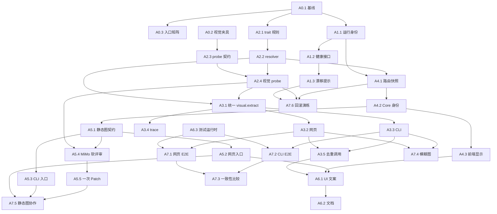

# MiMo–DeepSeek 网页/CLI 一致性修复原子 Work-Tree

> 状态：执行中（Wave 0–2 部分完成：T10 测试运行时、T3 trait 路由、T1 运行身份、T2 视觉探针、T4 薄 CLI 入口已实现并通过单元测试；A5 静态图协作与 A7 E2E 尚未执行）
> 类型：工程 + 流程治理
> 基线日期：2026-08-02
> 目标版本：`wuli-mimo-deepseek-consistency-v1`

## 1. 目标与真值政策

本 Work-Tree 修复教师网页、CLI 生命周期、Agent Gateway、模型注册表和文档之间的视觉协作漂移，使同一题目无论从网页还是 CLI 进入，都遵循同一条可观测、可失败关闭、可回滚的 MiMo–DeepSeek 链。

权威输入按以下优先级解释：

1. `record.json`、`pipeline.json` 和已提升的条目工件是单题状态真源；
2. `student-error-library/config/model-registry.json` 是运行模型与 trait 默认映射真源；
3. `student-error-library/config/analysis-production-routing.json` 是生产解析路由真源；
4. `teacher-console/agent_gateway.py` 是 provider、模型执行、候选隔离和运行 trace 真源；
5. `process_uploads.py` 是错题生命周期真源；
6. 文档、Skill 和 UI 文案必须从上述行为派生，不能反向覆盖代码事实。

本计划采用以下冻结决策：

- 生产解析保持 `core-first`：一次核心求解，不恢复默认 W2/W3 多求解器分流；
- MiMo 默认只在新原图进入时生成一次 `visual-facts.json`，下游任务复用该指纹工件；
- `source.clean`、`analysis.generate` 不因选择 DeepSeek 而重复上传原图；缺少或过期视觉事实时返回明确状态，不静默伪装成协同成功；
- 静态解释图是答案后的显式可选增强，必须在网页和 CLI 都有对等入口；
- 静态图生成后可自动运行一次非阻断 MiMo 视觉建议，再允许 DeepSeek 执行最多一次受限 Patch；
- 交互仿真仍只在教师明确请求后调用 `build-physics-simulator`，不纳入静态图修复链；
- 模型不能批准题干、答案、静态图、交互仿真、交付或公开发布；
- E2E 只在临时知识库、临时输出目录和无隐私合成图片上执行。

排除范围：

- 不重写 OCR 引擎；
- 不调整 W3/Claim Evidence 的物理解题正确性策略；
- 不改变学生端发布白名单；
- 不让 MiMo 直接生成最终 SVG 或 HTML；
- 不把 provider 专用参数重新放入 `server.py` 或 `process_uploads.py`。

## 2. 成功目标

| ID | 目标 | 可观察成功标准 | 优先级 | 最终批准 |
|---|---|---|---|---|
| T1 | 运行版本可识别 | 网页健康信息显示服务启动时间、代码版本、生产路由摘要和配置摘要；磁盘变化后能提示需重启 | P0 | 维护者 |
| T2 | 视觉模型真实可用 | 合成图片 probe 使用与生产相同的 endpoint、图片消息和响应契约；失败不能显示为“视觉测试通过” | P0 | 系统测试 |
| T3 | trait 路由正确 | `vision` 永远解析到具有 `traits.vision=true` 的模型；cost tier 不能覆盖成纯文本模型 | P0 | 单元测试 |
| T4 | 网页/CLI 同源 | 网页和 CLI 调用同一个 visual-extract 编排接口并产生同形工件、状态与错误分类 | P0 | 集成测试 |
| T5 | 协作可审计 | 每次 MiMo 和 DeepSeek 调用都记录实际模型、provider、契约、耗时、usage、输入/输出指纹和失败原因 | P1 | 系统测试 |
| T6 | Core 路由稳定 | 运行解析时实际路由与作业入队显示一致；`core-first` 不隐式升级为 W3/Pro | P0 | E2E |
| T7 | 静态图入口可达 | 网页和 CLI 都能显式请求 `diagram.scene`；未请求不阻塞答案或交付 | P1 | 教师验收 |
| T8 | 视觉效果协作闭环 | 静态图可运行一次 MiMo 软评审和最多一次 DeepSeek Patch；软评审不能自行批准或改变物理真源 | P1 | 教师验收 |
| T9 | 文档与 UI 一致 | Skill、API、架构、运行手册和页面说明只描述实际可达行为 | P1 | 文档审计 |
| T10 | 测试环境可复现 | 一个固定命令能在项目运行时执行相关单测与临时 E2E，不依赖偶然选中的系统 Python | P1 | CI/本机测试 |

## 3. 目标状态模型

```text
uploaded
→ ingested-local-ocr
→ visual-extract-requested
  ├─ MiMo completed → visual-facts-staged
  ├─ uncertainty/low-confidence → needs-source-review
  └─ provider/protocol/privacy failure → needs-source-review + durable failure trace
→ teacher-source-approved
→ source-cleaned-from-reviewed-text-and-facts
→ core-solved-by-selected-DeepSeek-route
→ core-gate-passed
→ answer-rendered
→ needs-answer-review
→ teacher-answer-approved
→ [teacher explicitly requests static diagram]
  → diagram-scene-generated
  → deterministic-svg-rendered
  → hard-gate-passed
  → [MiMo soft review]
  → [at most one bounded DeepSeek patch]
  → needs-answer-review
→ [teacher explicitly requests interactive visualization]
  → physics-model candidate
  → simulator build/review
→ finish
```

全程不变量：

- 原始题图只进入视觉提取边界，不进入答案、静态图 scene 或仿真模型 provider；
- `visual-facts.json` 必须绑定原图摘要、MiMo 运行身份和独立 Gate；
- DeepSeek 只消费已经存在且与当前原图匹配的视觉事实；
- 修改题干、答案、`physics-model.json` 或答案引用图后，旧答案批准失效；
- 静态图软评审不能覆盖硬物理门、安全门或教师审批；
- 作业 `completed` 只表示候选通过并提升，不表示教师批准。

## 4. 原子任务 DAG

每个任务最多执行两次；第二次必须有变化后的输入、诊断或实现版本。没有证据增量时触发 no-progress fuse，保留失败状态并停止该依赖锥。

### Wave 0：冻结证据

#### A0.1 提取当前运行基线

- 动词：提取
- 输入：当前模型注册表、生产路由、最近网页作业、最近 source-review、CLI 配置
- 输出：`docs/reports/mimo-deepseek-consistency-baseline-v1.json`
- 依赖：无
- 允许修改：仅上述报告
- 验证：JSON 包含配置摘要、作业 requested/resolved model、真实失败类型和文件摘要，不含密钥、原图或答案正文
- 影响目标：T1、T2、T4、T5、T6
- 终态：`completed | insufficient-evidence`

#### A0.2 构造无隐私视觉夹具

- 动词：构造
- 输入：`wuli.visual-facts.v1` 视觉契约
- 输出：清晰图、模糊图和预期事实 JSON，存入 `teacher-console/tests/fixtures/visual-routing/`
- 依赖：无
- 允许修改：仅该 fixture 目录
- 验证：图片不含学生数据；清晰图可唯一读取，模糊图必须产生 uncertainty
- 影响目标：T2、T4、T10
- 终态：`completed | rejected-by-privacy-review`

#### A0.3 冻结入口行为矩阵

- 动词：分类
- 输入：网页上传、CLI start、source.clean、analyze、diagram、visualization 的现有入口
- 输出：基线报告中的 `entrypoint_matrix`
- 依赖：A0.1
- 允许修改：仅基线报告
- 验证：每个入口标明 source owner、model resolver、privacy gate、产物、失败落盘位置和教师门禁
- 影响目标：T4、T9
- 终态：`completed | incomplete-entrypoint`

### Wave 1：运行身份与重启可见性

#### A1.1 生成运行身份摘要

- 动词：生成
- 输入：Git revision 或工作树摘要、服务启动时间、路由配置、模型注册表公开摘要
- 输出：版本化 `runtime_identity()` 结果
- 依赖：A0.1
- 允许修改：`teacher-console/runtime_environment.py` 或独立 `runtime_identity.py`
- 验证：摘要不含 API key、完整环境变量、学生路径或私有模型凭据
- 影响目标：T1
- 终态：`completed | unsupported-vcs-state`

#### A1.2 暴露健康接口身份

- 动词：暴露
- 输入：A1.1 运行身份
- 输出：`GET /api/health.runtime_identity`
- 依赖：A1.1
- 允许修改：`teacher-console/server.py`、API 测试
- 验证：响应包含 `server_started_at`、`code_digest`、`analysis_route`、`route_config_digest`、`model_registry_digest`
- 影响目标：T1
- 终态：`completed | contract-failed`

#### A1.3 呈现版本漂移提示

- 动词：呈现
- 输入：健康接口身份和当前磁盘摘要
- 输出：教师端只读状态条
- 依赖：A1.2
- 允许修改：`teacher-console/static/app.js`、`index.html`、`styles.css`、静态契约测试
- 验证：代码或生产路由摘要变化时显示“服务需重启”；不自动重启、不阻断未保存编辑
- 影响目标：T1、T9
- 终态：`completed | UI-contract-failed`

### Wave 2：统一 trait 路由与真实 probe

#### A2.1 规范 trait 解析规则

- 动词：规范
- 输入：`defaults.vision`、cost tier、模型 traits、probe 状态
- 输出：`resolve_model_id_for_trait()` 的冻结决策表
- 依赖：A0.1
- 允许修改：先仅修改设计测试或本文件附属报告
- 验证：`vision + economy` 不能解析到 `traits.vision=false` 的模型；显式模型不具 trait 时必须失败
- 影响目标：T3
- 终态：`completed | policy-dispute`

#### A2.2 修复 trait resolver

- 动词：修复
- 输入：A2.1 决策表
- 输出：正确的 trait 模型配置
- 依赖：A2.1
- 允许修改：`teacher-console/model_registry.py`、对应测试
- 验证：auto 使用 `defaults.<trait>`；档位覆盖仅在候选声明该 trait 且可用时成立；指定模型缺 trait 返回稳定错误
- 影响目标：T3、T4
- 终态：`completed | resolver-test-failed`

#### A2.3 定义视觉 probe 契约

- 动词：定义
- 输入：A0.2 清晰夹具、生产视觉请求格式
- 输出：`wuli.vision-probe.v1` 请求/结果契约
- 依赖：A0.2、A2.1
- 允许修改：模型 probe 模块、schema/测试
- 验证：使用与生产一致的 endpoint、图片 content、模型名和 JSON 返回约束；不得使用真实学生图片
- 影响目标：T2
- 终态：`completed | contract-rejected`

#### A2.4 实现视觉 probe

- 动词：实现
- 输入：A2.3 契约和模型注册配置
- 输出：可持久化的真实视觉 probe 结果
- 依赖：A2.2、A2.3
- 允许修改：`teacher-console/agent_gateway.py`、`visual_extraction.py`、`model_registry.py`、设置 API 与测试
- 验证：文本 probe 通过而图片请求 404 时，模型必须显示 `vision_probe=failed`，且不能被 vision 路由选中
- 影响目标：T2、T3、T5
- 终态：`completed | upstream-incompatible | privacy-blocked`

### Wave 3：统一网页和 CLI 的 visual.extract

#### A3.1 提取统一视觉编排器

- 动词：提取
- 输入：原图、OCR、subject、source fingerprint、privacy、视觉模型配置
- 输出：单一 `run_visual_extract()` 接口及 `VisualExtractOutcome`
- 依赖：A2.2、A2.4
- 允许修改：优先在 `teacher-console/` 新增应用编排模块；Gateway 仅保留执行职责，`process_uploads.py` 仅保留确定性生命周期职责
- 验证：输出包含 `status`、`stage`、`model_id`、`provider`、`upstream_model`、usage、timing、fingerprint、failure_type；不执行 source approval
- 影响目标：T4、T5
- 终态：`completed | contract-failed`

#### A3.2 接入网页上传

- 动词：接入
- 输入：A3.1 编排接口、网页上传事务
- 输出：网页入库后的统一视觉结果
- 依赖：A3.1
- 允许修改：`teacher-console/server.py`、HTTP 测试
- 验证：删除硬编码 `human/unavailable` 后的双重语义；失败仍创建可复核条目；远程门禁在读取图片和网络调用前执行
- 影响目标：T4、T5
- 终态：`completed | HTTP-contract-failed`

#### A3.3 接入 CLI start

- 动词：接入
- 输入：A3.1 编排接口、CLI 参数和旧 adapter 配置
- 输出：CLI 薄入口与网页同形视觉结果
- 依赖：A3.1
- 允许修改：新增 `teacher-console/scripts/` 下的薄 CLI 编排入口、source-review adapter 兼容层、CLI 测试；`process_uploads.py` 只允许增加确定性参数/回调接口，不得导入 provider 或拼接网络请求
- 验证：薄入口先调用确定性 ingest，再调用 A3.1；默认使用模型注册表 `defaults.vision`；显式旧 adapter 仍可作为兼容 override，并记录 `legacy-adapter`；不再形成第二套结果 schema
- 影响目标：T4、T5
- 终态：`completed | compatibility-failed`

#### A3.4 持久化视觉运行记录

- 动词：持久化
- 输入：`VisualExtractOutcome`
- 输出：条目私有 `visual-extract-request.json`、Candidate Archive 紧凑事件、source-review 安全摘要
- 依赖：A3.1
- 允许修改：生命周期记录模块、候选档案测试
- 验证：刷新页面后仍能看到 404/超时/隐私阻断原因；文件不含图片 data URL、密钥、完整 provider stdout 或绝对临时路径
- 影响目标：T5
- 终态：`completed | redaction-failed`

#### A3.5 消除重复视觉预处理

- 动词：消除
- 输入：已存在/缺失/过期的 `visual-facts.json`
- 输出：`source.clean` 的唯一输入政策
- 依赖：A3.2、A3.3
- 允许修改：`source_clean_task()`、Gateway 旧 `_maybe_vision_preprocess()`、对应测试
- 验证：视觉事实当前时只消费工件，不再次调用 MiMo；缺失或过期时调度 A3.1，而不是在 provider 内隐式上传原图
- 影响目标：T3、T4、T5
- 终态：`completed | duplicate-call-detected`

### Wave 4：解析路由与作业可观测性

#### A4.1 冻结作业路由快照

- 动词：冻结
- 输入：提交时的模型注册表与生产路由
- 输出：job 中的 `route_snapshot`
- 依赖：A1.1、A2.2
- 允许修改：`agent_jobs.py`、提交函数、作业 schema/测试
- 验证：回调执行时使用同一快照或明确失败 `route_snapshot_stale`；不能入队显示 Flash API、执行时静默变成 Pro/Claude
- 影响目标：T5、T6
- 终态：`completed | stale-route-rejected`

#### A4.2 固定 Core 调用身份

- 动词：固定
- 输入：A4.1 路由快照、`analysis-production-routing.json`
- 输出：`core-first` 的唯一实际 model/provider 身份
- 依赖：A4.1
- 允许修改：`server.py` 自适应入口、核心路由测试
- 验证：`core-first` 下 `max_agent_calls=1`、无 W3/Pro 隐式升级；失败不触发旧求解器
- 影响目标：T6
- 终态：`completed | route-invariant-failed`

#### A4.3 统一作业前端显示

- 动词：统一
- 输入：requested、resolved、stage identities
- 输出：队列与完成状态的一致模型说明
- 依赖：A4.1、A4.2
- 允许修改：`app.js`、作业公开序列化、静态测试
- 验证：多阶段或显式回滚模式展示阶段模型列表；单 Core 作业只显示一个实际模型；fallback 必须可见
- 影响目标：T5、T6、T9
- 终态：`completed | display-contract-failed`

### Wave 5：恢复可达的静态图协作

#### A5.1 定义静态图动作契约

- 动词：定义
- 输入：当前 `diagram.scene`、答案摘要、visual facts、教师门禁
- 输出：`POST /api/entries/<id>/build-diagram` 契约和 CLI 对等命令定义
- 依赖：A4.2
- 允许修改：先修改 API/命令契约与测试夹具
- 验证：动作只在题干已批准且答案存在时运行；未请求不阻塞答案或 finish；生成/修改图后答案批准失效
- 影响目标：T7
- 终态：`completed | policy-dispute`

#### A5.2 接入网页静态图动作

- 动词：接入
- 输入：A5.1 契约和现有 `run_physics_diagram_gateway()`
- 输出：解析复核页“生成/重新生成静态解释图”入口
- 依赖：A5.1
- 允许修改：`server.py`、`app.js`、`index.html`、HTTP/静态测试
- 验证：按钮状态、后台轮询、失败诊断、未保存答案保护和答案批准失效均可测试
- 影响目标：T7、T9
- 终态：`completed | UI-E2E-failed`

#### A5.3 接入 CLI 静态图动作

- 动词：接入
- 输入：A5.1 契约
- 输出：`teacher-console/scripts/entry_action.py build-diagram <entry-id>` 或等价薄入口
- 依赖：A5.1
- 允许修改：教师端薄 CLI、共享应用编排模块、CLI 测试；不得把 provider 调用或 SVG renderer 塞进 `process_uploads.py`
- 验证：与网页调用同一应用服务、Gateway 和 validator，不在 CLI 内重写 provider 或 SVG renderer
- 影响目标：T7、T9
- 终态：`completed | CLI-contract-failed`

#### A5.4 实现 MiMo 软视觉评审

- 动词：实现
- 输入：确定性 SVG 的无隐私渲染图、视觉质量 rubric、当前 scene/facts 摘要
- 输出：`wuli.diagram-visual-review.v1`
- 依赖：A2.4、A5.1
- 允许修改：独立视觉评审模块、schema、测试；不得修改 simulator Skill
- 验证：只评价可读性、遮挡、层次与辅助性；不得输出物理结论、改写 facts、批准质量或直接修改 SVG
- 影响目标：T8
- 终态：`completed | review-unavailable | privacy-blocked`

#### A5.5 绑定一次受限 Patch

- 动词：绑定
- 输入：A5.4 软建议、原 scene、硬门诊断
- 输出：最多一次 `wuli.physics-diagram-scene-patch.v1` 结果
- 依赖：A5.4
- 允许修改：diagram orchestrator、Patch 测试
- 验证：物理模型、visual facts、编译轨迹点不可变；Patch 后重新运行硬门和 SVG 安全门；无改进或二次失败立即停止
- 影响目标：T8
- 终态：`completed | accepted-with-warnings | patch-failed`

### Wave 6：文档、UI 与运行环境收敛

#### A6.1 统一产品文案

- 动词：统一
- 输入：已通过的 A3–A5 行为契约
- 输出：教师端模式、视觉模型、静态图和交互仿真的清晰说明
- 依赖：A3.5、A4.3、A5.2
- 允许修改：`index.html`、设置页说明、错误提示
- 验证：教师能区分“解题模型”“视觉模型”“静态解释图”“交互仿真”；页面不再暗示选择 DeepSeek 会在所有任务重跑 MiMo
- 影响目标：T9
- 终态：`completed | UX-review-failed`

#### A6.2 同步权威文档

- 动词：同步
- 输入：已通过的代码和测试行为
- 输出：一致的架构、API、Gateway、运行手册、Skill 和变更记录
- 依赖：A6.1
- 允许修改：`docs/architecture.md`、`docs/teacher-console-api.md`、`docs/agent-gateway.md`、`docs/visual-review-integration.md`、`docs/operator-runbook.md`、`docs/CHANGES.md`、总控 Skill 及引用
- 验证：删除“analyze 必定生成 SVG”“默认答案必须有图”等失效描述；CLI 与网页命令映射一致；文档链接有效
- 影响目标：T9
- 终态：`completed | documentation-audit-failed`

#### A6.3 固定测试运行时

- 动词：固定
- 输入：项目 Python/Pillow/浏览器依赖
- 输出：单一测试入口或明确的环境检测脚本
- 依赖：无
- 允许修改：测试启动脚本、README/runbook、依赖声明
- 验证：错误 Python 能快速报告缺失依赖；正确入口能运行视觉、Gateway、HTTP 和静态契约测试
- 影响目标：T10
- 终态：`completed | dependency-unavailable`

### Wave 7：集成验收

#### A7.1 验证网页清晰图流程

- 动词：验证
- 输入：A0.2 清晰图、临时库、真实或受控视觉 adapter
- 输出：网页 E2E 报告
- 依赖：A3.2、A4.2、A6.3
- 允许修改：仅临时库、临时输出和测试报告
- 验证：MiMo trace → visual facts → source review → DeepSeek Core → needs-answer-review；无自动批准
- 影响目标：T2、T4、T5、T6
- 终态：`passed | upstream-unavailable | failed`

#### A7.2 验证 CLI 清晰图流程

- 动词：验证
- 输入：与 A7.1 相同夹具和配置
- 输出：CLI E2E 报告
- 依赖：A3.3、A4.2、A6.3
- 允许修改：仅临时库、临时输出和测试报告
- 验证：关键工件 schema、模型身份、状态和失败分类与网页一致
- 影响目标：T4、T5、T6
- 终态：`passed | upstream-unavailable | failed`

#### A7.3 比较网页与 CLI 结果

- 动词：比较
- 输入：A7.1、A7.2 报告
- 输出：`web_cli_parity` 差异报告
- 依赖：A7.1、A7.2
- 允许修改：仅验收报告
- 验证：允许 job ID、时间和路径不同；不允许模型路由、状态机、工件 schema、privacy gate 和教师门禁不同
- 影响目标：T4、T9
- 终态：`passed | parity-failed`

#### A7.4 验证模糊图失败关闭

- 动词：验证
- 输入：A0.2 模糊图
- 输出：网页/CLI 双入口失败关闭报告
- 依赖：A3.2、A3.3、A6.3
- 允许修改：仅临时测试区和报告
- 验证：两边均保留 uncertainty、停在 `needs-source-review`、不启动 Core、不得批准题干
- 影响目标：T2、T4、T5
- 终态：`passed | unsafe-advance-detected`

#### A7.5 验证静态图协作

- 动词：验证
- 输入：已批准测试题干、已生成答案、visual facts
- 输出：静态图 E2E 报告
- 依赖：A5.2、A5.3、A5.5、A6.3
- 允许修改：仅临时测试区和报告
- 验证：显式请求后 DeepSeek scene → 本地 SVG → MiMo soft review → 至多一次 Patch；最终仍等待教师答案复核
- 影响目标：T7、T8
- 终态：`passed | accepted-with-warnings | failed`

#### A7.6 执行回滚演练

- 动词：演练
- 输入：旧 adapter override、MiMo 404、route config 变化、服务未重启场景
- 输出：回滚与诊断报告
- 依赖：A1.3、A2.4、A3.3、A4.1
- 允许修改：仅临时配置和报告
- 验证：旧 adapter 可显式启用；MiMo 失败不污染 canonical；路由变化提示重启；作业快照不漂移
- 影响目标：T1、T2、T4、T6
- 终态：`passed | rollback-failed`

## 5. DAG 与执行波



可并行执行：

- Wave 0：A0.1 与 A0.2；
- Wave 1/2：A1.1 与 A2.1/A2.3；
- Wave 3：A3.2、A3.3、A3.4；
- Wave 5：A5.2、A5.3、A5.4；
- Wave 7：A7.1、A7.2、A7.4、A7.5。

## 6. 状态传递契约

| 接口 | 工件 | 生产者 | 消费者 | 前置条件 | 失效条件 |
|---|---|---|---|---|---|
| I1 | `RuntimeIdentity.v1` | A1.1 | 健康接口、UI、作业 | 服务已启动 | 代码、路由配置或模型注册表摘要变化 |
| I2 | `VisionProbeResult.v1` | A2.4 | 模型注册表 resolver | 合成图、真实视觉请求完成 | 模型配置摘要变化 |
| I3 | `VisualExtractOutcome.v1` | A3.1 | source review、档案、UI | privacy gate 通过或明确阻断 | 原图/OCR/模型配置变化 |
| I4 | `wuli.visual-facts.v1` | A3.1 | source.clean、Core、diagram | source fingerprint 匹配 | 原图、OCR 权威文本或视觉模型身份变化 |
| I5 | `RouteSnapshot.v1` | A4.1 | 作业 callback、前端 | 模型和路由在入队时可解析 | snapshot 摘要与执行输入不一致 |
| I6 | `wuli.core-solve.v1` | Core provider | Core Gate、教学 renderer | 已批准题干 | 题干、方法 profile、视觉事实或 model route 变化 |
| I7 | `wuli.physics-diagram-scene.v1` | DeepSeek diagram task | 本地 SVG renderer | 答案与视觉事实当前 | 答案、facts、physics model 或 obligations 变化 |
| I8 | `wuli.diagram-visual-review.v1` | MiMo soft reviewer | bounded patch | 已有安全渲染截图 | SVG/scene/rubric/model 变化 |
| I9 | `wuli.physics-diagram-scene-patch.v1` | DeepSeek patch task | hard gate、renderer | I8 有可操作建议 | 第二次 Patch、无进展或 immutable 变化 |

所有接口必须携带 schema version 和输入 fingerprint；消费者不能仅凭文件存在推断其当前有效。

## 7. 验证账本

| 义务 | 检查内容 | 证据 | 判定规则 | 失败处理 |
|---|---|---|---|---|
| V1 | 网页运行当前代码 | runtime/code/config digest | UI 与服务摘要一致 | 提示重启，阻止新 Agent 提交但保留只读与未保存文本 |
| V2 | 视觉模型真正支持图片 | 合成图生产同形 probe | 端点、模型、图片、JSON 契约全部通过 | 标记 vision unavailable，回到人工复核 |
| V3 | trait 路由不越权 | resolver 参数化测试 | 返回模型必须声明目标 trait | provider 调用前失败 |
| V4 | 网页/CLI 同源 | parity 报告 | 除时间/路径/ID 外关键字段一致 | 回跳 A3.1–A3.3 最小差异入口 |
| V5 | 无重复上传原图 | 调用 trace + fingerprint | 同一 source fingerprint 默认仅一次 MiMo visual.extract | 回跳 A3.5 |
| V6 | Core 不隐式升级 | route snapshot + job stages | `core-first` 恰好一次求解身份 | 回跳 A4.1/A4.2 |
| V7 | 静态图非阻断 | 无图 finish E2E | 已批准正确答案可交付 | 回跳 A5.1 或生命周期验证规则 |
| V8 | MiMo 不拥有物理结论 | visual review schema | 无答案、facts 修改或批准字段 | 拒绝视觉建议候选 |
| V9 | Patch 有界 | attempts + scene diff | 最多一次且 immutable 未变 | 保留原 SVG/警告或失败关闭 |
| V10 | 审批仍属教师 | pipeline/record 摘要 | 所有 Agent 完成后仍处于对应 review state | 安全回滚并标记生命周期回归 |
| V11 | 隐私边界稳定 | 请求快照扫描 | 无原图进入答案/diagram/仿真 provider；视觉调用有独立远程授权 | provider 调用前阻断 |
| V12 | 测试环境可复现 | 固定测试入口 | 本机与 CI 均能发现依赖并运行目标测试 | 修复 A6.3，不跳过关键测试 |

## 8. 反馈、回跳与熔断

| 触发 | 最小回跳 | 保留内容 | 最大尝试 | 终止状态 |
|---|---|---|---:|---|
| MiMo endpoint 404/协议错误 | A2.3 或 provider 配置 | OCR、条目、人工复核包 | 2 | `upstream-incompatible` |
| vision probe 通过但生产失败 | A2.3/A2.4 | 失败 trace | 1 修复轮 | `probe-not-representative` |
| economy 覆盖 vision trait | A2.1/A2.2 | 模型注册原配置备份 | 2 | `resolver-test-failed` |
| 网页/CLI 工件不同 | A3.1 加对应入口任务 | 两侧 E2E 报告 | 2 | `parity-failed` |
| source.clean 重复调用 MiMo | A3.5 | 首个有效 visual facts | 1 | `duplicate-call-detected` |
| 作业模型身份漂移 | A4.1/A4.2 | 入队 snapshot、失败作业 | 2 | `route-invariant-failed` |
| Core 失败 | 当前 Core 调用 | 题干、视觉事实、旧 canonical 答案 | 1 | `core-failed` |
| 静态图硬门失败 | A5.5 | 已批准答案、原 scene/诊断 | 1 Patch | `diagram-failed` |
| 静态图仅美观警告 | A5.4/A5.5 | 安全原 SVG | 1 Patch | `accepted-with-warnings` |
| 文档再次分叉 | A6.2 | 已通过代码/测试行为 | 1 | `documentation-audit-failed` |

全局最多两个修复 round。第二 round 后若同一 fingerprint、同一错误码、同一诊断再次出现，立即熔断，不再调用外部模型。

## 9. 文件影响矩阵

| 区域 | 预期文件 |
|---|---|
| 运行身份 | `teacher-console/runtime_environment.py`、`server.py`、`static/app.js`、对应测试 |
| trait 路由/probe | `teacher-console/model_registry.py`、`agent_gateway.py`、`visual_extraction.py`、模型注册测试 |
| 统一视觉入口 | `teacher-console/` 新应用编排模块、`server.py`、薄 CLI、`process_uploads.py` 的确定性接口、`source_review.py`、`visual_source_review.py` |
| 作业 trace | `agent_jobs.py`、`agent_outcome.py`、Candidate Archive 接口、HTTP 测试 |
| Core 路由 | `server.py`、`core_analysis.py`、路由测试 |
| 静态图 | 共享应用编排模块、`server.py`、`physics_diagram.py`、`app.js`、`index.html`、薄 CLI、图示测试 |
| E2E | `teacher-console/e2e/`、临时视觉夹具、fake adapter 两份同步 |
| 文档 | 架构、API、Gateway、视觉接入、runbook、CHANGES、总控 Skill |

禁止把 provider endpoint、模型名、API key 或 CLI 参数重新散落进 `server.py`、UI JavaScript 或生命周期 Skill。

## 10. 验收命令

实现阶段使用固定测试运行时（A6.3 已完成）：

```bash
/Users/qingyuan/miniconda3/bin/python3 -B teacher-console/scripts/run_tests.py \
  --python /Users/qingyuan/miniconda3/bin/python3
```

`--all` 运行全部单元测试，也可追加单个测试文件名；从项目根任意目录可复现。
已知例外：`test_agent_http.py` 中 4 个 W3 shadow 作业失败（solver/verifier
provider 解析，属于 W3 排除范围，单独追踪）。

然后运行四条隔离 E2E，并新增：

```text
web-clear-image-parity
cli-clear-image-parity
web-cli-blurred-image-fail-closed
explicit-static-diagram-collaboration
runtime-identity-stale-warning
```

任何真实 provider 冒烟只能使用 A0.2 合成图片，不得使用正式 `student-error-library/`、`output/`、`student-site/` 或学生原图。

代码修改完成后还必须执行：

```bash
git diff --check
graphify update .
```

## 11. 完成与发布条件

只有同时满足以下条件，才能把本 Work-Tree 标记为完成：

1. T1–T10 均有通过的验证证据，或被明确标记为非阻断 `accepted-with-warnings`；
2. 网页和 CLI 对同一合成清晰图生成等价的视觉事实、状态和模型身份；
3. 模糊图在两条入口都停于人工 source review；
4. 视觉 probe 能复现并准确报告 endpoint 404、鉴权失败、非法 JSON 和 uncertainty；
5. `core-first` 作业入队身份与实际执行身份一致，且只发生一次求解调用；
6. 未请求静态图时答案可以审核与交付，请求后网页和 CLI 都可完成同一图示链；
7. MiMo 软视觉评审未获得任何批准或物理真源修改权限；
8. 所有候选仍经过 Gateway 白名单、领域校验、canonical 摘要复查和教师门禁；
9. 当前文档、Skill、UI 文案和 API 契约不存在“解析必定生成 SVG”或“选择 DeepSeek 必定在每个动作重跑 MiMo”的错误暗示；
10. 临时 E2E 未向正式知识库、输出目录或公开站写入测试产物；
11. graphify 已更新，变更影响报告没有出现新的跨模块职责倒置；
12. 维护者实际查看网页运行身份、视觉失败提示、答案复核和静态图复核后给予最终批准。

若外部 MiMo 服务在实现结束时仍不兼容，允许交付状态为 `provisional`，但必须满足：视觉路由自动标为不可用、网页/CLI 都安全回退人工复核、DeepSeek 不读取原图、所有失败证据可见且没有虚假的“测试通过”。
