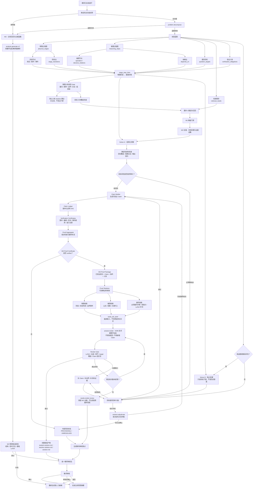

# RAG 完成 Work-tree

> **状态：已完成（2026-08-02 W3 已默认进入生产路由）**
> 本文档保留为 W3 治理参考。当前实现见 `teacher-console/w3_pipeline.py`、`teacher-console/analysis_routing.py`。

这份文档记录 W3 从影子状态走到生产完成的唯一执行视图。检索原理、实验细节和
历史指标分别留在 `evolve-roadmap.md` 与 `w3-reasoning-pipeline.md`。

## 完成定义

“RAG 最终闭环完成”同时满足：

1. 新鲜独立 holdout 先冻结教师真值，再运行同条件 W2/W3；
2. W3 目标准确率不低于 W2，且每题教师核对卡平均不超过 2；
3. 独立集没有因 W3 输出而修订参考真值；
4. 小范围生产灰度不退化，失败可自动退回 W2；
5. 自适应 W3 路由成为合格复杂题的默认路径，W2 回退和版本回滚经过验证；
6. 相关测试、运维说明、变更记录和 graphify 图谱同步。

慢循环样本积累是完成后的持续运营，不阻塞本轮 W3 上线；它仍遵守 20 个 RAG
完成任务、10 个教师闭环及更高自动策略门槛。

## 总树

```text
RAG 最终闭环
├─ W0 基线与评价口径                              ✅ 完成
├─ W1 精度门禁与独立检索 holdout                  ✅ 完成
├─ W2 evidence-set-v2 证据集选择                  ✅ 完成
├─ W3 自适应拆解、定向召回、验证与仲裁             ✅ 生产默认启用
├─ W4 泛化与生产门禁
│  ├─ W4-1 新鲜真值先冻结机制                     ✅ 机制完成
│  ├─ W4-2 旧题同条件 W2/W3 成对回放              ✅ 诊断完成
│  ├─ WAIT-5 五道从未进入旧 W3 manifest 的复核题   ✅ 完成
│  ├─ W4-3 新鲜独立 holdout                       ✅ 通过
│  ├─ W4-4 小范围生产灰度                         ✅ 通过
│  └─ W4-5 默认启用与回滚验收                     ✅ 通过
└─ W5 教师反馈慢循环                              ♻ 持续运营
```

## 当前停点

截至 2026-07-29，W4-5 已完成：

- 新鲜独立 holdout：5 题、15 目标，W2/W3 均为 100%，独立性完整；
- 首批生产灰度：3 题、9 目标，全部正确；
- 官方竞赛补充灰度：3 道有效题、8 原子目标，全部正确；
- `wuli-analysis-adaptive-v1` 已设为 `mode=default`；
- `default → off → default` 回滚演练通过，W2 接管有效；
- 下一阶段为 W5 教师反馈慢循环，只读观察不自动调整策略。

## 五题到达后的不可倒置流程

实验目录统一使用：

```text
student-error-library/evals/w3-shadow-w4-fresh-1
```

### 1. 只读确认资格

五题完成题干与答案复核后，先执行：

```bash
python3 -B teacher-console/scripts/w3_shadow_benchmark.py \
  --experiment student-error-library/evals/w3-shadow-w4-fresh-1 \
  status --holdout-count 5
```

必须看到 `fresh_eligible_case_count >= 5` 和 `ready_to_seed=true`。不满足时停止，
不能用 replay 补齐。

### 2. 建立新鲜批次

```bash
python3 -B teacher-console/scripts/w3_shadow_benchmark.py \
  --experiment student-error-library/evals/w3-shadow-w4-fresh-1 \
  seed --fresh-only --holdout-count 5 --batch-id w4-fresh-1
```

固定题目清单、教师复核答案摘要、模型/路由要求和评测契约。

### 3. 教师先写并批准目标真值

逐题完成 `truth/<entry-id>.json`：

- 覆盖题目全部目标，合计不少于 12 个；
- 每个目标都有结论、判据或可复算关系；
- 状态为教师批准；
- 此时尚未运行 W2/W3 候选。

然后冻结：

```bash
python3 -B teacher-console/scripts/w3_shadow_benchmark.py \
  --experiment student-error-library/evals/w3-shadow-w4-fresh-1 \
  freeze-truth
```

`truth-lock.json` 不允许覆盖。答案、真值或摘要变化时本批次失败关闭，必须另建新批次。

### 4. 固定条件生成 W2 与 W3

W2 必须通过真实教师网页“生成解析”链路，在隔离临时题库运行：

```bash
python3 -B teacher-console/scripts/paired_answer_web_run.py \
  --experiment student-error-library/evals/w3-shadow-w4-fresh-1 \
  --evidence-mode candidate --routing-tier expert \
  --model-id codex-visualization
```

W3 使用同一模型、同一路由档位和同一冻结批次：

```bash
python3 -B teacher-console/scripts/w3_shadow_run.py <五个-entry-id> \
  --experiment student-error-library/evals/w3-shadow-w4-fresh-1 \
  --routing-tier expert --model-id codex-visualization
```

模型、路由档位、证据策略、完成状态或来源不一致时，不进入评分。

### 5. 教师做目标级盲审

教师只按冻结真值审 W2/W3 各目标，并单独记录可交付性。允许的目标结论仍为
`correct`、`incorrect`、`valid-supplement`、`needs-review`；其中
`needs-review` 不进入最终准确率。

如果 W3 触发新的合法补充分支并导致教师修改真值，数学结论可保留，但本批次独立性
失效，返回 WAIT-5，重新收集五道未见题。

### 6. 聚合并裁决

```bash
python3 -B teacher-console/scripts/w3_shadow_benchmark.py \
  --experiment student-error-library/evals/w3-shadow-w4-fresh-1 \
  paired-score

python3 -B teacher-console/scripts/w3_shadow_benchmark.py \
  --experiment student-error-library/evals/w3-shadow-w4-fresh-1 \
  score
```

W4-3 通过必须同时满足：

- 至少 5 题、12 个可评分目标；
- W3 目标准确率不低于真实 W2；
- 平均教师核对卡不超过 2；
- 真值锁、标签、来源、固定运行条件和报告摘要完整；
- `independent_holdout_intact=true`；
- `production_eligible=true`。

准确率退化优先级最高；节省调用、缩短答案或减少核对时间都不能抵消正确率退化。

## W4-4：小范围生产灰度

W4-3 通过后才实施生产开关，不直接全量替换 W2：

1. 增加版本化、可审计的 W3 自适应路由策略；
2. 只对确定性初筛命中的复杂题启用 W3，其他题保持 W2；
3. 本轮五题只用于离线门禁，不重复充当生产灰度样本；
4. 灰度选择一个新的、数量受限的教师任务批次，所有答案仍由教师复核；
5. 记录目标准确性、首轮可用性、教师核对卡、延迟、内部调用数和 W2 回退；
6. 结构化阶段失败、超时、证据不足或门禁异常时自动回退 W2，不向学生端暴露内部冲突。

灰度停止条件：

- 出现经复算确认的 W3 新增错误；
- 教师核对卡平均超过 2；
- 回退失败或候选污染正式答案；
- 模型/策略版本无法追溯；
- 延迟或调用成本超过灰度前设定的上限。

## W4-5：默认启用与最终验收

灰度无正确率退化且回退稳定后：

1. 将已验收的版本化策略设为复杂题默认路径；
2. 保留 W2 作为低风险路径和自动回退；
3. 演练一次“W3 关闭 → W2 接管 → W3 恢复”的可逆切换；
4. 跑 W3、Gateway、Knowledge Store、静态契约和隔离 E2E；
5. 更新 `architecture.md`、`agent-gateway.md`、`operator-runbook.md`、
   `evolve-roadmap.md`、`CHANGES.md` 与 graphify；
6. 输出包含指标、版本、灰度范围、失败记录和回滚结果的最终验收报告。

完成后，W5 继续积累教师闭环并生成只读慢循环报告；任何自动调整证据预算、模型路由
或检索策略仍需满足自己的更高样本门槛，不因 W3 上线而自动获权。

### W5 整卷观察：2021 IPhO 理论题

2026-07-29 完成官方英文 T1–T3 的解答隔离整卷作答：三道候选先冻结、再解锁官方解答，
独立阅卷得到 30/30 分、36/36 小问 full-credit，无 needs-review。逐题有效作答、失败重试、
独立阅卷时间和可得 token 已固化；详见
[`reports/w5-ipho-2021-theory-closed-book.md`](reports/w5-ipho-2021-theory-closed-book.md)。
该批次是 W5 只读观察，不反向改写 fresh holdout，也不自动调整生产路由。

## 一票否决

出现任一情况就不能宣称完成：

- 复用旧 W3 manifest 题充当 fresh holdout；
- W2/W3 输出生成后才编写或修改真值；
- 用教师复核稿冒充 W2 真实生成结果；
- W2/W3 使用不同模型、路由档位或证据条件；
- 只比较整体答案观感，不做逐目标复算；
- `needs-review` 被当作正确；
- 独立集真值被本轮输出修订后仍用于生产门禁；
- 没有可用 W2 回退或没有验证回滚。

## 完整解题 pipeline + RAG执行图

