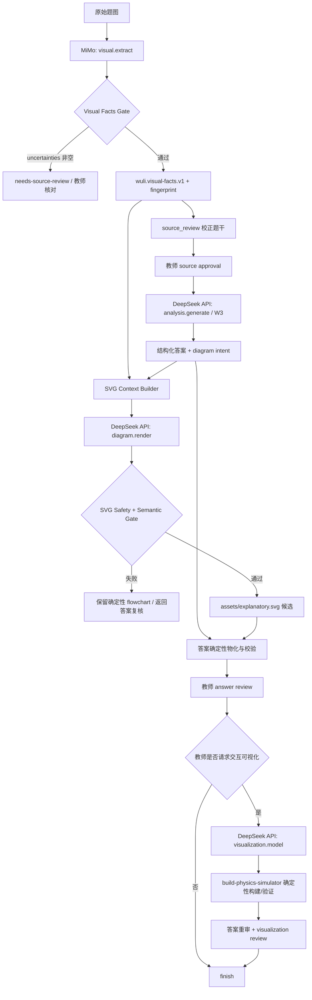

# 构建 MiMo + DeepSeek 协同解题链：原子执行 Work-Tree

## 1. 目标

把教师端统一为一条可观测、可失败关闭的双模型链：

```text
原图
→ MiMo V2.5 Flash：只做忠实视觉理解
→ wuli.visual-facts.v1
→ DeepSeek V4 Flash API：题干整理、解题、答案修订、SVG 规划与生成、physics-model 候选
→ 确定性契约/物理/SVG 校验
→ 教师复核
→ finish / delivery
```

核心不是“两个模型都调用过”，而是 MiMo 的视觉结果必须以冻结、带指纹的结构化工件进入
DeepSeek；DeepSeek 不得读取原图后假装自己有视觉能力，也不得批准任何结果。

## 2. 冻结边界

### 2.1 MiMo 可以做

- 逐字核对印刷题干、公式层级、上下标、正负号、单位；
- 提取区域、箭头、方向、电性、边界、标注和几何关系；
- 区分印刷题干、学生手写和批改痕迹；
- 对不确定内容显式输出 `uncertainties`；
- 为静态示意图输出视觉事实和布局约束。

MiMo 不解题、不生成最终答案、不批准 source、不直接生成最终 SVG。

### 2.2 DeepSeek V4 Flash API 可以做

- 消费已验证的题干和 `wuli.visual-facts.v1`；
- 执行 `source.clean`、`analysis.generate`、`answer.revise`；
- 生成静态 SVG 的结构化 scene 或完整 SVG 候选；
- 生成 `physics-model.json` 候选，交给现有 simulator validator/build；
- 执行本 Work-Tree 中获得授权的代码修改原子任务。

DeepSeek 不批准 source/answer/visualization，不执行 `finish`，不发布，不晋升 Gold/Evidence。

### 2.3 系统与教师

- Gateway 负责模型解析、密钥隔离、候选隔离、超时、调用遥测和允许路径；
- Validator 负责 schema、SVG 安全、物理语义、答案模板与摘要一致性；
- `process_uploads.py` 仍是生命周期唯一 owner；
- 教师仍是 source、answer、visualization 和生产路由的批准者。

## 3. 目标架构



## 4. 原子任务 Work-Tree

### W0：冻结基线和有效模型身份

```text
W0.1 记录当前 model-registry defaults、traits、probe digest
W0.2 冻结 source-review、analysis、SVG、visualization 的调用 trace
W0.3 冻结至少一张清晰图和一张含不确定标注的视觉夹具
W0.4 验收：不改变 canonical entry 和审批状态
```

### W1：冻结统一视觉事实契约

新增不可变证据工件 `wuli.visual-facts.v1`：

```json
{
  "schema": "wuli.visual-facts.v1",
  "source_fingerprint": "sha256:...",
  "reviewed_text": "...",
  "printed_facts": ["..."],
  "diagram_facts": [
    {
      "id": "vf1",
      "kind": "region|object|arrow|label|boundary|geometry",
      "statement": "...",
      "confidence": 0.99
    }
  ],
  "handwriting": ["..."],
  "uncertainties": [],
  "model_identity": {
    "model_id": "mimo-v2.5-flash",
    "provider": "openai-compatible"
  }
}
```

契约规则：

- `source_fingerprint` 和规范化后的 `fingerprint` 统一使用
  `sha256:<64 lowercase hex>`；
- `uncertainties` 必须原样保留，不能为了通过门控而删除；
- `model_identity` 在领域契约中只校验字段结构。实际是否由
  `mimo-v2.5-flash/openai-compatible` 运行，由 Gateway trace 门控校验；
- raw provider candidate 与 canonical artifact 是两个明确阶段。
  `normalize_payload` 接受无 `fingerprint` 的 raw candidate，也接受带
  `fingerprint` 的 canonical artifact；后者必须与重算结果一致，因此规范化幂等。

视觉事实本身不保存 `passed`。独立生成 `wuli.visual-facts-gate-result.v1`：

```json
{
  "schema": "wuli.visual-facts-gate-result.v1",
  "visual_facts_fingerprint": "sha256:...",
  "status": "passed|needs-source-review",
  "reasons": [
    {
      "code": "uncertainty-present|low-confidence|empty-reviewed-text|source-mismatch|route-mismatch",
      "fact_id": "vf1",
      "message": "..."
    }
  ],
  "thresholds": {
    "minimum_fact_confidence": 0.6
  }
}
```

`passed` 必须同时满足：`reviewed_text` 非空、`uncertainties=[]`、
source fingerprint 匹配、每条事实置信度不低于当前可校准阈值、Gateway trace
确认本次视觉运行来自指定 MiMo。视觉事实规范化成功不等于门控通过。

### W2：统一视觉调用入口

```text
W2.1 AgentGateway 增加结构化 visual.extract 调用
W2.2 通过 model_config_for_trait("vision") 显式解析 mimo-v2.5-flash
W2.3 source-review adapter 只负责协议转换，不再依赖另一套手工 URL/model 配置
W2.4 MiMo 失败、超时、非法 JSON、不确定或低置信度 → needs-source-review
W2.5 不自动调用 DeepSeek 修补视觉事实
```

最小修改边界：

- `teacher-console/agent_gateway.py`
- `teacher-console/model_registry.py`（仅补任务/trait 默认保存或解析）
- `.claude/skills/manage-student-error-library/scripts/openai_compatible_vision_adapter.py`
- `.claude/skills/manage-student-error-library/scripts/source_review.py`
- 对应 tests

### W3：固定 DeepSeek API 生成路由

```text
W3.1 analysis.generate → deepseek-v4-flash-api
W3.2 answer.revise → deepseek-v4-flash-api
W3.3 agent → deepseek-v4-flash-api
W3.4 visualization.model → deepseek-v4-flash-api
W3.5 vision → mimo-v2.5-flash
W3.6 每次 trace 记录 requested/resolved model、provider、contract、usage
```

禁止静默降级到 Claude/Codex/其他模型。指定模型不可用时返回失败并保持 canonical 不变。

### W4：把 SVG 改成真正的 MiMo + DeepSeek 协同

```text
W4.1 MiMo 只输出 visual-facts，不输出最终 SVG
W4.2 Gateway 将 visual-facts 作为只读结构化上下文注入 W2/W3
W4.3 DeepSeek API 在独立 `diagram.scene` 原子任务中生成 `wuli.physics-diagram-scene.v1`；`analysis.generate` 的废弃 `diagram` 字段固定为 `null`，系统渲染器生成最终 SVG
W4.4 SVG Gate 检查 XML、标签/属性白名单、脚本/外链/foreignObject
W4.5 svg-provenance 同时绑定 MiMo facts、DeepSeek generation、实际 SVG 和注册表身份
W4.6 facts 存在时任一绑定或安全检查失败均拒绝整个候选事务，不污染 canonical
```

SVG 生成输入不得包含教师私有审计、学生身份、原始绝对路径或审批记录。
这意味着“协同成功”是一个工件级事实，不是“日志中调用过两个模型”的推断。旧条目没有
缺少 `visual-facts.json` 时不得自动生成流程图顶替物理图；已有经复核物理 SVG 可作为 legacy 产物保留，否则任务失败关闭。逻辑流程图仅能通过显式 `logic-flowchart` 插件请求生成。

### W5：交互可视化保持职责边界

DeepSeek API 只生成结构化 `physics-model.json` 候选；`build-physics-simulator` 继续拥有
HTML/ZIP、事件、轨迹、控件和浏览器验证。模型不得直接写最终 HTML。

### W6：测试矩阵

```text
W6.1 registry：vision/agent/task defaults 精确解析
W6.2 source review：清晰图 passed，模糊图 needs-review
W6.3 privacy：远程图片仍需双门禁
W6.4 analysis：实际 model_id/provider 为 deepseek-v4-flash-api/openai-compatible
W6.5 SVG：MiMo facts 被 DeepSeek 消费，MiMo 未直接生成 SVG
W6.6 SVG 安全故障注入：script、onload、外链、foreignObject 全拒绝
W6.7 fallback：任一模型失败不污染 canonical
W6.8 approvals：答案/SVG/physics-model 变化使旧批准失效
W6.9 E2E：source → analysis → answer review checkpoint；不伪造教师批准
```

### W7：教师端隔离回放

使用独立临时知识库和无学生隐私测试图：

```text
ingest/local OCR
→ MiMo visual.extract
→ source review packet
→ 测试教师 approve-source
→ DeepSeek API analysis.generate
→ MiMo facts + DeepSeek SVG
→ validate
→ 停在 needs-answer-review
```

只有用户实际审核当前答案后才可继续 `approve-answer → finish`。

## 5. 执行波与回跳

```text
Wave 1：W0 + W1
Wave 2：W2 + W3
Wave 3：W4 + W5
Wave 4：W6
Wave 5：W7
```

- 视觉事实错误只回跳 W1/W2，并使其下游答案/SVG失效；
- 解题错误回跳 W3 的当前生成任务，不重新调用 MiMo；
- SVG 错误只回跳 W4，不重跑解题；
- physics-model 错误回跳 W5，不修改静态答案 SVG；
- 相同输入/契约/模型 fingerprint 的生成失败最多重试一次；无证据增量即停止。
- 两次生成后若候选与 verifier 对同一契约产生矛盾，进入 `gate-dispute`，不把它
  直接记为候选失败。人工可授权确定性 `reviewer-repair` 修复非语义测试错误，
  修复记录必须绑定原候选、争议项和新测试摘要。

## 6. DeepSeek 执行约束

DeepSeek 执行每个代码原子任务时必须：

1. 只读取任务包列出的文件；
2. 输出候选 patch，不直接审批或运行真实题目；
3. 不改 `process_uploads.py` 的审批状态机，不放宽 privacy gate；
4. 不把模型 API 参数散落进 `server.py`；
5. 不让 MiMo 直接生成最终 SVG；
6. 不让 DeepSeek 读取未经 MiMo/教师确认的原图语义；
7. 每个原子任务单独通过测试后才进入下一波。

## 7. 完成定义

同时满足以下条件才算协同架构完成：

- source review trace 明确显示 MiMo；
- analysis/answer/SVG/visualization model trace 明确显示 DeepSeek V4 Flash API；
- SVG trace 同时绑定 MiMo visual-facts fingerprint 和 DeepSeek 输出；
- 不存在 MiMo 直接生成最终 SVG 的路径；
- 指定模型失败时没有静默换模型；
- 教师端流程停在真实检查点，模型没有批准或 finish；
- 所有单元、集成、隐私与故障注入测试通过。
