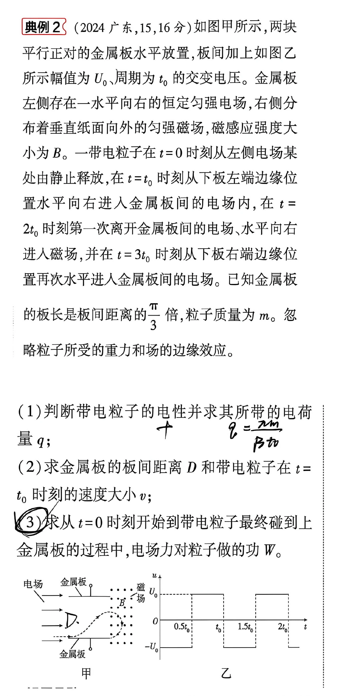
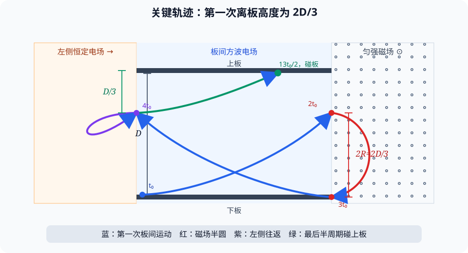

# 题目

## 题干

典例 2（2024 广东，15，16 分）如图甲所示，两块平行正对的金属板水平放置，板间加上如图乙所示幅值为 $U_0$、周期为 $t_0$ 的标准对称双极性方波电压。金属板左侧存在一水平向右的恒定匀强电场，右侧分布着垂直纸面向外的匀强磁场，磁感应强度大小为 $B$。一带电粒子在 $t=0$ 时刻从左侧电场某处由静止释放，在 $t=t_0$ 时刻从下板左端边缘位置水平向右进入金属板间的电场内，在 $t=2t_0$ 时刻第一次离开金属板间的电场、水平向右进入磁场，并在 $t=3t_0$ 时刻从下板右端边缘位置再次水平进入金属板间的电场。已知金属板的板长是板间距离的 $\frac{\pi}{3}$ 倍，粒子质量为 $m$。忽略粒子所受的重力和场的边缘效应。

（1）判断带电粒子的电性并求其所带的电荷量 $q$；

（2）求金属板的板间距离 $D$ 和带电粒子在 $t=t_0$ 时刻的速度大小 $v$；

（3）求从 $t=0$ 时刻开始到带电粒子最终碰到上金属板的过程中，电场力对粒子做的功 $W$。

---

# 解析（学生版）

## 答案速览

- （1）粒子带正电，
  $$
  q=\frac{\pi m}{Bt_0}。
  $$
- （2）
  $$
  D=\sqrt{\frac{3\pi U_0t_0}{8B}},\qquad
  v=\sqrt{\frac{\pi^3U_0}{24Bt_0}}。
  $$
- （3）
  $$
  W=\frac{\pi(\pi^2+16)mU_0}{48Bt_0}。
  $$

## 一眼识别

- 题型识别：方波电场中的分段匀变速运动与磁场中的圆周运动。
- 最短主线：磁场半圆求 $q$ 和离板高度，水平匀速求 $v$，竖直位移求 $D$，最后用动能定理求总功。
- 可用二级结论：磁场中转过半圆的时间为 $\pi m/(|q|B)$；**适用条件**：粒子只受洛伦兹力，且出入磁场时速度方向相反。

## 详细解答

### 第 1 步：由磁场半圆求电性和电荷量

粒子进入磁场时速度向右，轨迹向下弯，磁场方向垂直纸面向外，所以洛伦兹力向下，粒子带正电。

粒子在磁场中运动时间为 $t_0$，出入磁场时速度均水平、方向相反，故轨迹为半圆：

$$
t_0=\frac{\pi m}{qB}，
$$

所以

$$
\boxed{q=\frac{\pi m}{Bt_0}}。
$$

### 第 2 步：用磁场半径确定第一次离板高度

设板长为 $L$。粒子在板间的水平速度不变，且用时 $t_0$ 从左端到右端，因此

$$
v=\frac{L}{t_0}=\frac{\pi D}{3t_0}。
$$

磁场半径

$$
R=\frac{mv}{qB}
=\frac{vt_0}{\pi}
=\frac D3。
$$

半圆两端的高度差为 $2R=2D/3$，所以粒子第一次离开板间时距下板 $2D/3$，不是到达上板。

### 第 3 步：由一个方波周期内的竖直位移求 $D$ 和 $v$

板间电场强度大小为 $U_0/D$。设竖直加速度大小为

$$
a=\frac{qU_0}{mD}。
$$

一个周期内，粒子先向上加速 $t_0/2$，再向上减速 $t_0/2$。末速度虽恢复为零，两段位移却同向，故

$$
\frac{2D}{3}
=2\times\frac12a\left(\frac{t_0}{2}\right)^2
=\frac{at_0^2}{4}。
$$

代入 $a$ 和 $q$，得

$$
\boxed{D=\sqrt{\frac{3\pi U_0t_0}{8B}}}，
$$

进而

$$
\boxed{v=\frac{\pi D}{3t_0}
=\sqrt{\frac{\pi^3U_0}{24Bt_0}}}。
$$

### 第 4 步：确定最终碰板时的速度

| 时刻 | 位置与运动状态 |
|---|---|
| $t_0$ | 从下板左端进入板间，速度向右 |
| $2t_0$ | 从右侧 $2D/3$ 高处进入磁场 |
| $3t_0$ | 经半圆到下板右端，速度向左 |
| $4t_0$ | 从左侧 $2D/3$ 高处进入左侧电场 |
| $6t_0$ | 在左侧电场中往返后，回到原高度，速度向右、大小为 $v$ |
| $13t_0/2$ | 上移 $D/3$，碰到上板 |

从 $6t_0$ 起的前半周期内，粒子竖直向上加速。因为

$$
\frac12a\left(\frac{t_0}{2}\right)^2=\frac D3，
$$

所以恰在 $13t_0/2$ 时碰板，此时

$$
v_x=v,\qquad v_y=\frac{at_0}{2}=\frac{4D}{3t_0}=\frac4\pi v。
$$

### 第 5 步：用全过程动能定理求总功

磁场力不做功，粒子又从静止释放，所以全部电场力做的总功等于碰板时的动能：

$$
W=\frac12m(v_x^2+v_y^2)
=\frac12mv^2\left(1+\frac{16}{\pi^2}\right)。
$$

代入 $v^2=\pi^3U_0/(24Bt_0)$：

$$
\boxed{W=\frac{\pi(\pi^2+16)mU_0}{48Bt_0}}。
$$

## 易错点

- **错误表现**：把第一次离开板间的位置当成上板右端；**纠正策略**：先由 $R=mv/(qB)$ 算出 $2R=2D/3$。
- **错误表现**：认为一个方波周期内竖直位移为零；**纠正策略**：两个半周期的加速度反向，但速度一直向上，位移应相加。
- **错误表现**：最终只取水平速度 $v$；**纠正策略**：碰板时还有竖直速度 $4v/\pi$，动能必须合成两分速度。

## 30 秒自测

为什么粒子第一次到达右侧边界时没有碰到上板，而第三次进入板间后只运动半个方波周期就碰板？
