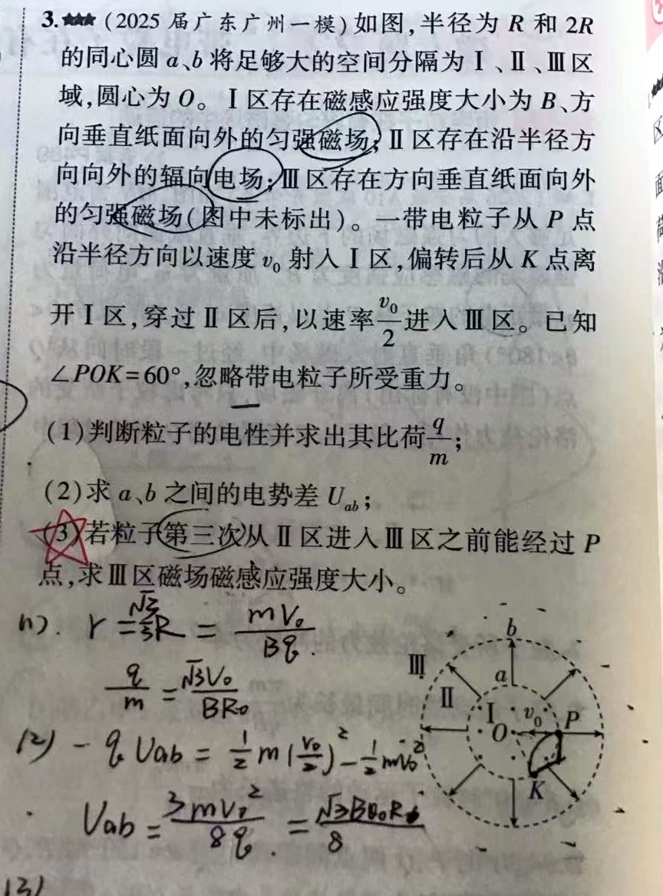
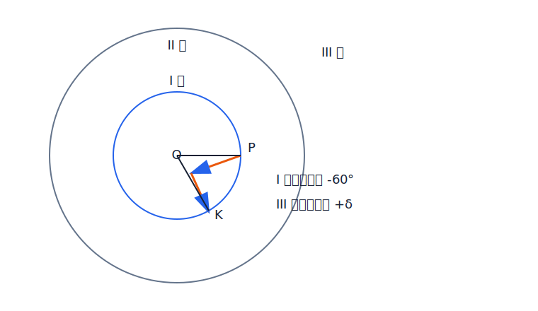

# 带电粒子在同心圆复合场中的运动

如图，半径分别为 $R$ 和 $2R$ 的同心圆 $a、b$ 将空间分隔为 I、II、III 区域，圆心为 $O$。

- I 区存在磁感应强度大小为 $B$、方向垂直纸面向外的匀强磁场；
- II 区存在沿半径方向向外的辐向电场；
- III 区存在方向垂直纸面向外的匀强磁场，磁感应强度大小未知。

一个带电粒子从 $P$ 点沿半径方向以速度 $v_0$ 射入 I 区，偏转后从 $K$ 点离开 I 区；穿过 II 区后，以速率 $v_0/2$ 进入 III 区。已知 $\angle POK=60^\circ$，忽略粒子重力。

求：

1. 粒子的电性，以及其比荷 $q/m$；
2. $a、b$ 两点间的电势差 $U_{ab}$；
3. 若粒子在第三次从 II 区进入 III 区之前能经过 $P$ 点，求 III 区磁感应强度大小。

---

# 解析（学生版）

{width=62%}

## 答案速览

- （1）粒子带负电，$\frac qm=-\frac{\sqrt3v_0}{BR}$。
- （2）$U_{ab}=\frac{\sqrt3}{8}BRv_0$。
- （3）$B_3=\frac B4,\frac{B}{4\sqrt3},\frac{B}{12}$。

## 一眼识别

- 看到磁场中沿圆边界半径方向进出：优先用切线交点结论 $r=R_{边界}\tan(\theta/2)$。
- 看到多区域重复往返：只记半径方向角，I 区每次 $-60^\circ$，III 区每次 $+\delta$，II 区不改角度。

## 详细解答

### （1）电性与比荷

P 点处正电荷受力应向上，而轨迹向下弯，所以粒子带负电。沿半径进出内圆边界，直接用切线交点结论求轨迹半径。

$$
r_1=R\tan30^\circ=\frac{R}{\sqrt3}
$$

$$
\frac{|q|}{m}=\frac{v_0}{Br_1}=\frac{\sqrt3v_0}{BR}
$$

$$
\boxed{\frac qm=-\frac{\sqrt3v_0}{BR}}
$$

### （2）电势差

II 区只有电场力做功，按 $U_{ab}=\varphi_a-\varphi_b$ 使用动能定理。

$$
qU_{ab}=\frac12m(\frac{v_0}{2})^2-\frac12mv_0^2=-\frac38mv_0^2
$$

$$
\boxed{U_{ab}=\frac{\sqrt3}{8}BRv_0}
$$

### （3）先把 B₃ 化成偏转角 δ

III 区沿外圆半径方向进出，外圆半径为 $2R$。

$$
r_3=2R\tan\frac{\delta}{2}
$$

$$
r_3=\frac{mv_0}{2|q|B_3}=\frac{BR}{2\sqrt3B_3}
$$

$$
B_3=\frac{B}{4\sqrt3\tan(\delta/2)}
$$

### （3）只检查能产生新答案的三个 P 点时刻

P 对应半径方向角为 $0^\circ$。第三次进入 III 区前，三个不同的首次到达条件如下；第二次返回 I 区前的条件只会重复 $\delta=60^\circ$，不产生新解。

$$
-60^\circ+\delta=0\Rightarrow\delta=60^\circ
$$

$$
-120^\circ+\delta=0\Rightarrow\delta=120^\circ
$$

$$
-180^\circ+2\delta=0\Rightarrow\delta=90^\circ
$$

$$
\boxed{B_3=\frac B4,\frac{B}{12},\frac{B}{4\sqrt3}}
$$

## 易错点

- “第三次进入之前”是截止条件，第二次进入之前经过 P 也符合。
- 二级结论 $r=R_{边界}\tan(\theta/2)$ 只在入、出速度都沿边界圆半径时使用。

## 30 秒自测

若 $B_3=B/12$，粒子在哪一次进入 III 区之前首次经过 P？
