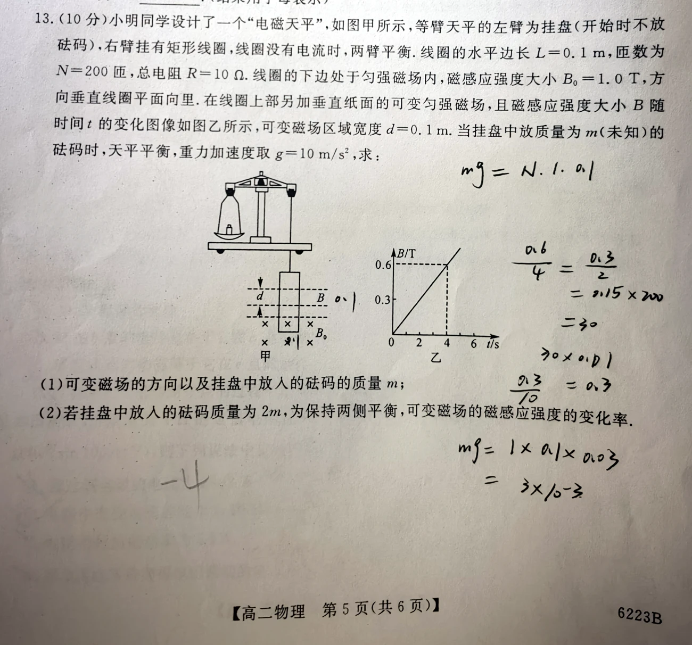
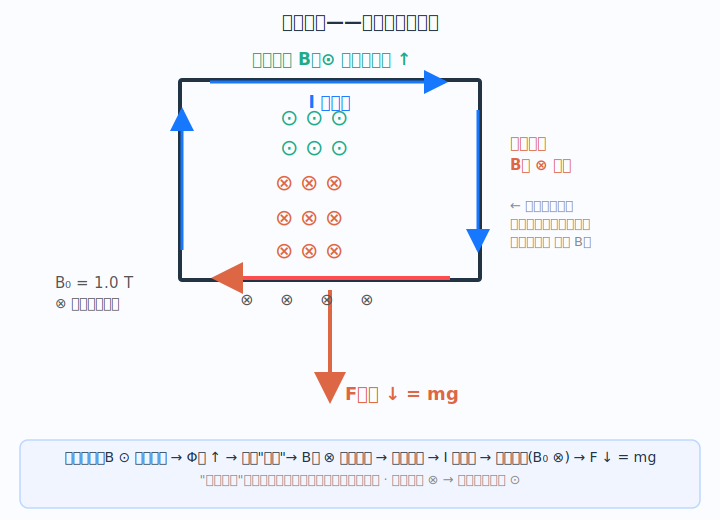

# 题目

小明同学设计了一个“电磁天平”，如图甲所示。等臂天平的左臂为挂盘（开始时不放砝码），右臂挂有矩形线圈，线圈没有电流时两臂平衡。线圈的水平边长 $L=0.1\,\mathrm m$，匝数 $N=200$ 匝，总电阻 $R=10\,\Omega$。线圈的下边处于匀强磁场内，磁感应强度大小 $B_0=1.0\,\mathrm T$，方向垂直线圈平面向里。在线圈上部另加垂直纸面的可变匀强磁场，且磁感应强度大小 $B$ 随时间 $t$ 的变化图像如图乙所示，可变磁场区域宽度 $d=0.1\,\mathrm m$。当挂盘中放质量为 $m$（未知）的砝码时，天平平衡，重力加速度取 $g=10\,\mathrm{m/s^2}$。求：

1. 可变磁场的方向以及挂盘中放入的砝码质量 $m$；
2. 若挂盘中放入的砝码质量为 $2m$，为保持两侧平衡，可变磁场的磁感应强度的变化率。

---

# 解析（学生版）

## 答案速览

- （1）可变磁场方向垂直纸面向外；$m=0.060\,\mathrm{kg}$。
- （2）所需磁感应强度变化率为 $0.30\,\mathrm{T/s}$，方向仍为随时间增强。

## 一眼识别

- 题型识别：变化磁场产生感应电流，固定磁场对线圈下边施加安培力。
- 最短主线：由天平确定安培力方向 → 左手定则得电流方向 → 右手螺旋定则得感应磁场方向 → 楞次定律"增反减同"反推可变磁场方向。
- 适用条件：线圈总电阻恒定、可变磁场覆盖面积为 $Ld$。

## 详细解答

### 第 1 步：由天平平衡确定安培力和电流方向

原来两臂平衡，左盘增加砝码后，右侧线圈必须受到大小为 $mg$ 的向下安培力，才能使天平恢复平衡。线圈下边处在固定磁场 $B_0$ 中，$B_0$ 方向垂直纸面向里（⊗）。

用**左手定则**：磁感线穿手心（向里），拇指指向受力方向（向下），四指指向即为电流方向——从右向左。因此线圈中的感应电流为**顺时针**方向。

### 第 2 步：右手螺旋定则与楞次定律——反推可变磁场方向

**① "顺时针电流 → 向里感应磁场"怎么理解？**

用**右手螺旋定则**（安培定则）：右手握住线圈，四指沿顺时针电流方向弯曲，大拇指所指方向即感应电流产生的磁场方向——垂直纸面向**里**（⊗）。这一步把"电流方向"翻译成"感应磁场方向"，是连接左手定则和楞次定律的桥梁。

**② 楞次定律告诉我们什么？**

楞次定律的核心是"阻碍变化"：感应电流的磁场总要阻碍引起感应电流的磁通量变化。

用高中常用的"**增反减同**"口诀记忆：
- 穿过线圈的磁通量**增大**时，感应磁场与原磁场方向**相反**；
- 穿过线圈的磁通量**减小**时，感应磁场与原磁场方向**相同**。

**③ 反推可变磁场方向**

图乙中可变磁场 $B$ 的大小在增大 → "增" → 感应磁场与原磁场方向"反"。

已知感应磁场垂直纸面向**里**，所以可变磁场（原磁场）方向应与它相反 → 垂直纸面向**外**（⊙）。

> ✅ 验证链条：可变磁场 ⊙ 向外且在增大 → 向外的磁通量 ↑ → 楞次定律：感应出 ⊗ 向里的磁场来阻碍 → 右手螺旋定则：产生顺时针感应电流 → 左手定则：下边受向下安培力 → 平衡 ✓

### 第 3 步：求感应电流

图乙斜率为

$$
k=\frac{\Delta B}{\Delta t}=\frac{0.6}{4}=0.15\,\mathrm{T/s}.
$$

感应电动势与电流分别为

$$
\mathcal E=NLd\,k,
\qquad
I=\frac{NLdk}{R}
=\frac{200\times0.1\times0.1\times0.15}{10}
=0.030\,\mathrm A.
$$

### 第 4 步：由平衡求质量

线圈下边 $N$ 匝均受安培力：

$$
mg=NB_0IL.
$$

代入数据得 $mg=0.60\,\mathrm N$，所以

$$
m=0.060\,\mathrm{kg}.
$$

### 第 5 步：质量变为 $2m$

安培力需变为原来的 2 倍。$F\propto I\propto |dB/dt|$，故

$$
\left|\frac{dB}{dt}\right|=2k=0.30\,\mathrm{T/s}.
$$

## 易错点

- >**错误表现**：把 $B_0$ 当作产生感应电流的磁场；
**纠正策略**：$B_0$ 负责安培力（左手定则），可变磁场负责产生感应电流（楞次定律），两者职责不同，不要混用。

- >**错误表现**：混淆左手定则和右手定则的使用场景；
**纠正策略**：判断受力方向用**左手**（$F=IL\times B$），判断感应电流/感应磁场方向用**右手**（螺旋定则 + 楞次定律）。

- >**错误表现**：漏掉匝数 $N$；
**纠正策略**：感应电动势和安培力两个环节都含 $N$，应分别写出。

## 30 秒自测

1. 若可变磁场改为向里且逐渐减小，线圈下边所受安培力方向是否改变？

   不改变。向里的磁通量减小，感应磁场仍向里，感应电流仍为顺时针，所以下边仍受向下安培力。

2. 若只把线圈总电阻改为 $20\,\Omega$，其余条件不变，第一次平衡时砝码质量变为多少？

   电阻加倍，感应电流减半，安培力也减半，所以 $m$ 变为 $0.030\,\mathrm{kg}$。
