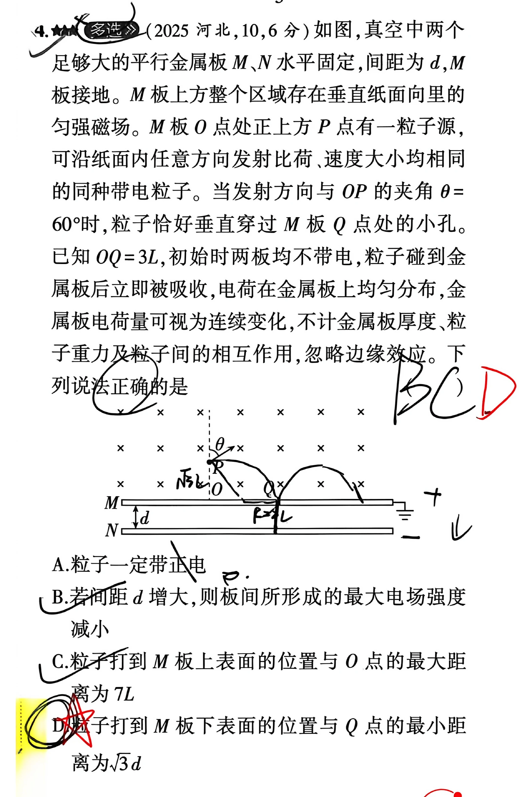
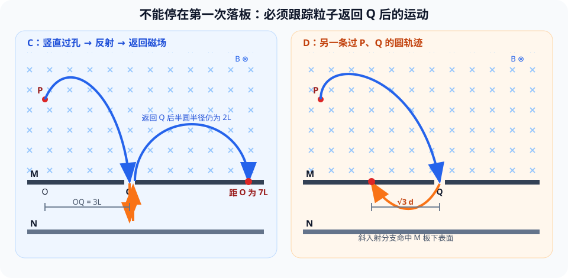

# 题目

4. （多选）（2025 河北，10，6 分）如图，真空中两个足够大的平行金属板 $M$、$N$ 水平固定，间距为 $d$，$M$ 板接地。$M$ 板上方整个区域存在垂直纸面向里的匀强磁场。$M$ 板 $O$ 点处正上方 $P$ 点有一粒子源，可沿纸面内任意方向发射比荷、速度大小均相同的同种带电粒子。当发射方向与 $OP$ 的夹角 $\theta=60^\circ$ 时，粒子恰好垂直穿过 $M$ 板 $Q$ 点处的小孔。已知 $OQ=3L$，初始时两板均不带电，粒子碰到金属板后立即被吸收，电荷在金属板上均匀分布，金属板电荷量可视为连续变化，不计金属板厚度、粒子重力及粒子间的相互作用，忽略边缘效应。下列说法正确的是

A. 粒子一定带正电

B. 若间距 $d$ 增大，则板间所形成的最大电场强度减小

C. 粒子打到 $M$ 板上表面的位置与 $O$ 点的最大距离为 $7L$

D. 粒子打到 $M$ 板下表面的位置与 $Q$ 点的最小距离为 $\sqrt{3}d$

---

# 解析（学生版）

## 答案速览

- 正确选项：$\boxed{\mathrm{BCD}}$。
- 粒子带负电，A 错。
- $E_{\max}=\frac{mv^2}{2|q|d}$，所以 $d$ 增大时最大场强减小，B 对。
- 竖直粒子经板间反射并返回 $Q$ 后，再在磁场中走半圆，最远落在距 $O$ 为 $7L$ 处，C 对。
- 另一条过 $P、Q$ 的斜入射轨迹返回 $M$ 板下表面时，距 $Q$ 为 $\sqrt3d$，D 对。

## 一眼识别

- 题型识别：同一批粒子经历“磁场圆弧—板间电场—返回磁场”的分段运动。
- 最短主线：先用已知轨迹定出 $q<0、r=2L、OP=\sqrt3L$，再分别跟踪“竖直过孔”和“斜向过孔”两条完整事件链。
- 可用二级结论：同种粒子的比荷和速率相同，在同一匀强磁场中的轨道半径相同；**适用条件**：磁场中只有洛伦兹力且速度与磁场垂直。

## 详细解答

### 第 1 步：由已知轨迹确定电性和轨道尺度

粒子从 $P$ 到 $Q$ 时顺时针偏转，在垂直纸面向里的磁场中对应负电荷，因此 A 错。

由 $Q$ 点速度竖直向下、圆心位于过 $Q$ 的水平线上，并结合 $P$ 点切线方向，有

$$
r=2L,\qquad OP=\sqrt3L.
$$

### 第 2 步：确定板间最大电场

负粒子不断被 $N$ 板吸收，板间电场逐渐增强。停止继续充电的临界条件是竖直穿过 $Q$ 的粒子恰好不能到达 $N$ 板。由动能定理，

$$
|q|E_{\max}d=\frac12mv^2
\quad\Rightarrow\quad
E_{\max}=\frac{mv^2}{2|q|d}.
$$

故 $d$ 增大时 $E_{\max}$ 减小，B 对。

### 第 3 步：跟踪反射后重新进入磁场的轨迹

只看粒子从 $P$ 首次落到 $M$ 板上表面，最远只能得到

$$
OX_{\text{首次}}\leq\sqrt{(2r)^2-OP^2}=\sqrt{13}L.
$$

但题目还允许粒子从小孔 $Q$ 进入板间。竖直粒子在临界状态下反向并由 $Q$ 返回磁场，速度变为竖直向上，速率仍为 $v$。新圆心在 $Q$ 右侧 $2L$，再走半圆后落在 $Q$ 右侧 $4L$：

$$
OX_{\max}=OQ+4L=3L+4L=7L.
$$

因此 C 对。关键是不能遗漏“返回 $Q$ 后继续在磁场中运动”这一段。

### 第 4 步：求下表面落点到 $Q$ 的最小距离

半径为 $2L$ 且经过 $P、Q$ 的圆只有两个。除竖直过孔轨迹外，另一条轨迹在 $Q$ 点斜向左下进入板间，其速度分量为

$$
|v_x|=\frac{\sqrt3}{2}v,\qquad |v_y|=\frac12v.
$$

在 $E_{\max}$ 下，粒子打到 M 板下表面有距离 Q 点有最短距离，故有

$$
a=\frac{|q|E_{\max}}m=\frac{v^2}{2d},\qquad
t=\frac{2|v_y|}{a}=\frac{2d}{v}.
$$

返回 $M$ 板下表面时的水平位移为

$$
\Delta x=|v_x|t
=\frac{\sqrt3}{2}v\cdot\frac{2d}{v}
=\sqrt3d.
$$

竖直轨迹返回的是小孔 $Q$，不属于撞击板面；故实际下表面落点到 $Q$ 的最小距离为 $\sqrt3d$，D 对。

## 易错点

- **错误表现**：只研究从 $P$ 到 $M$ 上表面的第一次磁偏转；**纠正策略**：按“进入区域—离开区域—是否被吸收”列完整事件链。
- **错误表现**：把返回小孔 $Q$ 当成撞击下表面；**纠正策略**：小孔不是金属板面，必须继续跟踪粒子。
- **错误表现**：认为所有过孔粒子都竖直进入；**纠正策略**：半径固定且经过 $P、Q$ 的圆有两个，应检查两种切向速度。

## 30 秒自测

为什么 $\sqrt{13}L$ 只是“首次落到上表面”的极值，而不是题目所问全部粒子运动中的最大距离？
