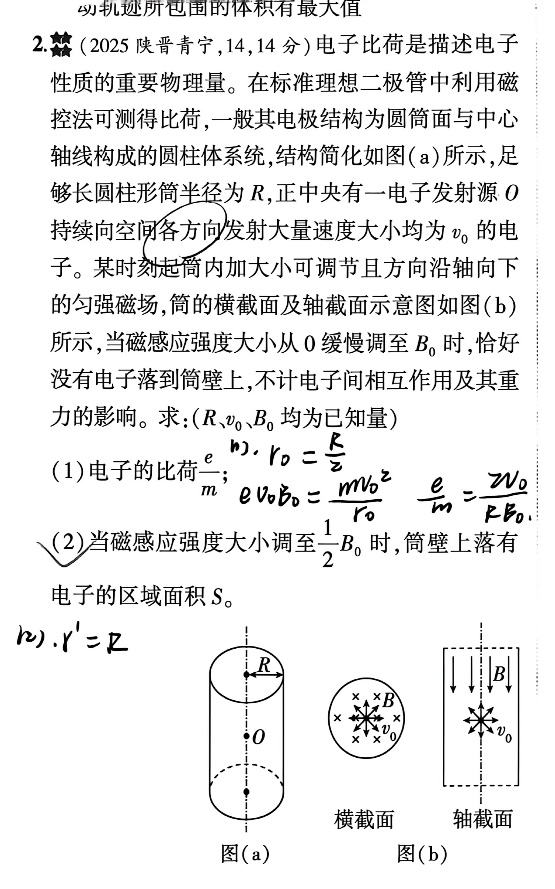
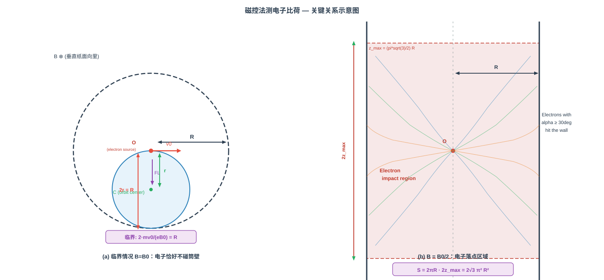

# 题目

2. （2025 陕晋青宁，14，14 分）电子比荷是描述电子性质的重要物理量。在标准理想二极管中利用磁控法可测得比荷，一般其电极结构为圆筒面与中心轴线构成的圆柱体系统。结构简化如图（a）所示，足够长圆柱形筒半径为 $R$，正中央有一电子发射源 $O$ 持续向空间各方向发射大量速度大小均为 $v_0$ 的电子。某时刻起筒内加大小可调节且方向沿轴向的匀强磁场，筒的横截面及轴截面示意图如图（b）所示。当磁感应强度大小从 $0$ 缓慢调至 $B_0$ 时，恰好没有电子落到筒壁上。不计电子间相互作用及其重力的影响。求：（$R$、$v_0$、$B_0$ 均为已知量）

（1）电子的比荷 $\dfrac{e}{m}$；

（2）当磁感应强度大小调至 $\dfrac{1}{2}B_0$ 时，筒壁上落有电子的区域面积 $S$。

---

# 解析（学生版）

## 答案速览

- （1）$\displaystyle \frac{e}{m} = \frac{2v_0}{B_0 R}$；
- （2）$S = 2\sqrt{3}\,\pi^2 R^2$。

## 一眼识别

- **题型识别**：磁场中带电粒子圆周运动 + 临界条件 + 三维空间落点区域面积。
- **最短主线**：电子从中心 O 以任意方向射出 → 垂直磁场分量决定回旋半径 $r = \frac{mv_\perp}{eB}$ → O 在圆周上，最远距离 $2r$ → 临界条件 $2r_{\max}=R$ 给出比荷 → 半磁场下只需 $\alpha \ge 30^\circ$ 的电子落壁 → 落点构成整个筒壁带，面积由轴向最远距离 $z_{\max}$ 确定。
- **可用二级结论**：
  - 匀强磁场中回旋半径 $r = \frac{mv_\perp}{|q|B}$，角频率 $\omega = \frac{|q|B}{m}$（与速度大小无关）；
  - 圆心角为 $\varphi$ 的圆弧耗时 $t = \frac{\varphi m}{|q|B}$（`magnetic-arc-time`）；
  - **适用条件**：只有磁场力做功，$v_\perp$ 不变。

## 详细解答

### 第 1 步：速度分解

设电子发射方向与轴线（$z$ 轴）的夹角为 $\alpha$（$0 \le \alpha \le \pi$），则

$$v_\perp = v_0\sin\alpha,\qquad v_\parallel = v_0\cos\alpha.$$

轴向速度 $v_\parallel$ 不受磁场影响，电子沿 $z$ 轴匀速运动；横截面内的 $v_\perp$ 在洛伦兹力作用下做匀速圆周运动。

### 第 2 步：横截面内的回旋运动

电子电荷为 $-e$，磁场沿 $+z$ 方向。在横截面内，洛伦兹力提供向心力：

$$ev_\perp B = \frac{m v_\perp^2}{r}\;\Longrightarrow\; r = \frac{m v_\perp}{eB}.$$

电子从 $O$ 点出发，$O$ 点在圆周上，因此轨道圆心 $C$ 距 $O$ 为 $r$，电子到 $O$ 的最大距离为 $2r$（轨道直径）。

### 第 3 步：临界条件求比荷

电子能到达的最远径向距离由 $v_\perp$ 最大的情况决定，即 $\alpha = 90^\circ$（纯横截面内发射，$v_\perp = v_0$）。当 $B$ 从 $0$ 调至 $B_0$ 时"恰好没有电子落到筒壁"，意味着最远电子正好擦壁：

$$2\cdot\frac{m v_0}{e B_0}=R.$$

因此

$$\boxed{\frac{e}{m} = \frac{2v_0}{B_0 R}}.$$

### 第 4 步：半磁场下的落壁条件

粒子是否能碰到筒壁由水平面的投影分量决定，

当 $B = \frac{1}{2}B_0$ 时，利用（1）的结果 $R = \frac{2m v_0}{e B_0}$，回旋半径变为

$$r' = \frac{m v_\perp}{e\cdot(B_0/2)} = \frac{2m v_\perp}{e B_0} = R\sin\alpha.$$

电子在横截面内的最远径向距离为 $2r' = 2R\sin\alpha$。落壁条件：$2R\sin\alpha \ge R$，即

$$\sin\alpha \ge \frac{1}{2}\;\Longrightarrow\;30^\circ \le \alpha \le 150^\circ.$$

### 第 5 步：落点轴向范围与壁面面积

而粒子在竖直方向上运动了多远的距离由速度的垂直分量决定。因此需要先求不同角度发射粒子的碰壁时间，才能知道它们碰壁的具体位置。运动时间 $ t $取决于粒子运动过程中转过的圆心角 $\phi$ 的大小：

斜向发射的粒子的投影圆的半径均为 $90^\circ$ 时发射粒子的 $|cos(\alpha -\pi/2)|$倍，即 $|sin(\alpha)|$。根据几何关系易得能够落到筒壁范围的粒子转过的圆心角为：

$$\varphi = \arcsin\!\left(\frac{R}{2r'}\right) = \arcsin\!\left(\frac{1}{2\sin\alpha}\right).$$

因此有：

$$z = v_\parallel t = v_0\cos\alpha \cdot \frac{2\varphi}{\omega}
    = 2R\cos\alpha \cdot \arcsin\!\left(\frac{1}{2\sin\alpha}\right).$$

我们注意到，在 $z(\alpha)$ 在 $\alpha \in [30^\circ,90^\circ]$ 上连续且单调递减；（另外一半$\alpha \in [90^\circ,150^\circ]$ 由于对称性的原因我们不予考虑）

因此有$|z|$ 在 $\alpha = 30^\circ$ 时最大：

$$|z|_{\max} = 2R\cdot\frac{\sqrt{3}}{2}\cdot\frac{\pi}{2}
            = \frac{\pi\sqrt{3}}{2}\,R.$$

由对称性给出对称的负半轴。因此落点铺满整个周向角 $\varphi \in [0,2\pi)$，构成高度为 $2z_{\max}$ 的完整圆筒带：

$$\boxed{S = 2\pi R \cdot 2z_{\max}
       = 2\pi R \cdot \pi\sqrt{3}\,R
       = 2\sqrt{3}\,\pi^2 R^2}.$$

## 易错点

>- **错误表现 1**：认为电子到 $O$ 的最远距离就是回旋半径 $r$，而不是 $2r$。
**纠正策略**：画轨迹图——电子从圆周上一点出发，圆心在 $O$ 外，$O$ 到圆周上最远点的距离是直径。

>- **错误表现 2**：利用能够接触到筒壁的粒子的角度直接计算覆盖的面积，忽略 $z$轴方向的移动
**纠正策略**：利用时间$\times$速度计算纵向位移，而不是利用$R\tan\alpha$直接计算。

>- **错误表现 3**：第（2）问中误以为只有周向一段弧面落电子，而没意识到落点铺满整个 $2\pi$ 周向角。因为对各 $\alpha$，电子在任意方位角方向发射，落点覆盖整个周向。

## 30 秒自测

遮住答案后回答：电子从圆柱中心 $O$ 向各方向发射速率 $v_0$，当磁场 $B$ 恰好使电子不碰半径 $R$ 的筒壁时，回旋半径 $r$ 与 $R$ 的关系是 $r = R/2$ 还是 $r = R$？为什么？
