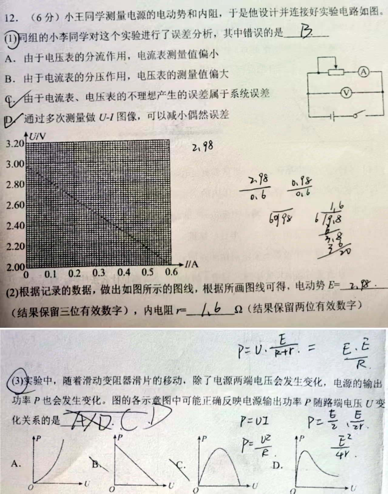
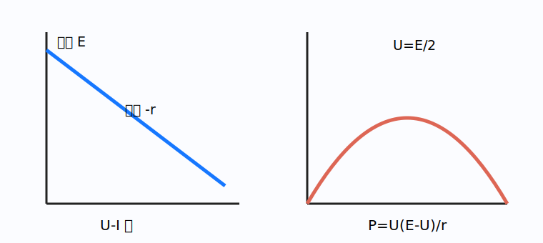

# 题目

{height=16.5cm}

小王同学测量电源的电动势和内阻，设计并连接好实验电路如图。

1. 同组的小李同学对这个实验进行误差分析，其中错误的是（　　）

   A. 由于电压表的分流作用，电流表测量值偏小  
   B. 由于电流表的分压作用，电压表的测量值偏大  
   C. 由于电流表、电压表的不理想产生的误差属于系统误差  
   D. 通过多次测量作 $U-I$ 图像，可以减小偶然误差

2. 根据记录的数据作出图示直线，根据图线求电动势 $E$（结果保留三位有效数字）和内电阻 $r$（结果保留两位有效数字）。

3. 随着滑动变阻器滑片移动，电源输出功率 $P$ 也发生变化。图中可能正确反映 $P$ 随路端电压 $U$ 变化关系的是（　　）

---

# 解析（学生版）

## 答案速览

- （1）错误的是 **B**。
- （2）由图读得 $E\approx2.98\,\mathrm V$，$r\approx1.6\,\Omega$。
- （3）正确图像为 **C**。

## 一眼识别

- 题型识别：$U=E-Ir$ 的截距、斜率与 $P(U)$ 的二次函数。
- 最短主线：$U-I$ 图纵截距是 $E$、斜率绝对值是 $r$；再消去 $I$ 得 $P-U$ 关系。

## 详细解答

### 第 1 步：判断误差说法

电压表并联在电源两端，会分走一小部分电流，电流表只测外电路该支路电流，所以相对电源总电流偏小，A 正确。电压表测的就是路端电压，不能把电流表内阻造成的压降说成“电压表示数偏大”，B 错。

电表非理想带来的偏差具有固定规律，属于系统误差；多组数据作图能减小偶然误差，所以 C、D 正确。第（1）问选 B。

### 第 2 步：由直线读参数

电源路端电压

$$
U=E-Ir.
$$

将图线延长至 $I=0$，纵截距约为 $2.98\,\mathrm V$，故 $E\approx2.98\,\mathrm V$。取图线上相距较远的两点求斜率，

$$
r=\left|\frac{\Delta U}{\Delta I}\right|\approx1.6\,\Omega.
$$

### 第 3 步：推导输出功率图像

由 $I=(E-U)/r$，

$$
P=UI=\frac{U(E-U)}{r}.
$$

这是开口向下的抛物线，在 $U=0$ 与 $U=E$ 时均为零，中间有最大值，因此选 C。

## 易错点

- >**错误表现**：用离得很近的两个点求斜率；
**纠正策略**：在线上取相距尽量远的点，降低读图误差。

- >**错误表现**：把 $P$ 写成 $U^2/R$ 后认为单调增；
**纠正策略**：滑片移动时外电阻 $R$ 也在变，应消去 $I$ 得 $P(U)$。

## 30 秒自测

$P-U$ 图像的顶点对应路端电压是多少？
