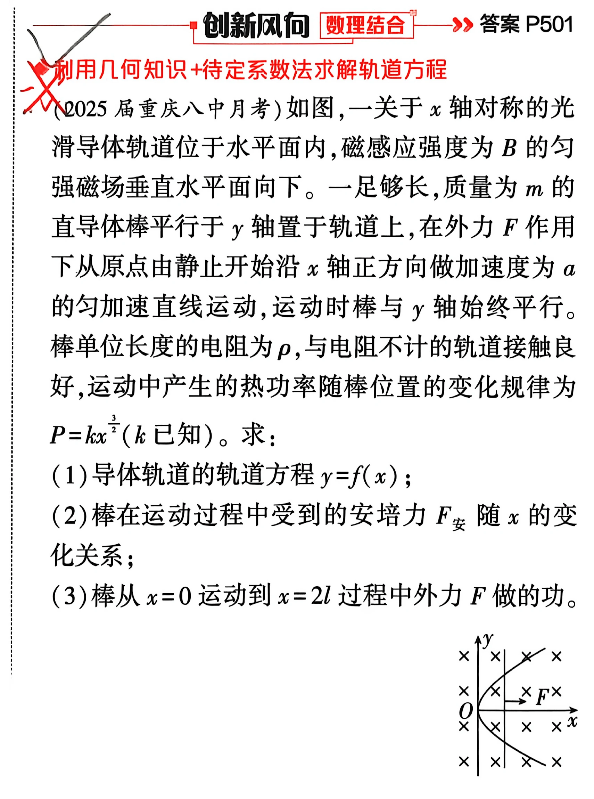
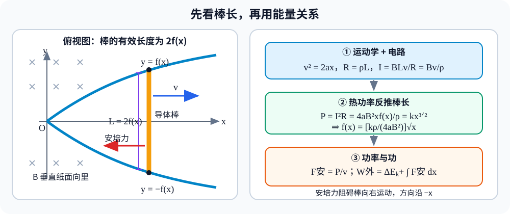

# 题目

◇ 创新风向 [数理结合] >> 答案 P501
利用几何知识+待定系数法求解轨道方程

（2025届重庆八中月考）如图，一关于x轴对称的光滑导体轨道位于水平面内，磁感应强度为B的匀强磁场垂直水平面向下。一足够长，质量为m的直导体棒平行于y轴置于轨道上，在外力F作用下从原点由静止开始沿x轴正方向做加速度为a的匀加速直线运动，运动时棒与y轴始终平行。棒单位长度的电阻为ρ，与电阻不计的轨道接触良好，运动中产生的热功率随棒位置的变化规律为 $P=kx^{3/2}$（k已知）。求：

（1）导体轨道的轨道方程 y=f(x)；
（2）棒在运动过程中受到的安培力 F安 随x的变化关系；
（3）棒从 x=0 运动到 x=2l 过程中外力F做的功。

---

# 解析（学生版）

## 答案速览

- （1）上轨道 $y=f(x)=C\sqrt{x}$，下轨道 $y=-f(x)$，其中 $C = \frac{k\rho}{4aB^{2}}$；等价地，两轨道合写为 $y^{2}=C^{2}x\;(x\ge 0)$；
- （2）$F_{\text{安}} = \frac{k}{\sqrt{2a}}\,x$，方向沿 $x$ 轴负方向；
- （3）$W = 2mal + \frac{2kl^{2}}{\sqrt{2a}}$。

## 一眼识别

- 题型识别：电磁感应中的导轨问题——由运动学与热功率条件反推轨道几何，再求安培力与外力功。
- 最短主线：运动学得速度 → 切割得电动势与电流 → 热功率条件定轨道方程 → 功率关系求安培力 → 动能定理（或牛二+积分）求外力功。
- 可用二级结论：$P = F_{\text{安}}v$（克服安培力的功率等于热功率）；匀加速 $v^{2}=2ax$；**适用条件**：轨道电阻不计、棒始终平行于 $y$ 轴。

## 详细解答

### 第 1 步：运动学关系

导体棒从原点由静止沿 $x$ 轴正方向做加速度 $a$ 的匀加速直线运动：

$$v^{2} = 2ax,\qquad v = \sqrt{2ax}.$$

### 第 2 步：电动势、电阻与电流

设轨道方程为 $y = f(x)\;(x\ge 0)$，由关于 $x$ 轴对称得上支 $y=f(x)$、下支 $y=-f(x)$。棒平行于 $y$ 轴，与轨道两接触点间有效切割长度

$$L = 2f(x).$$

磁感应强度 $B$ 垂直水平面向下，棒沿 $+x$ 方向运动。动生电动势大小：

$$\mathcal{E} = BLv = B\cdot 2f(x)\cdot v.$$

棒在接触点间的电阻（单位长度电阻 $\rho$，轨道电阻不计）：

$$R = \rho\cdot 2f(x).$$

感应电流：

$$I = \frac{\mathcal{E}}{R} = \frac{B\cdot 2f(x)\cdot v}{\rho\cdot 2f(x)} = \frac{Bv}{\rho}.$$

> $I$ 中 $2f(x)$ 恰好约去，电流与轨道形状无关。

### 第 3 步：由热功率定轨道方程

热功率

$$P = I^{2}R = \left(\frac{Bv}{\rho}\right)^{2}\cdot \rho\cdot 2f(x) = \frac{2B^{2}v^{2}}{\rho}\,f(x).$$

代入 $v^{2}=2ax$：

$$P = \frac{2B^{2}\cdot 2ax}{\rho}\,f(x) = \frac{4aB^{2}x}{\rho}\,f(x).$$

已知 $P = kx^{3/2}$，故

$$\frac{4aB^{2}x}{\rho}\,f(x) = kx^{3/2}
\quad\Longrightarrow\quad f(x) = \frac{k\rho}{4aB^{2}}\,x^{1/2}.$$

令 $C \equiv \frac{k\rho}{4aB^{2}}$，得上轨道方程

$$\boxed{y = C\sqrt{x}\qquad (x \ge 0)}.$$

下轨道为 $y=-C\sqrt{x}$；两轨道合写为 $y^{2}=C^{2}x$（开口向右的抛物线）。

### 第 4 步：安培力

安培力大小 $F_{\text{安}} = BIL$。代入 $I=Bv/\rho$ 与 $L=2f(x)$：

$$F_{\text{安}} = B\cdot\frac{Bv}{\rho}\cdot 2f(x) = \frac{2B^{2}v}{\rho}\,f(x).$$

代入 $v=\sqrt{2ax}$、$f(x)=C\sqrt{x}$ 及 $C=\frac{k\rho}{4aB^{2}}$：

$$\begin{aligned}
F_{\text{安}} &= \frac{2B^{2}\sqrt{2ax}}{\rho}\cdot C\sqrt{x}
= \frac{2B^{2}C\sqrt{2a}}{\rho}\,x \\[4pt]
&= \frac{2B^{2}\sqrt{2a}}{\rho}\cdot\frac{k\rho}{4aB^{2}}\,x
= \frac{k\sqrt{2a}}{2a}\,x
= \frac{k}{\sqrt{2a}}\,x.
\end{aligned}$$

$$\boxed{F_{\text{安}} = \frac{k}{\sqrt{2a}}\,x}.$$

由楞次定律，安培力方向沿 $x$ 轴负方向。

> 另法：$P = F_{\text{安}}v \;\Longrightarrow\; F_{\text{安}} = \frac{P}{v} = \frac{kx^{3/2}}{\sqrt{2ax}} = \frac{k}{\sqrt{2a}}\,x$，结果一致。

### 第 5 步：外力做功

由（2）知

$$
F_{\text{安}}=\frac{k}{\sqrt{2a}}x.
$$

其 $F_{\text{安}}-x$ 图像为三角形，故克服安培力做功

$$
W_{\text{安}}
=\frac12(2l)\cdot\frac{2kl}{\sqrt{2a}}
=\frac{2kl^2}{\sqrt{2a}}.
$$

又由 $v^2=2a(2l)$ 得

$$
\Delta E_k=\frac12mv^2=2mal.
$$

由动能定理：

$$
\boxed{W_F=2mal+\frac{2kl^2}{\sqrt{2a}}}.
$$

## 易错点

- **错误表现**：切割长度误取为 $f(x)$ 而遗漏系数 2（轨道有上下两支）；**纠正策略**：画俯视图标出上下轨接触点，确认有效长度为 $2f(x)$。
- **错误表现**：陷入含 $f(x)$ 的代数困境，误以为 $I$ 与轨道形状强耦合；**纠正策略**：先写出 $I = \mathcal{E}/R$，观察 $2f(x)$ 在分子分母约去，得 $I = Bv/\rho$ 与 $f(x)$ 无关。

## 30 秒自测

遮住答案后回答：为什么感应电流 $I = Bv/\rho$ 与棒长 $2f(x)$ 无关？若轨道电阻不可忽略，这个结论还成立吗？
