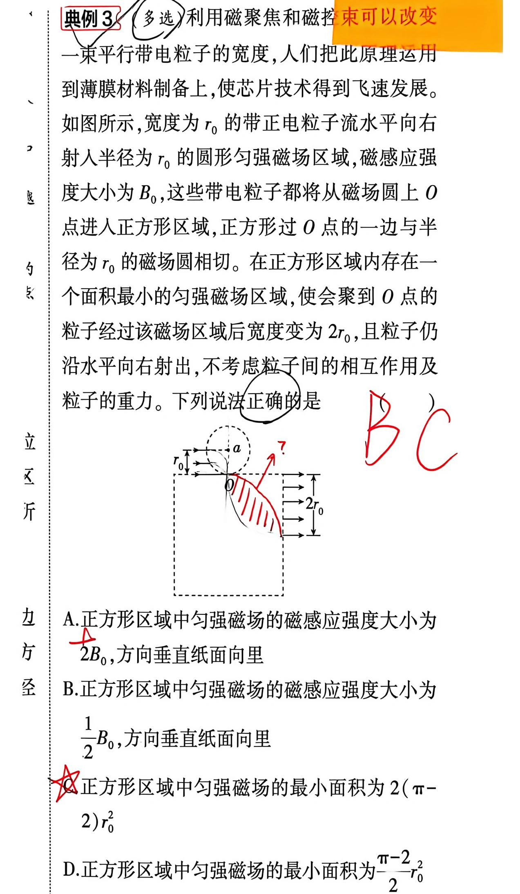
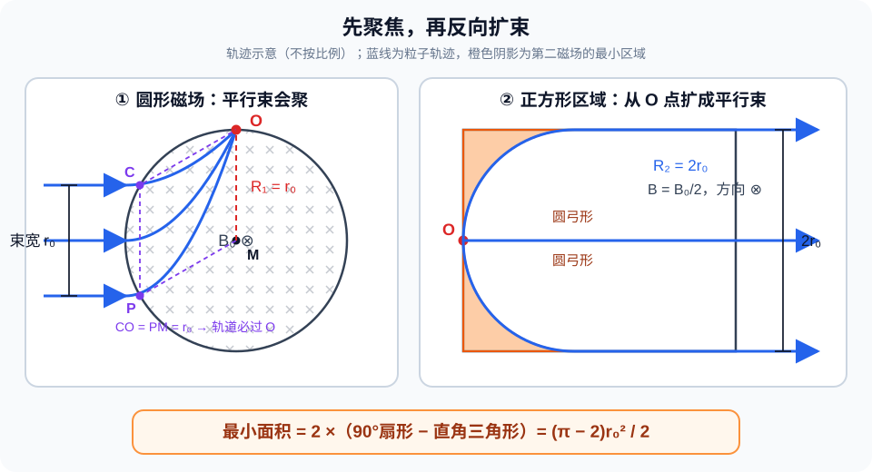

# 题目

典例 3（多选）利用磁聚焦和磁控束可以改变一束平行带电粒子的宽度，人们把此原理运用到薄膜材料制备上，使芯片技术得到飞速发展。如图所示，宽度为 $r_0$ 的带正电粒子流水平向右射入半径为 $r_0$ 的圆形匀强磁场区域，磁感应强度大小为 $B_0$，这些带电粒子都将从磁场圆上 $O$ 点进入正方形区域，正方形过 $O$ 点的一边与半径为 $r_0$ 的磁场圆相切。在正方形区域内存在一个面积最小的匀强磁场区域，使会聚到 $O$ 点的粒子经过该磁场区域后宽度变为 $2r_0$，且粒子仍沿水平向右射出，不考虑粒子间的相互作用及粒子的重力。下列说法正确的是（ ）

A. 正方形区域中匀强磁场的磁感应强度大小为 $2B_0$，方向垂直纸面向里

B. 正方形区域中匀强磁场的磁感应强度大小为 $\dfrac{1}{2}B_0$，方向垂直纸面向里

C. 正方形区域中匀强磁场的最小面积为 $2(\pi-2)r_0^2$

D. 正方形区域中匀强磁场的最小面积为 $\dfrac{\pi-2}{2}r_0^2$

---

# 解析（学生版）

读图时只抓住两点：第一次轨道半径为 $r_0$；扩束后的宽度是原来的 2 倍，所以第二次轨道半径也放大为 $2r_0$。橙色阴影就是必须有磁场的最小包络。

## 答案速览

- 正方形区域内的磁感应强度大小为 $B_0/2$，方向垂直纸面向里；
- 最小磁场面积为 $(\pi-2)r_0^2/2$；
- 正确选项：**B、D**。

## 一眼识别

- 题型识别：先用圆形磁场完成平行束聚焦，再用第二个磁场把会聚束反向展开成更宽的平行束。
- 最短主线：由两次聚焦、扩束的几何关系确定轨道半径，再用 $R=mv/(qB)$ 比较磁感应强度，最后计算轨迹包络面积。
- 可用二级结论：正电荷的洛伦兹力方向可用左手定则判断，并用“轨道圆心位于洛伦兹力一侧”复核；**适用条件**：速度不与磁场平行，且只判断磁场力方向。

## 详细解答

### 第 1 步：确定第一次磁聚焦的轨道半径

设粒子的质量为 $m$、电荷量为 $q$、速率为 $v$。粒子在匀强磁场中做匀速圆周运动，轨道半径为

$$
R=\frac{mv}{qB}.
$$

先说明为什么平行入射的粒子会聚到 $O$。设圆形磁场的圆心为 $M$，任取一粒子从圆周上的 $P$ 点水平向右进入磁场，其轨道圆心为 $C$。正电荷刚进入磁场时所受洛伦兹力竖直向上，所以 $C$ 在 $P$ 的正上方。又因为轨道半径与磁场圆半径都为 $r_0$，故

$$
\overrightarrow{PC}=\overrightarrow{MO}.
$$

也就是说，线段 $PC$ 与 $MO$ 等长且平行，因而 $PMOC$ 是平行四边形，于是

$$
CO=PM=r_0.
$$

$C$ 是粒子轨道的圆心，$CO=r_0$ 表明 $O$ 一定在这条粒子轨道上。由于 $P$ 可以是入射边界上的任意点，所以所有水平入射的粒子都经过同一个 $O$ 点，这就是磁聚焦。

因此该磁聚焦几何对应的轨道半径为

$$
R_1=r_0.
$$

因此

$$
\frac{mv}{qB_0}=r_0. \tag{1}
$$

### 第 2 步：由扩束宽度确定第二次运动半径

粒子从 $O$ 点以不同方向进入正方形区域。若要使它们重新水平向右射出，第二个磁场应完成第一次聚焦过程的反向几何变换。

第一次对应宽度 $r_0$、轨道半径 $r_0$；现在要求出射粒子束宽度变为 $2r_0$。相似的轨迹几何给出

$$
R_2=2r_0.
$$

这里的 $2r_0$ 是第二次圆周运动的半径，不是把束宽机械地当成轨道直径。

### 第 3 步：求第二个磁场的大小和方向

粒子速率不变，由式（1）及 $R_2=2r_0$ 得

$$
\frac{B}{B_0}=\frac{R_1}{R_2}=\frac{r_0}{2r_0}=\frac12,
$$

所以

$$
B=\frac12B_0.
$$

正电荷在 $O$ 点之后必须向能使各条轨迹逐渐恢复水平的方向弯曲。按左手定则判断，并以“轨道圆心位于洛伦兹力一侧”复核，可知磁场方向应垂直纸面向里。故 **B 正确，A 错误**。

### 第 4 步：求最小磁场区域面积

从汇聚转成平行粒子束相当于一个反向的“磁约束”过程，此时圆形磁场II的中心理论上位于 $O$点下方 $2r_0$处。为了使每个粒子恰好完成所需偏转，磁场只需覆盖全部实际圆弧轨迹扫过的包络区域；再增加其他区域不会改变结果，只会使面积增大。该包络可分成两个全等的圆弓形。每个圆弓形等于半径为 $r_0$、圆心角为 $90^\circ$ 的扇形减去对应的直角三角形：

$$
S_1=\frac14\pi r_0^2-\frac12r_0^2
=\frac{\pi-2}{4}r_0^2.
$$

因此最小总面积为

$$
S_{\min}=2S_1
=\frac{\pi-2}{2}r_0^2.
$$

故 **D 正确，C 错误**。

## 易错点

>- **错误表现**：认为两次磁场中的轨道半径相同；
**纠正策略**：先由最终束宽写出第二次轨迹的几何尺度，再比较磁场大小。

>- **错误表现**：看到出射宽度 $2r_0$，就把它直接当成轨道直径；
**纠正策略**：根据聚焦与扩束的相似几何判断，此处第二次轨道半径为 $2r_0$。

>- **错误表现**：把整个扇形都计入磁场区域；**纠正策略**：
最小区域应取圆弧族实际扫过的包络，即两个圆弓形。

>- **错误表现**：只凭轨迹弯向判断磁场方向；**纠正策略**：
先按正电荷使用左手定则，再检查轨道圆心是否位于受力一侧。

## 30 秒自测

若出射粒子束的宽度扩大到原来的 $k$ 倍，在其他条件不变时，第二个磁场的轨道半径和磁感应强度分别应变为第一次的多少倍？
