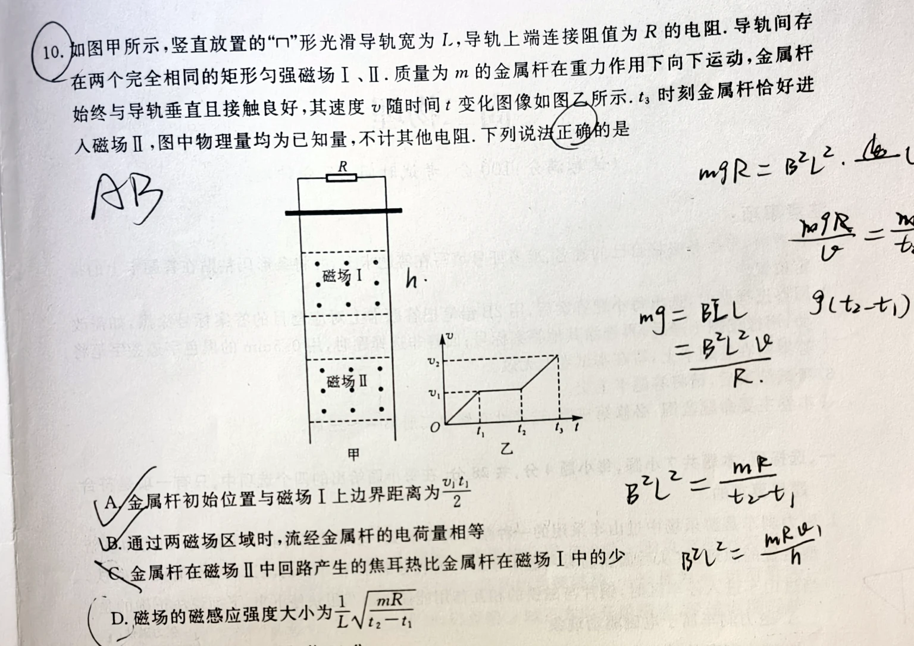
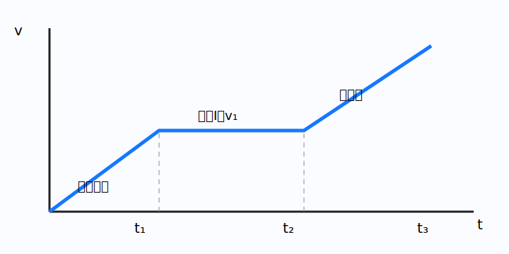

# 题目

如图甲所示，竖直放置的“∩”形光滑导轨宽为 $L$，导轨上端连接阻值为 $R$ 的电阻，导轨间存在两个完全相同的矩形匀强磁场Ⅰ、Ⅱ。质量为 $m$ 的金属杆在重力作用下向下运动，金属杆始终与导轨垂直接触良好，其速度 $v$ 随时间 $t$ 变化的图像如图乙所示。$t_3$ 时刻金属杆恰好进入磁场Ⅱ，图中物理量均为已知量，不计其他电阻。下列说法正确的是（　　）

A. 金属杆初始位置与磁场Ⅰ上边界距离为 $\frac{v_1t_1}{2}$  
B. 通过两磁场区域时，流经金属杆的电荷量相等  
C. 金属杆在磁场Ⅱ中回路产生的焦耳热比金属杆在磁场Ⅰ中的少  
D. 磁场的磁感应强度大小为 $\frac1L\sqrt{\frac{mR}{t_2-t_1}}$

---

# 解析（学生版）

## 答案速览

- 正确选项：**A、B**。
- 两相同磁场区的感应电荷量相等；第二磁场中的焦耳热更多；D 式中的时间应与加速段 $t_1$ 对应。

## 一眼识别

- 题型识别：把 $v-t$ 图像的斜率、面积分别对应加速度和位移。
- 最短主线：入磁场前自由落体，磁场Ⅰ中以终端速度匀速，离开后再加速。
- 可用结论：$q=\frac{BL\Delta x}{R}$；适用条件是单杆切割、总电阻恒定。

## 详细解答

### 第 1 步：判断初始距离

$0\sim t_1$ 为从静止开始的自由落体，且 $v_1=gt_1$。初始位置到磁场Ⅰ上边界的距离是图像下的三角形面积：

$$
x=\frac12v_1t_1.
$$

A 对。

### 第 2 步：比较两区通过的电荷量

杆通过每个完全相同的磁场区域时，磁通量变化量相同：

$$
q=\int I\,dt=\frac{BL}{R}\int v\,dt=\frac{BLh}{R}.
$$

所以两次电荷量相等，B 对。

### 第 3 步：比较焦耳热

磁场Ⅰ中杆以终端速度 $v_1$ 运动。进入磁场Ⅱ时速度 $v_2>v_1$，随后在安培力作用下减速趋近 $v_1$。由于

$$
Q=\frac{B^2L^2}{R}\int v\,dx,
$$

同样位移内磁场Ⅱ中的速度整体更大，所以 $Q_2>Q_1$，C 错。

### 第 4 步：检查 D

终端速度满足 $mg=B^2L^2v_1/R$；又由第一段斜率 $g=v_1/t_1$，得

$$
B=\frac1L\sqrt{\frac{mR}{t_1}},
$$

不是题给的 $t_2-t_1$，D 错。

## 易错点

- >**错误表现**：只因两磁场相同就断言焦耳热相同；
**纠正策略**：电荷量只看位移，热量还与速度有关。

- >**错误表现**：把匀速段时长直接当作电磁阻尼时间常量；
**纠正策略**：先由图像斜率求 $g$。

## 30 秒自测

为什么两区的感应电荷量相等，却允许焦耳热不同？
