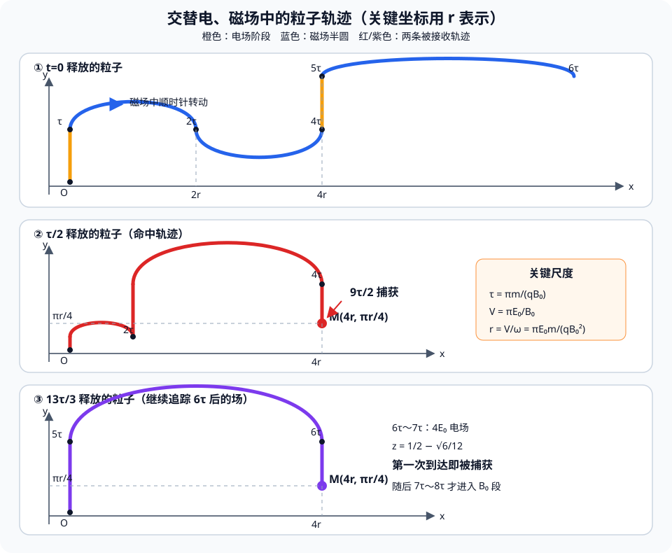

# 题目

2. （2022 河北，14，16 分）两块面积和间距均足够大的金属板水平放置，$y$ 轴垂直于金属板。金属板与可调电源相连形成电场，方向沿 $y$ 轴正方向。在两板之间施加磁场，方向垂直 $xOy$ 平面向外。电场强度和磁感应强度随时间的变化规律为图2所示(该图分为上下两幅子图，横轴均为无量纲时间$t/\left(\dfrac{\pi m}{qB_0}\right)$，上图电场强度$E$呈分段阶梯式递增（$0 \to 1$为$E_0$、$2 \to 3$为$2E_0$、$4 \to 5$为$3E_0$、$6 \to 7$为$4E_0$,其余时间为$0$），下图磁感应强度$B$从$1 \to 8$，周期为2，第一个周期$B_{0\to 1}=0$，$B_{1\to 2}=B_0$)。板间 $O$ 点放置一粒子源，可连续释放质量为 $m$、电荷量为 $q(q>0)$、初速度为零的粒子，不计重力及粒子间的相互作用，图中物理量均为已知量。求：

（1）$t=0$ 时刻释放的粒子，在 $t=\dfrac{2\pi m}{qB_0}$ 时刻的位置坐标；

（2）在 $0\sim\dfrac{6\pi m}{qB_0}$ 时间内，静电力对 $t=0$ 时刻释放的粒子所做的功；

（3）在 $M\left(\dfrac{4\pi E_0m}{qB_0^2},\dfrac{\pi^2E_0m}{4qB_0^2}\right)$ 点放置一粒子接收器，在 $0\sim\dfrac{6\pi m}{qB_0}$ 时间内什么时刻释放的粒子在电场存在期间被捕获。

---

# 解析（学生版）

## 答案速览

- （1）粒子的位置坐标为
  $$
  \boxed{\left(\frac{2\pi E_0m}{qB_0^2},\frac{\pi^2E_0m}{2qB_0^2}\right)}；
  $$
- （2）静电力所做的功为
  $$
  \boxed{W=\frac{2\pi^2mE_0^2}{B_0^2}}；
  $$
- （3）符合条件的释放时刻有两个：
  $$
  \boxed{t_0=\frac{\tau}{2}=\frac{\pi m}{2qB_0}}
  $$
  和
  $$
  \boxed{t_0=\frac{13\tau}{3}=\frac{13\pi m}{3qB_0}}。
  $$
  前者在
  $$
  t_c=\frac{9\tau}{2}
  $$
  时被捕获；后者在
  $$
  t_c=\left(\frac{13}{2}-\frac{\sqrt6}{12}\right)\tau
  $$
  时第一次到达接收器并被捕获。

## 一眼识别

- 题型识别：电场加速与磁场半圆运动交替进行的分段运动问题。
- 最短主线：先识别场的持续规律，再按六个释放区间用横坐标筛选，最后用纵坐标确定两个释放时刻。
- 可用二级结论：在磁场中运动半个周期后，速度反向；若进入磁场时速度为 $(v_x,v_y)$，则半周期位移为 $(2v_y/\omega,-2v_x/\omega)$。**适用条件**：磁场恒为 $B_0$，区域内只有洛伦兹力，且运动时间为半个回旋周期。

## 详细解答

### 第 1 步：建立统一的尺度和半周期规律

由半周期可得角速度

$$
\tau=\frac{\pi m}{qB_0},\qquad \omega=\frac{qB_0}{m},
$$

可得第一段电场加速后的末速度及第一段磁场运动的圆周运动半径

$$
v=\frac{qE_0}{m}\tau=\frac{\pi E_0}{B_0},
\qquad
r=\frac{v}{\omega}=\frac{\pi E_0m}{qB_0^2}.
$$

磁场垂直纸面向外，正粒子所受洛伦兹力使速度顺时针转动。粒子在磁场中运动时间 $\tau=\pi/\omega$，恰好转过半周，因此

$$
(v_x,v_y)\longrightarrow(-v_x,-v_y),
$$

同时

$$
(\Delta x,\Delta y)=\left(\frac{2v_y}{\omega},-\frac{2v_x}{\omega}\right).
$$

本题各电场段中粒子的 $v_x=0$，所以完整磁场段只改变横坐标，不改变纵坐标。

### 第 2 步：求 $t=2\tau$ 时的位置

在 $0\sim\tau$ 内，只有电场 $E_0$。粒子从静止出发，故

$$
v_y=v,
\qquad
y=\frac12\frac{qE_0}{m}\tau^2
  =\frac{\pi^2E_0m}{2qB_0^2}.
$$

在 $\tau\sim2\tau$ 内，粒子在磁场中运动半周，其横向位移为

$$
\Delta x=2r=\frac{2\pi E_0m}{qB_0^2},
$$

纵向位移为零。因此

$$
\boxed{(x,y)=\left(\frac{2\pi E_0m}{qB_0^2},
\frac{\pi^2E_0m}{2qB_0^2}\right)}.
$$

### 第 3 步：用动能变化求静电力做功

以 $v$ 为速度单位，各电场段前后的纵向速度依次为

| 电场时间段 | 电场强度 | 初速度 | 末速度 | 静电力做功 |
|---|---:|---:|---:|---:|
| $0\sim\tau$ | $E_0$ | $0$ | $v$ | $\frac12mv^2$ |
| $2\tau\sim3\tau$ | $2E_0$ | $-v$ | $v$ | $0$ |
| $4\tau\sim5\tau$ | $3E_0$ | $-v$ | $2v$ | $\frac32mv^2$ |

磁场力不做功，所以在 $0\sim6\tau$ 内，静电力的总功为

$$
W=\frac12 m(2v)^2
 =\boxed{\frac{2\pi^2mE_0^2}{B_0^2}}.
$$

### 第 4 步：用横坐标筛选可能的释放时段

接收器的坐标可写成

$$
M\left(4r,\frac{\pi r}{4}\right).
$$

设粒子在第一次电场段的 $t=\alpha\tau$ 时释放，其中 $0\leq\alpha\leq1$；再令

$$
d=1-\alpha,
$$

即粒子在第一次电场中实际运动了 $d\tau$ 的时间。

第一次电场结束时速度为 $dv$，可得第一次磁场段产生的横向位移为 $2dr$ 。 (磁场转动周期与速度无关，$ T=\frac{2\pi m}{qB_0}$，周期相同则角速度相同，半径$\propto\frac{速度}{角速度}\propto 速度$)

第二次电场结束时速度为 $(2-d)v$，第二次磁场段又产生横向位移 $2(2-d)r$。因此第三次电场开始时
$$
x=2dr+2(2-d)r=4r.
$$

所以第一次电场期间释放的粒子，都会在第三次电场期间保持 $x=4r$。

题图在 $6\tau$ 后仍按同一规律变化：

$$
[2n\tau,(2n+1)\tau]:\ E=(n+1)E_0,\qquad
[(2n+1)\tau,(2n+2)\tau]:\ B=B_0.
$$

题目限制的是“在 $0\sim6\tau$ 内释放”，不是“必须在 $6\tau$ 前被捕获”，所以六个释放区间都要检查：

| 释放时段 | 到随后电场段的横坐标 | 判断 |
|---|---:|---|
| $0\sim\tau$ | 到 $4\tau$ 时恒有 $x=4r$ | 保留，继续查纵坐标 |
| $\tau\sim2\tau$ | 静止到 $2\tau$，到 $4\tau$ 时 $x=4r$ | 纵坐标最低仍过高 |
| $2\tau\sim3\tau$ | 设剩余时间为 $s\tau$，到 $4\tau$ 时 $x=4sr$ | 仅 $s=1$ 可取 $4r$，即并入 $t_0=2\tau$ 的端点 |
| $3\tau\sim4\tau$ | 静止到 $4\tau$ | 在 $4\tau\sim5\tau$ 内始终 $x=0$ |
| $4\tau\sim5\tau$ | 设剩余时间为 $d\tau$，到 $6\tau$ 时 $x=6dr$ | 取 $d=2/3$ 时可在下一电场段命中 |
| $5\tau\sim6\tau$ | 静止到 $6\tau$ | 在 $6\tau\sim7\tau$ 内始终 $x=0$ |

对于 $\tau\sim2\tau$ 释放的粒子，它等效于在 $2\tau$ 从静止释放。进入 $4\tau\sim5\tau$ 后若再运动 $z\tau$，则

$$
\frac{y}{\pi r}=1-2z+\frac32z^2\geq\frac13>\frac14,
$$

所以不能到达 $M$。这也排除了 $2\tau\sim3\tau$ 的端点 $t_0=2\tau$。

### 第 5 步：用纵坐标确定两个释放时刻

利用电磁场半周期关系，易得 $v\tau=\pi r$， 与 $v=a\tau$ 易得 $a\tau^2=\pi r$，由 $y = \frac{1}{2} at^2$得第一段电场 $y$ 轴位移:
$$
\Delta y_1= \frac{1}{2} a(d\tau)^2 =\frac{\pi r}{2}d^2
$$
第二段电场位移为：
$$
\Delta y_2=(-dv)\tau+\frac{1}{2}(2a)\tau^2=-dv\tau+a\tau^2 = \pi r(-d+1)
$$

因此第三次电场开始时，该粒子的纵坐标和纵向速度分别为：

$$
\Delta y=\pi r\left(\frac{d^2}{2}-d+1\right),

v_{y0}=(d-2)v.
$$
令粒子进入第三次电场后又运动了 $z\tau$，其中 $0\leq z\leq1$，在强度为 $3E_0$ 的电场中运动 $z\tau$ 后，令纵坐标等于 $M$ 点纵坐标，得到(已约掉 $\pi r$):

$$
\frac{d^2}{2}-d+1+(d-2)z+
\frac32z^2=\frac14.
$$

把它看成关于 $d$ 的二次方程，其判别式为

$$
\Delta=(z-1)^2-2\left(\frac{3}{2} z^2-2z+\frac34 \right)
      =-2\left(z-\frac12\right)^2.
$$

要有实数解，只能有

$$
z=\frac12,
\qquad d=\frac12.
$$

于是

$$
\alpha=1-d=\frac12.
$$

故第一种释放时刻为

$$
\boxed{t_0=\frac{\tau}{2}=\frac{\pi m}{2qB_0}}.
$$

粒子在第三次电场段的中点到达 $M$，捕获时刻为

$$
t=\left(4+\frac12\right)\tau
 =\boxed{\frac{9\pi m}{2qB_0}}.
$$

还要检查 $4\tau\sim5\tau$ 内释放的粒子。令它在该段剩余电场时间为 $d\tau$。经过 $5\tau\sim6\tau$ 的半圆运动后，横坐标为

$$
x=2(3dv/\omega)=6dr.
$$

在下一段 $6\tau\sim7\tau$ 的 $4E_0$ 电场中，横坐标不变。由 $x=4r$ 得

$$
d=\frac23,\qquad
\boxed{t_0=5\tau-\frac23\tau=\frac{13\tau}{3}}.
$$

该粒子在 $6\tau$ 时满足

$$
\frac{y_0}{\pi r}=\frac32d^2=\frac23,\qquad v_{y0}=-3dv=-2v.
$$

进入 $4E_0$ 电场后再运动 $z\tau$，由 $y=\pi r/4$ 得

$$
\frac23-2z+2z^2=\frac14,
$$

所以

$$
z=\frac12\pm\frac{\sqrt6}{12}.
$$

接收器会在第一次相遇时捕获粒子，故捕获时刻为

$$
t_c=\left(6+\frac12-\frac{\sqrt6}{12}\right)\tau
=\boxed{\left(\frac{13}{2}-\frac{\sqrt6}{12}\right)\frac{\pi m}{qB_0}}.
$$

其余释放区间在随后的电场段中要么始终 $x=0$，要么横坐标已经超过 $4r$ 且以后每个完整磁场段的横向位移均为正，因此不会产生新的捕获时刻。

## 易错点

- **错误表现**：把磁场力方向判断反，或认为磁场力改变速率；**纠正策略**：先用 $\boldsymbol F=q\boldsymbol v\times\boldsymbol B$ 定圆心方向，再记住磁场力不做功。
- **错误表现**：把 $0\sim6\tau$ 误读成捕获截止时间，并漏掉第二、第三次电场中的释放；**纠正策略**：该时间窗只限定释放时刻，要按六个区间枚举并继续追踪后续周期。
- **错误表现**：横坐标满足条件后就判定捕获；**纠正策略**：还要在同一时刻核对纵坐标，并确认当时电场存在。

## 30 秒自测

为什么在 $4\tau\sim5\tau$ 内释放的粒子仍可能在 $6\tau$ 以后被捕获？由 $x_M=4r$ 能立刻求出它在该电场段内还应运动多长时间吗？
