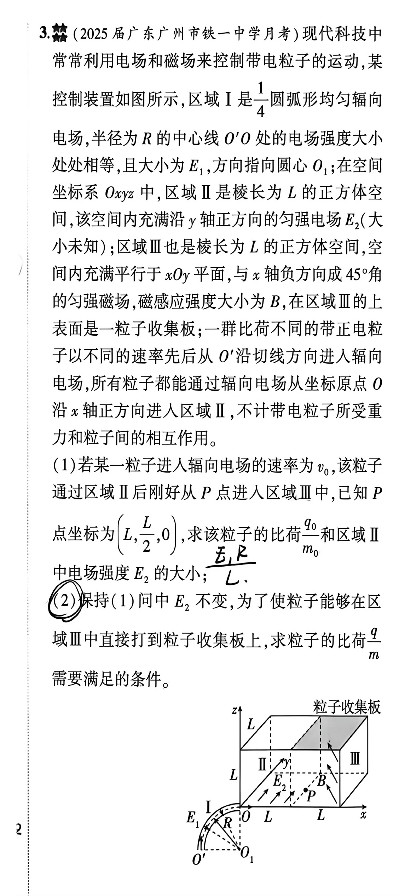
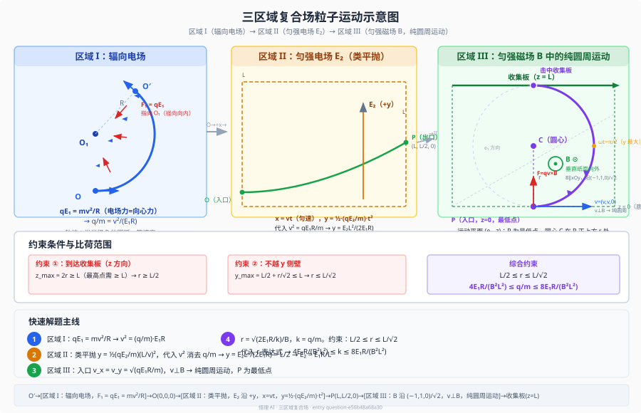

# 题目

## 题目正文

**3.**（2025 届广东广州市铁一中学月考）现代科技中常常利用电场和磁场来控制带电粒子的运动，某控制装置如图所示。区域 I 是一圆弧形均匀辐向电场，半径为 $R$ 的中心线 $O'O$ 处的电场强度大小处处相等，且大小为 $E_1$，方向指向圆心 $O_1$；在空间坐标系 $Oxyz$ 中，区域 II 是棱长为 $L$ 的正方体空间，该空间内充满沿 $y$ 轴正方向的匀强电场 $E_2$（大小未知）；区域 III 也是棱长为 $L$ 的正方体空间，空间内充满平行于 $xOy$ 平面、与 $x$ 轴负方向成 $45^\circ$ 角的匀强磁场，磁感应强度大小为 $B$，在区域 III 的上表面是一粒子收集板；一群比荷不同的带正电粒子以不同的速率先后从 $O'$ 沿切线方向进入辐向电场，所有粒子都能通过辐向电场从坐标原点 $O$ 沿 $x$ 轴正方向进入区域 II，不计带电粒子所受重力和粒子间的相互作用。

（1）若某一粒子进入辐向电场的速率为 $v_0$，该粒子通过区域 II 后刚好从 $P$ 点进入区域 III 中，已知 $P$ 点坐标为 $(L,\ L/2,\ 0)$，求该粒子的比荷 $\dfrac{q_0}{m_0}$ 和区域 II 中电场强度 $E_2$ 的大小。

（2）保持（1）问中 $E_2$ 不变，为了使粒子能留在区域 III 中直接打到粒子收集板上，求粒子的比荷 $\dfrac{q}{m}$ 需要满足的条件。

---

# 解析（学生版）

## 答案速览

- （1）$\displaystyle\frac{q_0}{m_0}=\frac{v_0^2}{E_1R}$，$E_2=\displaystyle\frac{E_1R}{L}$。
- （2）$\displaystyle\frac{4E_1R}{B^2L^2}\le \frac{q}{m}\le \frac{8E_1R}{B^2L^2}$。

## 一眼识别

- **题型识别**：带电粒子在辐向电场 + 匀强电场 + 匀强磁场三区域中的复合运动。
- **最短主线**：区域 I（辐向电场提供向心力，做等速率圆弧运动）→ 区域 II（匀强电场中类平抛）→ 区域 III（洛伦兹力驱动纯圆周运动；P 点为圆周最低点），三段独立建模再联立。
- **可用二级结论**：
  - 匀强磁场中圆弧偏转角对应时间 $t=\dfrac{\varphi m}{|q|B}$；
  - 弦长与半径关系 $L=2r\sin(\theta/2)$。
  - **适用条件**：区域内只有匀强磁场，$\varphi$ 使用弧度制。

## 详细解答

### 第 1 步：区域 I —— 辐向电场中的圆周运动

辐向电场方向沿径向指向圆心 $O_1$，中心线 $O'O$ 处场强大小为 $E_1$。带正电粒子所受电场力 $\mathbf{F}_1 = q\mathbf{E}_1$ 恒指向 $O_1$。该力恰好提供粒子沿半径 $R$ 圆弧做圆周运动所需的向心力：

$$
qE_1 = m\frac{v^2}{R}
\qquad\Longrightarrow\qquad
\frac{q}{m} = \frac{v^2}{E_1R} \tag{1}
$$

记比荷 $k = q/m$，则粒子在此区域出口处的速率 $v = \sqrt{kE_1R}$。

对第（1）问中速率为 $v_0$ 的特定粒子：

$$\boxed{\frac{q_0}{m_0} = \frac{v_0^2}{E_1R}}$$

### 第 2 步：区域 II —— 匀强电场中的类平抛

区域 II 为边长 $L$ 的立方体，$E_2$ 沿 $+y$ 方向。粒子自 $O(0,0,0)$ 以速率 $v$ 沿 $+x$ 射入。

- $x$ 方向匀速：$x = vt$
- $y$ 方向匀加速（$a_y = kE_2$）：$y = \frac12 kE_2 t^2$

粒子到达右边界 $x = L$ 历时 $t = L/v$，偏移量：

$$
y = \frac12 kE_2 \left(\frac{L}{v}\right)^2
$$

代入式 (1) 的 $v^2 = kE_1R$：

$$
y = \frac12 kE_2 \cdot \frac{L^2}{kE_1R} = \frac{E_2 L^2}{2E_1R}
$$

**关键发现**：$y$ 表达式中 $k$ 被消去——任意比荷的粒子在区域 II 的偏转量完全相同。

对第（1）问：粒子恰到达 $P(L,\,L/2,\,0)$，故 $y = L/2$：

$$
\frac{E_2 L^2}{2E_1R} = \frac{L}{2}
\qquad\Longrightarrow\qquad
\boxed{E_2 = \frac{E_1R}{L}}
$$

### 第 3 步：区域 III 入口速度（通解）

保持 $E_2 = E_1R/L$ 不变，考虑任意比荷 $k$ 的粒子。由式 (1)，区域 II 入口速率 $v = \sqrt{kE_1R}$。出口处：

- $v_x = v = \sqrt{kE_1R}$
- $v_y = kE_2 t = k\cdot\dfrac{E_1R}{L}\cdot\dfrac{L}{\sqrt{kE_1R}} = \sqrt{kE_1R}$

**所有粒子进入区域 III 时均有 $v_x = v_y = v = \sqrt{kE_1R}$**，入口位置恒为 $P(L,\,L/2,\,0)$（区域 III 底面 $z=0$）。

### 第 4 步：区域 III —— 磁场中的轨迹分析

磁场 $\mathbf{B}$ 在 $xOy$ 平面内、与 $-x$ 轴成 $45^\circ$。为使洛伦兹力产生 $+z$ 分量让粒子升至收集板，$\mathbf{B}$ 必须取偏向 $+y$ 侧：

$$\hat{\mathbf{B}} = \frac{1}{\sqrt{2}}(-1,\;1,\;0)$$

粒子入口速度 $\mathbf{v} = (v, v, 0)$，计算得：

- $\mathbf{v}\cdot\hat{\mathbf{B}} = v(-1/\sqrt{2}) + v(1/\sqrt{2}) + 0 = 0$ → 速度完全垂直于磁场，做**纯圆周运动**（非螺旋线）。
- 运动平面：由 $\mathbf{e}_1 = (1,1,0)/\sqrt{2}$（速度方向）与 $z$ 轴张成。
- P 点恰好位于 $z=0$（底面），且洛伦兹力沿 $+z$，故 **P 为圆周最低点**。

洛伦兹力：$\mathbf{F} = q\mathbf{v}\times\mathbf{B} = \sqrt{2}\,qvB\,\mathbf{e}_z$（沿 $+z$）

轨道半径与角频率：

$$
r = \frac{m v_\perp}{qB}
   = \frac{m\cdot\sqrt{2}v}{qB}
   = \frac{1}{B}\sqrt{\frac{2E_1R}{k}} \tag{2}
$$

### 第 5 步：根据边界条件与命中条件求解 $k$ 的取值范围

区域 III 上表面（$z = L$）为粒子收集板。粒子须在触及侧壁前到达 $z = L$。

**约束 ① —— 到达收集板**：$z_{\max}=2r \ge L$，即

$$
r \ge \frac{L}{2} \tag{3}
$$

**约束 ② —— 不越 $y$ 侧壁**：$y$ 在 $\omega t = \pi/2$ 处取最大值 $y_{\max}=L/2 + r/\sqrt{2}$，须

$$
\frac{L}{2} + \frac{r}{\sqrt{2}} \le L
\qquad\Longrightarrow\qquad
r \le \frac{L}{\sqrt{2}} \tag{4}
$$

$x$ 方向约束 $x_{\max}=L+r/\sqrt{2}\le 2L$ 与 $y$ 约束等价（$x_{\min}=L$ 自动满足），无需单列。

综合 (3)(4)：

$$\frac{L}{2}\le r\le\frac{L}{\sqrt{2}}$$

代入 $r = \dfrac{1}{B}\sqrt{\dfrac{2E_1R}{k}}$，平方整理：

$$
\boxed{\frac{4E_1R}{B^2L^2} \;\le\; \frac{q}{m} \;\le\; \frac{8E_1R}{B^2L^2}}
$$

---

## 易错点

| 错误表现 | 纠正策略 |
|:--|:--|
| 区域 I 写成 $qE_1 = mv^2/(2R)$ 或将电场力与洛伦兹力混淆 | 辐向电场提供向心力：**$qE_1 = mv^2/R$**，此处只有电场力做功 |
| 认为不同 $q/m$ 的粒子在区域 II 偏转不同 | 推导 $y = E_2L^2/(2E_1R)$，$k$ 恰好被消去——**所有粒子出口位置同为 $P$** |
| 区域 III 中见到 $v_x,v_y\neq0$ 就当作螺旋线 | 检验 $\mathbf{v}\cdot\mathbf{B}=0$，此处速度恰好垂直于磁场，做**纯圆周运动** |
| 只考虑 $r$ 的一个边界条件 | 收集板高度给下限 $r\ge L/2$；$y$ 侧壁给上限 $r\le L/\sqrt{2}$，**两者缺一不可** |
| $\mathbf{B}$ 方向取错（如取偏向 $-y$ 侧）导致 $F_z=0$ | **必须取偏向 $+y$ 侧**（与 $-x$ 成 $45^\circ$），才产生 $+z$ 方向的洛伦兹力使粒子升向收集板 |

## 30 秒自测

> 遮住答案：在区域 III 中，若某粒子的比荷 $q/m$ 恰好等于下界 $4E_1R/(B^2L^2)$，它的轨迹半径 $r$ 是多少？该粒子命中收集板时 $\omega t$ 等于多少？此时 $x$ 和 $y$ 坐标分别是什么？
