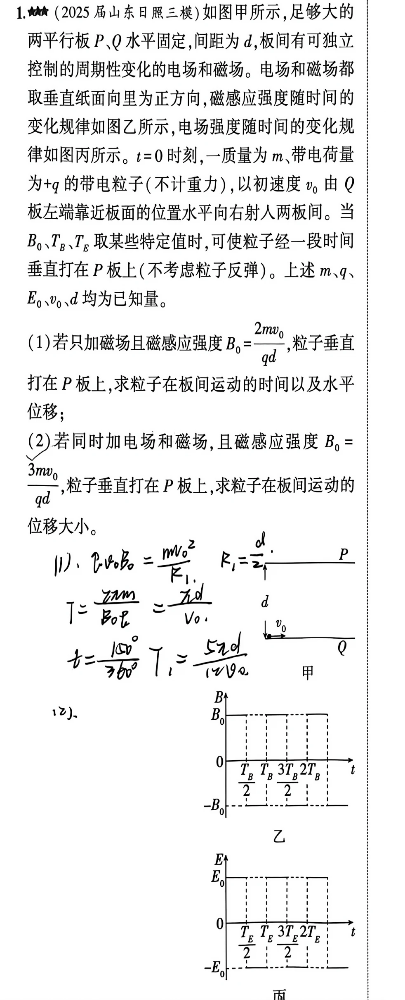
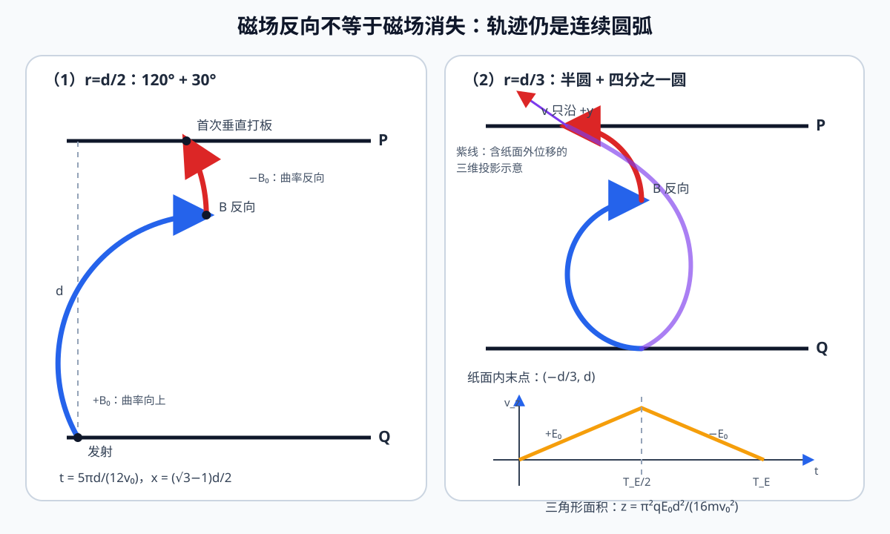

# 题目

1. （2025 届山东日照三模）如图甲所示，足够大的两平行板 $P$、$Q$ 水平固定，间距为 $d$，板间有可独立控制的周期性变化的电场和磁场。电场和磁场都取垂直纸面向里为正方向，磁感应强度随时间的变化规律如图乙所示（磁场每隔$\frac{T_B}{2}$时长，$B$就在恒定值$B_0$与$-B_0$之间交替切换），电场强度随时间的变化规律如图丙所示(电场每隔$\frac{T_E}{2}$时长，$E$就在恒定值$E_0$与$-E_0$之间交替切换)。$t=0$ 时刻，一质量为 $m$、带电荷量为 $+q$ 的带电粒子（不计重力），以初速度 $v_0$ 由 $Q$ 板左端靠近板面的位置水平向右射入两板间。当 $B_0$、$T_B$、$T_E$ 取某些特定值时，可使粒子经一段时间垂直打在 $P$ 板上（不考虑粒子反弹）。上述 $m$、$q$、$E_0$、$v_0$、$d$ 均为已知量。

（1）若只加磁场且磁感应强度 $B_0=\dfrac{2mv_0}{qd}$，粒子垂直打在 $P$ 板上，求粒子在板间运动的时间以及水平位移；

（2）若同时加电场和磁场，且磁感应强度 $B_0=\dfrac{3mv_0}{qd}$，粒子垂直打在 $P$ 板上，求粒子在板间运动的位移大小。

---

# 解析（学生版）

## 答案速览

- （1）磁场先取 $+B_0$，粒子转过 $120^\circ$；磁场反向后再转过 $30^\circ$，首次垂直到达 $P$ 板：

$$
\boxed{t=\frac{5\pi d}{12v_0}},\qquad
\boxed{x=\frac{\left(\sqrt3-1\right)d}{2}}.
$$

- （2）纸面内轨迹依次为半圆和四分之一圆，末点为
  $\left(-d/3,d\right)$；电场一个完整周期产生纸面外位移

$$
z=\frac{\pi^2qE_0d^2}{16mv_0^2}.
$$

因此粒子的总位移大小为

$$
\boxed{s=\sqrt{\frac{10d^2}{9}
+\frac{\pi^4q^2E_0^2d^4}{256m^2v_0^4}}}.
$$

## 一眼识别

- 题型识别：磁场方向每半周期反向，轨迹由半径相同、转向相反的圆弧首尾相切组成；电场与纸面垂直，只控制第三个方向的运动。
- 最短主线：先由 $r=mv_0/(qB_0)$ 定半径，再用“到板时速度竖直”确定每段圆心角；第（2）问最后把 $x、y、z$ 三个正交位移合成。
- 可用二级结论：磁场恒定的一段内，粒子转过 $\varphi$ 所需时间为
  $t=\varphi m/(qB_0)$；**适用条件**：该段只有洛伦兹力改变纸面内速度方向，且 $\varphi$ 用弧度表示。

## 详细解答

### 第 1 步：规定方向并抓住磁场反向

取初速度方向向右为 $+x$，由 $Q$ 板指向 $P$ 板为 $+y$，垂直纸面向里为第三个方向。正粒子在“磁场向里”时先向 $P$ 板偏转；磁场变为向外后，圆周运动转向反转，但速度和轨迹仍连续。

### 第 2 步：第（1）问确定两段圆心角

由

$$
B_0=\frac{2mv_0}{qd}
$$

得回旋半径和角速度

$$
r_1=\frac{mv_0}{qB_0}=\frac d2,\qquad
\omega_1=\frac{qB_0}{m}=\frac{2v_0}{d}.
$$

设第一段磁场向里时粒子转过 $\alpha$，磁场反向后再转过 $\beta$。末速度垂直 $P$ 板，故

$$
\alpha-\beta=\frac{\pi}{2}. \tag{1}
$$

由于 $r_1 < d$，因此一定有 $\alpha >\pi/2$，则两段圆弧在竖直方向的总位移为

$$
\begin{align}
 y&=r_1\left[1 - cos(\alpha) + sin(\beta)\right]\\
 &=r_1\left[1 - cos(\alpha-\beta + \beta) + sin(\beta)\right]\\
 &=r_1\left[1 - (-sin(\beta)) + sin(\beta)\right]\\
 &=r_1\left[1  + 2sin(\beta))\right]\\
\end{align}
$$

代入 $y=d=2r_1$ 和式（1），得

$$
\sin\beta=\frac12.
$$

取首次到达且此前不碰板的解

$$
\alpha=\frac{2\pi}{3},\qquad
\beta=\frac{\pi}{6}.
$$

所以

$$
\boxed{t=\frac{\alpha+\beta}{\omega_1}
=\frac{5\pi d}{12v_0}}.
$$

水平方向两段位移相加：

$$
x=r_1(\sin\alpha+\cos\beta) - r_1,
$$

于是

$$
\boxed{x=\frac{\left(\sqrt3-1\right)d}{2}}.
$$

### 第 3 步：第（2）问的纸面内轨迹

因为电场、磁场都垂直纸面向内，电场不会影响磁场在xoy面（即纸面）的运动。此时有半径和半周期为：

$$
r_2=\frac{mv_0}{qB_0}=\frac d3,\qquad
\tau_B=\frac{\pi d}{3v_0}.
$$

磁场放大2/3，周期缩小为原先的3/2，转过弧度为原先的2/3。因此有第一段 $+B_0$ 使粒子转过半圆：

$$
\alpha=\pi,
$$

粒子到达 $(0,2d/3)$，速度向左。磁场反向后再转过四分之一圆，粒子在

$$
(x,y)=\left(-\frac d3,d\right)
$$

处以沿 $+y$ 方向的速度垂直打板。第二段用时

$$
\frac{\pi/2}{\omega_2}=\frac{\pi d}{6v_0},
$$

故总运动时间为

$$
t_f=\frac{\pi d}{2v_0}.
$$

### 第 4 步：第（2）问的纸面外运动

为了使打板时第三方向速度也为零，粒子从开始到打到板的时间应为电场周期的整数倍。

$$
T_E=t_f=\frac{\pi d}{2nv_0}.\quad n = 1,2,\cdots, k
$$

记

$$
\tau=\frac{T_E}{2}=\frac{\pi d}{4nv_0},\qquad
a=\frac{qE_0}{m}.
$$

前半周期沿正方向匀加速，后半周期以反向加速度减速。末速度

$$
v_z=a\tau-a\tau=0,
$$

但两段位移同向，因此

$$
z=\frac12a\tau^2+(a\tau)\tau-\frac12a\tau^2
=a\tau^2
=\frac{\pi^2qE_0d^2}{16n^2mv_0^2}.
$$

一共有 $n$ 段周期，故沿纸面方向的总位移为：
$$
z=\frac{\pi^2qE_0d^2}{16nmv_0^2}.
$$

### 第 5 步：合成三维位移

终点的三个正交位移分量为

$$
x=-\frac d3,\qquad y=d,\qquad
z=\frac{\pi^2qE_0d^2}{16nmv_0^2}.
$$

所以

$$
\boxed{s=\sqrt{x^2+y^2+z^2}
=\sqrt{\frac{10d^2}{9}
+\frac{\pi^4q^2E_0^2d^4}{256n^2m^2v_0^4}}}.
$$

## 易错点

- **错误表现**：把图乙的 $-B_0$ 阶段当成“撤去磁场”。**纠正策略**：磁场大小不变、方向反转，后一段仍是圆弧，只是转向相反。
- **错误表现**：把第（2）问的后续运动当成直线。**纠正策略**：第一段是半圆，磁场反向后接四分之一圆。
- **错误表现**：用纸面内到板时间充当电场半周期。**纠正策略**：为使末态 $v_z=0$，完整运动时间应等于一个电场周期 $T_E$。
- **错误表现**：只合成 $x、y$。**纠正策略**：电场垂直纸面，必须计入第三方向位移 $z$。

## 30 秒自测

第（1）问中，磁场反向后粒子为什么不是走直线？请同时说明洛伦兹力大小和圆弧转向发生了什么变化。
