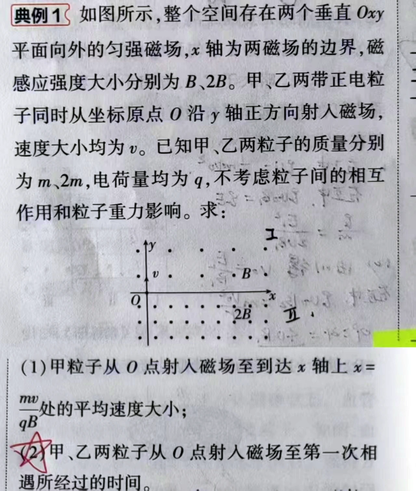
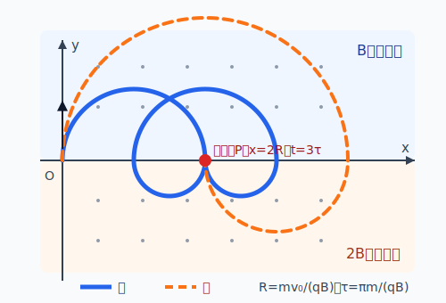

# 题目

## 人工校对稿

如图所示，整个空间存在两个垂直 $Oxy$ 平面向外的匀强磁场，$x$ 轴为两磁场的边界，磁感应强度大小分别为 $B$、$2B$。甲、乙两带正电粒子同时从坐标原点 $O$ 沿 $y$ 轴正方向射入磁场，速度大小均为 $v_0$。已知甲、乙两粒子的质量分别为 $m$、$2m$，电荷量均为 $q$，不考虑粒子间的相互作用和粒子重力影响。求：

1. 甲粒子从 $O$ 点射入磁场至到达 $x$ 轴上 $x=\frac{mv_0}{qB}$ 处的平均速度大小；
2. 甲、乙两粒子从 $O$ 点射入磁场至第一次相遇所经过的时间。

---

# 解析（学生版）

## 答案速览

- （1）平均速度大小为 $\frac{2v_0}{3\pi}$；
- （2）第一次相遇所经过的时间为 $\frac{3\pi m}{qB}$。

## 一眼识别

- 题型识别：分区磁场中的半圆轨迹；两粒子相遇问题——先系统枚举交点，再逐一核对到达时间。
- 最短主线：记 $R=\frac{mv_0}{qB}$、$\tau=\frac{\pi m}{qB}$；第（2）问按"先找全部交点 → 后算每个交点对应的时间"两步走。
- 可用二级结论：匀强磁场中转过 $\varphi$ 所需时间 $t=\frac{\varphi m}{qB}$；**适用条件**：区域内只有匀强磁场，且 $\varphi$ 用弧度。

## 详细解答

### 第 1 步：先确定轨道半径和半圆时间

磁场力不做功，两粒子的速率始终为 $v_0$。令

$$
R=\frac{mv_0}{qB},\qquad \tau=\frac{\pi m}{qB}.
$$

甲在上、下半平面的轨道半径分别为 $R$、$R/2$，走半圆的时间分别为 $\tau$、$\tau/2$；
乙在上、下半平面的半径分别为 $2R$、$R$，走半圆的时间分别为 $2\tau$、$\tau$。

### 第 2 步：完成第（1）问

甲先走上方半圆，从 $O$ 到 $x=2R$；再走下方半圆，到达题目指定的 $x=R$。总时间为

$$
t_1=\tau+\frac{\tau}{2}=\frac{3\pi m}{2qB}.
$$

从 $O$ 到 $x=R$ 的位移大小为 $R$，所以平均速度大小

$$
\left|\bar v\right|=\frac{R}{t_1}=\boxed{\frac{2v_0}{3\pi}}.
$$

### 第 3 步：第（2）问——先找交点：两粒子可能在哪些位置相遇

相遇首先要"走到同一个位置"。两粒子轨迹由交替的上下半圆组成，每个半圆的起点和终点都在 $x$ 轴上。因此最直接的方法是：**先列出两粒子依次到达 $x$ 轴的位置，找出公共落点。**

| 到达 $x$ 轴的次序 | 甲到达的位置 | 乙到达的位置 |
|:---:|:---:|:---:|
| 出发 | $x=0$ | $x=0$ |
| 第 1 次 | $x=2R$ | $x=4R$ |
| 第 2 次 | $x=R$ | $x=2R$ |
| 第 3 次 | $x=3R$ | $x=6R$ |
| 第 4 次 | $x=2R$ | $x=4R$ |
| $\cdots$ | $\cdots$ | $\cdots$ |

除去出发点 $O$，两粒子**都经过**的 $x$ 轴位置有：$x=2R,\;4R,\;6R,\;\cdots$

**结论：** 出发后两粒子轨迹的全部交点都在 $x$ 轴上，从近到远依次为

$$
P_1(2R,0),\;P_2(4R,0),\;P_3(6R,0),\,\cdots
$$

最近的是 $P_1(2R,0)$。先检查 $P_1$——若在此已经相遇，就不需要看更远的交点。

### 第 4 步：后算时间——两粒子各自何时到达交点

取最近的交点 $P_1(2R,0)$，分别计算两粒子第几次经过、用时多少。

**甲到达 $P_1$ 的时刻：**

甲走一个上方半圆（$\tau$）就第一次到达 $x=2R$；之后走完"下（$\tau/2$）→ 上（$\tau$）→ 下（$\tau/2$）"一个完整来回，第二次回到 $x=2R$：

$$
t_{\text{甲},1}=\tau,\qquad
t_{\text{甲},2}=\tau+\frac{\tau}{2}+\tau+\frac{\tau}{2}=3\tau.
$$

**乙到达 $P_1$ 的时刻：**

乙先走第一个上方半圆到 $x=4R$（$2\tau$），再走第一个下方半圆回到 $x=2R$（$\tau$）：

$$
t_{\text{乙},1}=2\tau+\tau=3\tau.
$$

类似地，后续经过一个完整上下周期再回一次：$7\tau$

**对比：**

| 交点 | 甲到达时刻 | 乙到达时刻 |
|:---:|:---|:---|
| $P_1(2R,0)$ | $\tau,\;\mathbf{3\tau}$ | $\mathbf{3\tau},\;7\tau$ |

甲第一次到 $P_1$（$\tau$）时乙还在途中；两人**第一次同时到达** $P_1$ 是在 $t=3\tau$。$P_1$ 已是最近交点，无需再查 $P_2$ 等更远交点。

$$
t_{\text{遇}}=3\tau=\boxed{\frac{3\pi m}{qB}}.
$$

## 易错点

- **把平均速度当成平均速率**：平均速度 = 位移 ÷ 时间，不是路程 ÷ 时间。
- **一上来就排时间而不先找交点**：相遇题必须先问"有没有同一个位置"，再问"是不是同一时刻"。
- **只算甲第一次到 $P_1$ 就下结论**：甲 $\tau$ 时到 $P_1$，但乙要 $3\tau$ 才到；真正相遇是甲第二次（即乙第一次）到 $P_1$。

## 30 秒自测

甲第一次从下半平面回到 $x$ 轴时，横坐标是多少？从出发到此时共用了多久？
