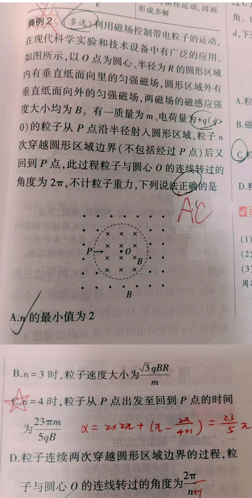
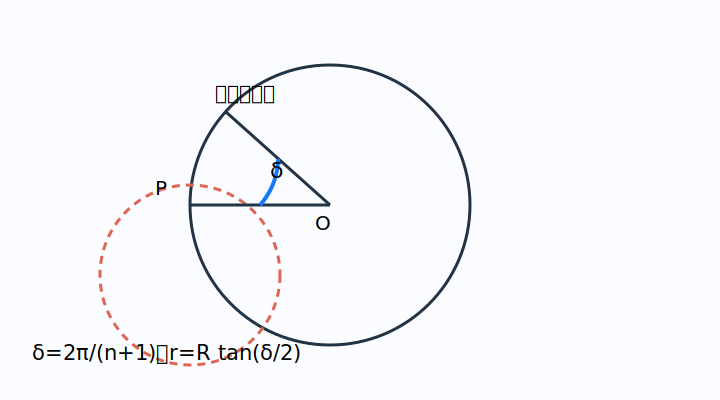

# 题目

在现代科学实验和技术设备中有广泛的应用。如图所示，以 $O$ 点为圆心、半径为 $R$ 的圆形区域内有垂直纸面向里的匀强磁场，圆形区域外有垂直纸面向外的匀强磁场，两磁场的磁感应强度大小均为 $B$。有一质量为 $m$、电荷量为 $+q$（$q>0$）的粒子从 $P$ 点沿半径射入圆形区域，粒子 $n$ 次穿越圆形区域边界（不包括经过 $P$ 点）后又回到 $P$ 点，此过程粒子与圆心 $O$ 的连线转过的角度为 $2\pi$。不计粒子重力，下列说法正确的是（　　）

A. $n$ 的最小值为 2  
B. $n=3$ 时，粒子速度大小为 $\frac{\sqrt3 qBR}{m}$  
C. $n=4$ 时，粒子从 $P$ 点出发至回到 $P$ 点的时间为 $\frac{23\pi m}{5qB}$  
D. 粒子连续两次穿越圆形区域边界的过程中，粒子与圆心 $O$ 的连线转过的角度为 $\frac{2\pi}{n}$

---

# 解析（学生版）

## 答案速览

- 正确选项：**A、C**。
- 相邻两次边界事件对应的径向转角为 $\delta=\frac{2\pi}{n+1}$，轨道半径 $r=R\tan\frac{\delta}{2}$。

## 一眼识别

- 题型识别：内外磁场方向相反，轨迹曲率交替反向。
- 最短主线：先数“轨迹段数”而不是只数穿越次数，再由两圆相交几何求半径和弧角。
- 适用条件：内外磁感应强度大小相同，所以每段轨迹圆半径相同。

## 详细解答

### 第 1 步：把次数数准

粒子穿越边界 $n$ 次后回到 $P$，而回到 $P$ 的最后一段也要计入运动，因此一周共有 $n+1$ 个相同的径向转角：

$$
\delta=\frac{2\pi}{n+1}.
$$

轨迹圆半径有限时 $\delta<\pi$，故 $n+1>2$，最小 $n=2$。A 对，D 的 $2\pi/n$ 错。

### 第 2 步：用两圆相交几何求速度

看示意图：轨迹圆在 $P$ 点与入射半径垂直，且要经过下一边界点。由两个圆的交点几何可得

$$
r=R\tan\frac{\delta}{2},
\qquad
v=\frac{qBr}{m}.
$$

当 $n=3$ 时，$\delta=\pi/2$，所以 $r=R$、$v=qBR/m$，B 错。

### 第 3 步：计算 $n=4$ 的总时间

此时 $\delta=2\pi/5$。在圆内的轨迹弧角为 $\pi-\delta$，在圆外为 $\pi+\delta$。五段轨迹依次为“内、外、内、外、内”，故总弧角

$$
3(\pi-\delta)+2(\pi+\delta)
=5\pi-\delta
=\frac{23\pi}{5}.
$$

回旋角速度 $\omega=qB/m$，于是

$$
t=\frac{23\pi/5}{qB/m}=\frac{23\pi m}{5qB}.
$$

C 对。

## 易错点

- **错误表现**：写成 $n\delta=2\pi$；**纠正策略**：从 $P$ 出发到第一次穿越是第一段，最后一次穿越到回到 $P$ 还有一段，共 $n+1$ 段。
- **错误表现**：把圆内外的轨迹弧角都写成同一个值；**纠正策略**：磁场反向使弯曲方向反向，外侧走的是 $\pi+\delta$。

## 30 秒自测

若 $n=2$，求轨道半径 $r$ 与速度 $v$。
