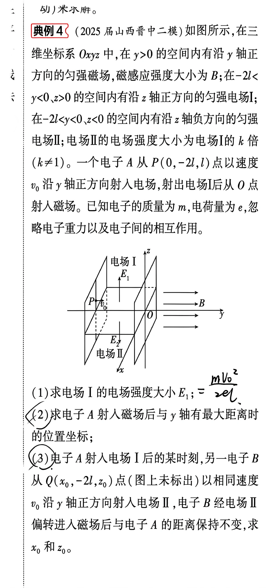
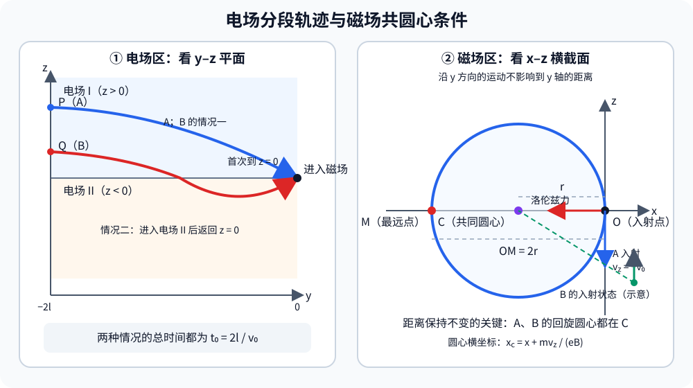

# 题目

## 题干

**典例 4**

（2025 届山西晋中二模）如图所示，在三维坐标系 $Oxyz$ 中，在 $y > 0$ 的空间内有沿 $y$ 轴正方向的匀强磁场，磁感应强度大小为 $B$；在 $-2l < y < 0$、$z > 0$ 的空间内有沿 $z$ 轴正方向的匀强电场 I；在 $-2l < y < 0$、$z < 0$ 的空间内有沿 $z$ 轴负方向的匀强电场 II；电场 II 的电场强度大小为电场 I 的 $k$ 倍（$k \neq 1$）。一个电子 A 从 $P(0,\,-2l,\,l)$ 点以速度 $v_0$ 沿 $y$ 轴正方向射入电场，射出电场 I 后从 $O$ 点射入磁场。已知电子的质量为 $m$，电荷量为 $e$，忽略电子重力以及电子间的相互作用。
（1）求电场 I 的电场强度大小 $E_1$；

（2）求电子 A 射入磁场后与 $y$ 轴有最大距离时的位置坐标；

（3）电子 A 射入电场 I 后的某时刻，另一电子 B 从 $Q(x_0,\,-2l,\,z_0)$ 点（图上未标出）以相同速度 $v_0$ 沿 $y$ 轴正方向射入电场 I，电子 B 经电场 I 偏转进入磁场后与电子 A 的距离保持不变，求 $x_0$ 和 $z_0$。

---

# 解析（学生版）

## 答案速览

设电子在磁场中的回旋半径
$$
r=\frac{mv_0}{eB}.
$$

- （1）
$$
E_1=\frac{mv_0^2}{2el}.
$$
- （2）电子 A 与 $y$ 轴距离最大时的位置为
$$
\left(-\frac{2mv_0}{eB},\frac{\pi mv_0}{eB},0\right).
$$
- （3）共有两组可能值：
$$
(x_0,z_0)=(0,l),
$$
或
$$
(x_0,z_0)=\left[-\frac{2(k+1)mv_0}{(k+2)eB},\frac{k^2l}{(k+2)^2}\right].
$$
第一组中 B 始终位于电场 I；第二组中 B 先进入电场 II，再返回分界面并进入磁场。

## 一眼识别

- 题型识别：电场中的类平抛运动、磁场中的螺旋运动与相对运动综合题。
- 最短主线：先由 A 恰好从 $P$ 到达 $O$ 求电场强度，再分解螺旋运动；最后把“两电子距离不变”转化为两条螺旋线具有相同回旋圆心。
- 可用二级结论：磁场中沿磁场方向的速度不变，垂直磁场方向做匀速圆周运动；**适用条件**：磁场区域内只有洛伦兹力，且速度不与磁场平行。

## 详细解答

### 第 1 步：由电子 A 在电场 I 中的运动求 $E_1$

电子带负电，电场 I 沿 $+z$ 方向，因此电子的加速度沿 $-z$ 方向。设其大小为
$$
a=\frac{eE_1}{m}.
$$

电子沿 $y$ 方向做匀速直线运动，从 $y=-2l$ 到 $y=0$ 所需时间为
$$
t_0=\frac{2l}{v_0}.
$$

它沿 $z$ 方向从 $z=l$ 恰好运动到 $z=0$，故
$$
l-\frac12at_0^2=0.
$$

解得
$$
a=\frac{v_0^2}{2l},
\qquad
\boxed{E_1=\frac{mv_0^2}{2el}}.
$$

电子 A 到达 $O$ 点时
$$
v_z=-at_0=-v_0,
$$
所以其入射磁场速度为
$$
\boldsymbol v_A=(0,v_0,-v_0).
$$

### 第 2 步：求电子 A 的螺旋轨迹及最大轴距位置

磁场沿 $+y$ 方向。电子速度的平行分量为 $v_0$，垂直分量大小也为 $v_0$，因此电子沿 $y$ 方向匀速前进，同时在 $xz$ 平面内做半径为
$$
r=\frac{mv_0}{eB}
$$
的圆周运动。

电子刚进入磁场时速度沿 $-z$ 方向。由洛伦兹力方向可知，此时受力沿 $-x$ 方向，所以回旋圆心在
$$
(-r,0)
$$
处。这里括号内依次表示圆心的 $x、z$ 坐标。

电子到 $y$ 轴的距离为 $\sqrt{x^2+z^2}$。回旋圆上离原点最远的位置是圆心另一侧的点，即
$$
x=-2r,\qquad z=0.
$$

此时电子恰好转过半周，角速度为
$$
\omega=\frac{eB}{m},
$$
所用时间
$$
t=\frac{\pi}{\omega}=\frac{\pi m}{eB}.
$$
因此
$$
y=v_0t=\pi r.
$$

故所求坐标为
$$
\boxed{(x,y,z)=\left(-\frac{2mv_0}{eB},\frac{\pi mv_0}{eB},0\right)}.
$$

### 第 3 步：把“距离保持不变”转化为回旋圆心相同

电子 B 在电场中只沿 $z$ 方向加速，所以进入磁场时仍有
$$
v_y=v_0,
$$
与 A 的沿磁场方向速度相同。因此两电子进入磁场后，$y$ 方向间距自动保持不变。

在 $xz$ 平面内，两电子的回旋角速度均为 $eB/m$。若两回旋圆心不同，两电子相对位置中会出现一个随时间转动的分量与一个固定的圆心差，其距离一般随时间改变；要使距离始终不变，两电子必须具有同一回旋圆心。

设 B 进入磁场时的坐标为 $(x_0,0,z_f)$，其 $z$ 方向速度为 $v_{zf}$。由于此时 $v_x=0$，其回旋圆心的 $xz$ 坐标为
$$
\left(x_0+\frac{mv_{zf}}{eB},z_f\right).
$$

A 的回旋圆心为 $(-r,0)$，故
$$
z_f=0,
$$
且
$$
x_0+\frac{mv_{zf}}{eB}=-r. \tag{1}
$$

### 第 4 步：分类求电子 B 的初始位置

B 在电场中的总运动时间仍为
$$
t_0=\frac{2l}{v_0}.
$$

**情况一：B 始终位于电场 I。**

B 在 $t_0$ 时刻恰好到达 $z=0$，因此与 A 的运动相同：
$$
z_0=l,
\qquad
v_{zf}=-v_0.
$$

代入式（1）得
$$
x_0=0.
$$
所以
$$
\boxed{(x_0,z_0)=(0,l)}.
$$

**情况二：B 先进入电场 II，再返回 $z=0$。**

设 B 在电场 I 中运动时间为 $t_1$。它到达 $z=0$ 时的速度为 $-at_1$；进入电场 II 后，电子加速度改为 $+ka$。

设在电场 II 中运动时间为 $t_2$。要使电子返回 $z=0$，由位移条件
$$
-at_1t_2+\frac12kat_2^2=0
$$
得
$$
t_2=\frac{2t_1}{k}.
$$
又有
$$
t_1+t_2=t_0,
$$
所以
$$
t_1=\frac{k}{k+2}t_0.
$$

B 的初始高度为
$$
z_0=\frac12at_1^2
=\frac{k^2l}{(k+2)^2}.
$$

返回 $z=0$ 时的速度为
$$
v_{zf}=-at_1+kat_2=at_1=\frac{k}{k+2}v_0.
$$

代入式（1），得到
$$
x_0=-r-\frac{k}{k+2}r
=-\frac{2(k+1)}{k+2}r.
$$
因此
$$
\boxed{(x_0,z_0)=\left[-\frac{2(k+1)mv_0}{(k+2)eB},\frac{k^2l}{(k+2)^2}\right]}.
$$

电子 B 从电场 I 出发并在总时间 $t_0$ 后从 $z=0$ 进入磁场，只有“始终在电场 I”和“进入电场 II 后返回”这两种不同过程，故上述枚举完备。

## 易错点

- **错误表现**：认为电子在电场 I 中沿 $+z$ 加速；**纠正策略**：电子带负电，受力方向与电场方向相反。
- **错误表现**：把磁场中的轨迹直接看成平面圆；**纠正策略**：先将速度分为平行磁场和垂直磁场两个分量，合运动是螺旋运动。
- **错误表现**：只令两电子的回旋半径相等；**纠正策略**：距离恒定要求考查相对位置，关键是两条回旋运动具有相同圆心，不要求半径相等。
- **错误表现**：遗漏 B 进入电场 II 后又返回的情况；**纠正策略**：以“进入磁场时必须回到 $z=0$”为终点条件，对是否越过分界面分类。

## 30 秒自测

若电子 B 返回 $z=0$ 时的速度沿 $+z$ 方向，为什么它仍可能与电子 A 的距离始终不变？请用“回旋圆心”而不是“速度相同”解释。
