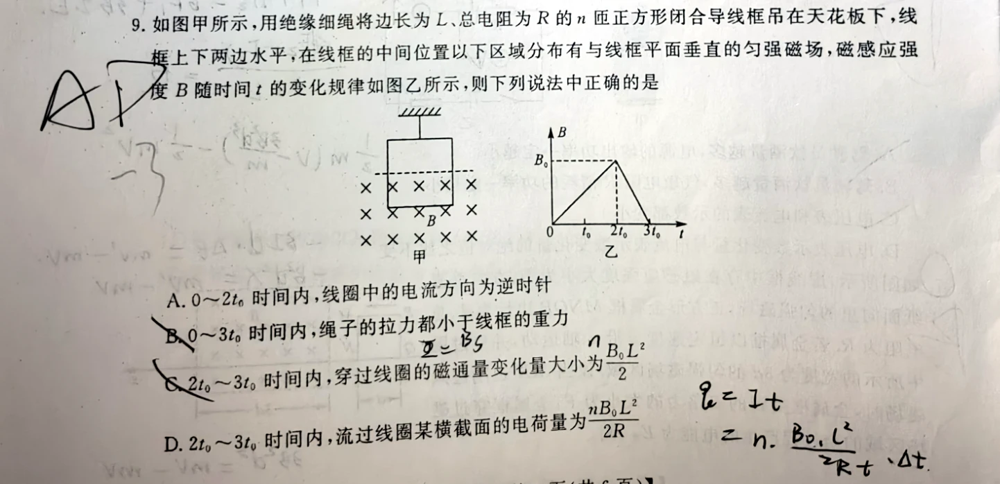
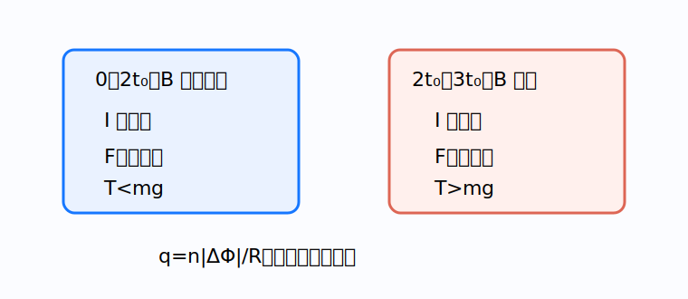

# 题目

如图甲所示，用绝缘细绳将边长为 $L$、总电阻为 $R$ 的 $n$ 匝正方形闭合导线框吊在天花板下，线框上下两边水平。在线框的中间位置以下区域分布有与线框平面垂直的匀强磁场，磁感应强度 $B$ 随时间 $t$ 的变化规律如图乙所示。下列说法中正确的是（　　）

A. $0\sim2t_0$ 时间内，线框中的电流方向为逆时针  
B. $0\sim3t_0$ 时间内，绳子的拉力都小于线框的重力  
C. $2t_0\sim3t_0$ 时间内，穿过线框的磁通量变化量大小为 $\frac{nB_0L^2}{2}$  
D. $2t_0\sim3t_0$ 时间内，流过线圈某横截面的电荷量为 $\frac{nB_0L^2}{2R}$

---

# 解析（学生版）

## 答案速览

- 正确选项：**A、C、D**。
- 增场阶段电流逆时针、安培力向上；减场阶段电流顺时针、安培力向下。

## 一眼识别

- 题型识别：先用楞次定律判电流，再用左手定则判拉力变化；电荷量只看磁通量变化。
- 最短主线：把 $0\sim2t_0$ 与 $2t_0\sim3t_0$ 分开判断。
- 可用结论：$q=n|\Delta\Phi|/R$；适用条件是回路总电阻恒定。

## 详细解答

### 第 1 步：增场阶段

$0\sim2t_0$ 内，向里的磁通量增加。感应电流要产生向外磁场，因此为逆时针，A 对。

此时下边电流向右，在向里磁场中所受安培力向上，所以绳的拉力小于重力。

### 第 2 步：减场阶段

$2t_0\sim3t_0$ 内，向里的磁通量减小，感应电流反向为顺时针。下边电流向左，安培力向下，绳的拉力

$$
T=mg+F_A>mg.
$$

所以“全过程拉力都小于重力”的 B 错。

### 第 3 步：求磁通量变化量

只有线框下半部分位于磁场中，有效面积为 $L^2/2$。减场阶段 $B_0\to0$，$n$ 匝线圈的磁通链变化量为

$$
|\Delta(n\Phi)|=\frac{nB_0L^2}{2}.
$$

C 对。

### 第 4 步：求感应电荷量

$$
q=\int I\,dt
=\frac{|\Delta(n\Phi)|}{R}
=\frac{nB_0L^2}{2R}.
$$

D 对。

## 易错点

- **错误表现**：只判一次安培力方向覆盖全程；**纠正策略**：$dB/dt$ 变号时电流和安培力都反向。
- **错误表现**：电荷量公式里再除以时间；**纠正策略**：积分后时间消去，$q$ 只由磁通变化量和总电阻决定。

## 30 秒自测

减场阶段斜率绝对值是增场阶段的几倍？相应感应电流大小如何变化？
