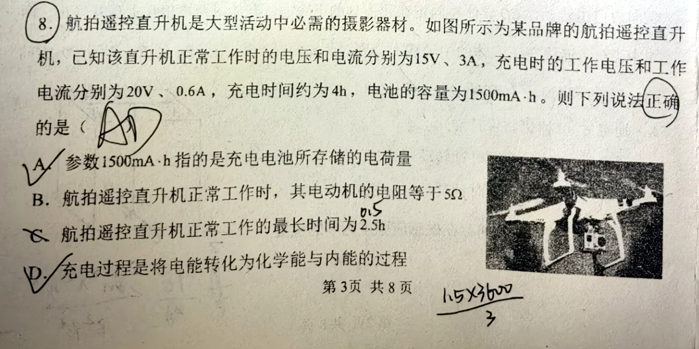
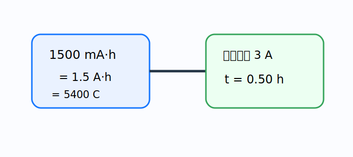

# 题目

航拍遥控直升机是大型活动中必需的摄影器材。如图所示为某品牌的航拍遥控直升机，已知该直升机正常工作时的电压和电流分别为 $15\,\mathrm V$、$3\,\mathrm A$，充电时的工作电压和工作电流分别为 $20\,\mathrm V$、$0.6\,\mathrm A$，充电时间约为 $4\,\mathrm h$，电池的容量为 $1500\,\mathrm{mA\cdot h}$。则下列说法正确的是（　　）

A. 参数 $1500\,\mathrm{mA\cdot h}$ 指的是充电电池所存储的电荷量  
B. 航拍遥控直升机正常工作时，其电动机的电阻等于 $5\,\Omega$  
C. 航拍遥控直升机正常工作的最长时间为 $2.5\,\mathrm h$  
D. 充电过程是将电能转化为化学能与内能的过程

---

# 解析（学生版）

## 答案速览

- 正确选项：**A、D**。
- 理想估算的最长工作时间为 $0.50\,\mathrm h$；电动机不是纯电阻，不能用 $R=U/I$ 求线圈电阻。

## 一眼识别

- 题型识别：容量单位、电动机非纯电阻、充电能量转化。
- 最短主线：先把 $1500\,\mathrm{mA\cdot h}$ 化成 $1.5\,\mathrm{A\cdot h}$，再逐项判断。

## 详细解答

### 第 1 步：判断容量含义

电池容量 $Q=It$，单位 $\mathrm{A\cdot h}$ 或 $\mathrm{mA\cdot h}$，表示可提供的电荷量。因此 A 对。

### 第 2 步：判断电动机电阻

电动机正常转动时存在反电动势，端电压满足

$$
U=E_{\text{反}}+Ir.
$$

所以 $U/I=5\,\Omega$ 是等效比值，不是线圈电阻，B 错。

### 第 3 步：估算最长工作时间

$$
t=\frac{1.5\,\mathrm{A\cdot h}}{3\,\mathrm A}=0.50\,\mathrm h.
$$

并非 $2.5\,\mathrm h$，C 错。

### 第 4 步：判断能量转化

充电时，输入电能主要转化为电池的化学能，同时因内阻发热产生内能。因此 D 对。

## 易错点

- **错误表现**：把 $\mathrm{mA\cdot h}$ 当作能量单位；**纠正策略**：它是电流乘时间，即电荷量。
- **错误表现**：对一切用电器都套 $R=U/I$；**纠正策略**：电动机工作时是非纯电阻元件。

## 30 秒自测

$1500\,\mathrm{mA\cdot h}$ 等于多少库仑？
