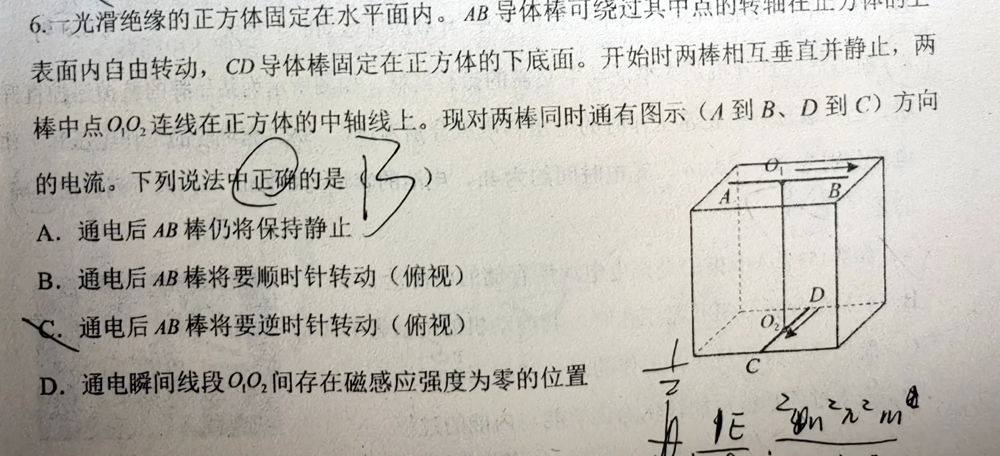
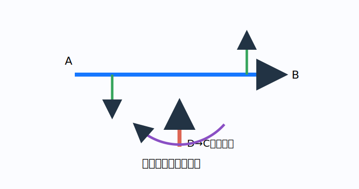

# 题目

一光滑绝缘的正方体固定在水平面内。$AB$ 导体棒可绕过其中点的转轴在正方体的上表面内自由转动，$CD$ 导体棒固定在正方体的下底面。开始时两棒相互垂直并静止，两棒中点 $O_1$、$O_2$ 连线在正方体的中轴线上。现对两棒同时通有图示（$A$ 到 $B$、$D$ 到 $C$）方向的电流。下列说法中正确的是（　　）

A. 通电后 $AB$ 棒仍将保持静止  
B. 通电后 $AB$ 棒将要顺时针转动（俯视）  
C. 通电后 $AB$ 棒将要逆时针转动（俯视）  
D. 通电瞬间线段 $O_1O_2$ 间存在磁感应强度为零的位置

---

# 解析（学生版）

## 答案速览

- 正确选项：**B**。
- 俯视时，$AB$ 棒受到顺时针力矩；中轴线上两棒产生的磁场方向互相垂直，不会相互抵消为零。

## 一眼识别

- 题型识别：下方直导线的磁场作用于上方通电棒，不必计算大小，只判断两端受力方向。
- 最短主线：把 $AB$ 分成左右两半，分别用右手螺旋定则和左手定则。
- 适用条件：只判断通电瞬间，棒尚未转动。

## 详细解答

### 第 1 步：判断 $CD$ 棒在 $AB$ 两侧产生的磁场

按图中 $D\to C$ 的电流方向，用右手螺旋定则可知：在 $AB$ 棒中点两侧，$CD$ 产生的磁场具有相反的竖直分量。

### 第 2 步：判断 $AB$ 两端所受安培力

$AB$ 中电流从 $A$ 流向 $B$。由左手定则，$AB$ 的两半分别受到方向相反、但形成同一转向的切向力。这一对力构成顺时针力矩（俯视），所以 B 对，A、C 错。

### 第 3 步：判断中轴线上能否出现零磁场

在线段 $O_1O_2$ 上，$AB$ 棒产生的磁场方向垂直于 $AB$ 与中轴线构成的平面；$CD$ 棒产生的磁场方向垂直于 $CD$ 与中轴线构成的平面。由于 $AB\perp CD$，这两个磁场方向也互相垂直。

两个非零且互相垂直的磁场不能矢量相消，因此 D 错。

## 易错点

- **错误表现**：只判断某一点的安培力就推转向；**纠正策略**：必须同时看中点两侧的力矩。
- **错误表现**：认为磁场大小相等就能抵消；**纠正策略**：先比较方向，矢量抵消还要求反向共线。

## 30 秒自测

若把 $CD$ 中的电流反向，$AB$ 初始转动方向如何改变？
