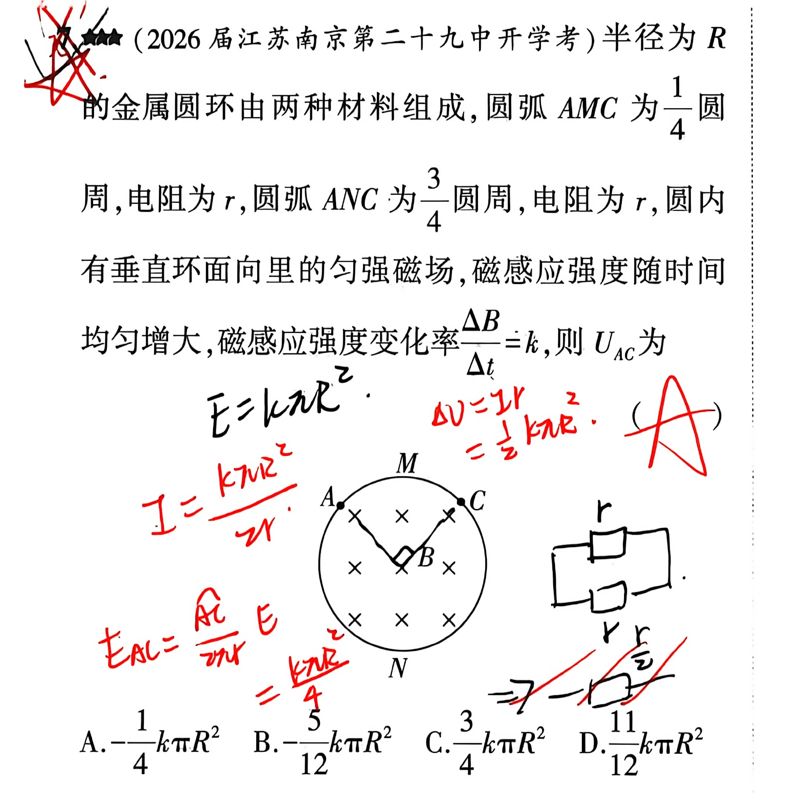
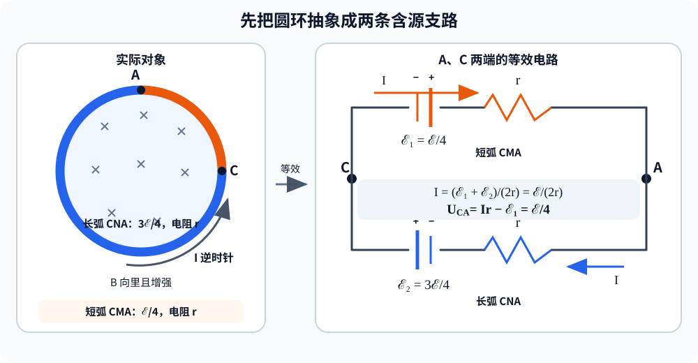

# 题目

**1.** （2026届江苏南京第二十九中开学考）半径为R的金属圆环由两种材料组成，圆弧AMC为 $\frac{1}{4}$ 圆周，电阻为 $r$，圆弧ANC为 $\frac{3}{4}$ 圆周，电阻为 $r$，圆内有垂直环面向里的匀强磁场，磁感应强度随时间均匀增大，磁感应强度变化率 $\frac{\Delta B}{\Delta t}=k$，则 $U_{AC}$ 为

A. $\frac{3}{4}kR^2$　　B. $\frac{1}{12}kR^2$　　C. $\frac{2}{3}kR^2$　　
D. $\frac{1}{4}kR^2$

---

# 解析（学生版）

## 答案速览

按题干 $\Delta B/\Delta t=k$ 计算，

$$
U_{AC} = \frac{\pi}{4}kR^2.
$$

### 没有正确答案，题目错误。

## 一眼识别

- 题型识别：变化磁场中的闭合圆环，要求计算两节点间的电压。
- 最短主线：先求整环感应电动势和环中电流，再沿一段圆弧计算两端电势差。
- 可用二级结论：圆环具有旋转对称性时，感生电动势按圆弧对应的圆心角分配；**适用条件**：磁场在圆内均匀变化，圆环与磁场同心。

## 详细解答

### 第 1 步：求整环的感应电动势

圆环所围面积为 $S=\pi R^2$。由法拉第电磁感应定律，整环感应电动势的大小为

$$
\mathcal E=\left|\frac{\Delta\Phi}{\Delta t}\right|
=S\frac{\Delta B}{\Delta t}
=\pi R^2k.
$$

磁场垂直环面向里且增强，根据楞次定律，感应电流产生的磁场应向外，因此电流沿逆时针方向。

### 第 2 步解法 1，利用电流大小直接计算

感应电流大小为
$$
I=I/R_{总}=\frac{\mathcal E}{2r}.
$$

圆弧 $AMC$ 是整圆周的 $1/4$。由于感生电场沿同心圆切向分布，其感生电动势大小也为整环的 $1/4$：

$$
\mathcal E_{AMC}=\frac{\mathcal E}{4}.
$$

声明电压定义为

$$
U_{AC}=\varphi_A-\varphi_C.
$$

由图取短弧 $A\to M\to C$ 与逆时针感应电流同向，则沿该段有

$$
U_{AC}=Ir-\mathcal E_{AMC}
=\frac{\mathcal E}{2}-\frac{\mathcal E}{4}
=\frac{\mathcal E}{4}.
$$

若交换 $A、C$ 的标记，$U_{AC}$ 的符号相反，但大小不变。因此

$$
\boxed{|U_{AC}|=\frac{\pi}{4}kR^2}.
$$

### 第 2 步解法 2，令A、C为两个节点，根据基尔霍夫第一定律 (流入电流 = 流出电流) 求解：

令逆时针为电流的正方向，A点电势一定高于C点，则分别对两条路径列等式，有
$$

\begin{align*}
U_{AC} = \phi_A - \phi_C &= Ir - \mathcal E/4 \\
&= -Ir + 3\mathcal E/4
\end{align*}
$$

得到 $Ir = \mathcal E/2$, $U_{AC} = \mathcal E/4 = \pi R^2k/4$

按当前题干，四个选项中没有这一结果。

## 易错点

>- **错误表现**：直接把整环感应电动势的 $1/4$ 当作 $U_{AC}$；
**纠正策略**：端电压还要同时计入该段电阻上的电势降。

>- **错误表现**：认为两段圆弧长度之比为 $1:3$，电阻也必为 $1:3$；
**纠正策略**：题目已明确两段由不同材料组成且电阻均为 $r$。

>- **错误表现**： 电流方向错误，忽视了真实线圈中的电流方向
**纠正策略**：“来拒去留”，感应磁场方向与外加磁场变化量方向相反，根据右手定则进行怕奴蛋

## 30 秒自测

为什么圆弧 $AMC$ 的感生电动势为整环的 $1/4$，但其两端电压不等于该感生电动势？
