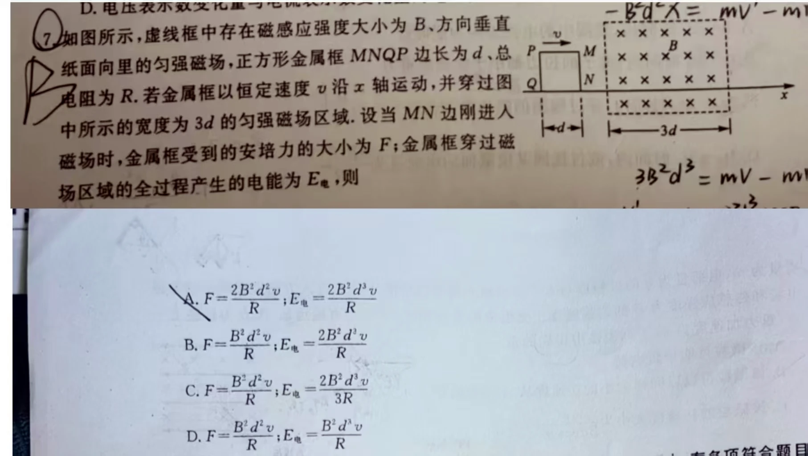

# 题目

如图所示，虚线框中存在磁感应强度大小为 $B$、方向垂直纸面向里的匀强磁场，正方形金属框 $MNQP$ 边长为 $d$、总电阻为 $R$。若金属框以恒定速度 $v$ 沿 $x$ 轴运动，并穿过图中所示的宽度为 $3d$ 的匀强磁场区域。设当 $MN$ 边刚进入磁场时，金属框受到的安培力大小为 $F$；金属框穿过磁场区域的全过程产生的电能为 $E_{\text{电}}$，则（　　）

A. $F=\frac{2B^2d^2v}{R}$，$E_{\text{电}}=\frac{2B^2d^3v}{R}$  
B. $F=\frac{B^2d^2v}{R}$，$E_{\text{电}}=\frac{2B^2d^3v}{R}$  
C. $F=\frac{B^2d^2v}{R}$，$E_{\text{电}}=\frac{2B^2d^3v}{3R}$  
D. $F=\frac{B^2d^2v}{R}$，$E_{\text{电}}=\frac{B^2d^3v}{R}$

---

# 解析（学生版）

## 答案速览

- 正确选项：**B**。
- $F=\frac{B^2d^2v}{R}$，全过程产生的电能 $E_{\text{电}}=\frac{2B^2d^3v}{R}$。

## 一眼识别

- 题型识别：线框匀速穿越比自身更宽的有界磁场。
- 最短主线：只有“进入”和“离开”两个长度为 $d$ 的阶段有感应电流；完全在场内时磁通量不变。

## 详细解答

### 第 1 步：求刚进入时的电流

$MN$ 边刚进入磁场时，动生电动势

$$
\mathcal E=Bdv,
\qquad
I=\frac{Bdv}{R}.
$$

### 第 2 步：求安培力

此时只有 $MN$ 边受到沿运动方向相反的水平安培力：

$$
F=BId=\frac{B^2d^2v}{R}.
$$

### 第 3 步：分清发热阶段

线框进入磁场所需时间为 $d/v$；线框完全进入后，虽有四边受力，但磁通量不变、感应电流为零；离开磁场时再次产生同样大小的电流，持续时间也是 $d/v$。

### 第 4 步：求全过程电能

进入或离开阶段的焦耳功率

$$
P=I^2R=\frac{B^2d^2v^2}{R}.
$$

两个阶段总电能

$$
E_{\text{电}}
=2P\frac{d}{v}
=\frac{2B^2d^3v}{R}.
$$

因此选 B。

## 易错点

- **错误表现**：认为线框在磁场内全程都有电流；**纠正策略**：判断的是磁通量是否变化，不是线框是否处在磁场中。
- **错误表现**：能量漏算离开阶段；**纠正策略**：进入、离开各贡献一次相同热量。

## 30 秒自测

若磁场宽度恰好等于 $d$，进入与离开阶段是否仍能分开？
