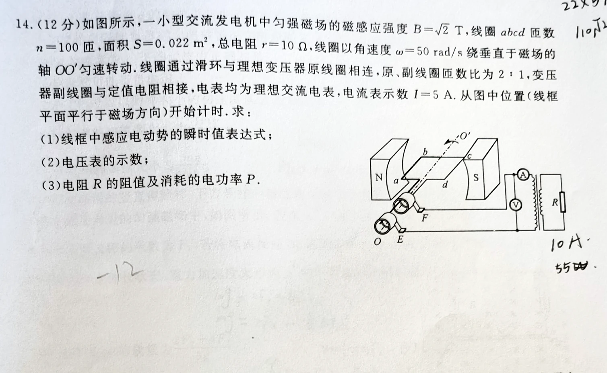
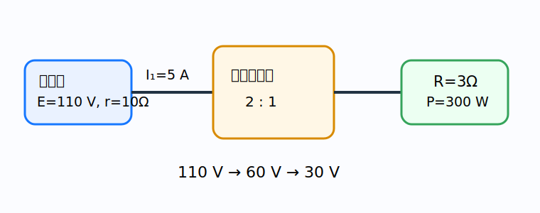

# 题目

如图所示，一小型交流发电机中匀强磁场的磁感应强度 $B=\sqrt2\,\mathrm T$，线圈 $abcd$ 匝数 $n=100$ 匝，面积 $S=0.022\,\mathrm{m^2}$，总电阻 $r=10\,\Omega$，线圈以角速度 $\omega=50\,\mathrm{rad/s}$ 绕垂直于磁场的轴 $OO'$ 匀速转动。线圈通过滑环与理想变压器原线圈相连，原、副线圈匝数比为 $2:1$，变压器副线圈与定值电阻相接，电表均为理想交流电表，电流表示数 $I=5\,\mathrm A$。从图中位置（线框平面平行于磁场方向）开始计时。求：

1. 线框中感应电动势的瞬时值表达式；
2. 电压表的示数；
3. 电阻 $R$ 的阻值及消耗的电功率 $P$。

---

# 解析（学生版）

## 答案速览

- （1）取图示时刻感应电动势为正：$e=110\sqrt2\cos(50t)\,\mathrm V$。
- （2）电压表示数 $U_1=60\,\mathrm V$。
- （3）$R=3.0\,\Omega$，$P=300\,\mathrm W$。

## 一眼识别

- 题型识别：发电机峰值 → 有效值 → 内阻压降 → 理想变压器。
- 最短主线：先求电源有效值 $E$，再算原线圈端电压，最后用匝数比和功率守恒。
- 适用条件：电表读有效值，变压器理想。

## 详细解答

### 第 1 步：写瞬时电动势

峰值

$$
E_m=nBS\omega
=100\times\sqrt2\times0.022\times50
=110\sqrt2\,\mathrm V.
$$

开始时线圈平面与磁场平行，磁通量为零，电动势为峰值。选定此刻为正，

$$
e=110\sqrt2\cos(50t)\,\mathrm V.
$$

### 第 2 步：求原线圈端电压

发电机电动势有效值 $E=E_m/\sqrt2=110\,\mathrm V$。电流表位于原线圈回路，$I_1=5\,\mathrm A$，所以

$$
U_1=E-I_1r=110-5\times10=60\,\mathrm V.
$$

电压表示数为 $60\,\mathrm V$。

### 第 3 步：求副边电压和电流

匝数比 $N_1:N_2=2:1$：

$$
U_2=30\,\mathrm V,
\qquad
U_1I_1=U_2I_2.
$$

得 $I_2=10\,\mathrm A$。

### 第 4 步：求负载

$$
R=\frac{U_2}{I_2}=3.0\,\Omega,
\qquad
P=U_2I_2=300\,\mathrm W.
$$

## 易错点

- **错误表现**：把 $110\sqrt2\,\mathrm V$ 当成电表读数；**纠正策略**：电表读有效值，峰值需除以 $\sqrt2$。
- **错误表现**：直接把 $110\,\mathrm V$ 当作原线圈电压；**纠正策略**：先扣除发电机内阻上的压降。

## 30 秒自测

原线圈电流为 $5\,\mathrm A$ 时，发电机内部热功率是多少？
