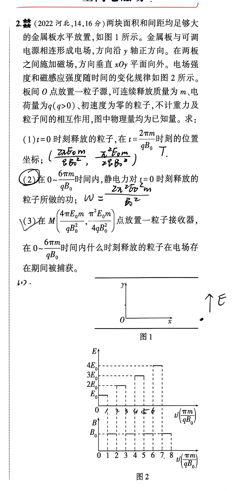

# 题目

2. （2022 河北，14，16 分）两块面积和间距均足够大的金属板水平放置，$y$ 轴垂直于金属板。金属板与可调电源相连形成电场，方向沿 $y$ 轴正方向。在两板之间施加磁场，方向垂直 $xOy$ 平面向外。电场强度和磁感应强度随时间的变化规律为图2所示(该图分为上下两幅子图，横轴均为无量纲时间$t/\left(\dfrac{\pi m}{qB_0}\right)$，上图电场强度$E$呈分段阶梯式递增（$0 \to 1$为$E_0$、$2 \to 3$为$2E_0$、$4 \to 5$为$3E_0$、$6 \to 7$为$4E_0$,其余时间为$0$），下图磁感应强度$B$从$1 \to 8$，周期为2，第一个周期$B_{0\to 1}=0$，$B_{1\to 2}=B_0$)。板间 $O$ 点放置一粒子源，可连续释放质量为 $m$、电荷量为 $q(q>0)$、初速度为零的粒子，不计重力及粒子间的相互作用，图中物理量均为已知量。求：

（1）$t=0$ 时刻释放的粒子，在 $t=\dfrac{2\pi m}{qB_0}$ 时刻的位置坐标；

（2）在 $0\sim\dfrac{6\pi m}{qB_0}$ 时间内，静电力对 $t=0$ 时刻释放的粒子所做的功；

（3）在 $M\left(\dfrac{4\pi E_0m}{qB_0^2},\dfrac{\pi^2E_0m}{4qB_0^2}\right)$ 点放置一粒子接收器，在 $0\sim\dfrac{6\pi m}{qB_0}$ 时间内什么时刻释放的粒子在电场存在期间被捕获。

---

# 解析（学生版）

## 答案速览

- （1）粒子的位置坐标为
  $$
  \boxed{\left(\frac{2\pi E_0m}{qB_0^2},\frac{\pi^2E_0m}{2qB_0^2}\right)}；
  $$
- （2）静电力所做的功为
  $$
  \boxed{W=\frac{2\pi^2mE_0^2}{B_0^2}}；
  $$
- （3）唯一符合条件的释放时刻为
  $$
  \boxed{t=\frac{\pi m}{2qB_0}}，
  $$
  粒子在
  $$
  t=\frac{9\pi m}{2qB_0}
  $$
  时首次到达接收器。

## 一眼识别

- 题型识别：电场加速与磁场半圆运动交替进行的分段运动问题。
- 最短主线：先求每段末速度和位移，再用接收器的横坐标筛选释放区间，最后用纵坐标确定唯一时刻。
- 可用二级结论：在磁场中运动半个周期后，速度反向；若进入磁场时速度为 $(v_x,v_y)$，则半周期位移为 $(2v_y/\omega,-2v_x/\omega)$。**适用条件**：磁场恒为 $B_0$，区域内只有洛伦兹力，且运动时间为半个回旋周期。

## 详细解答

### 第 1 步：建立统一的尺度和半周期规律

由半周期可得角速度

$$
\tau=\frac{\pi m}{qB_0},\qquad \omega=\frac{qB_0}{m},
$$

可得第一段电场加速后的末速度及第一段磁场运动的圆周运动半径

$$
v=\frac{qE_0}{m}\tau=\frac{\pi E_0}{B_0},
\qquad
r=\frac{v}{\omega}=\frac{\pi E_0m}{qB_0^2}.
$$

磁场垂直纸面向外，正粒子所受洛伦兹力使速度顺时针转动。粒子在磁场中运动时间 $\tau=\pi/\omega$，恰好转过半周，因此

$$
(v_x,v_y)\longrightarrow(-v_x,-v_y),
$$

同时

$$
(\Delta x,\Delta y)=\left(\frac{2v_y}{\omega},-\frac{2v_x}{\omega}\right).
$$

本题各电场段中粒子的 $v_x=0$，所以完整磁场段只改变横坐标，不改变纵坐标。

### 第 2 步：求 $t=2\tau$ 时的位置

在 $0\sim\tau$ 内，只有电场 $E_0$。粒子从静止出发，故

$$
v_y=v,
\qquad
y=\frac12\frac{qE_0}{m}\tau^2
  =\frac{\pi^2E_0m}{2qB_0^2}.
$$

在 $\tau\sim2\tau$ 内，粒子在磁场中运动半周，其横向位移为

$$
\Delta x=2r=\frac{2\pi E_0m}{qB_0^2},
$$

纵向位移为零。因此

$$
\boxed{(x,y)=\left(\frac{2\pi E_0m}{qB_0^2},
\frac{\pi^2E_0m}{2qB_0^2}\right)}.
$$

### 第 3 步：用动能变化求静电力做功

以 $v$ 为速度单位，各电场段前后的纵向速度依次为

| 电场时间段 | 电场强度 | 初速度 | 末速度 | 静电力做功 |
|---|---:|---:|---:|---:|
| $0\sim\tau$ | $E_0$ | $0$ | $v$ | $\frac12mv^2$ |
| $2\tau\sim3\tau$ | $2E_0$ | $-v$ | $v$ | $0$ |
| $4\tau\sim5\tau$ | $3E_0$ | $-v$ | $2v$ | $\frac32mv^2$ |

磁场力不做功，所以在 $0\sim6\tau$ 内，静电力的总功为

$$
W=\frac12 m(2v)^2
 =\boxed{\frac{2\pi^2mE_0^2}{B_0^2}}.
$$

### 第 4 步：用横坐标筛选可能的释放时段

接收器的坐标可写成

$$
M\left(4r,\frac{\pi r}{4}\right).
$$

设粒子在第一次电场段的 $t=\alpha\tau$ 时释放，其中 $0\leq\alpha\leq1$；再令

$$
d=1-\alpha,
$$

即粒子在第一次电场中实际运动了 $d\tau$ 的时间。

第一次电场结束时速度为 $dv$，可得第一次磁场段产生的横向位移为 $2dr$ 。 (磁场转动周期与速度无关，$ T=\frac{2\pi m}{qB_0}$，周期相同则角速度相同，半径$\propto\frac{速度}{角速度}\propto 速度$)

第二次电场结束时速度为 $(2-d)v$，第二次磁场段又产生横向位移 $2(2-d)r$。因此第三次电场开始时
$$
x=2dr+2(2-d)r=4r.
$$

所以第一次电场期间释放的粒子，都会在第三次电场期间保持 $x=4r$。

若粒子在第一次磁场期间释放，它将静止到第二次电场开始；这类粒子在第三次电场中也有 $x=4r$，但其纵坐标的最小值仍大于接收器纵坐标。若在第二次电场内较晚释放，则到第三次电场时 $x<4r$；更晚释放也不可能在题设时间内、且在电场存在期间到达 $x=4r$。因此只需进一步检查第一次电场期间释放的粒子。

### 第 5 步：用纵坐标确定唯一释放时刻

利用电磁场半周期关系，易得 $v\tau=\pi r$， 与 $v=a\tau$ 易得 $a\tau^2=\pi r$，由 $y = \frac{1}{2} at^2$得第一段电场 $y$ 轴位移:
$$
\Delta y_1= \frac{1}{2} a(d\tau)^2 =\frac{\pi r}{2}d^2
$$
第二段电场位移为：
$$
\Delta y_2=(-dv)\tau+\frac{1}{2}(2a)\tau^2=-dv\tau+a\tau^2 = \pi r(-d+1)
$$

因此第三次电场开始时，该粒子的纵坐标和纵向速度分别为：

$$
\Delta y=\pi r\left(\frac{d^2}{2}-d+1\right),

v_{y0}=(d-2)v.
$$
令粒子进入第三次电场后又运动了 $z\tau$，其中 $0\leq z\leq1$，在强度为 $3E_0$ 的电场中运动 $z\tau$ 后，令纵坐标等于 $M$ 点纵坐标，得到(已约掉 $\pi r$):

$$
\frac{d^2}{2}-d+1+(d-2)z+
\frac32z^2=\frac14.
$$

把它看成关于 $d$ 的二次方程，其判别式为

$$
\Delta=(z-1)^2-2\left(\frac{3}{2} z^2-2z+\frac34 \right)
      =-2\left(z-\frac12\right)^2.
$$

要有实数解，只能有

$$
z=\frac12,
\qquad d=\frac12.
$$

于是

$$
\alpha=1-d=\frac12.
$$

故唯一释放时刻为

$$
\boxed{t=\frac{\tau}{2}=\frac{\pi m}{2qB_0}}.
$$

粒子在第三次电场段的中点到达 $M$，捕获时刻为

$$
t=\left(4+\frac12\right)\tau
 =\boxed{\frac{9\pi m}{2qB_0}}.
$$

## 易错点

- **错误表现**：认为磁场力使粒子加速或减速；**纠正策略**：磁场力始终垂直速度，只改变速度方向，不改变速率。
- **错误表现**：遗漏任意释放时刻，只分析 $t=0$ 释放的粒子；**纠正策略**：用第一次电场中的剩余运动比例 $d$ 表示释放时刻，再按释放区间分类。
- **错误表现**：横坐标满足条件后就直接判定能被捕获；**纠正策略**：还必须在同一时刻核对纵坐标，并确认该时刻电场确实存在。
- **错误表现**：把粒子在磁场中的转向判断反；**纠正策略**：先按 $\boldsymbol F=q\boldsymbol v\times\boldsymbol B$ 判断，再检查轨道圆心是否位于洛伦兹力一侧。

## 30 秒自测

为什么第一次电场中任意时刻释放的粒子，到第三次电场开始时横坐标都恰好是 $4r$，但最终只有一个释放时刻能使粒子被接收器捕获？
