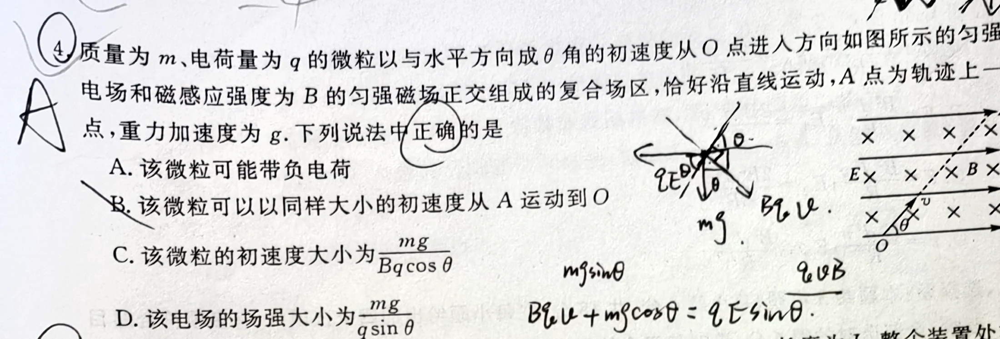
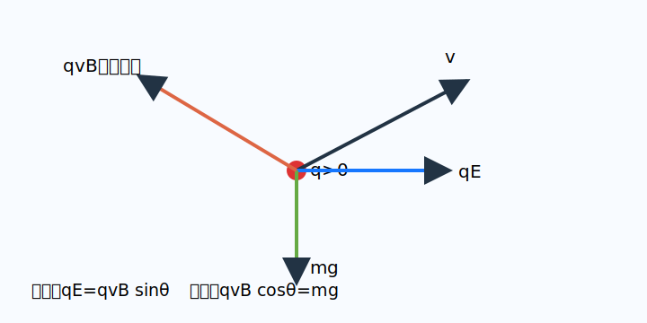

# 题目

质量为 $m$、电荷量为 $q$ 的微粒以与水平方向成 $\theta$ 角的初速度从 $O$ 点进入方向如图所示的匀强电场和磁感应强度为 $B$ 的匀强磁场正交组成的复合场区，恰好沿直线运动，$A$ 点为轨迹上一点，重力加速度为 $g$。下列说法中正确的是（　　）

A. 该微粒可能带负电荷  
B. 该微粒可以以同样大小的初速度从 $A$ 运动到 $O$  
C. 该微粒的初速度大小为 $\frac{mg}{Bq\cos\theta}$  
D. 该电场的场强大小为 $\frac{mg}{q\sin\theta}$

---

# 解析（学生版）

## 答案速览

- 正确选项：**C**。
- 微粒必须带正电，且 $v=\frac{mg}{qB\cos\theta}$、$E=\frac{mg\tan\theta}{q}$。

## 一眼识别

- 题型识别：复合场中的直线运动，本质是三个力平衡。
- 最短主线：先用竖直方向确定电性和速度，再用水平方向求场强。
- 适用条件：速度大小和方向均不变，所以合力必须为零。

## 详细解答

### 第 1 步：判断电性

磁场垂直纸面向里。若微粒带正电，洛伦兹力 $q\boldsymbol v\times\boldsymbol B$ 指向左上方，可以同时平衡向右的电场力和向下的重力。若带负电，洛伦兹力右下、电场力向左，竖直方向无法平衡重力。因此 $q>0$，A 错。

### 第 2 步：沿竖直方向平衡

洛伦兹力的竖直分量为 $qvB\cos\theta$，故

$$
qvB\cos\theta=mg,
\qquad
v=\frac{mg}{qB\cos\theta}.
$$

所以 C 对。

### 第 3 步：沿水平方向平衡

$$
qE=qvB\sin\theta,
\qquad
E=Bv\sin\theta=\frac{mg\tan\theta}{q}.
$$

这与 D 给出的式子不同，D 错。

### 第 4 步：检查反向运动

从 $A$ 到 $O$ 时速度反向，洛伦兹力也反向，但重力和电场力不变，三力不再平衡，B 错。

## 易错点

- **错误表现**：把 $qvB$ 直接放进水平或竖直方向；**纠正策略**：先画洛伦兹力，再按 $\theta$ 分解。
- **错误表现**：认为原轨迹可以原路返回；**纠正策略**：速度反向只会使洛伦兹力反向，另外两个力不变。

## 30 秒自测

若撤去重力，要保持同方向直线运动，电场力应与洛伦兹力满足什么关系？
