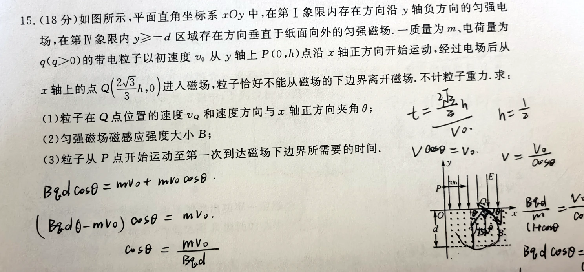
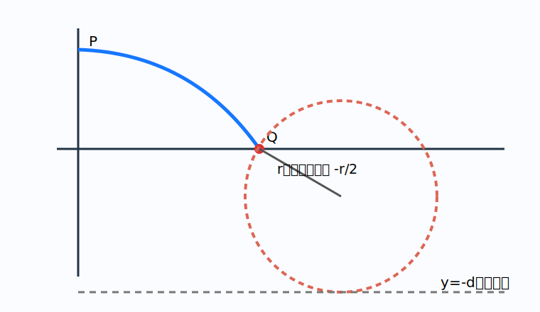

# 题目

平面直角坐标系 $xOy$ 中，在第Ⅰ象限内存在方向沿 $y$ 轴负方向的匀强电场，在第Ⅳ象限内 $y\ge-d$ 区域存在方向垂直纸面向外的匀强磁场。一质量为 $m$、电荷量为 $q$（$q>0$）的带电粒子以初速度 $v_0$ 从 $y$ 轴上 $P(0,h)$ 点沿 $x$ 轴正方向开始运动，经过电场后从 $x$ 轴上的点 $Q(\frac{2\sqrt3}{3}h,0)$ 进入磁场。粒子恰好不能从磁场的下边界离开磁场。不计粒子重力。求：

1. 粒子在 $Q$ 点的速度 $v_Q$ 和速度方向与 $x$ 轴正方向夹角 $\theta$；
2. 匀强磁场磁感应强度大小 $B$；
3. 粒子从 $P$ 点开始运动至第一次到达磁场下边界所需要的时间。

---

# 解析（学生版）

## 答案速览

- （1）$v_Q=2v_0$，方向与 $x$ 轴正方向成 $60^\circ$，斜向右下。
- （2）$B=\frac{3mv_0}{qd}$。
- （3）$t=\frac{2\sqrt3h}{3v_0}+\frac{2\pi d}{9v_0}$。

## 一眼识别

- 题型识别：电场中类平抛，磁场中匀速圆周运动。
- 最短主线：用 $Q$ 的坐标反求电场段末速度，再用轨迹与 $y=-d$ 相切确定半径。
- 适用条件：电场力恒定；磁场不做功，入磁场后速率保持 $v_Q$。

## 详细解答

### 第 1 步：求到达 $Q$ 的时间与速度

水平方向匀速，

$$
t_E=\frac{x_Q}{v_0}=\frac{2\sqrt3h}{3v_0}.
$$

设电场加速度大小为 $a$，竖直位移满足 $h=at_E^2/2$，得 $a=3v_0^2/(2h)$。于是

$$
v_y=at_E=\sqrt3v_0,
\qquad
v_Q=\sqrt{v_0^2+v_y^2}=2v_0.
$$

$\tan\theta=v_y/v_0=\sqrt3$，故 $\theta=60^\circ$，方向向右下。

### 第 2 步：由相切条件求轨道半径

正电荷进入向外磁场后向右下弯曲，圆心在速度左侧。$Q$ 到圆心的竖直分量为 $r\cos60^\circ=r/2$，圆心纵坐标为 $-r/2$。轨迹最低点恰在 $y=-d$：

$$
\frac r2+r=d,
\qquad
r=\frac{2d}{3}.
$$

### 第 3 步：求磁感应强度

$$
r=\frac{mv_Q}{qB}=\frac{2mv_0}{qB}.
$$

与 $r=2d/3$ 联立，

$$
B=\frac{3mv_0}{qd}.
$$

### 第 4 步：求磁场段时间

从 $Q$ 的半径方向转到最低点，粒子沿顺时针转过 $120^\circ=2\pi/3$。回旋角速度 $\omega=qB/m$，

$$
t_B=\frac{2\pi/3}{qB/m}=\frac{2\pi d}{9v_0}.
$$

总时间为

$$
t=t_E+t_B=\frac{2\sqrt3h}{3v_0}+\frac{2\pi d}{9v_0}.
$$

## 易错点

- **错误表现**：把 $Q$ 点速度仍写成 $v_0$；**纠正策略**：电场改变竖直分速度，先做速度合成。
- **错误表现**：直接写 $2r=d$；**纠正策略**：圆心不在 $x$ 轴上，先求圆心纵坐标 $-r/2$。

## 30 秒自测

若磁场方向改为向里，粒子刚进入磁场时会向哪个方向弯曲？
